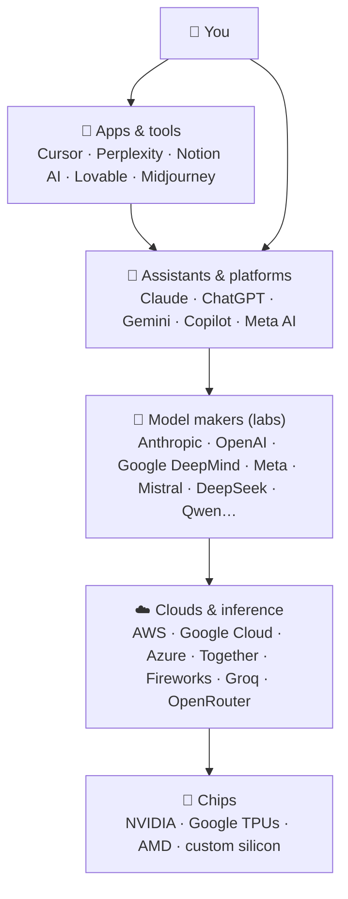

# 35 · The AI Landscape: Who's Who 🗺️🏢

> ⏱️ 8 min read · 🎯 Beginner-friendly · 🧰 Needs: nothing

**Claude, GPT, Gemini, Llama, Qwen, Mistral, DeepSeek… Cursor, Perplexity, Midjourney, ElevenLabs…** The AI world has a
*lot* of names. This chapter is your field guide: who makes what, how the pieces stack together, what "open-weight" means,
and how to decode model names, so you can read AI news without feeling lost.

🧸 ELI5: This chapter in 30 seconds

Think of AI like the food world. A few big **farms** grow the ingredients (the labs that make models: Anthropic, OpenAI,
Google…). **Supermarkets** sell those ingredients to everyone (the cloud platforms). **Restaurants** cook them into dishes
you actually eat (apps like Cursor, Perplexity or Notion). Some farms give their seeds away for free so anyone can grow
their own (**open-weight** models). This chapter shows you who's who in each group.

<!-- in-this-chapter -->

## 🧱 The stack in one picture

🧸 ELI5

At the bottom are the computer chips. Then the giant data centers. Then the companies that train the AI brains. Then the
apps built on top. And at the very top: you!

Most of what you *use* lives in the top two layers, but knowing the lower layers explains prices, speeds, and why the same
model shows up in many apps.

## 🏛️ The frontier labs

🧸 ELI5

These are the companies that build the biggest, smartest AI brains. Each has its own flavor, like different chefs.

| Lab | Main models | Flagship products | Known for |
|---|---|---|---|
| **Anthropic** | Claude (Opus, Sonnet, Haiku, and top-tier models) | Claude apps, Claude Code, Claude API | Writing, coding and agentic work, safety research, created **MCP** |
| **OpenAI** | GPT series, reasoning models, gpt-oss (open-weight) | ChatGPT, Codex, API | Kicked off the chat era, broad consumer ecosystem |
| **Google DeepMind** | Gemini (Pro, Flash, Flash-Lite), Gemma (open), Veo, Imagen | Gemini app, Gemini Notebook (NotebookLM), AI Studio, Workspace | Long context, multimodal, deep Google integration |
| **Meta** | Llama (open-weight) | Meta AI in WhatsApp, Instagram, Facebook | Popularized open-weight frontier models |
| **xAI** | Grok | Grok in X and its apps | Real-time X integration |
| **Mistral AI** (France) | Mistral, Codestral, open-weight models | Le Chat, API | European champion, efficient open models |
| **DeepSeek** (China) | DeepSeek V-series, R-series reasoning | DeepSeek app, API | Very efficient open-weight reasoning models |
| **Alibaba (Qwen)** | Qwen family | Qwen apps, open weights | Huge open family, strong at coding and multilingual |
| **Moonshot, Zhipu, MiniMax** (China) | Kimi, GLM, MiniMax | Their own apps, open weights | Strong open-weight agentic and long-context models |

> [!NOTE]
> **📌 Names and rankings change constantly**
> New flagship versions ship every few months, and "who's best" rotates. Don't memorize rankings. Learn the *families* and
> test on your own tasks ([Evaluating & Comparing AI](../part-12-mastery/105-evaluating-ai.md)).

## 🏢 The big platforms

🧸 ELI5

Giant tech companies bake AI into the stuff billions of people already use: phones, email, office apps, search and shopping.

| Company | AI in your life | Also… |
|---|---|---|
| **Microsoft** | Copilot in Windows, Edge and Microsoft 365; GitHub Copilot | Azure / Microsoft Foundry hosts many models, including OpenAI's and Anthropic's |
| **Google** | Gemini in Android, Search, Gmail, Docs, Chrome | Google Cloud Vertex AI hosts Gemini, Claude and open models |
| **Apple** | Apple Intelligence on iPhone and Mac (on-device + Private Cloud Compute), with ChatGPT integration | Privacy-first design, Shortcuts that can call AI models |
| **Amazon** | Alexa+, shopping assistants | AWS Bedrock hosts Claude, Llama, Mistral and Amazon's Nova models |
| **NVIDIA** | Powers most AI training and inference | Also releases open models and tools for running AI locally |

## 🔓 Open vs. closed models

🧸 ELI5

A **closed** model is like a secret family recipe: you can order the dish at their restaurant, but you can't see the recipe.
An **open-weight** model is a recipe given away for free: you can cook it at home, change it, and nobody sees what you eat.

| | 🔒 Closed (API-only) | 🔓 Open-weight |
|---|---|---|
| Examples | Claude, GPT flagship, Gemini Pro | Llama, Qwen, DeepSeek, Gemma, Mistral, gpt-oss |
| How you use it | Through the company's app or API | Download and run anywhere: laptop, server, cloud |
| Strengths | Usually the most capable, zero setup, constantly improved | Privacy, offline use, customization, no per-token fees at home |
| Trade-offs | Data goes to the provider; subject to their pricing and policies | You provide hardware, and top open models can lag the frontier a bit |

**"Open-weight" ≠ "open-source" (strictly).** Usually you get the trained **weights** and a license, but not the training
data or full recipe. Licenses vary: some are very permissive, others restrict certain uses. Check before building a business on one.

## 📱 The app & tool layer

🧸 ELI5

Lots of clever companies don't make brains. They build great apps that *use* brains to do one job really well, like
coding, searching, drawing or talking.

| Category | Popular tools | Chapter |
|---|---|---|
| 🛠️ Coding & app building | Claude Code, Cursor, GitHub Copilot, Windsurf, Codex, Replit, Lovable, Bolt, v0 | [Agents & Coding Tools](../part-7-building-with-ai/60-agents-and-coding-tools.md) |
| 🔎 Search & research | Perplexity, deep research modes, Gemini Notebook (NotebookLM) | [Research & Learning](../part-11-ai-for-life-and-work/91-research-and-learning.md) |
| 📋 Productivity | Notion AI, Microsoft 365 Copilot, Gemini in Workspace, Raycast | [AI Inside Your Apps](../part-6-ai-in-your-apps/53-ai-in-your-apps.md) |
| ⚙️ Automation | Zapier, n8n, Make, Pipedream, Power Automate | [Automation Platforms](../part-5-automation/45-automation-platforms.md) |
| 🎨 Images & design | Midjourney, Ideogram, Recraft, Canva, Adobe Firefly, Black Forest Labs (Flux) | [Image Generation](../part-10-creative-ai/84-image-generation-deep-dive.md) |
| 🎬 Video | Veo, Kling, Seedance, Runway, Luma | [Video & Audio](../part-10-creative-ai/85-video-and-audio-production.md) |
| 🎵 Music & voice | Suno, ElevenLabs, voice-agent platforms | [Music](../part-10-creative-ai/86-music-making-with-ai.md), [Voice Agents](../part-10-creative-ai/87-voice-agents.md) |
| 🏠 Local AI | Ollama, LM Studio, Open WebUI, llama.cpp | [Local & Open Models](../part-9-local-ai/78-local-and-open-models.md) |

## ☁️ Where models actually run

🧸 ELI5

The AI brains live in huge buildings full of computers. Some companies rent out those computers, and some specialize in
running AI super fast. You can reach many brains through one "universal remote" service.

- **Big clouds:** AWS (Bedrock), Google Cloud (Vertex AI), Microsoft (Azure / Foundry) host models from many labs. Great for
  companies that need their AI inside their existing cloud.
- **Inference providers:** Together, Fireworks, Groq, Cerebras, DeepInfra and others run open models fast and cheap.
- **Routers:** **OpenRouter** gives one API key for hundreds of models, which is great for comparing.
- **Hugging Face:** the "GitHub of AI," home to open models, datasets and demos (Spaces).
- **Your own machine:** Ollama and LM Studio run open models on your laptop ([Part IX](../part-9-local-ai/index.md)).

## 🏷️ How to decode model names

🧸 ELI5

Model names look like secret codes, but they follow patterns: a family name, a version number, and words that mean "big,"
"small," "fast," or "for coding."

| You see… | It usually means… |
|---|---|
| **Version numbers** (4, 4.5, 5…) | Newer generation, usually better |
| **Opus / Pro / Ultra** | Biggest, smartest, priciest tier |
| **Sonnet / Flash / "mini"** | Balanced workhorse tier |
| **Haiku / Flash-Lite / "nano"** | Small, fast, cheap |
| **"Instruct" / "chat"** | Tuned to follow instructions (vs. a raw base model) |
| **"Coder"** | Specialized for programming |
| **"VL" / "vision"** | Understands images |
| **7B, 70B, 405B** | Billions of **parameters** (rough size and hardware needs) |
| **"A3B", "MoE"** | **Mixture of Experts**: a big model that only activates a slice (e.g., 3B) per token, making it fast for its size |
| **Q4, Q8, GGUF, MLX** | **Quantized** or packaged for local use ([Local & Open Models](../part-9-local-ai/78-local-and-open-models.md)) |
| **A date suffix** | A pinned snapshot, so behavior won't change underneath you |

## 📊 Keeping track without drowning

🧸 ELI5

You don't need to follow every new AI. Check a couple of scoreboards now and then, and trust your own tests most.

- **Leaderboards (hints, not gospel):** LMArena (human preference votes), Artificial Analysis (quality, speed and price),
  SWE-bench (coding).
- **Release notes & changelogs** of the tools *you* use tell you about features you're already paying for.
- **Your personal eval:** 10 real tasks you care about, re-run when something new ships ([Evaluating & Comparing AI](../part-12-mastery/105-evaluating-ai.md)).
- A light news diet: [Staying Current](../part-12-mastery/110-staying-current.md).

## 🔮 Trends worth watching

🧸 ELI5

AI is getting better at doing long jobs on its own, cheaper every year, better at seeing and hearing, and easier to connect
to everything.

1. **Agents that work for hours**, with better planning, memory and self-checking.
2. **Cheaper intelligence**: today's frontier becomes tomorrow's budget tier.
3. **Open-weight models closing the gap**, making private, local AI ever more capable.
4. **Universal connectivity** through MCP and similar standards.
5. **Multimodal everything**: voice, video, screens and the physical world.

More in [Where This Is All Heading](../part-12-mastery/111-where-this-is-heading.md).

## 🎯 Key takeaways

- The stack: **chips → clouds → labs → assistants → apps → you**.
- A handful of **frontier labs** make the top models, and many **apps** build on them.
- **Open-weight** models can run anywhere, and **closed** models are used through apps and APIs.
- Model names follow patterns: **tier words, sizes, specializations, quantization**.
- Rankings change monthly, so trust **your own tests**.

## 🧠 Check yourself

❓ 1. Cursor uses Claude and GPT models. Is Cursor a lab or an app?

An **app** (the tool layer). It builds a great coding experience on top of models from labs.

❓ 2. What does "Qwen3-30B-A3B" roughly tell you?

A **Qwen** family model with **30B total parameters** that activates about **3B per token** (Mixture of Experts), so it's
fast for its size.

❓ 3. Why might a business choose an open-weight model?

**Privacy** (data never leaves their servers), **customization** (fine-tuning), **offline** use, and **cost control** at scale.

> [!TIP]
> **🎮 Try this**
> Pick one task you do often (say, summarizing a long email thread). Try it in **two different assistants** this week, one
> closed (e.g., Claude) and one open (e.g., a Qwen or Llama model on OpenRouter or LM Studio). Note which you preferred and
> why. Congratulations, you've started your own personal AI leaderboard. 🏆

---

**Next:** [36 · Context Engineering →](36-context-engineering.md)
