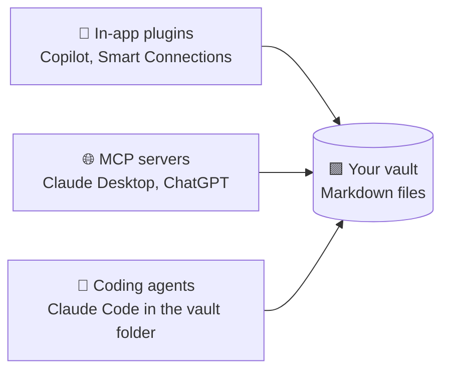

# 16 · Obsidian + AI: Your Local-First Thinking Machine 🟪

Obsidian stores your notes as **plain Markdown files in a folder on your computer**. That simple
fact makes it perfect for AI: every tool, script, agent, and model can read and write your notes,
and you stay in full control. This chapter shows how to turn a vault into an AI-powered thinking partner.

---

## Why Obsidian + AI is special
- **You own the files.** No lock-in, and no export needed.
- **Any AI can use them:** Claude Code, Cursor, MCP filesystem servers, local models, scripts.
- **Links = a knowledge graph.** `[[wikilinks]]` create connections that AI can follow and extend.
- **Git-friendly:** version your brain like code (and undo AI edits you don't like!).

## Three ways to add AI



### 1. In-app plugins (community plugins)
| Plugin | What it does |
|---|---|
| **Copilot for Obsidian** | Chat with your vault, with many model options (cloud or local via Ollama/LM Studio) |
| **Smart Connections** | Semantic search and "related notes" using embeddings |
| **Text Generator** | Generate or transform text with templates |
| **Local GPT / Ollama plugins** | Private AI running entirely on your machine |
| **Templater + AI** | Scripted templates that call models |

(Community plugins change fast, so check each one's recent activity and reviews before installing.)

### 2. MCP: let Claude or ChatGPT into your vault
- **Filesystem MCP server** pointed at your vault folder (simple and effective), or
- An **Obsidian MCP server** using the *Local REST API* community plugin (adds search, active-file, and more).

Config snippet (Claude Desktop):
```json
"obsidian-vault": {
  "command": "npx",
  "args": ["-y", "@modelcontextprotocol/server-filesystem", "/Users/you/Obsidian/MyVault"]
}
```

### 3. Claude Code (or any coding agent) *in* the vault 🤯
This is the power move. `cd` into your vault and run `claude`. The agent can read, search, create, and reorganize
notes with full file-system skills: grep, bulk edits, scripts.

Add a `CLAUDE.md` at the vault root:
```markdown
# Vault guide for AI
- Daily notes: /Daily/YYYY-MM-DD.md. Projects: /Projects. Evergreen notes: /Notes.
- Use [[wikilinks]] for connections. Tags: #idea #todo #person.
- Never delete notes. Move to /Archive instead.
- Keep my voice. Don't rewrite my writing unless I ask.
```

## 🎮 12 things to ask an AI with vault access

1. *"Read my daily notes from last month and write a monthly reflection: themes, wins, recurring worries."*
2. *"Find notes that should be linked but aren't, and suggest 20 new [[links]]. Show them before applying."*
3. *"Create a Map of Content (MOC) note for everything about 'productivity'."*
4. *"Turn my scattered #idea tags into a ranked list with next steps."*
5. *"What have I learned about sleep across all my notes? Cite the notes."*
6. *"Convert my book highlights folder into evergreen notes, one idea per note, linked to the source."*
7. *"Find all unchecked `- [ ]` tasks across the vault older than 2 weeks and make a triage list."*
8. *"Make a people index: everyone I mention, with the last time and context."*
9. *"Write a weekly review template and a script that fills in stats automatically."*
10. *"Draft a blog post from my notes on X in my writing voice (see /Writing samples)."*
11. *"Detect duplicate or near-duplicate notes and propose merges."*
12. *"Create flashcards from /Notes/Learning in spaced-repetition format."*

## Workflows 🔁

### The AI-assisted daily note
Morning: *"Create today's daily note with my calendar (via connector), top 3 priorities from yesterday's
unfinished tasks, and a thought prompt."*
Evening: *"Summarize what I wrote today, extract tasks, and link to relevant project notes."*

### Capture pipeline
Voice memo → transcription (Whisper / Wispr Flow) → AI cleanup → new note in `/Inbox` via n8n or an Apple Shortcut
writing a Markdown file (synced with Obsidian Sync, iCloud, Syncthing, or Git).

### Private mode 🔒
Use **Ollama + Copilot plugin** (or Smart Connections with local embeddings) to keep your journal 100% on-device.
See [Ch. 26](../part-7-local-ai/26-local-and-open-models.md).

## Safety net ✅
- Put the vault in **Git** (Obsidian Git plugin) so every AI change is reviewable and reversible.
- Tell agents to **propose before bulk edits**.
- Keep a separate `/AI` folder for AI-generated notes so your own writing stays distinct.

---

### 🎮 Try this
Initialize Git in your vault, open Claude Code in the folder, and ask for idea #1 (the monthly reflection).
Reading an AI's synthesis of your own month is surprisingly moving. 🟪

---

**Next:** [17 · Agents & AI Coding Tools →](../part-5-building-with-ai/17-agents-and-coding-tools.md)
