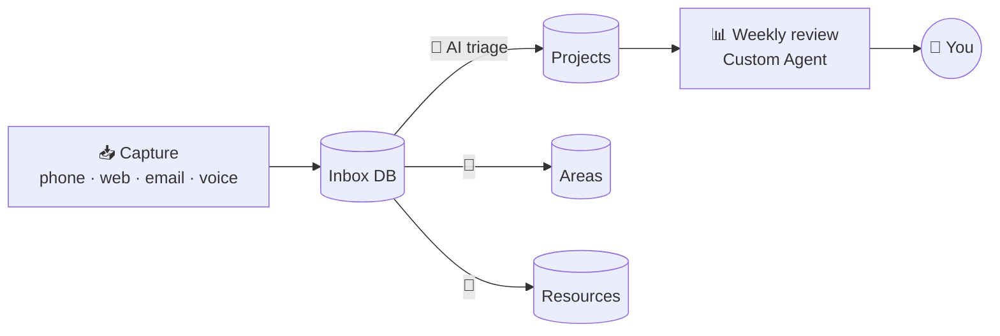

# 14 · Notion AI Deep Dive: Build an AI-Powered Second Brain 📒✨

Notion has become one of the most AI-native workspaces around. It's a place where your notes, tasks,
docs, and databases live **and** where AI agents can read, write, and organize them for you. This chapter
covers the features, then walks you through building a complete AI-assisted "second brain."

---

## The Notion AI toolbox

| Feature | What it does | Use it for |
|---|---|---|
| **Notion Agent** | Your personal on-demand AI. It can create and edit pages and databases and do multi-step work | "Turn these notes into a project plan with a task database" |
| **Custom Agents** | Team AI teammates that run on **schedules or triggers**, 24/7 | Weekly digests, triage, recurring reports |
| **Enterprise search** | Ask questions across Notion **and** connected apps (Slack, Drive, GitHub, and more) | "What did we decide about pricing?" |
| **AI Meeting Notes** | Transcribes meetings, then summarizes and extracts action items | Never take meeting notes by hand again |
| **Database AI autofill** | AI properties that summarize, tag, translate, or extract per row | Auto-tag 500 reading-list items |
| **Notion MCP (server)** | Lets Claude, ChatGPT, Cursor, etc. read and write your workspace | Use Notion from any AI app |
| **MCP connections (client)** | Notion's agents can use other tools (Linear, Figma, HubSpot, custom MCP) | Cross-tool agents inside Notion |

> Notion's AI features and pricing (plans, add-ons, credits) evolve quickly. Check notion.com for what your plan includes.

---

## Build: the AI Second Brain 🧠

We'll use a simplified **PARA** method (Projects, Areas, Resources, Archive) plus an Inbox, and then add AI at every step.

### Step 1: Create the databases (10 min)
Ask Notion Agent (or Claude via the Notion connector):
> *"Create a second-brain setup: an **Inbox** database (Name, Type [idea/task/note/link], Status, Created),
> a **Projects** database (Name, Status, Deadline, Area relation), an **Areas** database (Name), and a
> **Resources** database (Name, Topic multi-select, URL, Summary). Link Projects↔Areas. Put them all on a
> 'Second Brain' home page with linked views."*

Yes, AI can build the structure for you. Tweak it after. 😄

### Step 2: Add AI autofill properties
In **Resources**, add AI properties:
- **Summary**: "Summarize the page content in 2 sentences."
- **Topics**: AI-generated multi-select tags.
- **Key takeaway**: "The single most useful idea from this resource."

Now every link you save gets summarized and tagged automatically.

### Step 3: Capture from everywhere
| Source | How |
|---|---|
| Browser | Notion Web Clipper → Inbox |
| Phone | Notion share sheet, or an iOS Shortcut → webhook → n8n → Notion ([Ch. 12](../part-3-automation/15-webhooks-apis-json.md)) |
| Email | Forward to an automation (Zapier/n8n: Gmail label → Notion page) |
| Voice | Dictate → AI cleans it up → Inbox (the [idea-inbox workflow](../../examples/n8n-workflows/idea-inbox-to-notion.json)!) |
| Any AI chat | *"Save this to my Notion Inbox"* (via the Notion connector/MCP) |

### Step 4: AI triage
Create a **Custom Agent** (or run Notion Agent daily):
> *"Every morning at 8am: go through the Inbox. For each item, decide if it's a task (→ link to the right
> Project), a reference (→ Resources with topics), or trash-worthy (→ mark Archived). Leave a comment
> explaining each decision. Never delete anything."*

### Step 5: The weekly review agent
> *"Every Friday at 4pm, create a 'Weekly Review – {date}' page: projects that moved forward, stalled
> projects (no updates in 14 days), resources saved this week grouped by topic, and 3 suggested priorities for next
> week. Make it encouraging."*

### Step 6: Talk to it from anywhere
Connect **Notion MCP** to Claude, ChatGPT, or Claude Code:
- *"What have I saved about home automation, and which ideas could I build this weekend?"*
- *"Create a project for 'Launch newsletter' with 8 tasks and realistic deadlines."*
- *"Summarize every meeting note from this month with the word 'budget' in it."*

---

## 10 Notion + AI power moves ⚡

1. **Meeting → tasks in one step:** AI Meeting Notes → *"turn action items into tasks in my Tasks DB with owners."*
2. **Database from chaos:** paste a messy list → *"turn this into a database with sensible properties."*
3. **Docs Q&A:** *"Based on our wiki, how do we handle refunds?"*, with citations to pages.
4. **Translation property:** auto-translate a database column for a global team.
5. **Reading list triage:** AI "Should I read this?" property based on your stated interests.
6. **CRM-lite:** contacts database + AI "next best action" property.
7. **Content calendar:** agent drafts posts for rows marked "Ready to draft."
8. **Template generator:** *"Create a reusable template for client onboarding with a checklist."*
9. **Cross-tool agents:** Custom Agent reads Slack + Linear via MCP and updates a Notion status page.
10. **Claude Code + Notion:** your coding agent reads specs from Notion and updates the task when the PR merges.

## Tips & gotchas
- **Structure helps AI.** Consistent database properties make agents far more reliable than free-form pages.
- **Give agents rules** ("never delete, comment your reasoning"), and start them with narrow permissions.
- **Watch credit usage** for scheduled agents, and start with daily rather than hourly.
- **Page access matters:** MCP and agents only see what they've been given access to.

---

### 🎮 Try this
Do Steps 1–2 today (20 minutes). Save 5 articles to Resources and watch the AI summaries and tags fill in.
That small win makes the whole system click. ✨

---

**Next:** [15 · Google Workspace & Microsoft 365 AI →](24-google-and-microsoft-ai.md)
