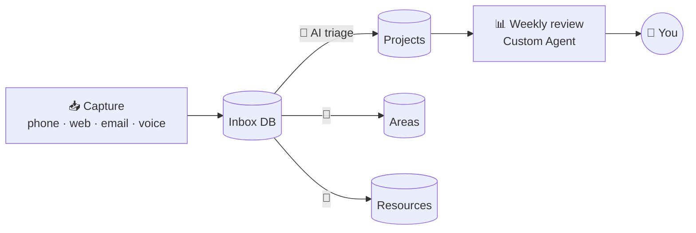

# 23 · Notion AI Deep Dive: Build an AI-Powered Second Brain 📒✨

> ⏱️ 8 min read · 🎯 Beginner → intermediate · 🧰 Needs: a Notion account (AI features vary by plan)

**Notion has become one of the most AI-native workspaces around**: a place where your notes, tasks, docs and databases live
*and* where AI agents read, write and organize them for you. This chapter covers the whole toolbox, then walks you through
building a complete AI-assisted second brain, step by step.

🧸 ELI5: This chapter in 30 seconds

Notion is like a magic binder where every page can hold notes, lists and tables. Now the binder has a **helper who lives
inside it**: you can ask it to write pages, tidy your lists, summarize meetings, and even do chores on a schedule while
you sleep. We'll build a "second brain" binder that organizes itself.

<!-- in-this-chapter -->

## 🧰 The Notion AI toolbox

🧸 ELI5

Notion's AI has several tools: a personal helper you chat with, team helpers that run on schedules, a meeting note-taker,
smart table columns, and doors (MCP) so other AIs can come in and Notion's AI can go out.

| Feature | What it does | Use it for |
|---|---|---|
| **Notion Agent** | Your on-demand AI: creates and edits pages and databases, does multi-step work | "Turn these notes into a project plan with a task database" |
| **Custom Agents** | Team AI teammates that run on **schedules or triggers**, 24/7 | Weekly digests, triage, recurring reports |
| **Enterprise search** | Ask across Notion **and** connected apps (Slack, Drive, GitHub…) | "What did we decide about pricing?" |
| **AI Meeting Notes** | Transcribes meetings, then summarizes and pulls out action items | Never take meeting notes by hand again |
| **Database AI autofill** | AI properties that summarize, tag, translate or extract per row | Auto-tag 500 reading-list items |
| **Notion MCP (server)** | Lets Claude, ChatGPT, Cursor, Claude Code… read and write your workspace | Use Notion from any AI app |
| **MCP connections (client)** | Notion's agents use other tools (Linear, Figma, HubSpot, custom MCP) | Cross-tool agents inside Notion |

> [!NOTE]
> **📌 Plans and credits change**
> Notion's AI features, plans and add-ons evolve quickly (Custom Agents, for example, run on Notion credits on business
> plans). Check notion.com for what your plan includes today.

## 🤖 Notion Agent vs. Custom Agents

🧸 ELI5

The **Notion Agent** is your personal helper that works when you ask. **Custom Agents** are team helpers that work by
themselves on a timer or when something happens, even at 3am.

| | 🙋 Notion Agent | 🤖 Custom Agents |
|---|---|---|
| Starts when | You ask | A **schedule** or **trigger** fires |
| Works for | You | A team or workspace |
| Great at | Drafting, restructuring, research on demand | Recurring reports, triage, digests, maintenance |
| Example | *"Summarize this page into a one-pager for my boss"* | *"Every Monday 9am, compile last week's project updates into a digest page and post the link to Slack"* |

**Designing a good Custom Agent** is like writing a job description ([Context Engineering](../part-1-foundations/05-context-engineering.md)):
say what data to read, what to produce, where to put it, and **what it must never do** ("never delete pages").

## 🧠 Build: the AI Second Brain

🧸 ELI5

We'll build four boxes: an inbox where everything lands, a projects box, an areas box and a library box. Then we'll teach
the AI helpers to sort the inbox for us every morning.

We'll use a simplified **PARA** method (Projects, Areas, Resources, Archive) plus an Inbox, and add AI at every step.

### Step 1 · Create the databases (10 min)
Ask Notion Agent (or Claude via the Notion connector):
> *"Create a second-brain setup: an **Inbox** database (Name, Type [idea/task/note/link], Status, Created), a **Projects**
> database (Name, Status, Deadline, Area relation), an **Areas** database (Name), and a **Resources** database (Name, Topic
> multi-select, URL, Summary). Link Projects↔Areas. Put them all on a 'Second Brain' home page with linked views."*

Yes, AI can build the structure for you. Tweak it after. 😄

### Step 2 · Add AI autofill properties
In **Resources**, add AI properties:

- **Summary:** "Summarize the page content in 2 sentences."
- **Topics:** AI-generated multi-select tags.
- **Key takeaway:** "The single most useful idea from this resource."

Every link you save now gets summarized and tagged automatically.

### Step 3 · Capture from everywhere

| Source | How |
|---|---|
| Browser | Notion Web Clipper → Inbox |
| Phone | Notion share sheet, or an iOS Shortcut → webhook → n8n → Notion ([Phone & Desktop Automation](../part-3-automation/19-phone-and-desktop-automation.md)) |
| Email | Forward to an automation (Gmail label → Notion page) |
| Voice | Dictate → AI cleanup → Inbox (the [idea-inbox workflow](../../examples/n8n-workflows/idea-inbox-to-notion.json)!) |
| Any AI chat | *"Save this to my Notion Inbox"* (via the Notion connector or MCP) |

### Step 4 · AI triage (a Custom Agent)
> *"Every morning at 8am, go through the Inbox. For each item, decide if it's a task (→ link to the right Project), a
> reference (→ Resources with topics), or not worth keeping (→ mark Archived). Leave a comment explaining each decision.
> Never delete anything."*

### Step 5 · The weekly review agent
> *"Every Friday at 4pm, create a 'Weekly Review – {date}' page: projects that moved forward, stalled projects (no updates in
> 14 days), resources saved this week grouped by topic, and 3 suggested priorities for next week. Make it encouraging."*

### Step 6 · Talk to it from anywhere
Connect **Notion MCP** to Claude, ChatGPT or Claude Code:

- *"What have I saved about home automation, and which ideas could I build this weekend?"*
- *"Create a project for 'Launch newsletter' with 8 tasks and realistic deadlines."*
- *"Summarize every meeting note from this month that mentions 'budget'."*

## 🗃️ Databases that AI loves

🧸 ELI5

AI works best with tidy tables: clear column names, fixed choices instead of free text, and dates in date columns. Tidy
tables mean smart helpers.

| Do ✅ | Why |
|---|---|
| Clear property names ("Due date," not "DD") | The AI reads names to understand meaning |
| **Select / multi-select** for categories | Consistent values the AI can filter and set |
| **Relations** between databases | The AI can follow links ("tasks for this project") |
| A **Status** property with a few clear stages | Agents can move items through a workflow |
| A short **description** at the top of each database | Standing instructions for any AI that visits |
| Templates for recurring page types | Consistent structure for AI to fill in |

## 🎙️ AI Meeting Notes workflow

🧸 ELI5

Notion can listen to your meeting, write the notes, and then turn the "we should…" moments into real tasks with owners and
due dates.

1. Start **AI Meeting Notes** in a meeting page (and tell participants you're transcribing).
2. After the call, review the summary: decisions, action items, open questions.
3. Ask Notion Agent: *"Turn the action items into tasks in my Tasks database with owners and due dates, and link them to
   this meeting."*
4. Optional: a Custom Agent that compiles each week's meeting decisions into a "Decision Log" page.

## 🔌 Notion + MCP: both directions

🧸 ELI5

Other AIs (like Claude or Cursor) can open Notion's door and work inside your pages. And Notion's own helpers can open
other apps' doors, like Linear or Figma.

**Outside-in (other AIs use Notion):** add the official Notion connector or MCP server to Claude, ChatGPT, Cursor or Claude
Code. Coding agents can read specs from Notion and update tasks when work is done. Research agents can save cited briefs
straight into your Resources database.

**Inside-out (Notion's agents use other tools):** Notion supports pre-configured MCP integrations with partners (Linear,
Figma, HubSpot and more) and custom MCP servers for your own tools, so a Custom Agent can read Linear issues and update a
Notion status page.

## ⚡ 12 Notion + AI power moves

🧸 ELI5

Twelve clever tricks to try, from turning meetings into tasks to making a table translate itself.

1. **Meeting → tasks in one step:** AI Meeting Notes → *"turn action items into tasks with owners."*
2. **Database from chaos:** paste a messy list → *"turn this into a database with sensible properties."*
3. **Wiki Q&A:** *"Based on our wiki, how do we handle refunds?"* (with citations to pages).
4. **Translation property:** auto-translate a database column for a global team.
5. **Reading list triage:** an AI "Should I read this?" property based on your stated interests.
6. **CRM-lite:** contacts database + an AI "next best action" property.
7. **Content calendar:** an agent drafts posts for rows marked "Ready to draft."
8. **Template generator:** *"Create a reusable template for client onboarding with a checklist."*
9. **Cross-tool status page:** a Custom Agent reads Slack and Linear via MCP and updates a Notion page.
10. **Claude Code + Notion:** your coding agent reads the spec from Notion and marks the task done when the PR merges.
11. **Decision log:** an agent extracts every "we decided…" from meeting notes into one searchable log.
12. **Personal dashboard:** *"Build me a home page with today's tasks, active projects and this week's meetings."*

## 🔐 Permissions, credits & gotchas

🧸 ELI5

Helpers can only see pages they're allowed to see, scheduled helpers cost credits each time they run, and you should always
tell them never to delete things.

- **Structure helps AI:** consistent properties make agents far more reliable than free-form pages.
- **Give agents rules** ("never delete, archive instead; comment your reasoning") and start them with narrow permissions.
- **Watch credit usage** for scheduled agents: start daily, not hourly.
- **Page access matters:** MCP connections and agents only see what they've been given access to.
- **Sensitive data:** check your workspace's AI data settings, especially at work ([Privacy & Your Data](../part-10-mastery/73-privacy-and-your-data.md)).

## 🎯 Key takeaways

- **Notion Agent** works on demand, and **Custom Agents** work on schedules and triggers for your team.
- Build a **PARA second brain** with an Inbox, **AI autofill properties**, and triage + weekly-review agents.
- **Tidy databases** (selects, relations, descriptions) make every AI smarter.
- Notion speaks **MCP both ways**: other AIs can work in Notion, and Notion's agents can use other tools.

## 🧠 Check yourself

❓ 1. You want a digest page created every Monday automatically. Notion Agent or Custom Agent?

A **Custom Agent** (it runs on a schedule).

❓ 2. Why use a Select property instead of free text for "Category"?

**Consistent values** that AI agents (and filters) can reliably read and set.

❓ 3. How can Claude Code update a Notion task when it finishes coding?

Connect the **Notion MCP server** (or connector) to Claude Code, and it can read specs and update pages.

> [!TIP]
> **🎮 Try this**
> Do **Steps 1–2** today (20 minutes). Save 5 articles to Resources and watch the AI summaries and tags fill themselves in.
> That small win makes the whole second-brain idea click. ✨

---

**Next:** [24 · Google Workspace & Microsoft 365 AI →](24-google-and-microsoft-ai.md)
