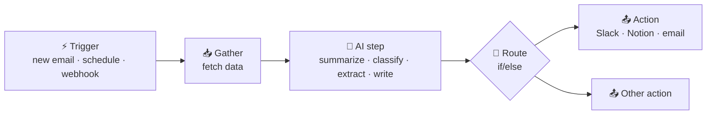

# 45 · Automation Platforms: AI That Works While You Sleep ⚙️🌙

> ⏱️ 8 min read · 🎯 Beginner-friendly · 🧰 Needs: a free account on Zapier or Make, or `npx n8n` for a local n8n

**Chat-based AI needs *you* to press enter. Automation platforms run on triggers**: a new email, a form submission, 7am
every day, a webhook. Put an AI step in the middle and you've got a tireless little robot employee. This chapter maps the
whole landscape and helps you pick the right platform.

🧸 ELI5: This chapter in 30 seconds

An automation is a robot recipe: **"When this happens, do that."** When an email arrives, summarize it and put it in my
notes. Every morning, send me the news. Automation platforms (Zapier, Make, n8n…) are kitchens where you build these
recipes by connecting blocks, and adding an AI block lets the robot *think*: sort, summarize, write and decide.

<!-- in-this-chapter -->

## 🧬 The pattern behind every AI automation

🧸 ELI5

Almost every robot recipe has the same five steps: something happens → grab the info → let AI think about it → decide
which way to go → do something.

Almost every useful AI automation is a variation of **trigger → gather → AI → route → act**. Once you see this pattern,
you can design automations in your head while waiting for coffee. ☕

## 🧱 The building blocks (vocabulary)

🧸 ELI5

Every automation kitchen uses the same kinds of blocks: a starter block, doing blocks, deciding blocks, looping blocks and
memory blocks. Learn these words once and every platform makes sense.

| Block | What it does | Zapier calls it | Make calls it | n8n calls it |
|---|---|---|---|---|
| **Trigger** | Starts the workflow | Trigger | Trigger module | Trigger node |
| **Action** | Does something in an app | Action | Module | Node |
| **Filter / condition** | Only continue if… | Filter | Filter | If / Filter node |
| **Branch** | Different paths | Paths | Router | Switch / If |
| **Loop** | Repeat for each item | Looping | Iterator | Loop Over Items (and items flow through nodes automatically) |
| **Transform** | Reshape data | Formatter | Tools / functions | Set / Code / Edit Fields |
| **AI step** | Summarize, classify, extract, write | AI by Zapier, Claude app | AI modules | AI Agent, LLM Chain, and more |
| **Human approval** | Wait for a yes/no | Human in the Loop | Approval flows | Send-and-wait nodes |

## 🟣 n8n: the tinkerer's favorite

🧸 ELI5

n8n is a free robot kitchen you can run on your own computer. It's super powerful, lets you write little bits of code when
needed, and has amazing AI blocks.

- **What:** a visual workflow builder with a code escape hatch (JavaScript or Python nodes). It's **fair-code** and
  **self-hostable**: run it free on your machine or server, or pay for n8n Cloud.
- **AI superpowers:** the **AI Agent node** (a tool-using agent inside a workflow, with memory and any model including local
  Ollama), LangChain-style nodes for RAG, the **MCP Client Tool** (use any MCP server), the **MCP Server Trigger** (turn a
  workflow into an MCP server), instance-level MCP (AI clients can build workflows), and an **AI workflow builder** that drafts
  workflows from plain English.
- **n8n 2.0** hardened security and scale: task runners that isolate code execution, stricter defaults, and faster storage.
- **Pricing shape:** free self-hosted, with Cloud billed by workflow **executions** (not steps), which is great for complex flows.
- **Best for:** tinkerers, privacy lovers, complex logic, anything needing code.
- **Go deeper:** [The n8n Masterclass](47-n8n-masterclass.md) → [n8n AI Agents Deep Dive](48-n8n-ai-agents.md).

## 🟠 Zapier: the biggest app catalog

🧸 ELI5

Zapier is the easiest robot kitchen: no setup, works with almost every app in the world, and you can even describe your
recipe in plain words and it builds it for you.

- **What:** the OG no-code automation tool, with **8,000+ apps**.
- **AI superpowers:** AI steps in Zaps, **Zapier Agents** (AI teammates that browse and use your apps on triggers),
  **Zapier MCP** (one URL gives Claude, ChatGPT or Cursor thousands of app actions), **Copilot** (describe a Zap and it
  builds it), plus Tables, Interfaces and human-in-the-loop approvals.
- **Pricing shape:** free tier, then priced by **tasks** (each action step counts), which adds up with big multi-step flows.
- **Best for:** non-coders, obscure apps, getting something working in 10 minutes.
- **Go deeper:** [Zapier & Make Walkthroughs](49-zapier-and-make-walkthroughs.md).

## 🟦 Make: the visual power tool

🧸 ELI5

Make is a beautiful drawing board where your robot recipe looks like a map of bubbles and lines. Great for recipes with
lots of branches and loops.

- **What:** a visual canvas with branching, iterators and fine-grained data mapping.
- **AI:** AI modules for many models, **Make AI Agents**, and an MCP server to expose scenarios as tools.
- **Pricing shape:** operations/credits. Generally cheaper than Zapier at volume.
- **Best for:** complex visual logic without code, heavy data shuffling.

## 🌈 The rest of the map

🧸 ELI5

There are many more robot kitchens: ones for coders, open-source ones, ones built into Microsoft or Google, and ones on
your phone.

| Tool | Niche |
|---|---|
| **Pipedream** | Code-first workflows with thousands of integrations and managed auth, and an MCP server for agents |
| **Activepieces** | MIT-licensed, self-hostable, friendly UI, with many "pieces" also available as MCP servers |
| **Microsoft Power Automate** | The default in Microsoft 365, with desktop automation (RPA) too |
| **Google Apps Script + Gemini** | Free automation inside Google Workspace ([Google & Microsoft AI](../part-6-ai-in-your-apps/55-google-and-microsoft-ai.md)) |
| **Apple Shortcuts / Android Tasker** | Phone automations that can call AI models and webhooks ([Phone & Desktop Automation](50-phone-and-desktop-automation.md)) |
| **IFTTT** | Dead-simple consumer and smart-home automations |
| **Relay.app, Lindy, Gumloop** | AI-native agent and workflow builders with human-in-the-loop steps |
| **Temporal, Inngest, Trigger.dev** | Code-level durable workflows for building real products |

## ⚖️ Side-by-side comparison

🧸 ELI5

Here's a chart comparing the big three kitchens on ease, cost, privacy and power, so you can pick your favorite.

| | n8n | Zapier | Make | Pipedream | Activepieces |
|---|---|---|---|---|---|
| Learning curve | Medium | Easiest | Medium | Dev-friendly | Easy |
| Self-host | ✅ | ❌ | ❌ | ❌ | ✅ |
| App catalog | Large + any HTTP API | **Largest** | Large | Very large (API) | Growing |
| AI agents built in | ✅ AI Agent node | ✅ Zapier Agents | ✅ Make AI Agents | Via code | ✅ |
| Local models (Ollama) | ✅ | ❌ | Limited | Via code | Limited |
| Expose as MCP | ✅ | ✅ | ✅ | ✅ | ✅ |
| Cost at scale | 💚 Lowest (self-host) | 💸 Highest | 💛 Medium | 💛 Medium | 💚 Low |

**The honest recommendation:** start with **Zapier** if you just want it to work *now*. Learn **n8n** if you want to go
deep, because self-hosting means unlimited experimentation for free. Many pros use both. 🎉

## 🧭 When to automate (and when not to)

🧸 ELI5

Build a robot for jobs you do again and again that follow the same steps. Don't build a robot for something you do once a
year, or something that needs your personal judgment every time.

| ✅ Great candidates | ❌ Poor candidates |
|---|---|
| Happens weekly or more | Happens once a year |
| Same steps every time | Different every time, needs your judgment |
| Clear trigger (email, form, schedule) | No clear starting signal |
| Mistakes are cheap to fix | Mistakes are costly (money, legal, reputation), unless you add approvals |
| Saves 10+ minutes per run | Saves 30 seconds but takes 3 hours to build (unless it's fun 😄) |

**Quick math:** a 10-minute weekly chore is **8+ hours a year**. Even a 2-hour build pays off fast.

## 🛠️ Your first automation in 15 minutes

🧸 ELI5

Let's build a tiny robot right now: every morning it sends you a fun fact and a small challenge. It's the "hello world" of
AI automation.

**Option A · Zapier (no install):**

1. **Trigger:** Schedule by Zapier → every day at 7:00.
2. **Action:** AI by Zapier (or the Anthropic/Claude app) → prompt: *"Give me one delightful fact about AI and one tiny
   5-minute challenge to learn something new today. Under 80 words, upbeat."*
3. **Action:** Email by Zapier (or Slack, or SMS) → send the AI output to yourself.
4. Test → Publish. ✅

**Option B · n8n (free, local):**

1. `npx n8n` → open http://localhost:5678.
2. Import the [Morning AI Digest](../../examples/n8n-workflows/morning-ai-digest.json) workflow.
3. Add your Anthropic credential, choose Slack or swap in Gmail, click **Test workflow**, then **Activate**.

## 🍳 A taste of what's possible

🧸 ELI5

Here are some favorite robot recipes people build. The full cookbook has 50!

1. **Morning digest:** news and RSS → AI summary → Slack or email.
2. **Idea inbox:** phone → webhook → AI categorizes → Notion ([importable](../../examples/n8n-workflows/idea-inbox-to-notion.json)).
3. **Inbox triage:** new email → AI labels urgent/newsletter/receipt → auto-label and draft replies.
4. **Meeting follow-ups:** transcript → action items → tasks + recap email.
5. **Receipt tracker:** receipt photo → AI extracts vendor, amount, category → spreadsheet.
6. **Content repurposer:** new blog post → thread + LinkedIn post + newsletter blurb → drafts.
7. **Support sorter:** new ticket → AI classifies and drafts a reply → human approves in Slack.
8. **Price watcher:** daily check → AI compares to history → ping on drops.

**50 more in [The Automation Recipe Book](52-automation-recipe-book.md).**

## 💡 Pro tips

🧸 ELI5

Test with pretend data first, ask the AI for neat forms (JSON) when a robot will read its answer, add a "ask me first"
step before anything important, and keep a logbook.

- **Pin test data** (n8n and Make) so you don't re-trigger things while building.
- **Ask the AI for JSON** when the next step needs structure, and parse it ([Webhooks, APIs & JSON](46-webhooks-apis-json.md)).
- **Add a human approval step** before anything customer-facing goes out.
- **Log everything** to a sheet or database while you're learning. It makes debugging much easier.
- **Deterministic where you can, AI where you must:** filters and formatters are free and reliable, and AI is for fuzzy steps.
- **Set API spend limits** before activating anything that calls AI in a loop ([Cost Optimization](../part-12-mastery/106-cost-optimization.md)).

## 🎯 Key takeaways

- Every AI automation is **trigger → gather → AI → route → act**.
- **Zapier** = easiest and biggest catalog. **Make** = visual power. **n8n** = free, self-hosted, AI-agent superpowers.
- Automate things that are **frequent, repetitive and cheap to get wrong**, and add approvals for the rest.
- Build your first "hello world" automation today, because the second one is always easier.

## 🧠 Check yourself

❓ 1. What are the five steps of the universal automation pattern?

**Trigger → gather → AI → route → act.**

❓ 2. You need unlimited runs for free and want to use a local model. Which platform?

**n8n**, self-hosted, with the Ollama chat model node.

❓ 3. Zapier bills by "tasks." What reduces your task count?

**Filters early** (stop irrelevant items before action steps), fewer steps, and free Formatter steps instead of AI where possible.

> [!TIP]
> **🎮 Try this**
> Build **Option A or B** above today. Tomorrow at 7am, a message *you built* will arrive on its own. That little moment is
> the start of a whole new relationship with your computer. 🤖☕

---

**Next:** [46 · Webhooks, APIs & JSON for Non-Programmers →](46-webhooks-apis-json.md)
