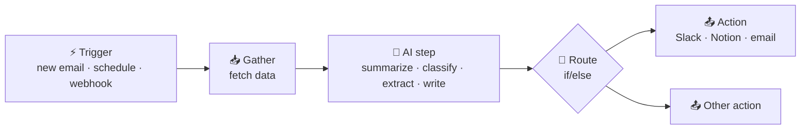

# 45 · Automation Platforms: AI That Works While You Sleep ⚙️🌙

> ⏱️ 9 min read · 🎯 Beginner-friendly · 🧰 Needs: a free account on Zapier or Make, or `npx n8n` for a local n8n

**Chat-based AI needs *you* to press enter. Automation platforms run on triggers**: a new email, a form submission, 7am
every day, a webhook. Put an AI step in the middle and you've got a tireless little robot employee. This chapter maps the
whole landscape and helps you pick the right platform.

✅ Key Points & Steps

An automation is a workflow that runs on its own: **when something happens, do something else.** Platforms like n8n, Zapier and Make let you build these workflows by connecting blocks, and adding an AI step lets them read, sort, summarize, write and make decisions.

- **Most AI automations follow one pattern:** trigger, gather, AI, route, act.
- **The main platforms** each have a niche: n8n for flexibility and self-hosting, Zapier for ease and app coverage, Make for complex visual flows.
- **Automate tasks that repeat** and follow consistent steps, and build your first one in about 15 minutes.

<!-- in-this-chapter -->

## 🧬 The pattern behind every AI automation

✅ Key Points & Steps

Nearly every AI automation follows the same five-step pattern:

1. **Trigger:** something happens (an email arrives, a time is reached).
2. **Gather:** collect the data needed.
3. **AI:** summarize, classify or draft.
4. **Route:** choose a path based on the result.
5. **Act:** send, save or update something.

```mermaid
flowchart LR
    T[⚡ Trigger<br/>new email · schedule · webhook] --> G[📥 Gather<br/>fetch data]
    G --> AI[🤖 AI step<br/>summarize · classify · extract · write]
    AI --> R{🔀 Route<br/>if/else}
    R --> A1[📤 Action<br/>Slack · Notion · email]
    R --> A2[📤 Other action]
```

Almost every useful AI automation is a variation of **trigger → gather → AI → route → act**. Once you see this pattern,
you can design automations in your head while waiting for coffee. ☕

## 🧱 The building blocks (vocabulary)

✅ Key Points & Steps

All automation platforms use the same kinds of building blocks (triggers, actions, conditions, loops and data storage), though each names them differently. The table maps the terms across Zapier, Make and n8n.

| Block | What it does | Zapier calls it | Make calls it | n8n calls it |
|---|---|---|---|---|
| **Trigger** | Starts the workflow | Trigger | Trigger module | Trigger node |
| **Action** | Does something in an app | Action | Module | Node |
| **Filter / condition** | Only continue if… | Filter | Filter | If / Filter node |
| **Branch** | Different paths | Paths | Router | Switch / If |
| **Loop** | Repeat for each item | Looping | Iterator | Loop Over Items (and items flow through nodes automatically) |
| **Transform** | Reshape data | Formatter | Tools / functions | Set / Code / Edit Fields |
| **AI step** | Summarize, classify, extract, write | AI by Zapier, Claude app | AI modules | AI Agent, LLM Chain, and more |
| **Human approval** | Wait for a yes/no | Human in the Loop | Approval flows | Send-and-wait nodes |

## 🟣 n8n: the tinkerer's favorite

✅ Key Points & Steps

n8n is a visual workflow builder that you can self-host for free, with code nodes for custom logic and strong built-in AI agent features. It suits people who want flexibility and control over their data.

- **What:** a visual workflow builder with a code escape hatch (JavaScript or Python nodes). It's **fair-code** and
  **self-hostable**: run it free on your machine or server, or pay for n8n Cloud.
- **AI superpowers:** the **AI Agent node** (a tool-using agent inside a workflow, with memory and any model including local
  Ollama), LangChain-style nodes for RAG, the **MCP Client Tool** (use any MCP server), the **MCP Server Trigger** (turn a
  workflow into an MCP server), instance-level MCP (AI clients can build workflows), and an **AI workflow builder** that drafts
  workflows from plain English.
- **n8n 2.0** hardened security and scale: task runners that isolate code execution, stricter defaults, and faster storage.
- **Pricing shape:** free self-hosted, with Cloud billed by workflow **executions** (not steps), which is great for complex flows.
- **Best for:** tinkerers, privacy lovers, complex logic, anything needing code.
- **Go deeper:** [The n8n Masterclass](47-n8n-masterclass.md) → [n8n AI Agents Deep Dive](48-n8n-ai-agents.md).

## 🟠 Zapier: the biggest app catalog

✅ Key Points & Steps

Zapier is the easiest platform to start with, requires no setup and connects to more than 8,000 apps. It includes AI steps, Zapier Agents, and the ability to build workflows from a plain-language description.

- **What:** the OG no-code automation tool, with **8,000+ apps**.
- **AI superpowers:** AI steps in Zaps, **Zapier Agents** (AI teammates that browse and use your apps on triggers),
  **Zapier MCP** (one URL gives Claude, ChatGPT or Cursor thousands of app actions), **Copilot** (describe a Zap and it
  builds it), plus Tables, Interfaces and human-in-the-loop approvals.
- **Pricing shape:** free tier, then priced by **tasks** (each action step counts), which adds up with big multi-step flows.
- **Best for:** non-coders, obscure apps, getting something working in 10 minutes.
- **Go deeper:** [Zapier & Make Walkthroughs](49-zapier-and-make-walkthroughs.md).

## 🟦 Make: the visual power tool

✅ Key Points & Steps

Make provides a visual canvas well suited to workflows with many branches, loops and detailed data mapping. It includes AI modules, AI agents and an MCP server.

- **What:** a visual canvas with branching, iterators and fine-grained data mapping.
- **AI:** AI modules for many models, **Make AI Agents**, and an MCP server to expose scenarios as tools.
- **Pricing shape:** operations/credits. Generally cheaper than Zapier at volume.
- **Best for:** complex visual logic without code, heavy data shuffling.

## 🌈 The rest of the map

✅ Key Points & Steps

Other options include Pipedream (code-first), Activepieces (open source), Power Automate (Microsoft), Google Workspace Flows, and phone automation apps. The table describes each one's niche.

| Tool | Niche |
|---|---|
| **Pipedream** | Code-first workflows with thousands of integrations and managed auth, and an MCP server for agents |
| **Activepieces** | MIT-licensed, self-hostable, friendly UI, with many "pieces" also available as MCP servers |
| **Microsoft Power Automate** | The default in Microsoft 365, with desktop automation (RPA) too |
| **Google Apps Script + Gemini** | Free automation inside Google Workspace ([Google & Microsoft AI](../part-6-ai-in-your-apps/55-google-and-microsoft-ai.md)) |
| **Apple Shortcuts / Android Tasker** | Phone automations that can call AI models and webhooks ([Phone & Desktop Automation](50-phone-and-desktop-automation.md)) |
| **IFTTT** | Dead-simple consumer and smart-home automations |
| **Relay.app, Lindy, Gumloop** | AI-native agent and workflow builders with human-in-the-loop steps |
| **Temporal, Inngest, Trigger.dev** | Code-level durable workflows for building real products |

## ⚖️ Side-by-side comparison

✅ Key Points & Steps

The table compares n8n, Zapier, Make, Pipedream and Activepieces on learning curve, self-hosting, pricing model, AI features and best use.

| | n8n | Zapier | Make | Pipedream | Activepieces |
|---|---|---|---|---|---|
| Learning curve | Medium | Easiest | Medium | Dev-friendly | Easy |
| Self-host | ✅ | ❌ | ❌ | ❌ | ✅ |
| App catalog | Large + any HTTP API | **Largest** | Large | Very large (API) | Growing |
| AI agents built in | ✅ AI Agent node | ✅ Zapier Agents | ✅ Make AI Agents | Via code | ✅ |
| Local models (Ollama) | ✅ | ❌ | Limited | Via code | Limited |
| Expose as MCP | ✅ | ✅ | ✅ | ✅ | ✅ |
| Cost at scale | 💚 Lowest (self-host) | 💸 Highest | 💛 Medium | 💛 Medium | 💚 Low |

**The honest recommendation:** start with **Zapier** if you just want it to work *now*. Learn **n8n** if you want to go
deep, because self-hosting means unlimited experimentation for free. Many pros use both. 🎉

## 🧭 When to automate (and when not to)

✅ Key Points & Steps

Automate tasks that happen often, follow the same steps each time, and are tedious or error-prone. Avoid automating rare tasks or ones that need your personal judgment every time. The table lists more criteria.

| ✅ Great candidates | ❌ Poor candidates |
|---|---|
| Happens weekly or more | Happens once a year |
| Same steps every time | Different every time, needs your judgment |
| Clear trigger (email, form, schedule) | No clear starting signal |
| Mistakes are cheap to fix | Mistakes are costly (money, legal, reputation), unless you add approvals |
| Saves 10+ minutes per run | Saves 30 seconds but takes 3 hours to build (unless it's fun 😄) |

**Quick math:** a 10-minute weekly chore is **8+ hours a year**. Even a 2-hour build pays off fast.

## 🛠️ Your first automation in 15 minutes

✅ Key Points & Steps

This first automation sends you a daily message with an interesting fact and a small challenge.

1. Choose Zapier (no installation) or n8n.
2. Add a **Schedule** trigger set to every morning.
3. Add an AI step with the prompt shown below.
4. Add an action that sends the result to your email, Slack or phone.

**Option A · Zapier (no install):**

1. **Trigger:** Schedule by Zapier → every day at 7:00.
2. **Action:** AI by Zapier (or the Anthropic/Claude app) → prompt: *"Give me one delightful fact about AI and one tiny
   5-minute challenge to learn something new today. Under 80 words, upbeat."*
3. **Action:** Email by Zapier (or Slack, or SMS) → send the AI output to yourself.
4. Test → Publish. ✅

**Option B · n8n (free, local):**

1. `npx n8n` → open http://localhost:5678.
2. Import the [Morning AI Digest](../../examples/n8n-workflows/morning-ai-digest.json) workflow.
3. Add your Anthropic credential, choose Slack or swap in Gmail, click **Test workflow**, then **Activate**.

## 🍳 A taste of what's possible

✅ Key Points & Steps

These are some of the most popular AI automations. The [Automation Recipe Book](52-automation-recipe-book.md) has 50 more.

1. **Morning digest:** news and RSS → AI summary → Slack or email.
2. **Idea inbox:** phone → webhook → AI categorizes → Notion ([importable](../../examples/n8n-workflows/idea-inbox-to-notion.json)).
3. **Inbox triage:** new email → AI labels urgent/newsletter/receipt → auto-label and draft replies.
4. **Meeting follow-ups:** transcript → action items → tasks + recap email.
5. **Receipt tracker:** receipt photo → AI extracts vendor, amount, category → spreadsheet.
6. **Content repurposer:** new blog post → thread + LinkedIn post + newsletter blurb → drafts.
7. **Support sorter:** new ticket → AI classifies and drafts a reply → human approves in Slack.
8. **Price watcher:** daily check → AI compares to history → ping on drops.

**50 more in [The Automation Recipe Book](52-automation-recipe-book.md).**

## 💡 Pro tips

✅ Key Points & Steps

A few habits make automations more reliable: test with sample data, request JSON when the next step needs structured data, add an approval step before important actions, and log what each run does.

- **Pin test data** (n8n and Make) so you don't re-trigger things while building.
- **Ask the AI for JSON** when the next step needs structure, and parse it ([Webhooks, APIs & JSON](46-webhooks-apis-json.md)).
- **Add a human approval step** before anything customer-facing goes out.
- **Log everything** to a sheet or database while you're learning. It makes debugging much easier.
- **Deterministic where you can, AI where you must:** filters and formatters are free and reliable, and AI is for fuzzy steps.
- **Set API spend limits** before activating anything that calls AI in a loop ([Cost Optimization](../part-12-mastery/106-cost-optimization.md)).

## 🎯 Key takeaways

- Every AI automation is **trigger → gather → AI → route → act**.
- **Zapier** = easiest and biggest catalog. **Make** = visual power. **n8n** = free, self-hosted, AI-agent superpowers.
- Automate things that are **frequent, repetitive and cheap to get wrong**, and add approvals for the rest.
- Build your first "hello world" automation today, because the second one is always easier.

## 🧠 Check yourself

❓ 1. What are the five steps of the universal automation pattern?

**Trigger → gather → AI → route → act.**

❓ 2. You need unlimited runs for free and want to use a local model. Which platform?

**n8n**, self-hosted, with the Ollama chat model node.

❓ 3. Zapier bills by "tasks." What reduces your task count?

**Filters early** (stop irrelevant items before action steps), fewer steps, and free Formatter steps instead of AI where possible.

> [!TIP]
> **🎮 Try this**
> Build **Option A or B** above today. Tomorrow at 7am, a message *you built* will arrive on its own. That little moment is
> the start of a whole new relationship with your computer. 🤖☕

---

**Next:** [46 · Webhooks, APIs & JSON for Non-Programmers →](46-webhooks-apis-json.md)
