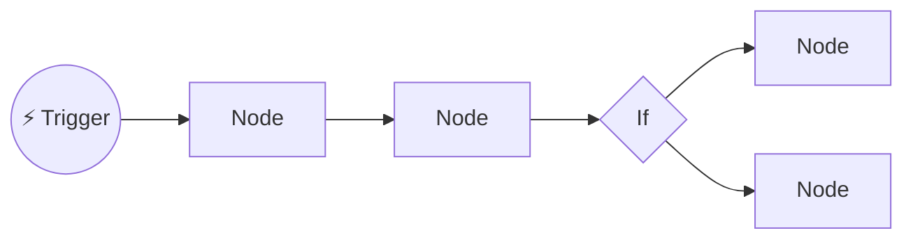

# 47 · The n8n Masterclass 🟣⚙️

> ⏱️ 7 min read · 🎯 Beginner → intermediate · 🧰 Needs: Node.js (for `npx n8n`) or Docker

**n8n is the playground where automation meets AI, and because you can self-host it for free, you can experiment without
watching a meter.** This chapter takes you from install to confident builder: the mental model, expressions, the nodes you'll
use daily, code nodes, credentials, error handling and running n8n reliably. The next chapter
([n8n AI Agents Deep Dive](48-n8n-ai-agents.md)) goes all-in on agents.

<details class="eli5" open>
<summary>🧸 ELI5: This chapter in 30 seconds</summary>

n8n is a big LEGO board for robot recipes. Each LEGO brick (a "node") does one thing: check email, ask Claude, post to
Slack. You snap them together left to right, and information flows through them like water through pipes. You can run the
whole board on your own computer for free.

</details>

<!-- in-this-chapter -->

## 🚀 Get n8n running (pick one)

<details class="eli5">
<summary>🧸 ELI5</summary>

You can try n8n with one command, run it in a container so it's always on, use their cloud version, or put it on a tiny
rented server.

</details>

| Option | Command / how | Best for |
|---|---|---|
| **Quick try** | `npx n8n` | Kicking the tires in 1 minute (needs Node.js) |
| **Docker** (recommended) | See below | Running it reliably on your machine or a server |
| **Home lab bundle** | [`examples/homelab`](../../examples/homelab/) | n8n + Ollama + Open WebUI together ([The AI Home Lab](../part-9-local-ai/80-home-lab.md)) |
| **n8n Cloud** | Sign up at n8n.io | No maintenance, always-on webhooks |
| **VPS** | Docker on a small cloud server | Always on and cheap, and it can receive webhooks from the internet |

```bash
docker volume create n8n_data
docker run -it --rm --name n8n -p 5678:5678 \
  -v n8n_data:/home/node/.n8n \
  docker.n8n.io/n8nio/n8n
```

Open **http://localhost:5678** and create your owner account. 🎉

> [!TIP]
> **💡 Your data lives in the volume**
> Everything (workflows, credentials, execution history) is stored in `n8n_data`. Back it up and you can move your whole
> setup anywhere.

## 🧠 The n8n mental model

<details class="eli5">
<summary>🧸 ELI5</summary>

Information travels through the bricks as a stack of cards (items). Most bricks do their job once for each card. That one
idea explains most of n8n.

</details>



- **Workflow** = a canvas of **nodes** connected left to right.
- **Trigger nodes** start it: Schedule, Webhook, Gmail "on new email," Chat Trigger, Form, and hundreds of app triggers.
- **Items:** data flows as a list of JSON **items**. Most nodes run **once per item**, which is the key concept!
- **Credentials** are stored once, encrypted, and reused across workflows.
- **Executions:** every run is logged. Click in to see exactly what each node received and output. This is your debugger. 🔍

## 🧮 Expressions: pulling data from anywhere

<details class="eli5">
<summary>🧸 ELI5</summary>

Expressions are little magic phrases in double curly braces that grab information from earlier bricks, like "the subject of
the email" or "today's date."

</details>

| Expression | Returns |
|---|---|
| `{{ $json.subject }}` | A field from the current item |
| `{{ $json.body.text }}` | A nested field |
| `{{ $('Gmail Trigger').item.json.from }}` | A field from a specific earlier node |
| `{{ $now.toFormat('yyyy-LL-dd') }}` | Today's date, formatted |
| `{{ $json.items.length }}` | Count of a list |
| `{{ $json.name.toUpperCase() }}` | Tiny JavaScript transformations inline |

**Pro tip:** drag a field from the input panel onto a parameter and n8n writes the expression for you.

## 🧰 The nodes you'll use every day

<details class="eli5">
<summary>🧸 ELI5</summary>

Out of hundreds of bricks, about fifteen do most of the work. Learn these and you can build almost anything.

</details>

| Node | Use it to… |
|---|---|
| **Schedule Trigger** | Run every morning, hour or Friday |
| **Webhook** | Receive data from anywhere ([Webhooks, APIs & JSON](46-webhooks-apis-json.md)) |
| **Chat Trigger** | Get a hosted chat page for your AI workflow |
| **Form Trigger** | Build a quick web form that starts a workflow |
| **HTTP Request** | Call any API |
| **Edit Fields (Set)** | Create, rename or reshape fields |
| **If / Switch / Filter** | Route and filter items |
| **Merge** | Combine data from two branches |
| **Loop Over Items** | Process in batches (great with rate limits) |
| **Aggregate / Split Out** | Combine many items into one, or split one into many |
| **Code** | JavaScript or Python when nothing else fits |
| **Wait** | Pause (for rate limits, or until a time) |
| **Basic LLM Chain / AI Agent** | Add AI thinking ([n8n AI Agents](48-n8n-ai-agents.md)) |
| **Gmail / Slack / Notion / Sheets / Telegram…** | Talk to apps |
| **Execute Workflow** | Call a sub-workflow (reusable building blocks) |

## 🤖 Your first AI workflow (15 minutes)

<details class="eli5">
<summary>🧸 ELI5</summary>

We'll build a robot that reads each new email, writes a two-sentence summary, decides if it's urgent, and pings you on your
phone for the urgent ones.

</details>

**Goal:** when a new email arrives, Claude summarizes it and flags urgency, and urgent ones ping you.

1. **Trigger:** add **Gmail Trigger** → "Message Received." Connect your Google account.
2. **AI step:** add **Basic LLM Chain** and attach an **Anthropic Chat Model** sub-node (add your API key). Prompt:
   ```text
   Summarize this email in 2 sentences, then on a new line write URGENT or NORMAL.
   From: {{ $json.from }}
   Subject: {{ $json.subject }}
   Body: {{ $json.snippet }}
   ```
3. **Route:** add an **If** node: `{{ $json.text }}` *contains* `URGENT`.
4. **Act:** on the true branch, add **Slack** or **Telegram** → send message with the summary.
5. Click **Test workflow**, send yourself an email, and watch it flow. Then toggle **Active**. ✅

Want it pre-built? Import the [example workflows](../../examples/n8n-workflows/).

## 🧑‍💻 Code nodes for superpowers

<details class="eli5">
<summary>🧸 ELI5</summary>

When no brick does exactly what you need, the Code brick lets you write a few lines of instructions. Your AI assistant can
write them for you!

</details>

Code nodes run **JavaScript or Python** (isolated in task runners in n8n 2.x). Handy snippets:

```js
// Run Once for All Items: merge everything into one summary input
const text = $input.all().map(i => `- ${i.json.title}`).join('\n');
return [{ json: { text } }];
```

```js
// Run Once for Each Item: clean up and add a field
return { json: { ...$json, email: $json.email.toLowerCase().trim(), processedAt: new Date().toISOString() } };
```

Can't write the code? Ask Claude: *"Write an n8n Code node (run once for all items) that groups items by `category` and
counts them."* It's great at this.

## 🔐 Credentials & secrets

<details class="eli5">
<summary>🧸 ELI5</summary>

Passwords and keys go in n8n's locked drawer (credentials), never written inside your recipe steps where anyone could see them.

</details>

- Store keys in **Credentials**, never hard-coded in Code nodes or HTTP headers typed by hand.
- Use **separate API keys** per project so you can see (and cap) spending.
- In n8n 2.x, **environment variable access from workflows is restricted by default**, which is a good safety default.
- Back up the **encryption key** (in the n8n data folder), because credentials can't be decrypted without it.

## 🛡️ Error handling & reliability

<details class="eli5">
<summary>🧸 ELI5</summary>

Robots sometimes trip. Tell them to try again a few times, and if they still fail, send you a message so you know.

</details>

| Technique | How |
|---|---|
| **Error workflow** | Create a workflow starting with **Error Trigger** → Slack or email alert, then set it as the error workflow in each workflow's settings |
| **Retries** | Node settings → *Retry On Fail* (with waits) for flaky APIs |
| **Continue on fail** | Let one bad item fail without stopping the whole batch, then route errors separately |
| **Pin data** | Pin a node's output to reuse sample data while building, with no re-triggering |
| **Sub-workflows** | Split big flows with **Execute Workflow** to keep them readable and reusable |
| **Rate limits** | **Loop Over Items** (batches) + **Wait** nodes |
| **Idempotency** | Store processed IDs (Data Table, Sheet or DB) so reruns don't duplicate work |

## 🏗️ Running n8n like a pro

<details class="eli5">
<summary>🧸 ELI5</summary>

Once you depend on your robots, keep their home safe: back it up, update it carefully, give it a real address with HTTPS,
and save copies of your recipes in Git.

</details>

- **Backups:** the data volume (or database) plus the encryption key, on a schedule.
- **Updates:** read release notes, back up first, then update the image. Pin versions for important instances.
- **Public webhooks:** put n8n behind HTTPS (a reverse proxy like Caddy, or a tunnel such as Cloudflare Tunnel) and set
  `WEBHOOK_URL` so webhook URLs are correct.
- **Scale:** for heavy loads, n8n supports **queue mode** (Redis + worker processes) and Postgres instead of SQLite.
- **Version control:** export workflows as JSON into Git (like this repo's [examples](../../examples/n8n-workflows/)).
- **Templates:** n8n's template library has thousands of workflows to import and remix.

## 🧱 10 n8n builds to try

<details class="eli5">
<summary>🧸 ELI5</summary>

Here are ten robot recipes to practice with, from easy to adventurous.

</details>

| # | Build | Level |
|---|---|---|
| 1 | 📰 Morning digest ([importable](../../examples/n8n-workflows/morning-ai-digest.json)) | 🟢 |
| 2 | 💡 Idea inbox → Notion ([importable](../../examples/n8n-workflows/idea-inbox-to-notion.json)) | 🟢 |
| 3 | 🧾 Receipt photos (Telegram) → vision model extracts → Google Sheets | 🟡 |
| 4 | 📧 Email triage with approval before replies | 🟡 |
| 5 | 🎙️ Voice memo → Whisper transcription → tasks + journal entry | 🟡 |
| 6 | 🔍 Lead enrichment: form → web research agent → CRM | 🟡 |
| 7 | 📚 Drive RAG bot in Slack ([n8n AI Agents](48-n8n-ai-agents.md)) | 🔴 |
| 8 | 🎥 YouTube channel monitor → transcript summary → Notion | 🟡 |
| 9 | 🏷️ Support ticket classifier + suggested answers | 🟡 |
| 10 | 🗓️ Friday weekly review from calendar, tasks and GitHub | 🟡 |

## 🎯 Key takeaways

- n8n = **nodes** passing **items**, where most nodes run **once per item**.
- **Expressions** (`{{ $json.field }}`) pull data from anywhere, so drag and drop to write them.
- ~15 core nodes cover most workflows, and the **Code** node covers the rest (let AI write it).
- Make it reliable with **error workflows, retries, pinned data, idempotency** and **backups**.
- Self-hosting = unlimited, private experimentation. 🎉

## 🧠 Check yourself

<details class="quiz">
<summary>❓ 1. Your Slack node sent 10 messages instead of 1. Why?</summary>

It received **10 items**, and most nodes run **once per item**. Use **Aggregate** (or a Code node that runs once for all
items) to combine them first.

</details>

<details class="quiz">
<summary>❓ 2. Where should API keys live in n8n?</summary>

In **Credentials** (encrypted), not typed into Code nodes or headers.

</details>

<details class="quiz">
<summary>❓ 3. How do you avoid re-triggering real emails while building?</summary>

**Pin data** on the trigger node and build against the pinned sample.

</details>

> [!TIP]
> **🎮 Try this**
> Build the **email summarizer** above, then connect it to **Telegram** (Telegram Trigger + Telegram send node) so urgent
> summaries arrive on your phone. You'll have built a real personal assistant feature on your own machine. 🤯

---

**Next:** [48 · n8n AI Agents Deep Dive →](48-n8n-ai-agents.md)
