# 47 · The n8n Masterclass: Your First AI Workflow, Click by Click 🟣⚙️

> ⏱️ 14 min read · 🎯 Beginner → intermediate · 🧰 Needs: n8n (Cloud, or Node.js 24+ / Docker), an Anthropic API key

**In the next 30 minutes you'll build a real AI app in n8n: a web form where you type any note, and Claude replies with
a one-line summary and tells you whether it's urgent.** Every step below shows what to click and what your screen should
look like. The screenshots come from a fresh install of n8n 2.41, so they match what you'll see.

<details class="keypoints" open>
<summary>✅ Key Points & Steps</summary>

n8n is a visual workflow tool. Each box (a **node**) does one job, and data flows between them from left to right.

1. **Install n8n** (Cloud, `npx n8n` or Docker) and create your owner account.
2. **Add a form trigger,** test it, and look at the data it produces.
3. **Add an AI step,** drag the form's answer into the prompt, and connect Claude.
4. **Show the AI's answer** on the form's thank-you screen and run the whole thing.
5. **Publish it,** then use the reference sections when you build your next workflow.

</details>

<!-- in-this-chapter -->

## 🎯 What you're building

Here's the finished result. Someone fills in the form, n8n sends the note to Claude, and the answer appears on screen a
second later:

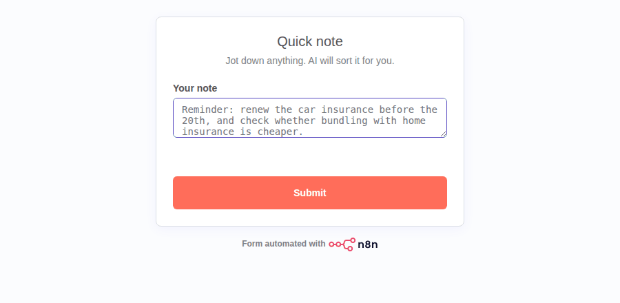

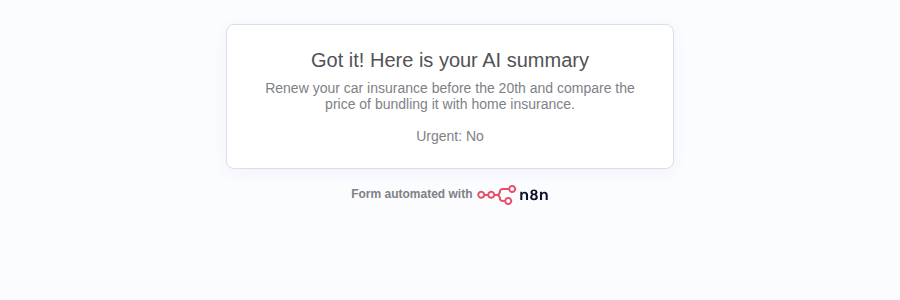

The workflow behind it has just four nodes:

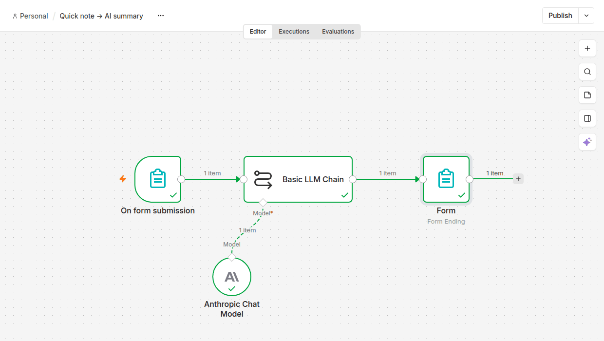

> [!NOTE]
> **📸 About these screenshots**
> They were captured on n8n 2.41.6 (October 2026). The AI replies shown are sample answers. Your own run will show
> whatever Claude writes for your note. If a button has moved in a newer version, look for the same label nearby.

## 1️⃣ Step 1: Get n8n running (5 minutes)

Pick **one** of these:

| Option | What to do | Best for |
|---|---|---|
| **n8n Cloud** | Sign up at **n8n.io** and open your workspace | No installing, always online |
| **Quick try on your computer** | Install **Node.js 24 or newer**, then run `npx n8n` in a terminal | Trying it out in a minute |
| **Docker** (recommended for keeps) | Run the two commands below | An always-on setup at home or on a server |

```bash
docker volume create n8n_data
docker run -it --rm --name n8n -p 5678:5678 -v n8n_data:/home/node/.n8n docker.n8n.io/n8nio/n8n
```

> [!WARNING]
> **⚠️ "Your Node.js version is currently not supported"**
> n8n 2.x needs **Node.js 24 or newer**. If `npx n8n` prints this, install the current Node.js from nodejs.org (or use
> Docker, which includes the right version).

**Then:**

1. Open **http://localhost:5678** in your browser (or your Cloud address).
2. Fill in **Set up owner account**: your email, name and a password with 8+ characters, one number and one capital letter.
   Click **Next**.

    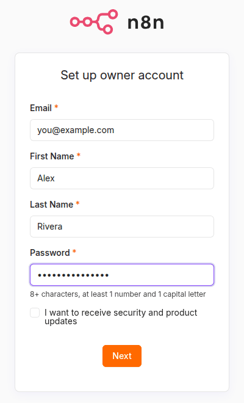

3. n8n may offer its built-in **n8n Assistant**. Click **Set up later in Settings** for now (or explore it later).
4. You land on **Overview**. Click **Build a workflow**.

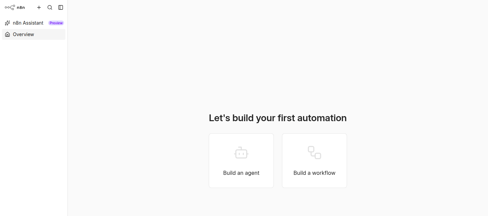

## 2️⃣ Step 2: Add a form trigger (5 minutes)

Every workflow starts with a **trigger**: the event that kicks it off. You'll use n8n's built-in web form.

1. **Name your workflow.** Click **My workflow** at the top and type *Quick note → AI summary*.
2. Click the big **+** labelled **Add first step**.

     is how you'll switch it on later.")

3. The panel **What triggers this workflow?** opens. Click **On form submission**.

    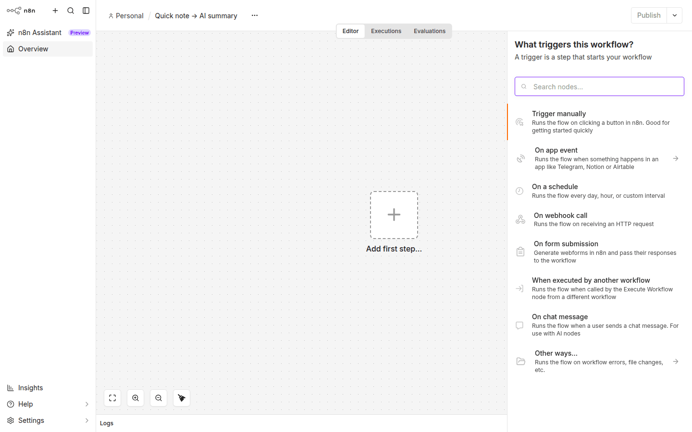

4. The node's settings open. Fill them in:
    - **Form Title:** `Quick note`
    - **Form Description:** `Jot down anything. AI will sort it for you.`
    - Click **Add Form Element**. Set **Label** to `Your note` and **Element Type** to **Textarea**.

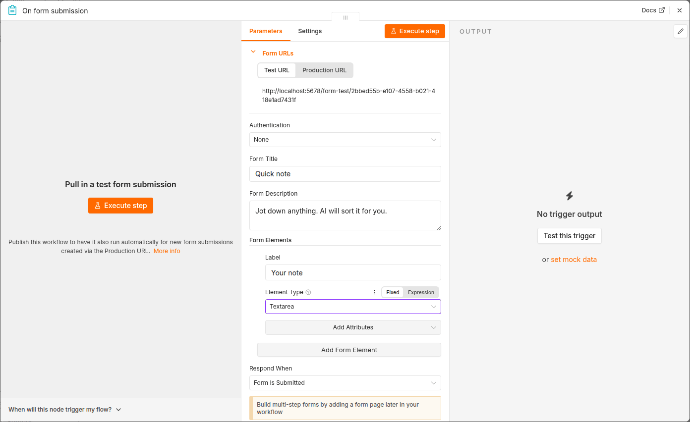

## 3️⃣ Step 3: Test the form and look at the data (3 minutes)

1. Click the orange **Execute step** button (top of the settings panel). A new browser tab opens with your test form.
2. Type a note, for example *The landlord needs to know by tonight if Thursday 10am works for the boiler repair*, and
   click **Submit**.

    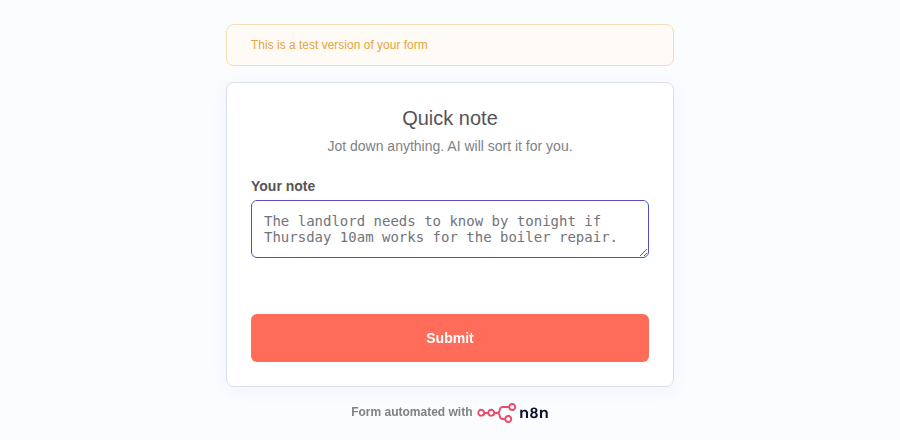

3. Switch back to the n8n tab. The **OUTPUT** panel on the right now shows what the form sent: your note, the time it
   was submitted and the form mode.

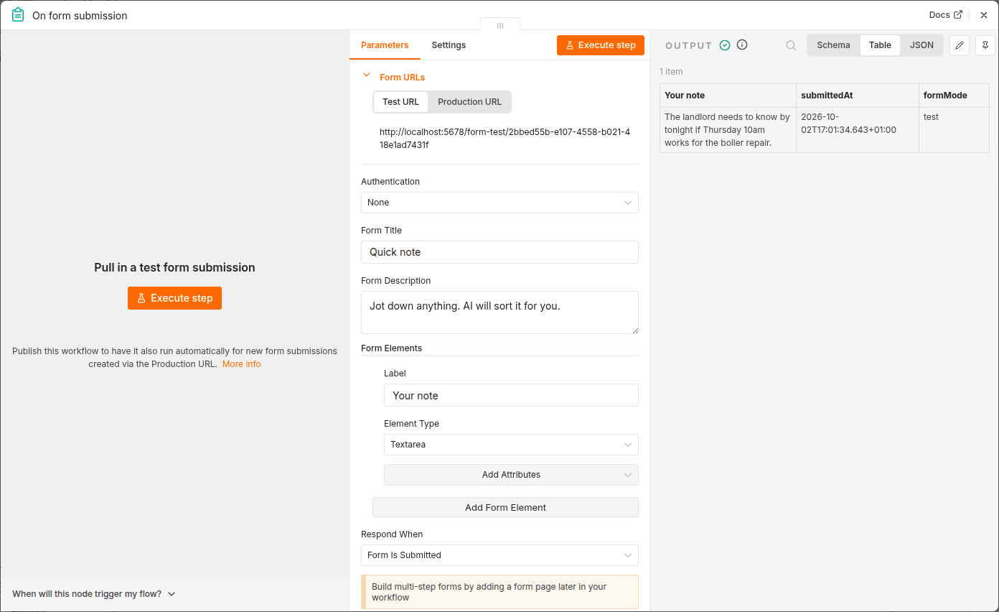

This is the most important habit in n8n: **run a step, then look at its output.** Every later step can use these fields.
Close the panel with the **×** in the top-right corner.

## 4️⃣ Step 4: Add the AI step (5 minutes)

1. Hover over the form node on the canvas and click the small **+** on its right side.
2. In the search box, type `Basic LLM` and click **Basic LLM Chain**. (It sends one prompt to an AI model and returns
   the answer.)

    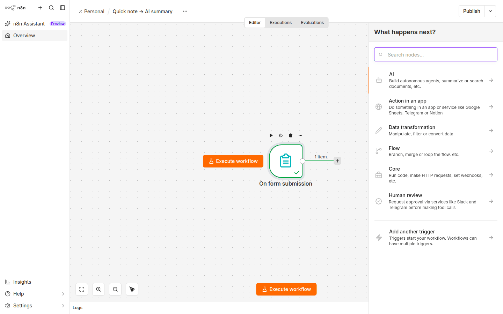

3. In the chain's settings, change **Source for Prompt (User Message)** to **Define below**.
4. Click inside the **Prompt (User Message)** box and type:

    ```text
    Summarize this note in one short sentence, then say if it is urgent (Yes or No).

    Note:
    ```

5. Now the magic move: in the **INPUT** panel on the left, find **Your note**, then **drag it** into the prompt box,
   just after `Note:`.

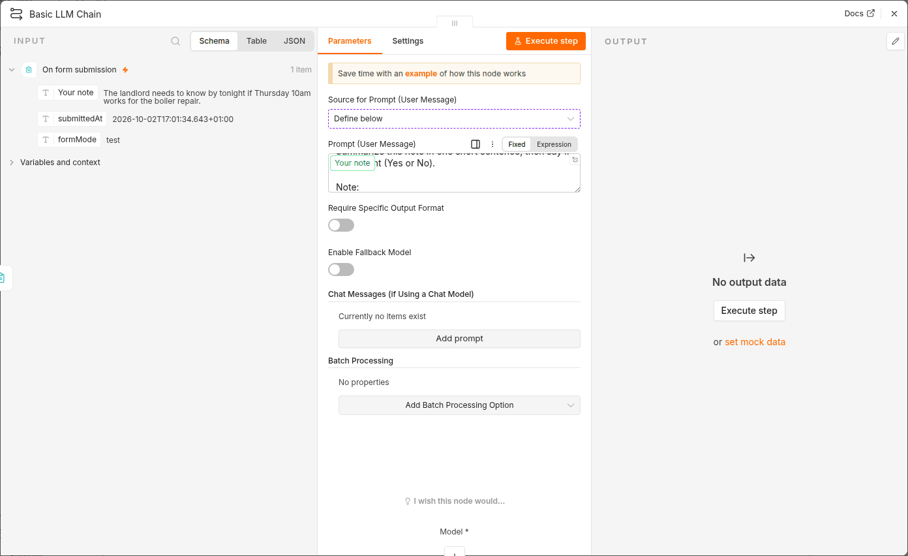

n8n writes the **expression** `{{ $json['Your note'] }}` for you and shows a live **Result** preview underneath, with
your real note filled in:

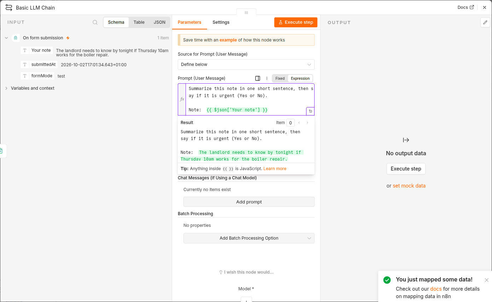

> [!TIP]
> **💡 Expressions in one sentence**
> Anything inside `{{ }}` is filled in fresh for each run. `$json` means "the data coming into this node". You rarely
> need to type expressions yourself; drag and drop writes them for you.

## 5️⃣ Step 5: Connect Claude (5 minutes)

Close the chain's panel. On the canvas, the chain shows a red warning and a **Model\*** connector underneath: it needs an AI
model before it can run.

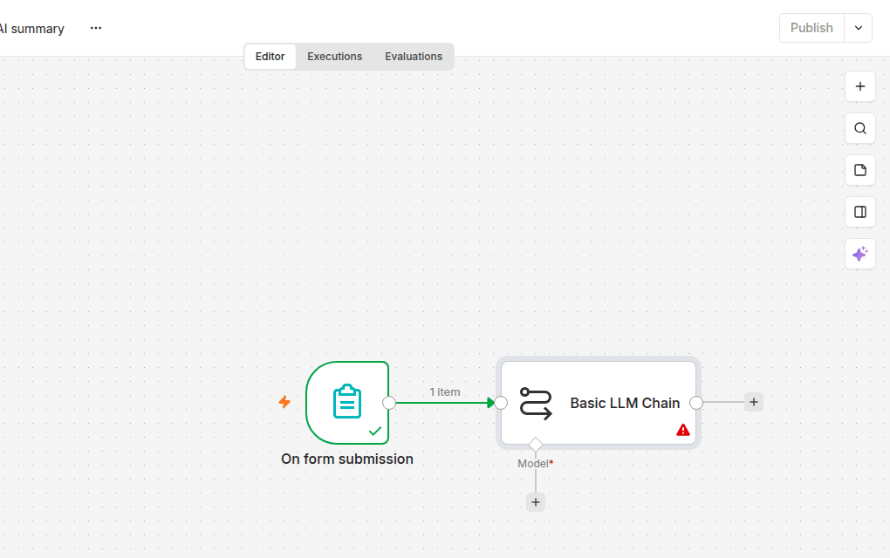

1. Click the **+** under **Model**, type `Anthropic` and choose **Anthropic Chat Model**.

    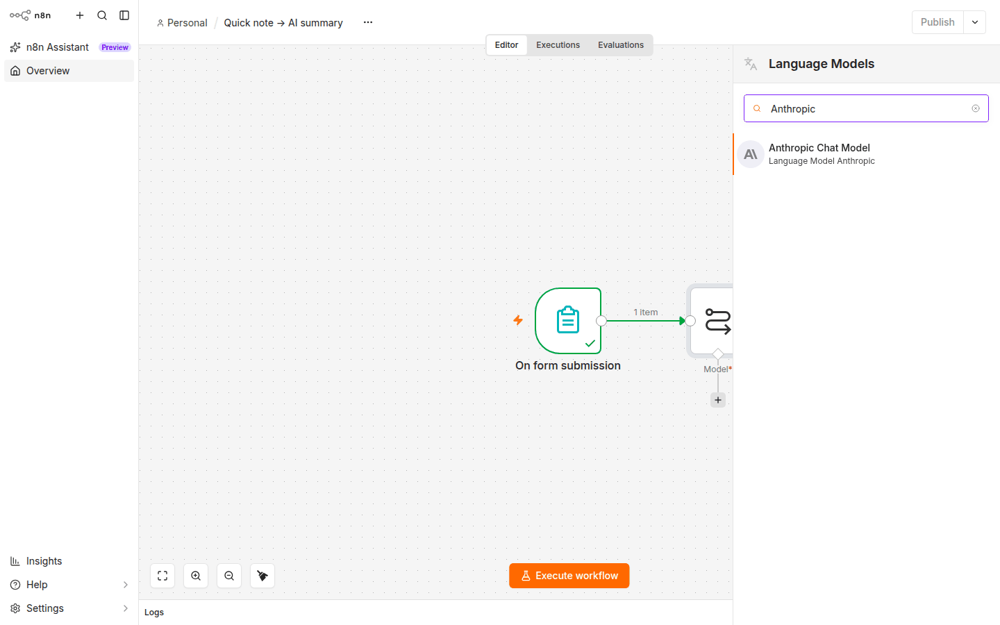

2. Click **Connect to Anthropic**. A credential window opens.
3. Paste your **API key** (create one at **console.anthropic.com → API Keys**, and set a monthly spend limit there while
   you're at it). Leave **Base URL** as it is. Click **Save**.

    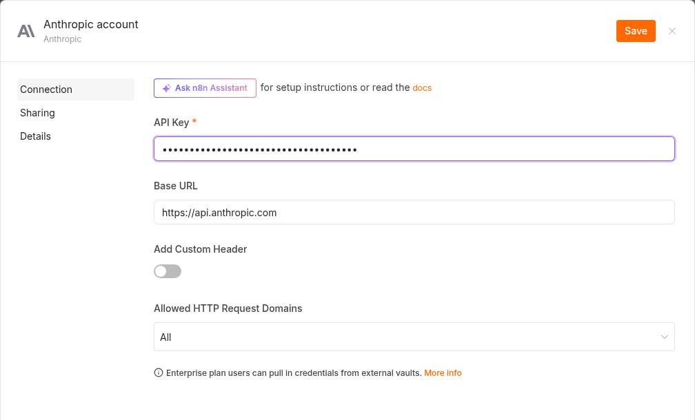

4. Close the credential window. Your model node now shows **Anthropic account** as its credential. Leave the **Model**
   on the default (a current Claude Sonnet) or pick another from the list.

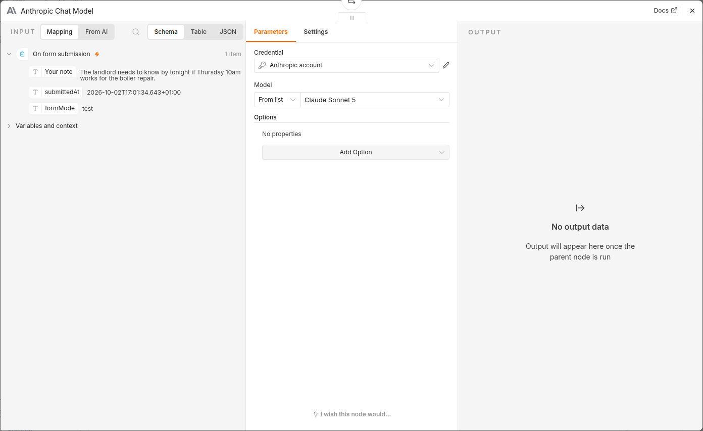

## 6️⃣ Step 6: Show the answer on screen (3 minutes)

Right now the answer would only appear inside n8n. Let's show it to whoever filled in the form.

1. Close the panel. Click the **+** on the right of **Basic LLM Chain**.
2. Search `n8n Form`, click **n8n Form**, then choose **Form Ending**.
3. Set **Completion Title** to `Got it! Here is your AI summary`.
4. For **Completion Message**, hover over the box, click **Expression**, and type `{{ $json.text }}` (the chain puts the
   AI's answer in a field called `text`).

    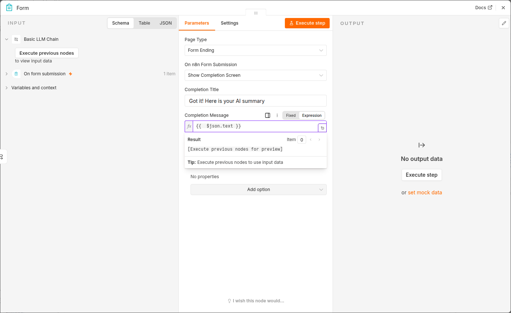

5. Close the panel and click **Zoom to fit** (bottom-left) to see the whole workflow:

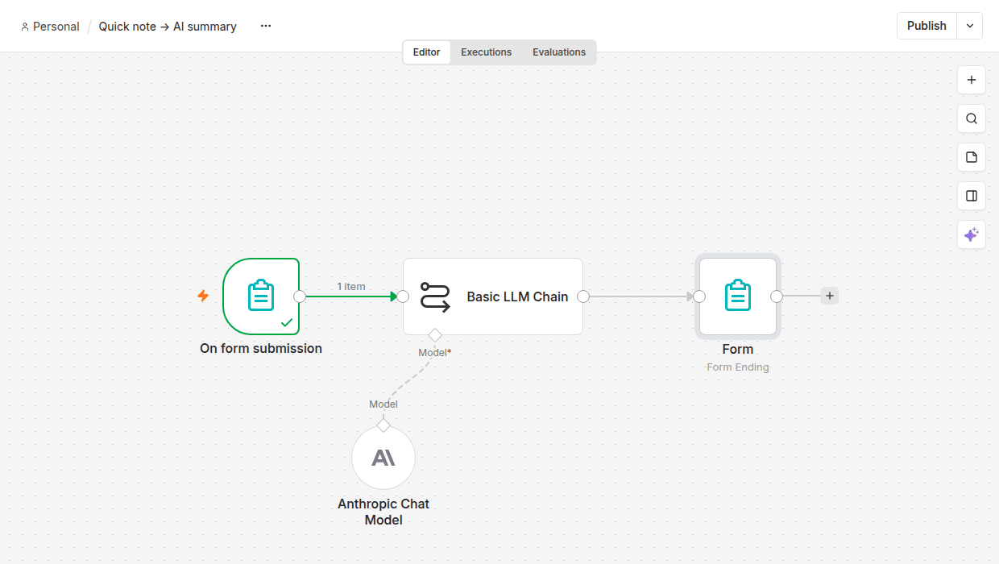

## 7️⃣ Step 7: Run it end to end (2 minutes)

1. Click **Execute workflow** at the bottom of the canvas. The test form opens in a new tab again.
2. Type a note and click **Submit**. After a second or two you see Claude's answer:

    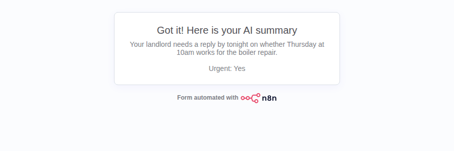

3. Back in n8n, every node has a green border and tick, and the lines show **1 item** flowing through:

    

4. Double-click **Basic LLM Chain** to see exactly what went in and what came out:

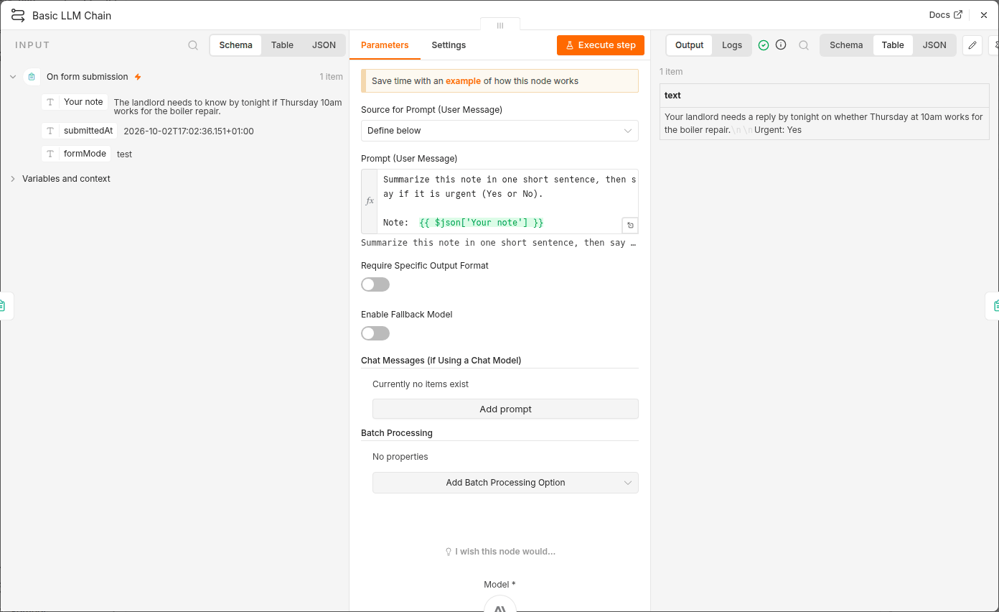

## 8️⃣ Step 8: Publish it (3 minutes)

So far it only runs when you click **Execute workflow**. **Publishing** switches it on for real.

1. Click **Publish** (top right). Give this version a name, such as *First version*, and click **Publish**.

    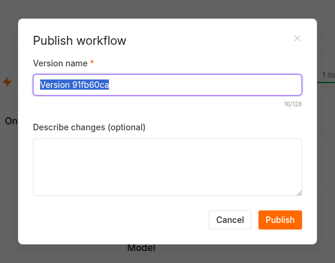

2. n8n shows a **Production Checklist**. It's worth doing all three soon: an error workflow (so you hear about failures),
   time-saved tracking, and MCP access (so AI assistants can use your workflows).

    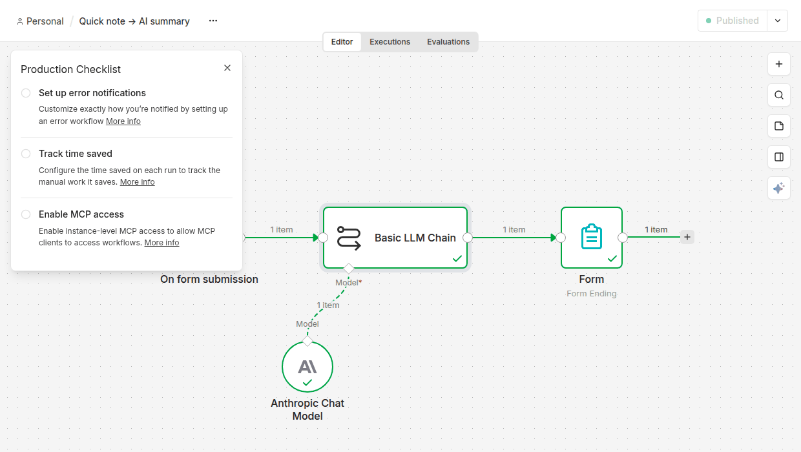

3. Double-click **On form submission** and click **Production URL**. That's your form's permanent address. Share it,
   bookmark it, or add it to your phone's home screen.

    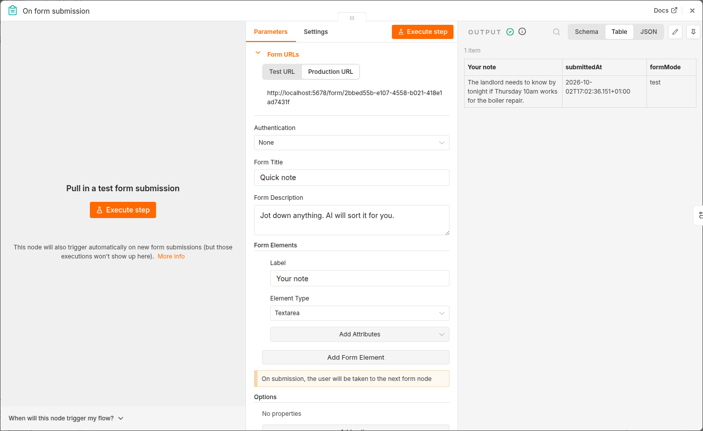

4. Submissions through the production URL run in the background. To see them, open the **Executions** tab at the top
   of the canvas:

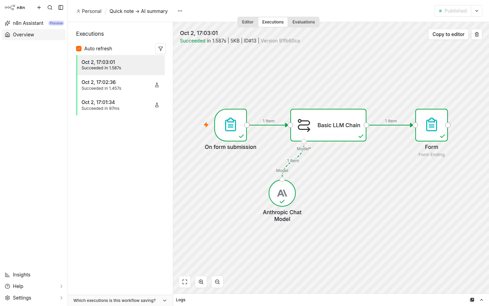

🎉 **You've built and published an AI app.** Everything else in n8n is the same loop: add a node, run it, look at the
output, connect the next one.

## 🩺 If something goes wrong

| What you see | What it means | Fix |
|---|---|---|
| `Your Node.js version … is currently not supported` | n8n 2.x needs Node.js 24+ | Update Node.js, or use Docker or Cloud |
| A node has a **red warning triangle** | A required setting or credential is missing | Double-click it; the missing field is marked in red |
| **Couldn't connect with these settings** when saving a credential | The key is wrong, expired or has no credit | Create a new key, check billing, paste it again |
| The test form says it's **not listening** | The test URL only works right after you click **Execute step** or **Execute workflow** | Click it again, then submit |
| The thank-you screen shows `{{ $json.text }}` literally | The message box is in **Fixed** mode | Switch it to **Expression** |
| The production URL gives **404** | The workflow isn't published | Click **Publish** |

## 🧮 Reference: expressions you'll use most

| Expression | Returns |
|---|---|
| `{{ $json.subject }}` | A field from the incoming item |
| `{{ $json['Your note'] }}` | A field whose name has spaces |
| `{{ $('On form submission').item.json['Your note'] }}` | A field from a specific earlier node |
| `{{ $now.toFormat('yyyy-LL-dd') }}` | Today's date |
| `{{ $json.items.length }}` | How many entries a list has |

## 🧰 Reference: the nodes you'll use every day

| Node | Use it to… |
|---|---|
| **Schedule Trigger** | Run every morning, every hour or every Friday |
| **Webhook** | Receive data from any app or script ([Webhooks, APIs & JSON](46-webhooks-apis-json.md)) |
| **On form submission / On chat message** | Get a hosted form or chat page, like in this chapter |
| **HTTP Request** | Call any web API |
| **Edit Fields (Set)** | Create, rename or reshape fields |
| **If / Switch / Filter** | Send items down different paths |
| **Merge / Aggregate / Split Out** | Combine or split items |
| **Loop Over Items + Wait** | Work in batches and respect rate limits |
| **Code** | JavaScript or Python when nothing else fits (ask an AI to write it) |
| **Basic LLM Chain / AI Agent** | Add AI ([n8n AI Agents](48-n8n-ai-agents.md)) |
| **Gmail, Slack, Notion, Sheets, Telegram…** | Talk to hundreds of apps |

**Items, in one paragraph.** Data moves between nodes as a list of **items** (rows), and most nodes run once per item.
If a Slack node sends ten messages instead of one, it received ten items. Put an **Aggregate** node before it to combine
them.

## 🏗️ Reference: running n8n for real

- **Error workflow:** build a workflow that starts with **Error Trigger** and alerts you, then pick it under
  **⋯ → Settings → Error Workflow** in every important workflow.
  ([Part XIV's build-along](../part-14-n8n-and-notion/127-build-along-ai-command-center.md) shows this step by step.)
- **Retries:** in a node's **Settings** tab, turn on **Retry On Fail** for flaky APIs.
- **Pin data:** pin a node's output (the pin icon in the OUTPUT panel) to rebuild later steps without re-triggering.
- **Sharing a form or webhook with the world:** a `localhost` address only works on your computer. Use n8n Cloud, or put
  self-hosted n8n behind HTTPS (a tunnel such as Cloudflare Tunnel, or a reverse proxy like Caddy) and set the
  `WEBHOOK_URL` environment variable to that address.
- **Backups:** back up the `n8n_data` volume **and** the encryption key. Export important workflows as JSON
  (**⋯ → Export JSON**) into Git.
- **Updates:** read the release notes, back up, then update. Pin versions for instances you rely on.

## 🧱 10 n8n builds to try next

| # | Build | Level |
|---|---|---|
| 1 | 📰 Morning digest ([importable](../../examples/n8n-workflows/morning-ai-digest.json)) | 🟢 |
| 2 | 💡 Idea inbox → Notion ([importable](../../examples/n8n-workflows/idea-inbox-to-notion.json)) | 🟢 |
| 3 | 📧 Email summarizer: Gmail Trigger → Basic LLM Chain → Telegram | 🟢 |
| 4 | 🧾 Receipt photos (Telegram) → vision model extracts → Google Sheets | 🟡 |
| 5 | 📧 Email triage with your approval before replies | 🟡 |
| 6 | 🎙️ Voice memo → transcription → tasks and journal entry | 🟡 |
| 7 | 🔍 Lead enrichment: form → web research agent → CRM | 🟡 |
| 8 | 🎥 YouTube channel monitor → transcript summary → Notion | 🟡 |
| 9 | 🗓️ Friday weekly review from calendar, tasks and GitHub | 🟡 |
| 10 | 🏗️ A full AI command center in Notion ([build-along](../part-14-n8n-and-notion/127-build-along-ai-command-center.md)) | 🔴 |

> [!TIP]
> **🎮 Try this next**
> Duplicate your workflow (**⋯ → Duplicate**), swap the form trigger for a **Gmail Trigger**, and send the summary to
> yourself on **Telegram**. You'll have an email summarizer in under 15 minutes.

---

**Next:** [48 · n8n AI Agents Deep Dive →](48-n8n-ai-agents.md)
