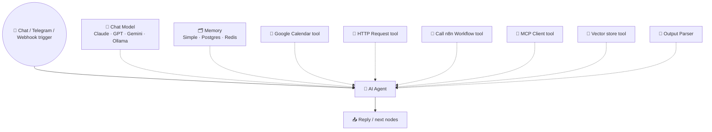
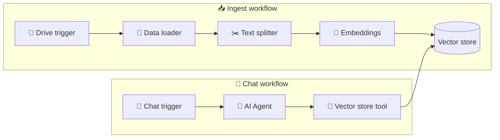

# 48 · n8n AI Agents Deep Dive 🤖🟣

> ⏱️ 9 min read · 🎯 Intermediate · 🧰 Needs: n8n (local or Cloud) + an AI API key (or Ollama for free local models)

**The AI Agent node puts a full tool-using agent inside a workflow**, with any model, memory, tools, MCP, RAG, structured
output and human approvals. This chapter is your deep dive: how each piece works, how to design reliable agents, and how to
build a personal assistant bot you can text from your phone.

<details class="eli5" open>
<summary>🧸 ELI5: This chapter in 30 seconds</summary>

A normal n8n recipe follows fixed steps. An **AI Agent brick** is a little brain inside the recipe that decides for itself
which tools to use, like a helper you can text: "What's on tomorrow, and add 'buy a birthday card' before my 3pm meeting."
It checks your calendar, adds the task and texts you back. You give it a brain (model), a memory and a toolbox.

</details>

<!-- in-this-chapter -->

## 🧩 Anatomy of the AI Agent node

<details class="eli5">
<summary>🧸 ELI5</summary>

The agent brick has plug-in slots: one for the brain, one for memory, many for tools, and one for a "fill in this form"
output helper.

</details>



The node runs the agent loop from [The Mental Model](../part-3-foundations/32-the-mental-model.md#-the-agent-loop-demystified):
think → call a tool → read the result → repeat → answer. Every step is visible in the execution log, so you can watch the
agent think. 🔍

## 🧠 Choosing the chat model

<details class="eli5">
<summary>🧸 ELI5</summary>

Pick a smart brain for the agent that makes decisions, and cheaper, faster brains for simple jobs like sorting. You can even
use a free brain running on your own computer.

</details>

| Model slot option | When to use |
|---|---|
| **Anthropic (Claude)** | Excellent tool use and instruction following, a great default for agents |
| **OpenAI / Google Gemini / Mistral** | Solid alternatives, and handy if you already have credits |
| **OpenRouter** | One key, hundreds of models, great for comparing |
| **Ollama** (local) | Free, private, unlimited, for simpler agents and high volume ([Local & Open Models](../part-9-local-ai/78-local-and-open-models.md)) |

**Tips:** use your strongest model for the **agent** (it makes decisions), and cheaper models for simple **chain** steps like
classify, summarize and extract. Test the same workflow with two models, because tool-use quality varies a lot.

## 🗂️ Memory: remembering the conversation

<details class="eli5">
<summary>🧸 ELI5</summary>

Memory lets the agent remember what you said earlier in the chat. Each person gets their own memory box, labeled with their
chat ID, so conversations don't get mixed up.

</details>

| Memory type | Stored where | Good for |
|---|---|---|
| **Simple Memory** | Inside n8n (in-process) | Testing and small personal bots |
| **Postgres / Redis chat memory** | Your database | Production bots and multiple users, survives restarts |
| **Custom** (Data Tables, Sheets, vector stores) | Anywhere | Long-term facts ("my preferences"), see [Memory for Agents](../part-8-knowledge-and-memory/75-memory-for-agents.md) |

**Key setting: the session key.** Use a unique ID per conversation (e.g. the Telegram chat ID
`{{ $json.message.chat.id }}`) so each person has their own memory. **Context window length** controls how many past messages
are sent each time: more means better recall but more tokens.

## 🔧 Tools: what the agent can do

<details class="eli5">
<summary>🧸 ELI5</summary>

Tools are the agent's hands. Almost any n8n brick can become a tool, and you can even hand the agent a whole other recipe as
one big tool.

</details>

| Tool type | What it gives the agent |
|---|---|
| **App nodes as tools** | Gmail, Calendar, Notion, Sheets, Slack, Todoist… (hundreds) |
| **HTTP Request Tool** | Any API ([Webhooks, APIs & JSON](46-webhooks-apis-json.md)) |
| **Code Tool** | Custom logic in JavaScript or Python |
| **Call n8n Workflow Tool** | An *entire workflow* as one tool (see power move below) |
| **MCP Client Tool** | Every tool from any MCP server ([The Big MCP Server Catalog](../part-4-mcp-and-connectors/40-mcp-server-catalog.md)) |
| **Vector Store Tool** | Search your documents (RAG, see below) |
| **Calculator / Think tools** | Exact math, and a scratchpad for reasoning |

**Letting the model fill in parameters:** in tool nodes you can mark parameters to be decided by the AI (n8n's `$fromAI()`
expressions and "let the model define this parameter" options), with a description of what the value should be.

> [!TIP]
> **💡 Power move: workflows as tools**
> Give the agent **whole workflows** as single tools, like `enrich_lead` or `generate_invoice`. The agent stays simple, and
> the complex logic stays deterministic, testable and cheap. This is the single best pattern for reliable n8n agents.

## 📝 Writing the system message

<details class="eli5">
<summary>🧸 ELI5</summary>

The system message is the agent's job description: who it is, who it helps, which tools to use when, and what it must
always ask permission for.

</details>

A strong agent system message covers **role, user, tools, rules and style**:

```text
You are Alex's upbeat personal assistant, reachable on Telegram.
Today is {{ $now.toFormat('cccc, d LLLL yyyy') }}. Alex's timezone is Europe/Lisbon.

Tools:
- Use google_calendar_get to check events before suggesting times.
- Use todoist_create_task for anything Alex wants to remember.
- Use web_search only for current facts; cite the source.

Rules:
- Ask for confirmation before creating or deleting calendar events.
- If a request is ambiguous, ask one short clarifying question.
- Never invent calendar entries; if a tool fails, say so kindly.

Style: short, warm replies (max ~80 words), emoji welcome.
```

Note the **date injection**: agents don't know today's date unless you tell them!

## 🧾 Structured output & AI helper nodes

<details class="eli5">
<summary>🧸 ELI5</summary>

When the next brick needs neat, labeled answers, attach a "fill in this form" helper. n8n also has ready-made AI bricks for
common jobs like sorting text into categories.

</details>

- **Structured Output Parser:** define a JSON schema (or example) and the agent/chain must return matching JSON.
- **Information Extractor:** pull fields (name, amount, date…) out of messy text.
- **Text Classifier:** route items into categories (e.g. billing / bug / feature / other), each category its own output branch.
- **Sentiment Analysis:** positive / neutral / negative routing.
- **Summarization chain:** summarize long documents in chunks.

These specialized nodes are often **more reliable and cheaper** than a general agent for single-purpose steps.

## 📚 RAG inside n8n

<details class="eli5">
<summary>🧸 ELI5</summary>

RAG lets your agent look things up in your own documents before answering. In n8n you build one recipe to put documents in
a library, and another where the agent reads from it.

</details>



1. **Ingest:** Drive trigger (new or updated file) → Default Data Loader → Recursive Character Text Splitter → Embeddings
   (OpenAI, Cohere, Google, Ollama…) → Vector Store insert (Supabase/pgvector, Qdrant, Pinecone, or in-memory for testing).
2. **Chat:** Chat Trigger → AI Agent with a **Vector Store tool** pointing at the same store → grounded answers.
3. Tell the agent in its system message: *"Answer from the knowledge base. If it isn't there, say so."*

Concepts explained in [RAG, Memory & Knowledge](../part-8-knowledge-and-memory/72-rag-memory-and-knowledge.md).

## 🔌 n8n ❤️ MCP (both directions)

<details class="eli5">
<summary>🧸 ELI5</summary>

n8n can *use* other MCP doors (so your agent gets GitHub, Notion…), and it can *become* an MCP door (so Claude can press
your n8n recipes like buttons).

</details>

| Feature | What it does | Use it for |
|---|---|---|
| **MCP Client Tool** | Your n8n agent calls tools from any MCP server | Give n8n agents GitHub, Notion, Brave Search… |
| **MCP Server Trigger** | Turns a workflow into an MCP server with a URL | Claude, Cursor or ChatGPT can call your n8n workflows as tools |
| **Instance-level MCP** | AI clients can search, build and run workflows in your n8n | *"Claude, build me a workflow that…"* |

**Recipe:** expose a "log expense" workflow via MCP Server Trigger → add the URL to Claude as a custom connector → from your
phone: *"Log $14 lunch with Sam, category Meals."* 📱➡️📊

## 🧑‍⚖️ Humans in the loop

<details class="eli5">
<summary>🧸 ELI5</summary>

For important actions, the robot pauses and asks you "Should I?" on Slack, email or Telegram, and waits for your yes or no.

</details>

- **Send-and-wait nodes** (Slack, Gmail, Telegram, Discord and others) pause the workflow until you approve, reject, or reply
  with text.
- Pattern: *agent drafts* → **send-and-wait** approval → *if approved* → action node.
- Put approvals on anything that **sends, spends, deletes or posts publicly** ([MCP Security & Trust](../part-4-mcp-and-connectors/43-mcp-security-and-trust.md)).

## 🛡️ Guardrails & evaluations

<details class="eli5">
<summary>🧸 ELI5</summary>

Guardrails are safety rails that check what goes in and out of the AI. Evaluations are practice tests that tell you whether
your agent is getting better or worse when you change it.

</details>

- **Validate outputs** with If or Code nodes before acting (e.g. is the amount a number? is the email address real?).
- **Guardrail nodes** (in recent n8n versions) help check for things like personal data, jailbreak attempts or off-topic
  requests before they reach the model or an action.
- **Limit tools** per agent: fewer tools = fewer surprises.
- **Evaluations:** n8n's evaluation features run your workflow against a dataset of test inputs and score the results, so you
  can see if a prompt or model change helped ([Evaluating & Comparing AI](../part-12-mastery/105-evaluating-ai.md)).

## 🏗️ Build: a personal assistant on Telegram (30 min)

<details class="eli5">
<summary>🧸 ELI5</summary>

We'll build a helper you can text from your phone. It can check your calendar, add tasks and look things up. It's like
having your own mini-assistant in your pocket.

</details>

1. **Create a Telegram bot:** message **@BotFather** on Telegram → `/newbot` → copy the token.
2. **Trigger:** Telegram Trigger (message received) with your bot credential.
3. **Filter:** an **If** node that only continues if `{{ $json.message.from.id }}` equals *your* Telegram user ID (so
   strangers can't use your bot!).
4. **AI Agent:** system message like the example above. Model: Anthropic. Memory: Simple Memory with session key =
   `{{ $json.message.chat.id }}`.
5. **Tools:** Google Calendar (get events, create event), Todoist (create task), and an HTTP Request tool for weather
   (Open-Meteo, no key).
6. **Reply:** Telegram node → send message → chat ID from the trigger, text = `{{ $json.output }}`.
7. **Activate**, then text your bot: *"What's on tomorrow? Add 'buy a birthday card' before my 3pm."* 🎉

The full, polished version (voice notes, daily briefings, long-term memory) is
[Build-Along: Your Pocket AI Assistant](../part-13-build-alongs/112-build-along-pocket-ai-assistant.md).

## 👥 Multi-agent patterns in n8n

<details class="eli5">
<summary>🧸 ELI5</summary>

You can have a boss agent that hands jobs to specialist helper agents, each living in its own recipe.

</details>

- **Orchestrator + specialists:** a main agent with tools that are *sub-workflows containing their own agents* (a research
  agent, a writing agent, a calendar agent). Each specialist has a focused system message and toolset.
- **Pipelines:** fixed sequences like classify → extract → draft → review, each a small chain, which is often more reliable than
  one big agent.
- More patterns in [Multi-Agent Systems](../part-7-building-with-ai/70-multi-agent-systems.md).

## 💸 Cost & performance tips

<details class="eli5">
<summary>🧸 ELI5</summary>

Agents can get chatty and expensive. Give them fewer tools, shorter memories and cheaper brains for easy jobs, and filter
out stuff that doesn't need AI at all.

</details>

- **Filter before AI:** skip newsletters and spam with plain If nodes.
- **Short memory windows** (e.g. the last 10 messages) unless you need more.
- **Cheaper models for chains**, strong models for agents.
- **Workflows as tools** reduce agent steps (one tool call instead of five).
- **Max iterations:** set a sensible cap on agent loops.
- **Set API spend limits** in your provider console ([Cost Optimization](../part-12-mastery/106-cost-optimization.md)).

## 🎯 Key takeaways

- The **AI Agent node** = model + memory + tools + optional output parser, running the agent loop inside a workflow.
- Use **session keys** for per-user memory and **inject today's date** into system messages.
- **Workflows as tools** are the best pattern for reliable agents, and specialized AI nodes beat agents for single jobs.
- n8n speaks **MCP both ways**: use MCP servers, or expose workflows as MCP tools.
- Add **send-and-wait approvals**, guardrails, iteration caps and evaluations before trusting an agent.

## 🧠 Check yourself

<details class="quiz">
<summary>❓ 1. Two people chat with your bot and it mixes up their conversations. What's wrong?</summary>

The **memory session key** isn't unique per conversation. Use the chat ID (or user ID) as the session key.

</details>

<details class="quiz">
<summary>❓ 2. Your agent books meetings on the wrong day. What's a likely missing piece?</summary>

**Today's date and timezone** in the system message. Agents don't know the date unless you tell them.

</details>

<details class="quiz">
<summary>❓ 3. When should you use a Text Classifier node instead of an AI Agent?</summary>

When the job is **single-purpose** (route into fixed categories). It's simpler, cheaper and more reliable than a general agent.

</details>

> [!TIP]
> **🎮 Try this**
> Build the **Telegram assistant** above with just *one* tool (weather). When that works, add the calendar tool, then a task
> tool. Growing an agent one tool at a time is the secret to agents that actually work. 🌱

---

**Next:** [49 · Zapier & Make Walkthroughs →](49-zapier-and-make-walkthroughs.md)
