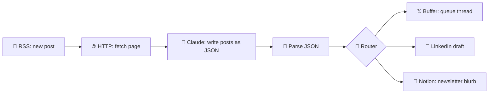

# 49 · Zapier & Make Walkthroughs 🟠🟦

> ⏱️ 6 min read · 🎯 Beginner-friendly, no code · 🧰 Needs: free Zapier and/or Make accounts

**n8n is the tinkerer's tool. Zapier and Make are the fastest paths from idea to working automation**: no servers, no code,
giant app catalogs. This chapter walks through real builds in both, including Zapier Agents, Zapier MCP and Make's visual
power features, and ends with a clear "which one when" guide.

<details class="eli5" open>
<summary>🧸 ELI5: This chapter in 30 seconds</summary>

Zapier and Make are robot-recipe kitchens you use in your web browser. **Zapier** is like a simple recipe card: step 1, step
2, step 3. **Make** is like drawing a map with bubbles and arrows, so recipes can split and loop. Both can add AI to any
step, and Zapier can even hand your AI chat a remote control for thousands of apps.

</details>

<!-- in-this-chapter -->

## 🟠 Zapier concepts in 2 minutes

<details class="eli5">
<summary>🧸 ELI5</summary>

A "Zap" is one robot recipe. Every step that does something counts as a "task," which is how Zapier charges. You can add
filters, branches, AI steps, and even AI teammates called Agents.

</details>

| Term | Meaning |
|---|---|
| **Zap** | An automation: one trigger + one or more actions |
| **Task** | Each successful action step, which is how Zapier bills |
| **Filters / Paths** | "Only continue if…" and branching |
| **Formatter** | Built-in text, date and number transformations (free steps!) |
| **Tables** | Zapier's built-in database |
| **Interfaces** | Simple forms, chatbots and portals |
| **Agents** | AI teammates that act across your apps |
| **Copilot** | Describe what you want in English, and it builds the Zap |
| **Zapier MCP** | Exposes Zapier actions to Claude, ChatGPT, Cursor and others |
| **Human in the Loop** | Pause for approval before continuing |

## 🧲 Walkthrough 1: AI lead responder (15 min)

<details class="eli5">
<summary>🧸 ELI5</summary>

When someone fills in your website form, the robot writes them a warm, personal reply draft and logs them in a spreadsheet.
You just review and send.

</details>

1. **Trigger:** Typeform, Google Forms or Tally → *New Response*.
2. **Action:** *AI by Zapier* (or the *Anthropic (Claude)* app) → prompt:
   ```text
   A lead just filled our form. Write a warm, 3-sentence reply that references their answer to
   "What are you hoping to achieve?": {{answer}}. Sign as Alex. No subject line.
   ```
3. **Action:** *Gmail → Create Draft* (a draft, not send, so you review first!) to `{{email}}` with the AI output.
4. **Action:** *Google Sheets → Add Row* to log the lead.
5. Test each step → Publish. ✅

> 💡 **Using Copilot:** type *"When someone fills my Tally form, have AI draft a personalized reply in Gmail and log them in
> Sheets,"* and it builds the steps above for you to review.

## 🔌 Walkthrough 2: Zapier MCP (one URL, thousands of apps)

<details class="eli5">
<summary>🧸 ELI5</summary>

You make a special web address that gives your AI chat a remote control for your apps. You pick which buttons are on the
remote, like "send Slack message" or "create Trello card."

</details>

1. Go to **Zapier MCP** (zapier.com/mcp) and create a server.
2. **Add actions** you want the AI to be able to do, e.g. *Gmail: Send Email*, *Google Calendar: Create Event*,
   *Slack: Send Channel Message*, *Trello: Create Card*.
3. Copy the server URL, or follow the one-click instructions for Claude, ChatGPT or Cursor.
4. In Claude: *"Create a Trello card in 'Ideas' called 'Podcast about AI gardening' and post it to #random."*

**Why it's great:** you choose exactly which actions are exposed, and Zapier handles every app's login. It's one of the
fastest ways to give AI "hands" across thousands of apps ([MCP Explained](../part-4-mcp-and-connectors/38-mcp-explained.md)).

## 🕵️ Walkthrough 3: a Zapier Agent

<details class="eli5">
<summary>🧸 ELI5</summary>

An Agent is an AI teammate that wakes up on a schedule, does research, uses your apps and emails you what it found, all by
itself.

</details>

1. Open **Zapier Agents** → New agent.
2. Instructions: *"Every weekday at 8am, check my Google Calendar for today's external meetings. For each one, research the
   company website and recent news, and email me a 5-bullet prep brief."*
3. Give it tools: Calendar, web browsing, Gmail.
4. Test it on today, refine the instructions, then turn on the schedule.

## 💡 Zapier tips

<details class="eli5">
<summary>🧸 ELI5</summary>

Put filters early so you don't pay for useless steps, use the free text-fixing steps instead of AI when you can, and ask
for approval before anything important.

</details>

- **Filters early** save tasks (and money): stop irrelevant items before AI steps.
- Use **Formatter** for simple text cleanup instead of paying for AI.
- Turn on **auto-replay** for failed runs, and get error notifications by email.
- **Human in the Loop** steps let you approve before a Zap or Agent does something important.
- Name your steps clearly ("Draft reply," not "Action 3"), because future you will thank you.

## 🟦 Make concepts in 2 minutes

<details class="eli5">
<summary>🧸 ELI5</summary>

In Make, your robot recipe is a map of bubbles. Each bubble is a step. You can split the path with a router, loop over lists
with an iterator, and glue results back together with an aggregator.

</details>

| Term | Meaning |
|---|---|
| **Scenario** | An automation (a visual flow of modules) |
| **Module** | One step (app action, tool, router…) |
| **Operation / credit** | Each module run, which is how Make bills |
| **Router** | Split into multiple branches |
| **Iterator / Aggregator** | Loop over arrays, then combine results back together |
| **Data store** | Make's built-in storage |
| **Make AI Agents** | Goal-driven agents that use your scenarios as tools |

## 📣 Walkthrough 4: social media repurposer (30 min)

<details class="eli5">
<summary>🧸 ELI5</summary>

When you publish a new blog post, the robot reads it, writes posts for X, LinkedIn and your newsletter, and sends each to the
right place for you to review.

</details>



1. **RSS → Watch RSS feed items** (your blog).
2. **HTTP → Make a request** to fetch the full article, then **Text parser → HTML to text**.
3. **Anthropic Claude → Create a Prompt** (or the OpenAI/Gemini module):
   ```text
   From this article, return JSON only:
   {"x_thread": ["tweet1", "..."], "linkedin": "...", "newsletter_blurb": "..."}
   Tone: friendly expert. Article: {{text}}
   ```
4. **JSON → Parse JSON** (Make can generate the data structure from a sample).
5. **Router** → three branches: Buffer, LinkedIn (or a Google Doc for review), Notion.
6. **Run once** to test. Inspect the bubbles on each module to see the data, then schedule it.

## 🧾 Walkthrough 5: invoice extractor

<details class="eli5">
<summary>🧸 ELI5</summary>

When an invoice email arrives, the robot reads the attached PDF, pulls out the important numbers, adds them to a
spreadsheet and puts the due date in your calendar.

</details>

1. **Gmail → Watch emails** (filter: has attachment, subject contains "invoice").
2. **Iterator** over attachments → **Claude or Gemini with PDF/image input**: extract vendor, amount, due date and invoice
   number as JSON.
3. **Google Sheets → Add a row**, plus **Google Calendar → Create event** on the due date.
4. **Error handler** route → email yourself if extraction fails.

## 🔧 Make tips

<details class="eli5">
<summary>🧸 ELI5</summary>

Add safety nets to bubbles that might fail, remember what you already processed so nothing happens twice, and let your AI
chat start scenarios for you.

</details>

- Right-click any module → **Add error handler** (Resume, Ignore, Break, Rollback).
- Use **Data stores** to remember what you've processed (dedupe!).
- **Scenario inputs** + **Make's MCP server** let AI assistants trigger scenarios on demand.
- **Aggregate before AI:** send one combined request instead of 50 small ones to save operations and tokens.

## ⚖️ Zapier vs. Make vs. n8n: when to use which

<details class="eli5">
<summary>🧸 ELI5</summary>

Zapier = easiest. Make = best for complicated maps. n8n = free, private and super powerful. Lots of people use two of them.

</details>

| Situation | Winner |
|---|---|
| "I need it working in 10 minutes and I don't code" | 🟠 Zapier |
| An obscure app only Zapier supports | 🟠 Zapier |
| Complex branching, loops and data transformation, visually | 🟦 Make |
| High volume on a budget | 🟣 n8n (self-hosted) or 🟦 Make |
| Privacy and self-hosting | 🟣 n8n |
| Custom code and AI agents with any model, including local | 🟣 n8n |
| Your team lives in Microsoft 365 | Power Automate |

**Plenty of pros use two:** Zapier for quick glue and rare apps, and n8n or Make for heavy, custom work.

## 🎯 Key takeaways

- **Zapier**: fastest start, biggest catalog, and AI via steps, **Agents**, **Copilot** and **Zapier MCP**.
- **Make**: visual power with routers, iterators and aggregators, often cheaper at volume.
- Always **draft before send** for customer-facing AI output.
- Filters early, aggregate before AI, and add error handling. Your wallet and future self will thank you.

## 🧠 Check yourself

<details class="quiz">
<summary>❓ 1. Why create a Gmail <em>draft</em> instead of sending directly in the lead responder?</summary>

So a **human reviews** AI-written, customer-facing messages before they go out (autonomy Level 1–2).

</details>

<details class="quiz">
<summary>❓ 2. What's the Make equivalent of looping over each attachment?</summary>

An **Iterator** (and an **Aggregator** to combine results afterward).

</details>

<details class="quiz">
<summary>❓ 3. How does Zapier MCP differ from a regular Zap?</summary>

A Zap runs on a **trigger**. **Zapier MCP** exposes actions as **tools your AI chat can call** whenever you ask.

</details>

> [!TIP]
> **🎮 Try this**
> Build **Walkthrough 1** in Zapier (the free tier works), then rebuild it in Make or n8n. Comparing the same recipe in two
> kitchens teaches you more about automation than either one alone. 🍳

---

**Next:** [50 · Phone & Desktop Automation →](50-phone-and-desktop-automation.md)
