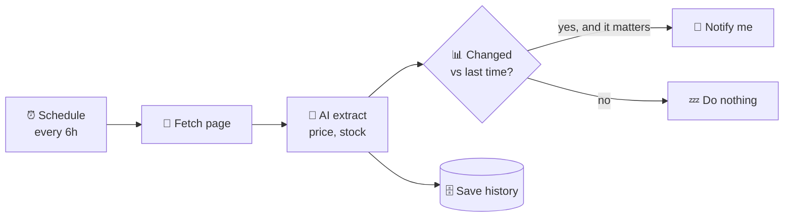

# 51 · Web Scraping & Monitoring with AI 🕸️👀

> ⏱️ 8 min read · 🎯 Beginner → intermediate · 🧰 Needs: an automation platform or Python (both optional)

**A huge amount of useful information lives on web pages with no API:** prices, job posts, event listings, government
notices, product restocks, competitor updates. With AI, turning messy pages into clean, structured data (and getting alerted
when something changes) has become astonishingly easy. This chapter shows you how to do it *politely*, *legally* and
*reliably*.

<details class="keypoints" open>
<summary>✅ Key Points & Steps</summary>

Web scraping means automatically collecting information from web pages; monitoring means checking pages on a schedule and alerting you to changes. AI makes both much easier because it can read a messy page the way a person does and extract exactly what you ask for.

- **Prefer official sources:** use an API, RSS feed or export when one exists.
- **Scrape responsibly:** follow terms of service, respect robots.txt and rate limits, and avoid personal data.
- **Use AI extraction** instead of fragile selectors, and build price-drop and news monitors step by step.

</details>

<!-- in-this-chapter -->

## 🧭 First: is there an API?

<details class="keypoints" open>
<summary>✅ Key Points & Steps</summary>

Before scraping, check for a better option: an official API, an RSS feed, a data export or an existing integration. These are more stable, clearly permitted and return structured data.

</details>

Always check for an easier, officially supported path first:

| Option | Why it's better |
|---|---|
| **Official API** | Stable, allowed, structured data ([Webhooks, APIs & JSON](46-webhooks-apis-json.md)) |
| **RSS / Atom feed** | Many blogs, news sites and job boards publish feeds, with no scraping needed |
| **Built-in alerts** | Google Alerts, price trackers, store "notify me" buttons |
| **An MCP server or connector** | Someone may have already built the integration ([The Big MCP Server Catalog](../part-4-mcp-and-connectors/40-mcp-server-catalog.md)) |
| **Data exports** | Many services let you download your own data |

Scrape when none of these exist, and do it kindly.

## ⚖️ The polite (and legal) scraping rules

<details class="keypoints" open>
<summary>✅ Key Points & Steps</summary>

Follow these rules to scrape responsibly:

1. Read the site's terms of service, and respect any ban on automated access.
2. Check `robots.txt` for areas the site asks bots to avoid.
3. Limit how often you send requests.
4. Avoid collecting personal data, and don't republish copyrighted content.

</details>

1. **Read the Terms of Service.** Some sites forbid automated access. Respect that.
2. **Check `robots.txt`** (e.g. `example.com/robots.txt`) for areas the site asks bots to avoid.
3. **Go slow.** A request every few seconds (or minutes) is plenty for personal monitoring. Never hammer a site.
4. **Don't collect personal data** about people without a lawful reason. Privacy laws (like GDPR) apply to scraped data too.
5. **Respect copyright.** Extracting facts (prices, dates) is different from republishing someone's articles or images.
6. **Don't bypass logins, paywalls or CAPTCHAs** you're not entitled to get past.
7. **Identify yourself** when appropriate (a descriptive User-Agent with contact info for bigger projects).

This isn't legal advice. For anything commercial or large-scale, check the rules in your country.

## 🧰 The toolbox

<details class="keypoints" open>
<summary>✅ Key Points & Steps</summary>

Scraping tools fall into four categories: no-code scrapers (point and click), page-to-text converters that prepare pages for AI, developer libraries, and change monitors. The table lists examples of each.

</details>

| Category | Tools | Great for |
|---|---|---|
| 🖱️ **No-code scrapers** | Browse AI, Apify (ready-made "Actors"), Octoparse | Point-and-click extraction and scheduled runs |
| 📄 **AI page readers** | Jina Reader (put `r.jina.ai/` in front of a URL), Firecrawl, the Fetch MCP server | Turning any page into clean Markdown an AI can read |
| 🕷️ **Crawlers** | Firecrawl, Apify, Crawl4AI (open source) | Whole sites, docs, many pages |
| 🎭 **Browser automation** | Playwright, Browserbase, Browser Use | JavaScript-heavy sites, logins you own, clicking through flows |
| 🔔 **Change monitors** | changedetection.io (open source), Visualping, Distill | "Tell me when this page changes" |
| 🔌 **MCP servers** | Fetch, Firecrawl, Apify, Playwright, Bright Data | Let your AI chat do the scraping for you |

## 🤖 AI extraction: from messy page to clean JSON

<details class="keypoints" open>
<summary>✅ Key Points & Steps</summary>

Traditional scraping relies on CSS selectors that break whenever a site's layout changes. AI extraction is more resilient:

1. Fetch the page as clean text or Markdown.
2. Ask the AI to extract specific fields as JSON.
3. Validate the result before using it.

</details>

The classic way to scrape was writing **CSS selectors** ("the price is in `div.price > span`") that broke whenever the site
changed. The AI way:

1. **Fetch** the page as clean text or Markdown (Jina Reader, Firecrawl or the Fetch server).
2. **Ask the AI to extract** fields into a schema:
   ```text
   From this product page, return ONLY JSON:
   {"name": string, "price": number, "currency": string, "in_stock": boolean, "sale_ends": string | null}
   If a field isn't on the page, use null. Page:
   <page>…</page>
   ```
3. **Validate** (is `price` a number? is it wildly different from yesterday?) before acting.

**Why it's great:** it survives layout changes, works across different sites with one prompt, and handles messy real-world
pages. **Cost tip:** use a small, fast model for extraction ([Cost Optimization](../part-12-mastery/106-cost-optimization.md)).

## 👀 Monitoring & alerts

<details class="keypoints" open>
<summary>✅ Key Points & Steps</summary>

A monitor checks a page on a schedule, compares the result with the previous check, and alerts you only when something meaningful changes. The table lists useful things to monitor, from price drops to restocks and policy updates.

</details>



**Things worth monitoring:**

| Monitor | Why it's delightful |
|---|---|
| 💸 Price drops on things you want | Buy at the right time |
| 📦 Restocks ("sold out" → "in stock") | Beat the rush |
| 💼 New job postings matching your skills | Apply first ([Careers & Job Hunting](../part-11-ai-for-life-and-work/94-careers-and-job-hunting.md)) |
| 🏛️ Government or school pages | New forms, deadlines, announcements |
| 🎟️ Event and ticket pages | Know the moment tickets drop |
| 🏠 Rental listings | New apartments matching your filters |
| 📰 Mentions of your name, company or hobby | Stay in the loop |

**The AI twist:** instead of alerting on *any* change (ads and timestamps change constantly!), ask the AI *"Did anything
meaningful change? Reply YES or NO, and explain in one sentence."* That kills false alarms.

## 🛠️ Build: a price-drop watcher in n8n (30 min)

<details class="keypoints" open>
<summary>✅ Key Points & Steps</summary>

This n8n workflow alerts you when a product's price falls below your target.

1. Add a **Schedule Trigger** that runs every 12 hours.
2. List your products with their URLs and target prices.
3. Fetch each page as text and ask AI to extract the current price.
4. Compare it with your target and send an alert if it's lower.

</details>

1. **Schedule Trigger:** every 12 hours.
2. **Edit Fields:** a list of products: `{url, name, target_price}`.
3. **HTTP Request:** `https://r.jina.ai/{{ $json.url }}` (returns the page as Markdown), or use a Firecrawl node or HTTP call.
4. **Basic LLM Chain + Structured Output Parser:** extract `{price, currency, in_stock}` (a small, cheap model is fine).
5. **Data Table / Google Sheet:** look up the previous price, then save the new one.
6. **If:** `price < target_price` **or** `price < previous_price * 0.9` **and** `in_stock`.
7. **Telegram / email:** *"🎉 {{name}} dropped to {{price}} (target {{target_price}}). {{url}}"*

Swap step 3 for **Apify** or **Browse AI** if the site needs a real browser.

## 📰 Build: a news & mentions monitor (20 min)

<details class="keypoints" open>
<summary>✅ Key Points & Steps</summary>

This workflow sends you a digest of news about topics you care about.

1. Add RSS feeds for your sources, plus Google News searches for your keywords.
2. Filter out items you've already seen and items without your keywords.
3. Have AI summarize and rank the rest, then send the digest.

</details>

1. **RSS triggers** for your favorite sources (plus Google News RSS searches for your keywords).
2. **Filter** out items you've seen (store IDs) and items without your keywords.
3. **AI:** *"Is this genuinely about [topic]? If yes, summarize in 2 sentences and rate importance 1–5."*
4. **Aggregate** the day's items → one **digest** message, sorted by importance.

It's the same idea as the [Morning AI Digest](../../examples/n8n-workflows/morning-ai-digest.json), tuned to *your* topics.

## 🐍 A tiny Python version

<details class="keypoints" open>
<summary>✅ Key Points & Steps</summary>

This short Python script fetches a page, asks Claude to extract the price as JSON and prints it. An AI coding assistant can extend it into a full monitor with storage and alerts.

</details>

A minimal sketch (ask Claude Code to turn it into a full monitor with storage and alerts):

```python
import httpx, anthropic, json

url = "https://example.com/product/123"
page = httpx.get(f"https://r.jina.ai/{url}", timeout=60).text   # page as clean Markdown

client = anthropic.Anthropic()
msg = client.messages.create(
    model="claude-opus-5",
    max_tokens=1000,
    messages=[{"role": "user", "content":
        'Return ONLY JSON {"name": str, "price": number, "in_stock": bool} for this page:\n' + page[:50000]}],
)
print(json.loads(msg.content[0].text))
```

For robust versions, use **structured outputs** so the JSON is guaranteed valid ([Calling AI APIs Directly](../part-7-building-with-ai/67-calling-ai-apis.md)).

## 🚧 Common problems & fixes

<details class="keypoints" open>
<summary>✅ Key Points & Steps</summary>

Common scraping problems include pages that load content with JavaScript, blocking or rate limiting, changing layouts and paginated data. The table pairs each problem with a fix.

</details>

| Problem | Fix |
|---|---|
| Page content loads with JavaScript (you get an empty shell) | Use a real browser: Playwright, Browserbase, Apify, Firecrawl |
| Blocked or rate-limited | Slow down, cache results, use an official API, and don't evade blocks you're not entitled to bypass |
| Layout changes break extraction | Use AI extraction instead of CSS selectors, and validate outputs |
| Data spread over many pages | Follow pagination or "next" links, or use a crawler |
| Too many false alerts | Ask AI whether the change is *meaningful*, and compare only extracted fields |
| Costs creeping up | Small models for extraction, fewer checks per day, cache unchanged pages |

## 🎯 Key takeaways

- **API, RSS or alerts first**, and scrape only when needed, **politely and legally**.
- Modern stack: **clean page reader** (Jina Reader, Firecrawl, Fetch) + **AI extraction to JSON** + **validation**.
- Monitors = **schedule → fetch → extract → compare → notify**, with AI filtering out meaningless changes.
- Use real-browser tools for JavaScript-heavy sites.

## 🧠 Check yourself

<details class="quiz">
<summary>❓ 1. Why is AI extraction more robust than CSS selectors?</summary>

It **reads the page like a person** and doesn't depend on exact HTML structure, so layout changes don't break it (validate
outputs anyway).

</details>

<details class="quiz">
<summary>❓ 2. Your monitor alerts every hour because a timestamp changes. Fix?</summary>

Compare only **extracted fields** (price, stock) or ask the AI whether the change is **meaningful**.

</details>

<details class="quiz">
<summary>❓ 3. What should you check before scraping a site?</summary>

For an **official API or RSS feed**, then the **Terms of Service** and **robots.txt**, and plan a **gentle request rate**.

</details>

> [!TIP]
> **🎮 Try this**
> Pick one thing you actually want: a price drop, a restock, or a new job post. Try `https://r.jina.ai/` in front of its URL
> in your browser to see the clean text, then paste that into your AI with the extraction prompt above. That's the heart of
> every AI scraper, done in 2 minutes. 🕸️

---

**Next:** [52 · The Automation Recipe Book →](52-automation-recipe-book.md)
