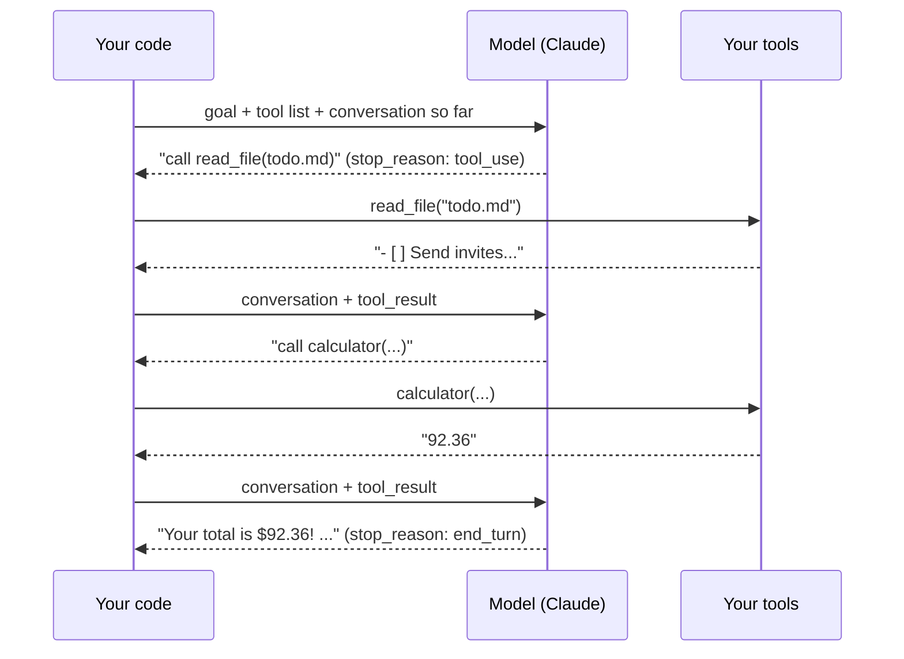

# 21 · Build Your Own Agent 🤖🔧

You've used agents. Now you'll **build one** and understand exactly what's happening inside. Once
you've written an agent loop yourself, every "AI agent" product stops being mysterious, and you'll be able to
build custom ones for anything.

---

## The whole secret, in one diagram



**An agent = a model + tools + a loop + a stopping rule.** That's it. Everything else is refinement.

## Hands-on: the ~100-line agent

The [build-your-own-agent kit](../../examples/build-your-own-agent/) is a complete, commented agent:

```bash
cd examples/build-your-own-agent
pip install -r requirements.txt
export ANTHROPIC_API_KEY=sk-ant-...
python agent.py "How much will the party shopping list cost in total?"
```

### Walkthrough of `agent.py`

**1. Describe the tools** (the model's manual):
```python
{"name": "read_file",
 "description": "Read a text file from the workspace folder by name, e.g. 'todo.md'.",
 "input_schema": {"type": "object", "properties": {"name": {"type": "string"}}, "required": ["name"]}}
```

**2. Implement them** (plain functions, with safety checks):
```python
def run_tool(name, args):
    if name == "read_file":
        path = (WORKSPACE / args["name"]).resolve()
        if WORKSPACE.resolve() not in path.parents:
            raise ValueError("That file is outside the workspace")
        return path.read_text()
```

**3–5. The loop:**
```python
for turn in range(MAX_TURNS):
    response = client.beta.messages.create(model=..., tools=TOOLS, messages=messages, ...)
    messages.append({"role": "assistant", "content": response.content})
    tool_calls = [b for b in response.content if b.type == "tool_use"]
    if not tool_calls:
        return final_text                         # done!
    results = [{"type": "tool_result", "tool_use_id": c.id, "content": run_tool(c.name, c.input)}
               for c in tool_calls]
    messages.append({"role": "user", "content": results})   # all results in ONE message
```

### Details that separate toy agents from good ones
| Detail | Why |
|---|---|
| **Return all tool results in one message** | Keeps parallel tool calls working |
| **Send errors back as `tool_result` with `is_error`** | The model adapts ("file not found → let me list files first") |
| **A max-turns limit** | Prevents runaway loops and runaway bills |
| **Sandboxed tools** | The model is persuadable, so tools must enforce their own limits |
| **Check `stop_reason`** | Handle `max_tokens`, `refusal`, and so on explicitly |
| **Log every step** | Debugging agents means reading their trajectory |

## Leveling up your agent 📈

### Human-in-the-loop approvals
```python
if call.name in {"send_email", "delete_file"}:
    if input(f"Allow {call.name}({call.input})? [y/N] ").lower() != "y":
        output, is_error = "User declined this action.", True
```

### Memory across runs
Save `messages` (or a summary of them) to a JSON file at the end, and reload it next time. For long-term facts, give
the agent `remember(fact)` and `recall(query)` tools backed by a file or DB.

### Plugging in MCP servers
Instead of writing tools, **connect MCP servers** and forward their tools to the model. Your agent instantly gains
GitHub, Notion, browser control, and more. (The Claude API also has an **MCP connector** that can call remote MCP servers for you.)

### Let the SDK run the loop
Once you understand the loop, use the SDK's **tool runner** to skip the boilerplate ([Ch. 20](20-calling-ai-apis.md)).

## Choosing how to build agents 🧭

| Approach | You write | Use when |
|---|---|---|
| **Manual loop** (this chapter) | Everything | Learning, or full control over every step |
| **SDK tool runner** | Just tool functions | Most custom agents with your own tools |
| **Claude Agent SDK** | A prompt + options | You want Claude Code's full harness (file editing, bash, search, subagents, MCP) inside your own app |
| **Managed agent platforms** (e.g. Claude Managed Agents) | Config + your tools | You want the provider to host the loop and a sandbox, with scheduling and long-running sessions |
| **Frameworks**: LangGraph, OpenAI Agents SDK, CrewAI, Pydantic AI, Mastra, Google ADK | Framework-style code | Complex graphs, multi-provider setups, or team conventions |
| **No-code**: n8n AI Agent, Zapier Agents, Make AI Agents | Nothing (visual) | Agents wired into business workflows ([Part III](../part-3-automation/09-automation-platforms.md)) |

**Start simple.** Most "agent" needs are really a single API call or a fixed workflow. Reach for a full agent when
the task is open-ended, multi-step, and the model needs to decide the path.

## Agent design principles 🏛️
1. **Few, well-described tools** beat many vague ones.
2. **Give it a way to verify** (tests, a "check" tool, reading back what it wrote).
3. **Constrain the blast radius:** sandboxes, allowlists, read-only by default.
4. **Budget everything:** turns, tokens, time, money.
5. **Observe:** log trajectories, and review failures to improve prompts and tools.

## 🎮 Agent ideas to build
| Agent | Tools |
|---|---|
| 📚 Research agent | web search, fetch, save_note |
| 🗂️ File organizer | list, move, rename (with an approval gate!) |
| 📧 Inbox assistant | Gmail search and draft (never send without approval) |
| 🧪 Data analyst | read CSV, run pandas code in a sandbox, make charts |
| 🎲 Game master | dice, NPC generator, campaign memory |
| 🛒 Deal hunter | fetch product pages, price history DB, notify |

---

### 🎮 Try this
Add a `write_file` tool to the kit's agent (workspace-only!) plus a y/N approval prompt. Then ask it to
*"write a shopping plan to plan.md, grouped by store."* You've built a **safe, human-supervised agent that takes actions**. 🏆

---

**Next:** [22 · Multi-Agent Systems →](22-multi-agent-systems.md)
