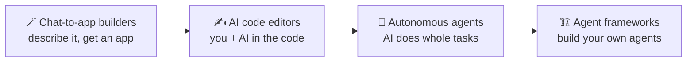

# 29 · Agents & AI Coding Tools: Become a Builder 🛠️🤖

> ⏱️ 7 min read · 🎯 Everyone (yes, even if you've never coded) · 🧰 Needs: curiosity, and optionally a Claude or Cursor plan

**Here's the secret: you don't need to be a programmer to build software anymore.** Coding agents write, run, test and fix
code for you. Even if you never plan to "code," these tools are the fastest way to build your own automations, MCP servers,
websites and little apps. This chapter maps the whole tool landscape and teaches you how to work with AI builders like a pro.

🧸 ELI5: This chapter in 30 seconds

Imagine a super-fast builder robot. You describe the treehouse you want ("two floors, a rope ladder, a secret door"), and
the robot builds it, tests that the ladder holds, and fixes anything wobbly while you watch. **Coding agents** are that
robot, but for apps and websites. Some live in your web browser, some in a code editor, and some in a terminal. This
chapter helps you pick one and be a great boss to it.

<!-- in-this-chapter -->

## 🌈 The spectrum of AI building tools

🧸 ELI5

On one end are "describe it and get an app" tools, super easy. On the other end are toolkits for building your own AI
robots, which take more effort. In the middle are editors where you and the AI work together.

| Level | Examples | You need |
|---|---|---|
| 🪄 **Chat-to-app** | Claude Artifacts, Lovable, Bolt, v0, Replit Agent | A browser and an idea |
| ✍️ **AI editors** | Cursor, VS Code + GitHub Copilot, Windsurf, Zed | A code editor on your computer |
| 🤖 **Autonomous agents** | Claude Code, Codex, Gemini CLI, Copilot coding agent, Devin | A terminal, IDE, desktop or web app |
| 🏗️ **Frameworks** | Claude Agent SDK, OpenAI Agents SDK, LangGraph, CrewAI | Some coding (AI can help!) |

## 🪄 Chat-to-app builders (no code needed)

🧸 ELI5

These are "wish machines": type what app you want, and a working app appears in your browser that you can click on,
change by chatting, and share with friends.

| Tool | Sweet spot |
|---|---|
| **Claude Artifacts** | Interactive mini apps, dashboards and games, right in chat, shareable by link |
| **Lovable** | Full web apps with logins and a database (Supabase), from a description |
| **Bolt** | Full-stack apps in the browser, deployable in a click |
| **v0** (Vercel) | Gorgeous React/Next.js UIs and apps |
| **Replit Agent** | Build, host and deploy in one place, including from your phone |
| **Google AI Studio** | Prototype Gemini-powered apps fast |

🎮 **Try:** *"Build me a habit tracker with streaks, confetti when I complete all habits, and a dark mode."*
Full guide: [Vibe Coding Your First Real App](34-vibe-coding-your-first-app.md).

## ✍️ AI code editors

🧸 ELI5

These are writing apps for code where an AI sits next to you: it suggests the next lines, answers questions about your
project, and can make big changes across many files when you ask.

| Tool | Notes |
|---|---|
| **Cursor** | The most popular AI-first editor (a VS Code fork): agent mode, its own fast Composer models, cloud background agents, rules, MCP, and the Bugbot PR reviewer |
| **VS Code + GitHub Copilot** | Agent mode, MCP gallery, and a coding agent that turns issues into pull requests |
| **Windsurf** | An agentic IDE with its "Cascade" agent |
| **Zed** | A fast editor with built-in agents and MCP |
| **JetBrains AI / Junie** | For IntelliJ, PyCharm and friends |

Deep dive: [Cursor & AI IDEs](33-cursor-and-ai-ides.md).

## 🤖 Autonomous coding agents

🧸 ELI5

These agents take a whole job ("add a login page") and do it themselves: read the project, write code, run tests, fix
mistakes and report back. You check their work like a manager.

| Tool | Notes |
|---|---|
| **Claude Code** | Anthropic's agent for your terminal, IDEs, desktop, web and phone. It reads your whole project, runs commands, ships features, and extends with skills, subagents, hooks, plugins and MCP. (This manual was built with it! 👋) |
| **OpenAI Codex** | CLI plus cloud agent, integrated with ChatGPT |
| **Gemini CLI** | Google's open-source terminal agent |
| **GitHub Copilot coding agent** | Assign an issue, get a pull request |
| **Aider** | Open-source, git-native pair programmer, works with any model |
| **Cline / Roo Code / Kilo Code** | Open-source agents inside VS Code, bring your own model |
| **Goose** | Open-source, MCP-centric local agent |
| **Devin, Jules** | Cloud "AI software engineers" for asynchronous tasks |

Deep dives: [Claude Code Masterclass](31-claude-code-masterclass.md) → [Claude Code Power-Ups](32-claude-code-power-ups.md).

## 🧩 Customizing agents: the power-user layer

🧸 ELI5

You can teach your builder robot your house rules (a memory file), give it special how-to guides (skills), hire helper
robots (subagents), add automatic safety checks (hooks) and install whole kits at once (plugins).

| Feature | What it does | Example |
|---|---|---|
| **Memory files** (`CLAUDE.md`, `AGENTS.md`, Cursor rules) | Always-on project instructions | "Run tests with `pytest`. Never touch `/legacy`." ([example](../../examples/prompts-for-agents/CLAUDE.md)) |
| **Skills** | On-demand playbooks + scripts, loaded when relevant | A `weekly-review` skill ([example](../../examples/prompts-for-agents/skills/weekly-review/SKILL.md)) |
| **Slash commands** | Saved prompts you trigger with `/name` | `/changelog`, `/fix-issue 123` |
| **Subagents** | Specialist helpers with their own context and tools | A "code reviewer" or "test writer" |
| **Hooks** | Scripts that run automatically on events | Auto-format after edits, block edits to `.env` |
| **MCP servers** | External tools | GitHub, Playwright, your database |
| **Plugins** | Bundles of all of the above | Install a team's whole setup in one command |

All of this is covered hands-on in [Claude Code Power-Ups](32-claude-code-power-ups.md).

## 🏗️ Agent frameworks (build your own)

🧸 ELI5

Frameworks are LEGO kits for building your own AI robots from scratch, for when you want an agent inside your own app.

When you want an agent inside *your* app or script:

- **Claude Agent SDK** (Python/TS): the same harness that powers Claude Code, with tools, MCP, subagents and context management.
- **OpenAI Agents SDK**, **LangGraph**, **CrewAI**, **Pydantic AI**, **Mastra**, **Google ADK**, **Microsoft Agent Framework**, **smolagents**.
- **Vercel AI SDK:** the go-to for AI features in web apps.

Learn the core loop first in [Build Your Own Agent](37-build-your-own-agent.md), then tour the options in
[Agent Frameworks Tour](38-agent-frameworks-tour.md).

> [!TIP]
> **💡 Configure before you build**
> Try configuring an existing agent (Claude Code + skills + MCP) *before* writing a framework-based agent. You'll often get
> 80% of the way there with 5% of the effort.

## 🧭 Which tool should *you* start with?

🧸 ELI5

Pick based on who you are: a total beginner starts with "describe it" tools, a curious learner starts with Claude Code, and
someone who likes seeing code starts with Cursor.

| You are… | Start with | Then try |
|---|---|---|
| 🌱 Never coded, want a quick app | Claude Artifacts or Lovable | Claude Code when you hit limits |
| 🧠 Curious, want to learn by doing | **Claude Code** (it explains as it goes) | Cursor for a visual editor |
| 👀 Like seeing and touching the code | **Cursor** or VS Code + Copilot | Claude Code for big tasks |
| 🔒 Privacy first | Aider, Cline or Continue with local models ([Local AI for Coding](../part-7-local-ai/50-local-ai-for-coding-and-agents.md)) | Hybrid local + cloud |
| 🏢 On a team with GitHub | Copilot coding agent or the Claude GitHub app | Cloud agents in parallel |

## 🎯 Working with coding agents like a pro

🧸 ELI5

Be a good boss: explain the goal clearly, ask for a plan first, let it test its own work, save progress often, and ask it to
explain what it did.

1. **Plan first.** Ask for a plan (Claude Code has a plan mode), review it, *then* let it build.
2. **Give it a way to check its work:** tests, a linter, a screenshot via Playwright. Agents that can verify their output are
   dramatically better.
3. **Small steps, frequent commits.** Git is your undo button ([Git & GitHub](30-git-and-github.md)).
4. **Be specific about "done":** *"Done means tests pass, the page loads, and it works on mobile."*
5. **Let it explain.** *"Walk me through what you changed and why"* is how you level up fast.
6. **Run things in parallel.** Cloud agents can work on three tasks while you have lunch. 🥪

## ⚖️ What coding agents are great at (and not)

🧸 ELI5

Builder robots are amazing at common, well-described jobs with clear tests. They struggle with fuzzy goals, weird old code
with no instructions, and anything they can't check.

| 🌟 Great at | 😬 Needs more guidance |
|---|---|
| Common app features (auth, forms, CRUD, dashboards) | Vague goals ("make it better") |
| Fixing bugs with a clear error message | Huge, undocumented legacy codebases |
| Writing tests, docs and refactors | Subtle product and design taste (show examples!) |
| Glue code, scripts, automations, MCP servers | Tasks it can't verify (no tests, no way to run it) |
| Explaining code in plain English | Security-critical code without review |

## 🎯 Key takeaways

- The spectrum runs from **chat-to-app builders** to **AI editors**, **autonomous agents** and **frameworks**.
- **Customize** agents with memory files, skills, subagents, hooks, MCP and plugins before building your own.
- Start where you're comfortable: **Artifacts or Lovable** (no code), **Claude Code** (learn by doing), **Cursor** (visual).
- Be a great boss: **plan first, verify, commit often, ask for explanations.**

## 🧠 Check yourself

❓ 1. What's the single biggest quality lever when working with a coding agent?

Giving it a **way to verify its work**: tests, running the app, screenshots.

❓ 2. What's the difference between a skill and a subagent?

A **skill** is a packaged playbook the agent loads when relevant. A **subagent** is a separate helper agent with its own
context and tools that the main agent delegates to.

> [!TIP]
> **🎮 Try this**
> Install Claude Code (or open Cursor), `cd` into this repo, and ask: *"Add a `weather` tool to the Pocket Toolkit MCP server
> using the free Open-Meteo API, then test it."* Congrats, you just extended an MCP server with an AI pair programmer. ☔

---

**Next:** [30 · Git & GitHub for AI Builders →](30-git-and-github.md)
