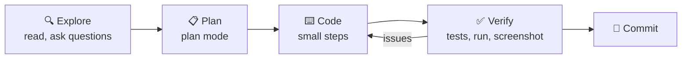

# 18 · The Claude Code Masterclass 🧑‍💻🤖

Claude Code is an **agentic coding tool**: it reads your project, runs commands, edits files, tests its
work, and ships features. It runs in your terminal, in IDEs (VS Code, JetBrains), in a desktop app, on
the web, and even from your phone. And it isn't just for code. People use it to organize files, analyze data,
write docs, manage Obsidian vaults, and automate their computers.

> This entire repo, manual and website included, was built with Claude Code. 👋

---

## Part A: Getting started

```bash
# install (see docs.claude.com/claude-code for the current recommended method)
npm install -g @anthropic-ai/claude-code
cd your-project
claude
```

Log in with your Claude subscription (Pro/Max include Claude Code) or an API key. Then just talk:

> *"Explain this project's structure to me like I'm new here."*
> *"Add a dark mode toggle to the settings page and make sure the tests pass."*

### Essential controls
| Action | How |
|---|---|
| Cycle permission modes (normal → auto-accept edits → **plan mode**) | `Shift+Tab` |
| Interrupt | `Esc` |
| Rewind to an earlier point | `Esc` `Esc` |
| Reference a file | `@path/to/file` |
| Run a shell command directly | `!npm test` |
| Paste a screenshot | Paste an image into the prompt |
| Continue the last session | `claude --continue` (or `claude --resume` to pick one) |

### Built-in slash commands you'll use constantly
| Command | Does |
|---|---|
| `/init` | Scans the project and writes a starter `CLAUDE.md` |
| `/clear` | Fresh context (do this between unrelated tasks!) |
| `/compact` | Summarize the conversation to free up context |
| `/model` | Switch models |
| `/mcp` | Manage MCP servers and log in |
| `/agents` | Create and manage subagents |
| `/hooks` | Configure hooks |
| `/plugin` | Browse and install plugins |
| `/permissions` | Manage which tools run without asking |
| `/review` | Review code changes |
| `/help` | Everything else |

## Part B: The workflow that works 🔁



1. **Explore:** *"Read the auth module and explain how login works. Don't change anything yet."*
2. **Plan:** press `Shift+Tab` into **plan mode**. Claude researches and proposes a plan, and you approve or edit it.
3. **Code:** let it implement. Watch, and interrupt if it drifts.
4. **Verify:** the single biggest quality lever. Give Claude a way to check its own work: tests, a linter, running
   the app, Playwright screenshots. *"Run the tests and fix any failures."*
5. **Commit:** *"Commit with a clear message."* Git is your undo button.

> [!TIP]
> **Context hygiene**
> Use `/clear` between unrelated tasks. A focused context gives better results than a 3-hour mega-session.

## Part C: `CLAUDE.md`, your project's memory 🧠

Claude Code automatically loads `CLAUDE.md` files:
| Location | Scope |
|---|---|
| `./CLAUDE.md` | This project (commit it and share with the team) |
| `./CLAUDE.local.md` or personal settings | Just you, this project |
| `~/.claude/CLAUDE.md` | You, everywhere (personal preferences) |
| Subfolder `CLAUDE.md` | Loaded when working in that folder |

Keep it **short and high-signal**: how to build, test, and lint, key conventions, gotchas, and "never do X."
[Example `CLAUDE.md`](../../examples/prompts-for-agents/CLAUDE.md). Tip: after Claude makes a mistake,
say *"add a note to CLAUDE.md so this doesn't happen again."*

## Part D: Skills, packaged expertise 🎓

A **skill** is a folder with a `SKILL.md` (instructions plus metadata) and optional scripts and templates.
Claude sees only each skill's **name + description** until a task matches, then loads the rest. That keeps
context lean even with dozens of skills.

```
.claude/skills/weekly-review/
├── SKILL.md          ← frontmatter (name, description) + instructions
├── template.md       ← optional supporting files
└── stats.py          ← optional scripts Claude can run
```

```markdown
---
name: weekly-review
description: Run my Friday weekly review. Use when I say "weekly review" or "recap my week".
---
# Weekly Review
1. Gather git log, notes, calendar...
```

**The description is everything.** It's how Claude decides when to use the skill.
[Full example](../../examples/prompts-for-agents/skills/weekly-review/SKILL.md). Skills work across
Claude apps (not just Claude Code), and the format has been adopted by other tools too.

## Part E: Subagents, your specialist team 👥

**Subagents** are helper agents with **their own context window, instructions, and tool permissions**.
The main agent delegates to them, and they return just a summary. That keeps the main context clean and
lets you specialize.

Create one with `/agents`, or add a file at `.claude/agents/code-reviewer.md`:

```markdown
---
name: code-reviewer
description: Reviews diffs for bugs, security issues, and readability. Use after significant code changes.
tools: Read, Grep, Glob, Bash
---
You are a meticulous senior reviewer. Check the diff for correctness bugs, security issues,
missing tests, and confusing names. Report findings by severity with file:line references.
```

Great subagent ideas: `test-writer`, `docs-writer`, `security-auditor`, `researcher` (web search only),
`data-analyst`, `ui-verifier` (with Playwright MCP).

## Part F: Hooks, automatic guardrails 🪝

**Hooks** run your shell commands automatically at lifecycle events. They're deterministic, so they don't rely
on the model remembering. Configure them with `/hooks` or in `.claude/settings.json`:

| Event | Fires when | Example use |
|---|---|---|
| `PreToolUse` | Before a tool runs (can **block** it) | Block edits to `.env` or `migrations/` |
| `PostToolUse` | After a tool runs | Auto-format every edited file |
| `UserPromptSubmit` | When you send a prompt | Inject context (e.g. today's ticket) |
| `Stop` | When Claude finishes | Run tests, and play a sound 🔔 |
| `Notification` | When Claude needs your attention | Desktop or phone notification |
| `SessionStart` | When a session begins | Install deps, print project status |

```json
{
  "hooks": {
    "PostToolUse": [
      {
        "matcher": "Edit|Write",
        "hooks": [{ "type": "command", "command": "npx prettier --write \"$CLAUDE_FILE_PATHS\" 2>/dev/null || true" }]
      }
    ]
  }
}
```

(Hook input arrives as JSON on stdin. Check the hooks docs for the exact fields and exit-code behavior before relying on them.)

## Part G: MCP + plugins 🔌

- **MCP:** `claude mcp add ...` gives Claude Code GitHub, Playwright, Sentry, databases, Notion… ([Ch. 4](../part-2-mcp-and-connectors/07-mcp-explained.md))
- **Plugins** bundle slash commands, skills, subagents, hooks, and MCP servers. Browse the official
  directory and community marketplaces with `/plugin`. Install a whole workflow in one step, or package your own
  setup to share with friends or your team.

## Part H: Headless, CI & automation 🤖

Claude Code runs **non-interactively**, which turns it into a building block:

```bash
claude -p "Summarize the changes in the last 10 commits for a changelog"      # print mode
claude -p "List TODOs as JSON" --output-format json > todos.json               # machine-readable
cat error.log | claude -p "Explain this error and suggest a fix"                # pipe input
```

- **GitHub Actions:** Anthropic's Claude Code GitHub Action lets you `@claude` in issues and PRs to get fixes,
  reviews, and implementations.
- **Cron + headless:** nightly *"triage new issues and label them."*
- **Claude Agent SDK:** the same harness as a Python/TypeScript library for building your own agents ([Ch. 21](37-build-your-own-agent.md)).
- **Claude Code on the web / mobile:** kick off tasks in cloud sandboxes from your browser or phone, and review PRs later.

## Part I: Pro tips 💎

1. **Be specific about "done":** *"Done means: tests pass, lint clean, and a screenshot of the new page."*
2. **Show, don't describe:** paste screenshots, error logs, and links to example code.
3. **Ask for options** on design decisions: *"Give me 3 approaches with tradeoffs before coding."*
4. **Parallelize:** run multiple sessions on different git worktrees, or send background tasks to the cloud.
5. **Make it explain:** *"Walk me through your diff."* It's the fastest way to learn to code.
6. **Course-correct early:** interrupt with `Esc` the moment it heads the wrong way.
7. **Use it for non-code:** *"Rename all these photos by date taken,"* *"analyze this CSV,"* *"clean up my Downloads."*
8. **Keep permissions sane:** allowlist safe commands (`npm test`) and keep risky ones on "ask."

## Part J: 15 Claude Code projects for non-programmers

| # | Project |
|---|---|
| 1 | Personal website from scratch, deployed free |
| 2 | Photo organizer script (rename and sort by date/location) |
| 3 | Budget analyzer from bank CSV exports with charts |
| 4 | A Chrome extension that does one annoying thing for you |
| 5 | Custom MCP server for your favorite hobby API |
| 6 | Discord or Telegram bot for your friend group |
| 7 | Obsidian vault reorganization + auto-linking |
| 8 | Recipe scaler + grocery list web app |
| 9 | Automated job-application tracker |
| 10 | A game (seriously: *"make a Tetris clone with a cat theme"*) |
| 11 | Home Assistant automations written and tested |
| 12 | Spreadsheet → dashboard web app |
| 13 | Newsletter pipeline: RSS → summaries → email |
| 14 | Resume website generated from your LinkedIn export |
| 15 | Script to back up and tidy your Google Drive |

---

### 🎮 Try this
In an empty folder: `claude` → *"Build me a single-page 'daily affirmation' web app with a big button, confetti, and
50 affirmations. Make it beautiful. Then open it in my browser."* Ten minutes later you have a real app. 🎉

---

**Next:** [19 · Vibe Coding Your First Real App →](34-vibe-coding-your-first-app.md)
