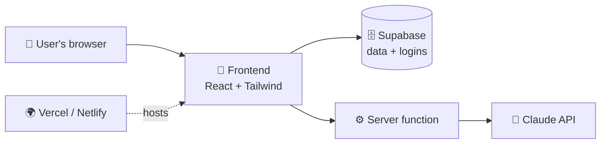
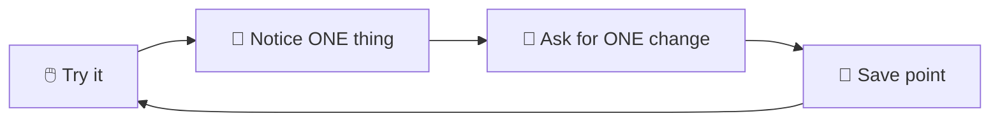

# 34 · Vibe Coding Your First Real App 🎸💻

> ⏱️ 10 min read · 🎯 Everyone (zero coding experience welcome) · 🧰 Needs: a browser builder (Lovable, Bolt, v0, Replit) or Claude Code / Cursor, plus a free Supabase account

**Vibe coding means building software by describing what you want and letting AI write the code.** It's real, it works,
and people with zero programming background are shipping useful apps with it every day. This chapter takes you from a
fuzzy idea to **a live app on the internet with logins and a database**, and shows you how to avoid the traps that stall
most first-timers. Let's make something! 🛠️

<details class="eli5" open>
<summary>🧸 ELI5: This chapter in 30 seconds</summary>

You tell the AI "I want an app where my family can share wish lists," and it builds it. You click around, say "make that
button bigger" or "it breaks when I do this," and it fixes things. Keep going until it's good, then put it on the internet
and send the link to your family. You're the director, the AI is the film crew. 🎬

</details>

<!-- in-this-chapter -->

## 🧰 The vibe coding stack

<details class="eli5">
<summary>🧸 ELI5</summary>

An app has a few layers: the part you see (frontend), the part that remembers things (database), the part that knows who you
are (login), and the place it lives on the internet (hosting). There are friendly, free tools for every layer.

</details>

| Layer | What it does | Beginner-friendly picks |
|---|---|---|
| 🏗️ **Builder** | Where you talk to the AI | Lovable, Bolt, v0, Replit Agent (browser) · Claude Code, Cursor (local) |
| 🎨 **Frontend** | What users see and click | React + Tailwind (the AI's favorite) or plain HTML/JS for tiny apps |
| 🗄️ **Backend + database + login** | Remembers data, knows who's who | **Supabase** (Postgres + auth + storage), Firebase, Convex |
| 🌍 **Hosting** | Puts it on the internet | Vercel, Netlify, Cloudflare Pages (free tiers) ([Deploying & Hosting](35-deploying-and-hosting.md)) |
| 🐙 **Code home** | Versions, backups, collaboration | GitHub ([Git & GitHub](30-git-and-github.md)) |
| ✨ **AI features** | Smart bits inside your app | Claude API and friends ([Calling AI APIs](36-calling-ai-apis.md)) |



## 💡 Step 1: Pick a small, real idea

<details class="eli5">
<summary>🧸 ELI5</summary>

Start with a tiny app that solves one real problem for you or someone you know. Small and finished beats big and forever
half-done.

</details>

The best first app **solves one problem for you or a friend**. Rule of thumb: **you should be able to describe v1 in three
sentences.**

| Idea | Why it's a great first app |
|---|---|
| 📚 Book club tracker | Lists, ratings, dates: all the basics |
| 🌱 Plant watering reminders | Photos + schedules, super satisfying |
| 🏋️ Workout log with streaks | Charts and streaks are fun to build |
| 🎁 Family gift list with secret "claims" | Logins + permissions, a real-world puzzle |
| 🍲 Recipe box with "what can I make?" AI search | Your first AI feature |
| 🐶 Dog-walking rota for roommates | Shared data between a few people |
| 🎲 Board-game night picker | Voting + a random wheel 🎡 |
| 🧾 Split-the-bill calculator | Math, sharing links, instant usefulness |

> [!TIP]
> **💡 Idea stuck?**
> Ask: *"Here's my week: [describe it]. Suggest 10 tiny apps that would save me time or make me smile. Each must be
> buildable in a weekend."*

## 📝 Step 2: Write a mini spec (5 minutes)

<details class="eli5">
<summary>🧸 ELI5</summary>

Before building, write a short "what I want" note: who uses it, what screens it has, how it should look, and what's NOT in
the first version. Clear wishes, better app.

</details>

AI builds much better from a clear spec. Use this template:

```markdown
# App: Gift Circle

## What it does
Families share wish lists. Others can secretly "claim" gifts so there are no duplicates.

## Users
Sign in with an email magic link. Each user has one wish list.

## Core screens
1. My list: add, edit, remove items (name, link, price, notes)
2. Family: see others' lists, claim or unclaim items (the owner can't see claims!)
3. Invite: share a join link for a family group

## Look & feel
Warm and cozy, rounded cards, festive accent color, mobile-first.

## Not in v1
Payments, notifications, multiple groups.
```

**Shortcut:** *"Interview me with 8 questions to turn my app idea into a spec like this one."* Then paste the result.

## 🏗️ Step 3: Build v1 (two paths)

<details class="eli5">
<summary>🧸 ELI5</summary>

You can build in your web browser with a "describe it" tool (fastest), or on your own computer with Claude Code or Cursor
(more control, and you learn more). Both work!

</details>

=== "🌐 Path A: Browser builders (fastest)"

    1. Paste your spec into **Lovable**, **Bolt**, **v0** or **Replit Agent**.
    2. Connect **Supabase** when it asks (for logins and data).
    3. Click around the preview, then fix things by chatting: *"The claim button should be hidden on my own list."*
    4. Use the builder's **version history** as your undo button.
    5. Hit its limits? Export or sync the code to **GitHub** and continue in Claude Code or Cursor.

=== "💻 Path B: Claude Code or Cursor (more control)"

    ```bash
    mkdir gift-circle && cd gift-circle && git init && claude
    ```

    > *"Here's my spec: [paste]. Propose a tech stack and a step-by-step build plan. Use Next.js, Tailwind and
    > Supabase. Wait for my OK before coding."*

    Then build **one feature at a time**, testing each:

    > *"Step 1: scaffold the app with a landing page. Run it and give me the local URL."*

    Commit after every step that works.

| | 🌐 Browser builders | 💻 Claude Code / Cursor |
|---|---|---|
| Speed to first version | ⚡⚡⚡ | ⚡⚡ |
| Control and flexibility | ⭐⭐ | ⭐⭐⭐ |
| Learning how code works | ⭐ | ⭐⭐⭐ |
| Hosting included | ✅ Usually | You deploy (easy) |
| Best for | Prototypes, first apps | Growing apps, custom features |

## 🔁 Step 4: The iteration loop

<details class="eli5">
<summary>🧸 ELI5</summary>

Try the app, notice one thing to improve, ask for that one change, and try again. Round and round, one small step at a time.

</details>



**Golden rules:**

1. **One change at a time.** "Fix the button AND add dark mode AND refactor" = chaos.
2. **Describe what you see, not how to fix it:** *"When I click Claim, nothing happens, and the console shows [paste
   error]."*
3. **Screenshots are gold.** Paste them in.
4. **Commit working states** (`git commit`, or the builder's version history). When things break, roll back instead of
   spiraling.
5. **Stuck in a loop?** Say *"Step back. Explain what you think is wrong, and list 3 possible causes before changing code."*

## 🐛 Debugging without panic

<details class="eli5">
<summary>🧸 ELI5</summary>

When something breaks, don't guess. Copy the exact error message and show it to the AI, tell it what you clicked, and ask it
to explain the problem before fixing it.

</details>

| Symptom | What to give the AI |
|---|---|
| Blank page | The browser console errors (right-click → Inspect → Console) |
| "It doesn't save" | The Network tab error, plus the Supabase logs |
| Works locally, broken online | The hosting build logs and your environment variables list (names, not values) |
| Login loops | The auth settings (redirect URLs) and the exact steps |
| "It was working yesterday" | `git log` and `git diff` since the last good commit |

**The magic debugging prompt:**

> *"Here's the bug: [what I did] → [what I expected] → [what happened]. Here's the error: [paste]. Before changing
> anything, explain the most likely cause in plain English, then add logging to confirm it, then fix it."*

## 🎨 Making it beautiful

<details class="eli5">
<summary>🧸 ELI5</summary>

Show the AI pictures of apps you think look nice, pick a color palette and a font, and ask it to make everything match. Pretty
apps get used more!

</details>

- **Show references:** screenshots of apps you love. *"Make it feel like this."*
- **Pick a vibe in words:** *"cozy, rounded, warm oranges, playful"* or *"minimal, lots of whitespace, one accent color."*
- **Use a component library:** *"Use shadcn/ui components"* gives instantly polished buttons, forms and dialogs.
- **Mobile first:** *"Check every screen at phone width and fix anything cramped."*
- **Delight:** empty states with illustrations, a confetti moment 🎉, friendly microcopy.
- **Design pass:** *"Act as a senior product designer. Critique this screen and give me the top 5 improvements."*

More in [Design & UI with AI](../part-8-creative-ai/59-design-and-ui.md).

## 🚀 Step 5: Ship it

<details class="eli5">
<summary>🧸 ELI5</summary>

Put your app on the internet so anyone with the link can use it, then send the link to a real person and ask what they think.

</details>

| From | Deploy |
|---|---|
| Lovable / Bolt / Replit / v0 | Click **Publish** or **Deploy** |
| Local code | Push to GitHub → import into **Vercel** or **Netlify** → add environment variables (your Supabase keys) |

Then: add a custom domain (optional), send it to a friend, and **collect feedback**. The full guide is in
[Deploying & Hosting](35-deploying-and-hosting.md). 🎉

## 🔐 Step 6: Don't skip the safety basics

<details class="eli5">
<summary>🧸 ELI5</summary>

AI-built apps can have hidden doors that let the wrong people see private data. Before real people use it, ask the AI to
check all the locks, and turn on the database's "only see your own stuff" rules.

</details>

AI-built apps can have security holes. Before real users arrive:

> *"Do a security review of this app: authentication, database row-level security (RLS) policies, exposed API keys, input
> validation. Fix anything serious and explain what you changed."*

- [ ] **Supabase RLS enabled** on every table (users only see their own or allowed data)
- [ ] **No secret keys in frontend code** (only public/anon keys belong in the browser)
- [ ] `.env` in `.gitignore`
- [ ] **Rate limits** on anything that costs money (AI calls!)
- [ ] **Spend limits** on your AI API keys
- [ ] Test as a **second user**: can they see things they shouldn't?

> [!WARNING]
> **🔐 The #1 vibe-coding security bug**
> Tables without row-level security. Anyone who finds your public key can read or change *every* row. Ask the AI to enable
> RLS and write policies for every table, then test with a second account.

## ✨ Adding AI features to your app

<details class="eli5">
<summary>🧸 ELI5</summary>

Once your app works, you can give it a little AI brain: suggestions, smart search, auto-sorting, or understanding photos.

</details>

| Feature | Example |
|---|---|
| 💡 **Smart suggestions** | "Suggest gifts based on this person's list" |
| 🔍 **Natural-language search** | "cozy mystery under $20" |
| 🏷️ **Auto-categorize** | Items get tags as they're added |
| 📸 **Image understanding** | Snap a product photo → the item details fill in |
| 📝 **Summaries** | "Summarize this month's book club discussion" |
| 🗣️ **Voice input** | Speak a new item instead of typing |

**Always call AI APIs from the server** (API routes, edge functions, server actions), **never** with your key in browser
code. The pattern is in [Calling AI APIs Directly](36-calling-ai-apis.md).

## 🧗 Growing past v1

<details class="eli5">
<summary>🧸 ELI5</summary>

When your app gets bigger, keep it tidy: add tests so old features don't break, clean up messy code, and write down how
everything works.

</details>

- **Add tests for things that work:** *"Write tests for the claim feature so future changes can't break it."*
- **Refactor sessions:** *"Clean up the code structure without changing behavior, then run the tests."*
- **Keep a `README.md` and `CLAUDE.md`** so any AI (or human) can pick up the project.
- **Track ideas in GitHub issues**, and hand well-specified ones to a background agent.
- **Watch real usage:** simple analytics (Plausible, PostHog) show what people actually use.

## 🪤 Common beginner traps (and the fix)

<details class="eli5">
<summary>🧸 ELI5</summary>

Everyone falls into these holes. Here's how to climb out quickly.

</details>

| Trap | Fix |
|---|---|
| The app grows into a tangled mess | Regular refactor sessions + tests |
| The AI "fixes" one bug and creates two | Write tests for working features first, commit before each fix |
| Going in circles on the same bug | *"Step back, list 3 hypotheses, add logging to test them."* Or `/clear` and start fresh |
| Fighting the builder's limits | Export to GitHub and continue in Claude Code or Cursor |
| Too many features in v1 | Cut ruthlessly. Ship, then add |
| Secrets leaked into GitHub | Rotate the key immediately ([Git & GitHub](30-git-and-github.md#-secrets--safety-the-stuff-that-bites-beginners)) |
| Losing motivation | Ship an ugly v1 to one real person. Feedback is fuel |

## 🗓️ A weekend plan

<details class="eli5">
<summary>🧸 ELI5</summary>

Here's how to go from idea to a real app your friends use in a single weekend.

</details>

| When | Mission |
|---|---|
| Friday evening | Pick the idea, write the spec, set up accounts (GitHub, Supabase, Vercel) |
| Saturday morning | Build v1's core screen. Commit every working step |
| Saturday afternoon | Logins, database, RLS. Test with a second account |
| Sunday morning | Make it beautiful and mobile-friendly |
| Sunday afternoon | Deploy, send to one friend, fix their first piece of feedback 🎉 |

## 🎯 Key takeaways

- Start with an idea you can describe in **three sentences**, and write a **mini spec**.
- **Browser builders** are fastest. **Claude Code or Cursor** give you control and teach you more.
- The loop: **try → notice one thing → ask for one change → save point.**
- **Security basics** (RLS, no secret keys in the browser, spend limits) are non-negotiable.
- Ship to **one real person** as soon as possible. Feedback is fuel.

## 🧠 Check yourself

<details class="quiz">
<summary>❓ 1. Your app works, and you ask for three changes at once. It breaks. What should you do differently?</summary>

**Roll back** to the last save point, then ask for **one change at a time**, testing and committing after each.

</details>

<details class="quiz">
<summary>❓ 2. Where should the code that calls the Claude API live, and why?</summary>

On the **server** (an API route or edge function), so your API key is never exposed in the browser.

</details>

<details class="quiz">
<summary>❓ 3. What's the most common security hole in vibe-coded Supabase apps?</summary>

Tables without **row-level security (RLS)**, which lets anyone with the public key read or edit every row.

</details>

> [!TIP]
> **🎮 Try this**
> Build the **Gift Circle** spec above (or your own idea) this weekend. Aim for "one friend used it" by Sunday night. That
> feeling of *"I made a real thing people use"* is wonderfully addictive. 🎸

---

**Next:** [35 · Deploying & Hosting →](35-deploying-and-hosting.md)
