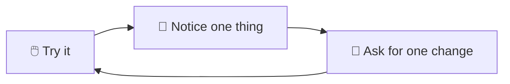

# 19 · Vibe Coding Your First Real App 🎸💻

**Vibe coding** means building software by describing what you want and letting AI write the code. It's
real, it works, and people with zero programming background are shipping useful apps with it. This chapter
takes you from idea to **a live app on the internet with logins and a database**.

---

## The vibe coding stack

| Layer | Beginner-friendly picks |
|---|---|
| **Builder** | Lovable, Bolt.new, v0, Replit Agent (browser) · Claude Code, Cursor (local) |
| **Frontend** | React + Tailwind (the AI's favorite) or plain HTML/JS for tiny apps |
| **Backend + DB + auth** | **Supabase** (Postgres + logins + storage), Firebase, Convex |
| **Hosting** | Vercel, Netlify, Cloudflare Pages (free tiers) |
| **Code home** | GitHub (versions, backups, and collaboration) |
| **AI features in your app** | Claude API / other model APIs ([Ch. 20](36-calling-ai-apis.md)) |

## Step 1: Pick a small, real idea 💡

The best first app **solves one problem for you or a friend**. Examples:
- 📚 Book club tracker (who's reading what, ratings, next meeting)
- 🌱 Plant watering reminders with photos
- 🏋️ Workout log with streaks and charts
- 🎁 Gift idea list shared with family (with "claimed" checkboxes!)
- 🍲 Recipe box with "what can I make with…" AI search

Rule: **you should be able to describe v1 in 3 sentences.**

## Step 2: Write a mini spec (5 minutes) 📝

AI builds much better from a clear spec. Use this template:

```markdown
# App: Gift Circle
## What it does
Families share wish lists. Others can secretly "claim" gifts so there are no duplicates.
## Users
Sign in with email magic link. Each user has one wish list.
## Core screens
1. My list: add/edit/remove items (name, link, price, notes)
2. Family: see others' lists, claim/unclaim items (owner can't see claims!)
3. Invite: share a join link for a family group
## Look & feel
Warm, cozy, rounded cards, festive accent color, mobile-first.
## Not in v1
Payments, notifications, multiple groups.
```

💡 Ask Claude: *"Interview me with 8 questions to turn my app idea into a spec like this."*

## Step 3: Build v1

### Path A: browser builders (fastest)
1. Paste your spec into **Lovable** or **Bolt**.
2. Connect **Supabase** when it asks (for login and data).
3. Click around the preview, then fix issues by chatting: *"The claim button should be hidden on my own list."*

### Path B: Claude Code or Cursor (more control, and you learn more)
```bash
mkdir gift-circle && cd gift-circle && claude
```
> *"Here's my spec: [paste]. Propose a tech stack and a step-by-step build plan. Use Next.js, Tailwind, and
> Supabase. Wait for my OK before coding."*

Then build **one feature at a time**, testing each:
> *"Step 1: scaffold the app and a landing page. Run it and give me the local URL."*

## Step 4: The iteration loop 🔁



**Golden rules:**
1. **One change at a time.** "Fix the button AND add dark mode AND refactor" = chaos.
2. **Describe what you see, not how to fix it:** *"When I click Claim, nothing happens, and the console shows [paste error]."*
3. **Screenshots are gold.** Paste them.
4. **Commit working states** (`git commit`, or the builder's version history). When things break, roll back instead of spiraling.
5. **Stuck in a loop?** Say *"Step back. Explain what you think is wrong, and list 3 possible causes before changing code."*

## Step 5: Ship it 🚀

| From | Deploy |
|---|---|
| Lovable/Bolt/Replit | Click **Publish** / **Deploy** |
| Local code | Push to GitHub → import in **Vercel** or **Netlify**, and set environment variables (Supabase keys) |

Then: custom domain (optional), send it to your friends, and **collect feedback**. 🎉

## Step 6: Don't skip the safety basics 🔐

AI-built apps can have security holes. Before real users arrive, ask:
> *"Do a security review of this app: authentication, database row-level security (RLS) policies, exposed API
> keys, input validation. Fix anything serious and explain what you changed."*

Checklist:
- [ ] **Supabase RLS enabled** on every table (users only see their own or allowed data)
- [ ] **No secret keys in frontend code** (only public/anon keys client-side)
- [ ] `.env` in `.gitignore`
- [ ] Rate limits on anything that costs money (AI calls!)
- [ ] Spend limits on your AI API keys

## Adding AI features to your app ✨

Once v1 works, sprinkle in AI:
- **Smart suggestions:** "Suggest gifts based on this person's list" → Claude API call
- **Natural language search:** "cozy mystery under $20"
- **Auto-categorize** items as they're added
- **Image understanding:** snap a photo of a product and it fills in the item details

Always call AI APIs **from the server** (API routes / edge functions), never with your key in browser code.

## Common beginner traps (and the fix)
| Trap | Fix |
|---|---|
| The app grows into a tangled mess | Refactor sessions: *"Clean up the code structure without changing behavior, then run the tests."* |
| AI "fixes" one bug and creates two | Ask it to write tests for working features first |
| Fighting the builder's limits | Export the code to GitHub and continue in Claude Code/Cursor |
| Losing motivation | Ship an ugly v1 to one real person. Feedback is fuel. |

---

### 🎮 Try this
Build the **Gift Circle** spec above (or your own idea) this weekend. Aim for "one friend used it" by Sunday
night. That feeling of *"I made a real thing people use"* is addictive. 🎸

---

**Next:** [20 · Calling AI APIs Directly →](36-calling-ai-apis.md)
