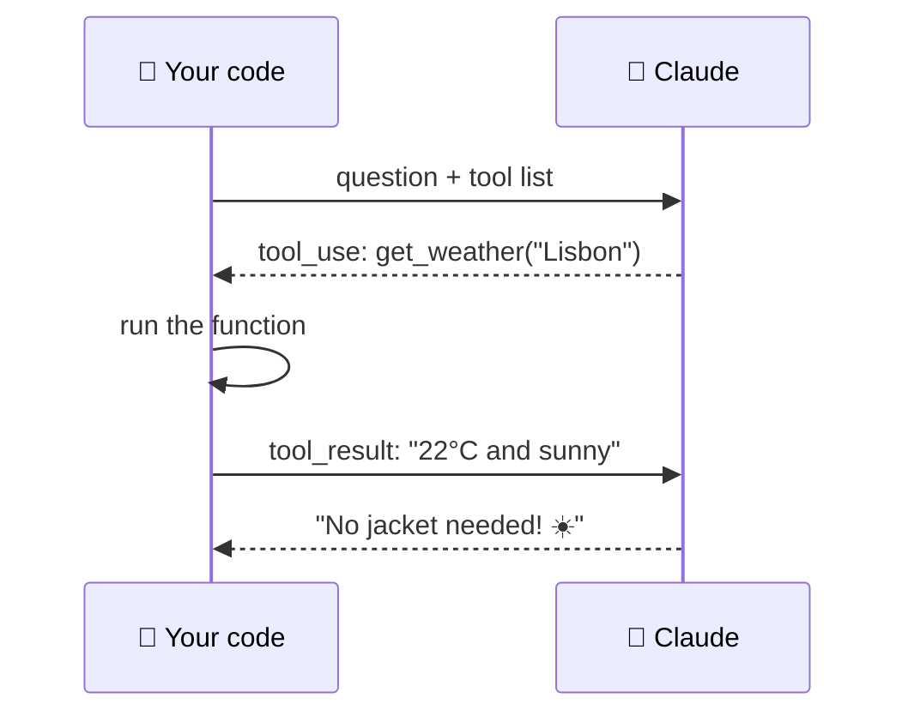
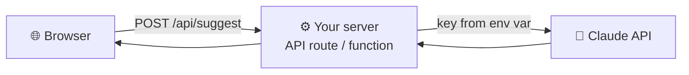

# 36 · Calling AI APIs Directly 🔑🐍

> ⏱️ 8 min read · 🎯 Intermediate (copy-paste friendly, no prior coding needed) · 🧰 Needs: an API key from console.anthropic.com, Python 3.10+ (or Node.js)

**Chat apps are wonderful, but the API is where AI becomes a programmable ingredient.** It's how you put AI in scripts,
spreadsheets, bots, apps and automations. This chapter gets you making real API calls in minutes, then covers the patterns
that matter: conversations, streaming, structured output, tool use, vision, server-side tools, caching, batching and error
handling. Examples use Python and the Claude API (`anthropic` SDK), with TypeScript where it helps. The same ideas work with
every provider.

<details class="eli5" open>
<summary>🧸 ELI5: This chapter in 30 seconds</summary>

A chat app is like ordering at a restaurant counter. An **API** is the kitchen's back door: your own programs can send
orders directly ("summarize this," "read this receipt") and get answers back, thousands of times a day, without anyone
typing into a chat box. You get a secret key (like a membership card), send a message in a special format, and get the
AI's reply as data your program can use.

</details>

<!-- in-this-chapter -->

## 🛠️ Setup (5 minutes)

<details class="eli5">
<summary>🧸 ELI5</summary>

Make an account, add a little money, set a spending limit so you can never overspend, and get your secret key. Then install
one small package.

</details>

1. Create an account at **console.anthropic.com**, add a little credit, and **set a monthly spend limit**. 💸🛡️
2. Create an **API key**. Treat it like a password.
3. Install the SDK and set your key:

=== "🐍 Python"

    ```bash
    pip install anthropic
    export ANTHROPIC_API_KEY="sk-ant-..."     # macOS/Linux (Windows: setx ANTHROPIC_API_KEY "...")
    ```

=== "🟨 TypeScript / Node"

    ```bash
    npm install @anthropic-ai/sdk
    export ANTHROPIC_API_KEY="sk-ant-..."
    ```

> [!WARNING]
> **🔐 Keys stay secret**
> Never paste your key into code you share, commit it to GitHub, or put it in browser JavaScript. Use environment variables
> or a `.env` file listed in `.gitignore` ([Git & GitHub](30-git-and-github.md#-secrets--safety-the-stuff-that-bites-beginners)).

## 👋 Your first call

<details class="eli5">
<summary>🧸 ELI5</summary>

You send a message, you get a message back, plus a little receipt saying how many "word pieces" (tokens) it used.

</details>

=== "🐍 Python"

    ```python
    import anthropic

    client = anthropic.Anthropic()  # reads ANTHROPIC_API_KEY from the environment

    response = client.messages.create(
        model="claude-opus-5",
        max_tokens=16000,
        messages=[{"role": "user", "content": "Give me 3 fun facts about octopuses 🐙"}],
    )
    print(response.content[0].text)
    print(response.usage)  # input/output tokens: what you're billed for
    ```

=== "🟨 TypeScript"

    ```typescript
    import Anthropic from "@anthropic-ai/sdk";

    const client = new Anthropic(); // reads ANTHROPIC_API_KEY

    const response = await client.messages.create({
      model: "claude-opus-5",
      max_tokens: 16000,
      messages: [{ role: "user", content: "Give me 3 fun facts about octopuses 🐙" }],
    });
    for (const block of response.content) {
      if (block.type === "text") console.log(block.text);
    }
    ```

**Anatomy of a request:**

| Field | Meaning |
|---|---|
| `model` | Which model. Tiers trade capability for speed and cost ([How Models Really Work](../part-1-foundations/02-how-models-really-work.md)) |
| `max_tokens` | The ceiling on reply length. Too low and answers get cut off |
| `system` | Standing instructions (persona, rules, format) |
| `messages` | The conversation: alternating `user` and `assistant` turns |
| `tools` | Functions the model may call (below) |

**Anatomy of a response:** `content` (a list of blocks: text, tool calls, thinking), `stop_reason` (why it stopped) and
`usage` (tokens in and out).

## 💬 Conversations & system prompts

<details class="eli5">
<summary>🧸 ELI5</summary>

The AI doesn't remember you between messages. To have a conversation, your program sends the whole chat so far every time.
The "system" message is the permanent instruction card, like "you are a friendly pirate."

</details>

**APIs are stateless:** you send the *whole* conversation each time. That's how "memory" works in every chat app.

```python
history = []
system = "You are a cheerful cooking coach. Keep answers under 100 words."

while True:
    user_text = input("You: ")
    history.append({"role": "user", "content": user_text})
    response = client.messages.create(
        model="claude-opus-5", max_tokens=16000, system=system, messages=history,
    )
    reply = response.content[0].text
    history.append({"role": "assistant", "content": reply})
    print("Coach:", reply)
```

Twelve lines, and you've built your own chat app. 🎉 Long chats grow expensive, so trim or summarize old turns for
long-running bots ([Context Engineering](../part-1-foundations/05-context-engineering.md)).

## 🌊 Streaming

<details class="eli5">
<summary>🧸 ELI5</summary>

Instead of waiting for the whole answer, you get it word by word as it's written, like watching someone type. It feels much
faster.

</details>

```python
with client.messages.stream(
    model="claude-opus-5",
    max_tokens=64000,
    messages=[{"role": "user", "content": "Write a short bedtime story about a brave toaster."}],
) as stream:
    for text in stream.text_stream:
        print(text, end="", flush=True)
    final = stream.get_final_message()   # the full message, with usage, when it's done
```

Use streaming for anything long: text appears immediately, users stay happy, and you avoid timeouts on big outputs.

## 📦 Structured output: data instead of prose

<details class="eli5">
<summary>🧸 ELI5</summary>

Instead of a paragraph, you ask the AI to fill in a form with exact boxes (title, date, place), so your program can use the
answers directly.

</details>

Perfect for automations. Define the shape you want, and get back a validated Python object:

```python
from pydantic import BaseModel

class Event(BaseModel):
    title: str
    date: str
    location: str
    attendees: list[str]

response = client.messages.parse(
    model="claude-opus-5",
    max_tokens=16000,
    messages=[{"role": "user", "content":
        "Extract the event: 'Team picnic at Riverside Park on June 14. Priya, Sam and Lee are coming.'"}],
    output_format=Event,
)
event = response.parsed_output
print(event.title, event.date, event.attendees)
```

**Use it for:** receipts → rows, emails → tasks, reviews → sentiment + themes, messy notes → clean JSON for n8n or Zapier
([Webhooks, APIs & JSON](../part-3-automation/15-webhooks-apis-json.md)).

## 🔧 Tool use: letting the model call your functions

<details class="eli5">
<summary>🧸 ELI5</summary>

You tell the AI "here are some buttons you can press: check the weather, look up a recipe." When it needs one, it asks your
program to press the button, reads the result, and keeps going. That's how an AI becomes an agent.

</details>

The SDK's **tool runner** turns plain Python functions into tools and handles the whole loop for you:

```python
from anthropic import beta_tool

@beta_tool
def get_weather(city: str) -> str:
    """Get the current weather for a city.

    Args:
        city: City name, e.g. "Lisbon".
    """
    return f"22°C and sunny in {city}"  # call a real weather API here

runner = client.beta.messages.tool_runner(
    model="claude-opus-5",
    max_tokens=16000,
    tools=[get_weather],
    messages=[{"role": "user", "content": "Should I pack a jacket for Lisbon today?"}],
)
for message in runner:          # each step of the loop
    print(message.content)
```



Want to see the loop *without* the helper? That's exactly what [Build Your Own Agent](37-build-your-own-agent.md) and the
[build-your-own-agent kit](../../examples/build-your-own-agent/) show.

## 👁️ Vision & documents

<details class="eli5">
<summary>🧸 ELI5</summary>

You can send pictures and PDFs, not just words. The AI can read a receipt, describe a photo, or pull the numbers out of a
chart.

</details>

```python
import base64, pathlib

image_b64 = base64.standard_b64encode(pathlib.Path("receipt.jpg").read_bytes()).decode()
response = client.messages.create(
    model="claude-opus-5",
    max_tokens=16000,
    messages=[{"role": "user", "content": [
        {"type": "image", "source": {"type": "base64", "media_type": "image/jpeg", "data": image_b64}},
        {"type": "text", "text": "List every item and price on this receipt, then the total."},
    ]}],
)
print(response.content[0].text)
```

**PDFs** work the same way with a `{"type": "document", "source": {...}}` block, and the model sees both the text and the
page images (charts, tables, handwriting). Combine with structured output for a receipt-to-spreadsheet pipeline. 🧾➡️📊

## 🌐 Server-side tools: search, fetch & code execution

<details class="eli5">
<summary>🧸 ELI5</summary>

Some tools are run by Anthropic for you: searching the web, reading web pages, and running little programs in a safe box.
You just switch them on, with no code of your own.

</details>

Some tools run on Anthropic's side, so you write **zero tool code**: **web search**, **web fetch** and **code execution** (a
sandbox where Claude runs Python to analyze data and make charts). You just declare them:

```python
response = client.messages.create(
    model="claude-opus-5",
    max_tokens=16000,
    tools=[{"type": "web_search_20260318", "name": "web_search", "max_uses": 5}],
    messages=[{"role": "user", "content": "What happened in AI news this week? Cite sources."}],
)
```

> [!NOTE]
> **📌 Tool versions**
> Server tool type names include a version date and get upgraded over time. Check the docs for the current names before
> you ship.

**Great for:** research bots with citations, "analyze this CSV and chart it" features, and fact-checking pipelines.

## ⚡ Make it cheap & fast

<details class="eli5">
<summary>🧸 ELI5</summary>

A few tricks make AI calls cheaper and faster: use smaller models for easy jobs, reuse long instructions (caching), and
send big non-urgent piles of work as a batch.

</details>

| Lever | What it does |
|---|---|
| **Right-size the model** | Small, fast tiers for classification and extraction. Big models for hard reasoning |
| **Effort / thinking controls** | Less thinking for simple tasks, more for hard ones |
| **Prompt caching** | Re-sending the same long prefix (instructions, documents) is much cheaper and faster |
| **Batch API** | Non-urgent bulk jobs at a big discount, with results within hours |
| **Trim context** | Send only what's needed, and summarize old chat turns |
| **Spend limits + logging** | Log `response.usage` to see where tokens go |

**Prompt caching** example (a long document you'll ask many questions about):

```python
response = client.messages.create(
    model="claude-opus-5",
    max_tokens=16000,
    system=[
        {"type": "text", "text": "You answer questions about the attached handbook."},
        {"type": "text", "text": handbook_text, "cache_control": {"type": "ephemeral"}},
    ],
    messages=[{"role": "user", "content": "How many vacation days do new hires get?"}],
)
print(response.usage)   # later calls show cache reads: cheaper and faster
```

**Batch** example (500 reviews to classify overnight):

```python
batch = client.messages.batches.create(requests=[
    {"custom_id": f"review-{i}",
     "params": {"model": "claude-opus-5", "max_tokens": 1000,
                "messages": [{"role": "user", "content": f"Sentiment (positive/neutral/negative): {text}"}]}}
    for i, text in enumerate(reviews)
])
print(batch.id)   # check back later with client.messages.batches.retrieve(batch.id)
```

More in [Cost Optimization](../part-10-mastery/75-cost-optimization.md).

## 🧯 Handling errors gracefully

<details class="eli5">
<summary>🧸 ELI5</summary>

Sometimes the internet hiccups or you send too many requests too fast. Good programs notice, wait a moment, and try again,
instead of crashing.

</details>

```python
try:
    response = client.messages.create(
        model="claude-opus-5", max_tokens=16000,
        messages=[{"role": "user", "content": "Hello!"}],
    )
except anthropic.RateLimitError:
    print("Slow down: wait and retry")          # the SDK already retries a few times for you
except anthropic.APIStatusError as e:
    print("API error:", e.status_code, e.message)
except anthropic.APIConnectionError:
    print("Network problem")
```

Also check `response.stop_reason`:

| `stop_reason` | Meaning | Do |
|---|---|---|
| `end_turn` | Finished normally | 🎉 |
| `max_tokens` | Cut off | Raise `max_tokens` or use streaming |
| `tool_use` | Wants to call a tool | Run it and send the result back |
| `refusal` | Declined the request | Rephrase or rethink the request |

## 🌍 Other providers & gateways

<details class="eli5">
<summary>🧸 ELI5</summary>

Other AI companies have very similar back doors. Once you know one, you know them all. Some services even give you one key
for hundreds of different AIs.

</details>

| Option | Why use it |
|---|---|
| **OpenAI, Google Gemini, Mistral, xAI…** | Similar SDKs: messages in, text or tool calls out |
| **OpenRouter** | One key, hundreds of models, great for comparing |
| **Local models** (Ollama, LM Studio) | Free, private HTTP APIs on your own machine ([Local & Open Models](../part-7-local-ai/47-local-and-open-models.md)) |
| **Cloud platforms** (AWS Bedrock, Google Vertex AI, Microsoft Foundry) | Claude and others inside enterprise clouds |
| **Vercel AI SDK, LiteLLM** | One interface for many providers in your app |

## 🧱 Where API calls live in real apps

<details class="eli5">
<summary>🧸 ELI5</summary>

In a real app, the AI call happens on the server (the kitchen), never in the visitor's browser (the dining room), so nobody
can steal your key.

</details>



- **Web apps:** API routes, server actions or edge functions ([Vibe Coding](34-vibe-coding-your-first-app.md)).
- **Automations:** HTTP Request or Anthropic nodes in n8n, Zapier and Make ([Part III](../part-3-automation/index.md)).
- **Scripts:** cron jobs, GitHub Actions, or a script you run by hand.
- **Spreadsheets:** Apps Script or Python ([Spreadsheet Superpowers](../part-4-ai-in-your-apps/27-spreadsheet-superpowers.md)).

## 🎮 10 weekend API projects

<details class="eli5">
<summary>🧸 ELI5</summary>

Ten small projects that each teach one API skill.

</details>

| # | Project | Skill it teaches |
|---|---|---|
| 1 | 🧾 Receipt → CSV scanner for a folder of photos | Vision + structured output |
| 2 | ✉️ Email reply CLI: pipe an email in, get 3 reply options | System prompts |
| 3 | 📓 Journal bot that texts you a daily reflective question | Scheduling + messaging |
| 4 | 📊 CSV enricher that adds AI columns (classify, summarize, translate) | Batching |
| 5 | 🔎 Research bot: *"Brief me on X with sources"* → Markdown | Web search tool |
| 6 | 🍳 Fridge-photo recipe suggester | Vision |
| 7 | 🗣️ Chat-with-a-handbook CLI | Prompt caching |
| 8 | 🌦️ Weather-aware outfit advisor | Tool use |
| 9 | 🧠 Flashcard generator from your notes | Structured output |
| 10 | 📈 "Analyze my spending" with code execution | Server-side tools |

## 🎯 Key takeaways

- The API turns AI into a **programmable ingredient**: messages in, content out, usage logged.
- APIs are **stateless**. Send the whole conversation each time.
- **Stream** long outputs, **parse** structured data, and use **tools** to build agents.
- **Caching, batching and right-sized models** cut costs dramatically. Always set a **spend limit**.
- Keep keys on the **server**, never in browser code.

## 🧠 Check yourself

<details class="quiz">
<summary>❓ 1. Your bot "forgets" what the user said two messages ago. Why?</summary>

APIs are **stateless**. You must send the **full conversation history** in `messages` on every call.

</details>

<details class="quiz">
<summary>❓ 2. `stop_reason` is `max_tokens` and the answer ends mid-sentence. What do you do?</summary>

Raise **`max_tokens`** (and use **streaming** for long outputs).

</details>

<details class="quiz">
<summary>❓ 3. You'll ask 200 questions about the same 80-page handbook. Which feature saves the most money?</summary>

**Prompt caching** on the handbook text, so repeat reads are much cheaper and faster.

</details>

<details class="quiz">
<summary>❓ 4. You need 10,000 product descriptions classified by tomorrow. Which API feature fits?</summary>

The **Batch API**: big discounts for non-urgent bulk work.

</details>

> [!TIP]
> **🎮 Try this**
> Run the octopus example, then change one thing at a time: add a `system` prompt (*"You are a pirate"*), stream it, and
> log `response.usage`. Then turn it into the 12-line chat loop. In half an hour you'll understand AI APIs better than most
> people. 🏴‍☠️

---

**Next:** [37 · Build Your Own Agent →](37-build-your-own-agent.md)
