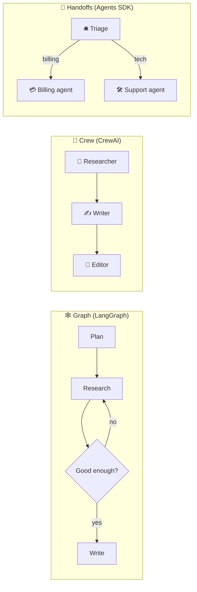
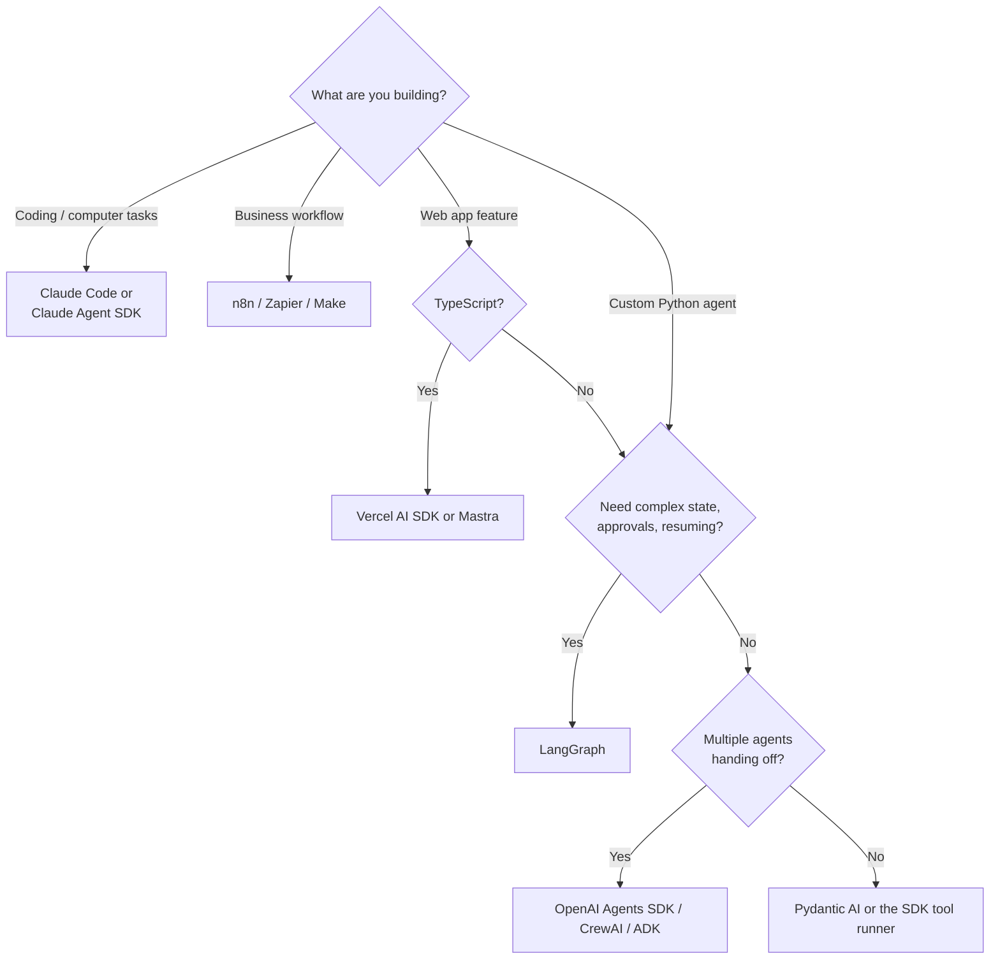

# 38 · Agent Frameworks Tour: Pick Your LEGO Set 🧱🤖

> ⏱️ 7 min read · 🎯 Intermediate · 🧰 Needs: Python or TypeScript basics (or an AI coding agent to help), and an API key

**Once you've written an agent loop by hand ([Build Your Own Agent](37-build-your-own-agent.md)), frameworks stop being
magic and start being time-savers.** They give you memory, multi-agent handoffs, guardrails, tracing, retries and
deployment patterns out of the box. This chapter tours the major frameworks, shows the same tiny agent in several of them,
and helps you pick one without the analysis paralysis. 🧭

<details class="eli5" open>
<summary>🧸 ELI5: This chapter in 30 seconds</summary>

You *can* build a robot from loose parts, but LEGO sets come with the special pieces already made: wheels, arms, a remote
control. **Agent frameworks** are LEGO sets for AI helpers. Each set has a different style. Some are simple, some build
giant castles (big multi-robot teams), and some are made for websites. This chapter shows you the sets so you can pick one
you like.

</details>

<!-- in-this-chapter -->

## 🧐 Do you even need a framework?

<details class="eli5">
<summary>🧸 ELI5</summary>

For small projects, no! A simple loop or an existing agent like Claude Code is often enough. Frameworks help when your
project gets big or needs fancy features.

</details>

| You want… | Best choice |
|---|---|
| A coding/computer agent that edits files and runs commands | **Claude Code** (configure it) or the **Claude Agent SDK** |
| One agent with a handful of your own tools | The **SDK tool runner** or a ~100-line loop |
| An agent in a business workflow (email, CRM, Slack) | **n8n / Zapier / Make** AI agents ([Part III](../part-3-automation/index.md)) |
| Complex branching flows, human approvals, resumable runs | **LangGraph** |
| Multiple agents handing off to each other | **OpenAI Agents SDK**, **CrewAI**, **Google ADK**, **Microsoft Agent Framework** |
| Type-safe Python with validated outputs | **Pydantic AI** |
| AI features in a web app (TypeScript) | **Vercel AI SDK** or **Mastra** |
| A provider-hosted agent with a sandbox | Managed agent platforms (e.g. Claude Managed Agents) |

> [!TIP]
> **💡 The honest advice**
> Configure an existing agent first, then write a small loop, and reach for a framework when you feel real pain (state,
> handoffs, tracing, retries). Frameworks add power *and* abstraction, so learn the loop first.

## 🗺️ The framework landscape

<details class="eli5">
<summary>🧸 ELI5</summary>

Here's a big table of the popular LEGO sets, what language they use, and what they're especially good at.

</details>

| Framework | Language | Superpower | Vibe |
|---|---|---|---|
| **Claude Agent SDK** | Python, TS | Claude Code's harness: files, bash, search, subagents, MCP, hooks | "Give my app Claude Code's brain" |
| **OpenAI Agents SDK** | Python, TS | Simple agents, **handoffs**, guardrails, tracing (works with other providers too) | Minimal and friendly |
| **LangGraph** | Python, JS | Agents as **graphs** with state, checkpoints, human-in-the-loop, time travel | Maximum control |
| **LangChain** | Python, JS | Huge integration library, now built on LangGraph for agents | The big toolbox |
| **CrewAI** | Python | "Crews" of role-playing agents with tasks | Teams of specialists |
| **Pydantic AI** | Python | Type-safe agents, validated structured outputs, dependency injection | Clean Python |
| **Google ADK** | Python, Java, more | Multi-agent hierarchies, Gemini-friendly, deploys to Google Cloud | Enterprise-ready |
| **Microsoft Agent Framework** | Python, .NET | Successor to AutoGen + Semantic Kernel, workflows, Azure integration | Enterprise .NET/Python |
| **Mastra** | TypeScript | Agents, workflows, memory, RAG, evals for TS devs | Batteries-included TS |
| **Vercel AI SDK** | TypeScript | Streaming UI, tool calls, any provider, agent loops | Web-app native |
| **smolagents** | Python | Agents that write and run **code** as their actions | Tiny and hackable |
| **LlamaIndex** | Python, TS | Data and RAG-heavy agents, document workflows | Knowledge-first |
| **DSPy** | Python | *Programs* instead of prompts, with auto-optimized prompts | Research-y, powerful |

> [!NOTE]
> **📌 This space moves fast**
> Frameworks merge, rename and release new major versions often. Check each project's docs and changelog before you start,
> and ask your coding agent to use the **current** API (a docs MCP server helps a lot).

## 🧪 The same agent in four frameworks

<details class="eli5">
<summary>🧸 ELI5</summary>

Here's the same tiny weather helper built with four different LEGO sets, so you can see how each one feels.

</details>

Each example builds the same thing: an agent with a `get_weather` tool that answers "Do I need an umbrella in Lisbon?"

=== "🟢 OpenAI Agents SDK"

    ```python
    # pip install openai-agents   (supports other providers via LiteLLM)
    from agents import Agent, Runner, function_tool

    @function_tool
    def get_weather(city: str) -> str:
        """Get today's weather for a city."""
        return f"Light rain in {city}, 16°C"

    agent = Agent(
        name="Weather buddy",
        instructions="You are a cheerful weather assistant. Be brief.",
        tools=[get_weather],
    )
    result = Runner.run_sync(agent, "Do I need an umbrella in Lisbon?")
    print(result.final_output)
    ```

=== "🟣 Pydantic AI"

    ```python
    # pip install pydantic-ai
    from pydantic_ai import Agent

    agent = Agent(
        "anthropic:claude-opus-5",
        instructions="You are a cheerful weather assistant. Be brief.",
    )

    @agent.tool_plain
    def get_weather(city: str) -> str:
        """Get today's weather for a city."""
        return f"Light rain in {city}, 16°C"

    result = agent.run_sync("Do I need an umbrella in Lisbon?")
    print(result.output)
    ```

=== "🦜 LangChain / LangGraph"

    ```python
    # pip install langchain langchain-anthropic
    from langchain.agents import create_agent

    def get_weather(city: str) -> str:
        """Get today's weather for a city."""
        return f"Light rain in {city}, 16°C"

    agent = create_agent(
        model="anthropic:claude-opus-5",
        tools=[get_weather],
        system_prompt="You are a cheerful weather assistant. Be brief.",
    )
    result = agent.invoke({"messages": [{"role": "user", "content": "Do I need an umbrella in Lisbon?"}]})
    print(result["messages"][-1].content)
    ```

=== "🟠 CrewAI"

    ```python
    # pip install crewai
    from crewai import Agent, Task, Crew

    forecaster = Agent(
        role="Friendly weather forecaster",
        goal="Give practical, cheerful weather advice",
        backstory="You've helped travelers stay dry for years.",
        llm="anthropic/claude-opus-5",
    )
    task = Task(
        description="Do I need an umbrella in Lisbon today? (Assume light rain, 16°C.)",
        expected_output="A one-sentence recommendation.",
        agent=forecaster,
    )
    print(Crew(agents=[forecaster], tasks=[task]).kickoff())
    ```

Notice the pattern: **a model, instructions, tools, and a run call.** Every framework is the same loop from
[Build Your Own Agent](37-build-your-own-agent.md) wearing a different outfit. 👗

## 🟨 TypeScript options

<details class="eli5">
<summary>🧸 ELI5</summary>

If you build websites with JavaScript or TypeScript, these sets fit right into your app.

</details>

**Vercel AI SDK** (streams straight into React UIs):

```typescript
import { generateText, tool, stepCountIs } from "ai";
import { anthropic } from "@ai-sdk/anthropic";
import { z } from "zod";

const { text } = await generateText({
  model: anthropic("claude-opus-5"),
  prompt: "Do I need an umbrella in Lisbon?",
  tools: {
    getWeather: tool({
      description: "Get today's weather for a city",
      inputSchema: z.object({ city: z.string() }),
      execute: async ({ city }) => `Light rain in ${city}, 16°C`,
    }),
  },
  stopWhen: stepCountIs(5), // let it loop: call tools, then answer
});
console.log(text);
```

| TS framework | Pick it when |
|---|---|
| **Vercel AI SDK** | You're building a web app with chat or AI features |
| **Mastra** | You want agents + workflows + memory + evals in one TS toolkit |
| **OpenAI Agents SDK (JS)** | You like its handoff model |
| **Claude Agent SDK (TS)** | You want the Claude Code harness in Node |
| **LangGraph.js** | Complex graphs and durable state |

## 🕸️ Graphs, crews & handoffs: three mental models

<details class="eli5">
<summary>🧸 ELI5</summary>

Frameworks organize robots in different ways: like a board game with squares and arrows (graphs), like a team with job
titles (crews), or like a relay race where one robot passes the baton to the next (handoffs).

</details>



| Model | Think of it as | Great for |
|---|---|---|
| **Graph** | A flowchart with loops and checkpoints | Reliable, resumable, auditable processes |
| **Crew** | A team with roles and a task list | Content pipelines, research reports |
| **Handoffs** | A receptionist routing to specialists | Customer support, multi-domain assistants |
| **Orchestrator + subagents** | A manager delegating in parallel | Deep research, big coding jobs ([Multi-Agent Systems](39-multi-agent-systems.md)) |

## 🔭 Tracing & observability

<details class="eli5">
<summary>🧸 ELI5</summary>

Tracing is a video recording of everything your agent did: every thought, every tool, every answer, and how long and how
much each step cost. When something goes wrong, you rewind the tape.

</details>

Agents are hard to debug by reading logs alone. **Tracing tools** show each run as a tree of steps with inputs, outputs,
timing and cost.

| Tool | Notes |
|---|---|
| **Langfuse** | Open source, self-hostable, works with most frameworks |
| **LangSmith** | Built for LangChain/LangGraph, works with others |
| **Logfire** | From the Pydantic team, OpenTelemetry-based |
| **Arize Phoenix** | Open-source tracing + evals |
| **Braintrust** | Evals + tracing + prompt playgrounds |
| **Built-in tracing** | OpenAI Agents SDK, Mastra and others ship dashboards |

Most speak **OpenTelemetry**, so you can switch tools later. Pair tracing with **evals** to catch regressions
([Evaluating AI](../part-10-mastery/74-evaluating-ai.md)).

## 🔗 Protocols: MCP, A2A & friends

<details class="eli5">
<summary>🧸 ELI5</summary>

Protocols are shared languages. MCP is how agents plug into tools. A2A is how agents from different companies talk to each
other. Using shared languages means your LEGO pieces fit together.

</details>

| Protocol | Connects | Why it matters |
|---|---|---|
| **MCP** | Agents ↔ tools and data | Every major framework can use MCP servers ([MCP Explained](../part-2-mcp-and-connectors/07-mcp-explained.md)) |
| **A2A** (Agent2Agent) | Agents ↔ other agents | Agents built on different frameworks can delegate to each other |
| **AG-UI** and similar | Agents ↔ user interfaces | Streaming agent events into web apps |
| **Agent Client Protocol** | Coding agents ↔ editors | Run Claude Code or Gemini CLI inside Zed and other editors |

**The takeaway:** build your tools as **MCP servers**, and they work with *every* framework on this page. That's the most
future-proof decision you can make. 🔮

## 🧭 How to choose (a decision flow)

<details class="eli5">
<summary>🧸 ELI5</summary>

Answer a few questions and the flowchart points you to a good starting set.

</details>



## 🪤 Framework pitfalls

<details class="eli5">
<summary>🧸 ELI5</summary>

Frameworks can hide what's happening, change quickly, and tempt you to build giant robot teams when one robot would do. Keep
it simple and keep an eye on the costs.

</details>

| Pitfall | Fix |
|---|---|
| "Magic" you can't debug | Turn on tracing from day one, and read the raw prompts it sends |
| Breaking changes between versions | Pin versions, read changelogs, keep tests |
| Over-engineering (5 agents for a 1-agent job) | Start with one agent and add more only when it clearly helps |
| Cost explosions from multi-agent chatter | Budgets per run, cheaper models for simple roles |
| Framework lock-in | Keep tools as MCP servers and prompts in plain files |
| Outdated examples from AI assistants | Give your coding agent the current docs (docs MCP server, `@docs`) |

## 🎯 Key takeaways

- Every framework is the **same loop** (model + tools + loop + stop) with extra features.
- **Configure existing agents first**, then a small loop, then a framework when you feel real pain.
- **LangGraph** for control, **OpenAI Agents SDK / CrewAI / ADK** for teams and handoffs, **Pydantic AI** for clean Python,
  **Vercel AI SDK / Mastra** for TypeScript, **Claude Agent SDK** for a Claude Code-grade harness.
- **Tracing** is non-negotiable for serious agents.
- Build tools as **MCP servers** to stay framework-agnostic.

## 🧠 Check yourself

<details class="quiz">
<summary>❓ 1. You need an agent process that can pause for human approval and resume tomorrow. Which framework fits best?</summary>

**LangGraph**, with its checkpointed state and human-in-the-loop support.

</details>

<details class="quiz">
<summary>❓ 2. What's the most future-proof way to build your agent's tools?</summary>

As **MCP servers**, so any framework or agent app can use them.

</details>

<details class="quiz">
<summary>❓ 3. Your multi-agent crew costs 10× more than expected. First two things to check?</summary>

**Tracing** (which agents talk the most, and how big the messages are) and whether you really need that many agents
(**simplify**, and use **cheaper models** for simple roles).

</details>

> [!TIP]
> **🎮 Try this**
> Pick two tabs from "The same agent in four frameworks" and run them both (ask your coding agent to set up the environments).
> Then swap the fake weather for the free Open-Meteo API. Which framework *felt* nicer? That's your answer. 🌦️

---

**Next:** [39 · Multi-Agent Systems →](39-multi-agent-systems.md)
