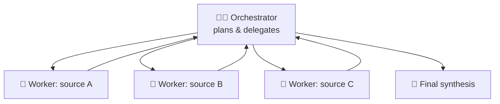
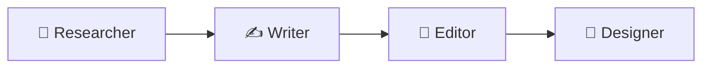
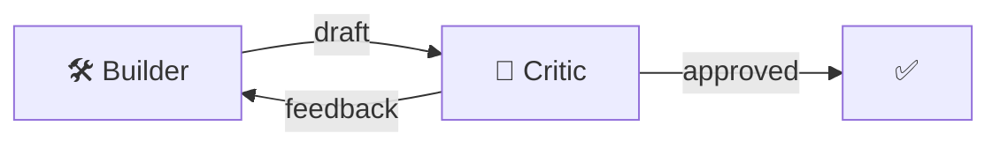

# 22 · Multi-Agent Systems: Teams of AIs 👥🤖

One agent is useful. **Several agents that divide the work** can take on bigger jobs: deep research
across dozens of sources, big codebases, content pipelines. This chapter explains when multi-agent setups
are worth it, the main patterns, and how to try them without drowning in complexity.

---

## Why multiple agents?

| Benefit | Explanation |
|---|---|
| 🧠 **Clean context** | Each agent keeps only what it needs, and subagents return summaries instead of raw dumps |
| 🎭 **Specialization** | A focused prompt and tools per role (researcher, coder, reviewer) |
| ⚡ **Parallelism** | Five researchers reading five sources at once |
| 🔍 **Checks and balances** | A reviewer agent catches the builder agent's mistakes |

**The cost:** more tokens (often several times more), more moving parts, and harder debugging. **Use multi-agent only when a
single agent is genuinely struggling** with context size, breadth, or quality.

## The core patterns

### 1. Orchestrator → workers (the most useful) 🎯

The lead agent breaks the task down, spawns workers (often in parallel), and combines their summaries. This is how
"deep research" features and Claude Code's subagents work.

### 2. Pipeline (assembly line) 🏭

Each agent transforms the previous one's output. Predictable and easy to debug. Honestly, this is often **just a workflow**
(n8n/Make) with AI steps, and that's a good thing!

### 3. Builder ↔ Critic loop 🔁

One agent produces, another evaluates against criteria, and they repeat until it passes (with a max-rounds limit!). Great for
writing quality, code review, and "keep going until it's right" tasks.

### 4. Debate / ensemble ⚖️
Several agents (or models) answer independently, and a judge picks or merges. It's useful for high-stakes decisions and for
catching hallucinations.

### 5. Handoffs (routing) 📞
A front-desk agent routes to specialists (billing agent, tech-support agent). Common in customer-service bots.

## Try it today (easiest → hardest)

| Level | How |
|---|---|
| 🟢 **Claude Code subagents** | Create `researcher` and `reviewer` subagents with `/agents`, then say *"use the researcher subagent to…"* ([Ch. 18](31-claude-code-masterclass.md)) |
| 🟢 **Deep research features** | Claude Research, ChatGPT/Gemini Deep Research are multi-agent under the hood |
| 🟡 **n8n** | An AI Agent that calls other workflows (each with its own agent) as tools |
| 🟡 **CrewAI** | Define roles, goals, and tasks in Python, and it orchestrates a "crew" |
| 🔴 **LangGraph / OpenAI Agents SDK / Claude Agent SDK** | Code-level control over graphs, handoffs, and subagents |
| 🔴 **Managed multi-agent platforms** | Hosted orchestration with delegation to worker agents |

## Example: a content studio crew 🎬

**Goal:** turn a topic into a researched, edited blog post with social snippets.

| Agent | Tools | Instructions (abridged) |
|---|---|---|
| 🔎 Researcher | web search, fetch | "Find 8 high-quality sources. Return key facts with URLs. No opinions." |
| ✍️ Writer | none | "Write a 1,200-word post for curious beginners using ONLY the research notes. Cite sources." |
| 🧐 Editor | none | "Check claims against the notes, tighten prose, flag anything unsupported. Return edits + a verdict." |
| 📣 Social | none | "Create an X thread, a LinkedIn post, and 3 pull quotes." |

The orchestrator runs Researcher → Writer → Editor (looping back to the Writer if the verdict is "revise," max 2 times) → Social.

**Pro tip:** the **Editor sees the research notes**, which lets it catch the Writer inventing facts. Grounded
checking is where multi-agent setups really shine.

## Design tips 🧩
1. **Start with one agent.** Split only where you see a specific failure (context overflow, lack of focus, no self-checking).
2. **Clear contracts between agents:** define exactly what each returns (ideally structured JSON).
3. **Summaries, not transcripts:** workers should return compact findings.
4. **Cheaper models for workers**, and your best model for orchestration and final synthesis.
5. **Limit rounds and fan-out.** Put caps on everything.
6. **Trace everything:** log each agent's input and output so you can see where quality drops.

## The honest truth 💬
Many impressive "multi-agent systems" are really **well-designed workflows**. That's great! Deterministic
structure plus AI at the fuzzy steps is often more reliable than agents chatting freely. Use autonomy where it adds
value, and structure everywhere else.

---

### 🎮 Try this
In Claude Code, create two subagents, a **researcher** (web tools only) and a **fact-checker** (read-only).
Ask: *"Use the researcher to write a brief on [topic you love], then have the fact-checker verify every claim
against the sources and report any that don't hold up."* Watch your team work. 👥

---

**Next:** [23 · RAG, Memory & Knowledge →](../part-6-knowledge-and-memory/41-rag-memory-and-knowledge.md)
