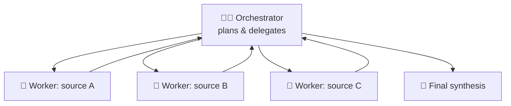
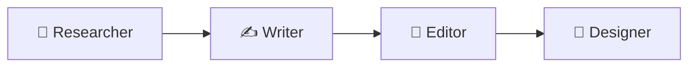
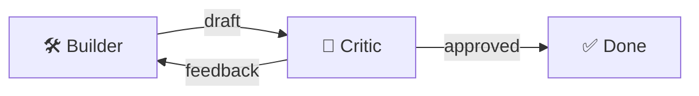
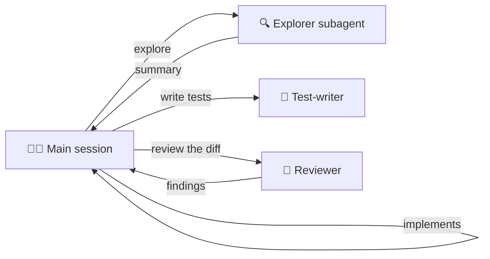

# 39 · Multi-Agent Systems: Teams of AIs 👥🤖

> ⏱️ 7 min read · 🎯 Intermediate → advanced · 🧰 Needs: Claude Code (easiest), or n8n, or a framework from the [Agent Frameworks Tour](38-agent-frameworks-tour.md)

**One agent is useful. Several agents that divide the work can take on much bigger jobs:** deep research across dozens of
sources, big codebases, content pipelines, and "build it and then check it" loops. This chapter explains when multi-agent
setups are worth it, the six core patterns, and how to try them today without drowning in complexity. 🏊

🧸 ELI5: This chapter in 30 seconds

Imagine building a huge sandcastle. One kid can do it, but it takes forever. With a team, one kid digs the moat, one builds
towers, one decorates, and a "boss kid" checks everyone's work and puts it all together. **Multi-agent systems** are teams
of AI helpers like that. They're great for big jobs, but teams also cost more and can get messy, so you only form a team
when one helper really isn't enough.

<!-- in-this-chapter -->

## 🤔 Why multiple agents?

🧸 ELI5

Teams help because each helper can focus on one job, several helpers can work at the same time, and one helper can check
another's work.

| Benefit | Explanation |
|---|---|
| 🧠 **Clean context** | Each agent keeps only what it needs, and subagents return summaries instead of raw dumps |
| 🎭 **Specialization** | A focused prompt and toolset per role (researcher, coder, reviewer) |
| ⚡ **Parallelism** | Five researchers reading five sources at once |
| 🔍 **Checks and balances** | A reviewer agent catches the builder agent's mistakes |
| 🧩 **Bigger jobs** | Tasks too large for one context window get split into pieces |

> [!WARNING]
> **⚠️ The cost**
> More tokens (often several times more), more moving parts and harder debugging. **Use multi-agent only when a single agent
> is genuinely struggling** with context size, breadth or quality.

## 🎯 Pattern 1: Orchestrator → workers

🧸 ELI5

A boss helper splits the big job into pieces, sends each piece to a worker helper, then combines their answers into one.

The lead agent breaks the task down, spawns workers (often **in parallel**), and combines their summaries. This is how
"deep research" features and Claude Code's subagents work. It's the **most useful pattern** by far.

**Great for:** research across many sources, auditing a large codebase folder by folder, processing 50 documents.

## 🏭 Pattern 2: Pipeline (assembly line)

🧸 ELI5

Like a factory line: the first helper does step one and passes it on, the next does step two, and so on.

Each agent transforms the previous one's output. Predictable and easy to debug. Honestly, this is often **just a workflow**
(n8n or Make) with AI steps, and that's a good thing!

## 🔁 Pattern 3: Builder ↔ critic loop

🧸 ELI5

One helper makes something, another helper grades it and gives tips, and they go back and forth until it's good enough.

One agent produces, another evaluates against **explicit criteria**, and they repeat until it passes (with a **max-rounds**
limit!). Great for writing quality, code review, and "keep going until the tests pass" tasks.

## ⚖️ Pattern 4: Debate & ensemble

🧸 ELI5

Several helpers answer the same question separately, then a judge helper compares their answers and picks the best (or
combines them).

Several agents (or different models) answer independently, then a judge picks or merges. Useful for **high-stakes decisions**
and for catching hallucinations: if three independent answers disagree, that's a signal to dig deeper.

## 📞 Pattern 5: Handoffs (routing)

🧸 ELI5

A receptionist helper figures out what you need and passes you to the right specialist helper.

A front-desk agent routes each conversation to specialists (billing, tech support, sales). Common in customer-service bots,
and a built-in feature of the OpenAI Agents SDK and similar frameworks.

## 🧑‍🤝‍🧑 Pattern 6: Parallel variants ("best of N")

🧸 ELI5

Ask several helpers to try the same job in different ways at the same time, then keep the best attempt.

Run the same task several times in parallel (different prompts, models or approaches), then pick the winner. Coding tools
make this easy: launch three cloud agents on the same issue and merge the best PR, or ask for three landing-page designs at
once. Costs more, but for creative and hard problems it can be dramatically better.

## 🧪 Try it today (easiest → hardest)

🧸 ELI5

You can try AI teams right now without coding, then level up to building your own.

| Level | How |
|---|---|
| 🟢 **Deep research features** | Claude Research, ChatGPT and Gemini Deep Research are multi-agent under the hood |
| 🟢 **Claude Code subagents** | Create `researcher` and `reviewer` subagents with `/agents`, then say *"use the researcher subagent to…"* ([Power-Ups](32-claude-code-power-ups.md#-subagents-your-specialist-team)) |
| 🟢 **Parallel cloud agents** | Start several Claude Code, Codex or Cursor background agents on different tasks |
| 🟡 **n8n** | An AI Agent that calls other workflows (each with its own agent) as tools ([n8n AI Agents](../part-3-automation/17-n8n-ai-agents.md)) |
| 🟡 **CrewAI** | Define roles, goals and tasks in Python, and it orchestrates a "crew" |
| 🔴 **LangGraph / OpenAI Agents SDK / Claude Agent SDK / ADK** | Code-level control over graphs, handoffs and subagents |
| 🔴 **Managed multi-agent platforms** | Hosted orchestration with delegation to worker agents |

## 🎬 Example: a content studio crew

🧸 ELI5

Four helpers make a blog post together: one finds facts, one writes, one checks the facts, and one makes social media posts
about it.

**Goal:** turn a topic into a researched, edited blog post with social snippets.

| Agent | Tools | Instructions (abridged) |
|---|---|---|
| 🔎 Researcher | web search, fetch | "Find 8 high-quality sources. Return key facts with URLs. No opinions." |
| ✍️ Writer | none | "Write a 1,200-word post for curious beginners using ONLY the research notes. Cite sources." |
| 🧐 Editor | none | "Check claims against the notes, tighten prose, flag anything unsupported. Return edits + a verdict." |
| 📣 Social | none | "Create a short thread, a LinkedIn post and 3 pull quotes." |

The orchestrator runs Researcher → Writer → Editor (looping back to the Writer if the verdict is "revise," max 2 times) →
Social.

> [!TIP]
> **💡 Grounded checking**
> The **Editor sees the research notes**, which lets it catch the Writer inventing facts. Checking against sources is where
> multi-agent setups really shine.

## 💻 Example: a coding team in Claude Code

🧸 ELI5

In Claude Code, you can have a planner, a builder, a tester and a reviewer, all as helpers the main Claude calls on.

**Prompt:** *"Use an explorer subagent to map how payments work, then implement refunds. When done, have the test-writer add
tests and the code-reviewer review the diff. Fix anything it flags."*

## 🧩 Design tips

🧸 ELI5

Start with one helper, give each helper a clear job and a clear way to report back, keep reports short, and put limits on
everything.

1. **Start with one agent.** Split only where you see a specific failure (context overflow, lack of focus, no self-checking).
2. **Clear contracts between agents:** define exactly what each returns (ideally structured JSON).
3. **Summaries, not transcripts:** workers return compact findings, not everything they read.
4. **Detailed delegation:** the orchestrator must give workers the goal, the boundaries, the output format and what's already
   known. Vague delegation is the #1 failure.
5. **Cheaper models for workers**, and your best model for orchestration and final synthesis.
6. **Limit rounds and fan-out.** Put caps on everything.
7. **Trace everything:** log each agent's input and output so you can see where quality drops.

## 🐛 Failure modes & fixes

🧸 ELI5

AI teams can go wrong in funny ways: two helpers doing the same job, helpers chatting forever, or the boss misunderstanding the
reports. Here's how to spot and fix each.

| Failure | Looks like | Fix |
|---|---|---|
| **Duplicate work** | Two workers research the same thing | The orchestrator assigns clear, non-overlapping scopes |
| **Endless loops** | Builder and critic ping-pong forever | Max rounds + concrete pass criteria |
| **Telephone game** | Details get lost between agents | Structured outputs, pass source links along |
| **Token explosion** | Costs 15× a single agent | Fewer agents, smaller summaries, cheaper worker models |
| **Rubber-stamp critic** | Reviewer approves everything | Give it a checklist and ask for at least 3 findings or an explicit "none found because…" |
| **Conflicting edits** | Parallel coders overwrite each other | Separate worktrees/branches, or split by folder |

## 💬 The honest truth

🧸 ELI5

A lot of fancy "AI teams" are really just a well-planned list of steps with AI doing the tricky ones, and that's totally fine!

Many impressive "multi-agent systems" are really **well-designed workflows**. That's great! Deterministic structure plus AI
at the fuzzy steps is often more reliable than agents chatting freely. Use autonomy where it adds value, and structure
everywhere else.

## 🎯 Key takeaways

- Multi-agent helps with **context, specialization, parallelism and checking**, and costs more tokens.
- **Orchestrator → workers** is the most useful pattern. **Builder ↔ critic** is the quality booster.
- Start with **one agent** and split only where it fails.
- **Clear contracts, compact summaries, caps and tracing** keep teams sane.
- Many great "multi-agent systems" are really **workflows with AI steps**.

## 🧠 Check yourself

❓ 1. Your research agent runs out of context after reading 30 sources. Which pattern helps?

**Orchestrator → workers**: each worker reads a few sources in its own context and returns a compact summary.

❓ 2. Your writer + critic loop never ends. What two things fix it?

A **max-rounds limit** and **concrete pass criteria** for the critic.

❓ 3. Why should an editor agent see the research notes?

So it can **check every claim against the sources** and catch invented facts (grounded checking).

> [!TIP]
> **🎮 Try this**
> In Claude Code, create two subagents, a **researcher** (web tools only) and a **fact-checker** (read-only). Ask: *"Use the
> researcher to write a brief on [a topic you love], then have the fact-checker verify every claim against the sources and
> report any that don't hold up."* Watch your team work. 👥

---

**Next:** [40 · Computer Use & Browser Agents →](40-computer-use-and-browser-agents.md)
