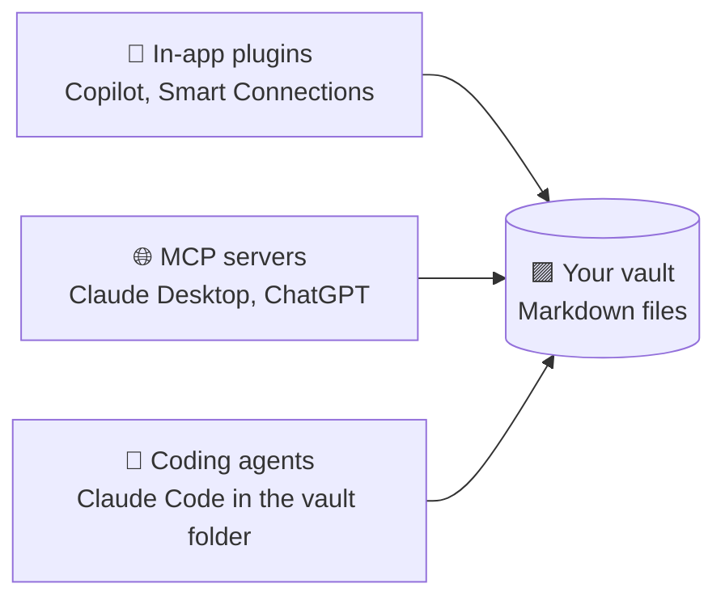

# 56 · Obsidian + AI: Your Local-First Thinking Machine 🟪🧠

> ⏱️ 6 min read · 🎯 Beginner → intermediate · 🧰 Needs: Obsidian (free), optionally Claude Code or a local model

**Obsidian stores your notes as plain Markdown files in a folder on your computer.** That simple fact makes it *perfect* for
AI: every tool, script, agent and model can read and write your notes, and you stay in full control. This chapter shows how
to turn a vault into an AI-powered thinking partner, privately if you want.

<details class="eli5" open>
<summary>🧸 ELI5: This chapter in 30 seconds</summary>

Obsidian keeps your notes as simple text files in a folder, like pages in a real notebook you own. Because they're just
files, any AI helper can read them: an AI inside Obsidian, Claude through a connector, or a coding agent that tidies your
whole notebook. You can even use an AI that lives only on your computer, so your diary never leaves home.

</details>

<!-- in-this-chapter -->

## 💜 Why Obsidian + AI is special

<details class="eli5">
<summary>🧸 ELI5</summary>

Your notes belong to you, they work with any AI, they're connected like a spider web, and you can undo any change the AI
makes.

</details>

- **You own the files.** No lock-in, and no export needed.
- **Any AI can use them:** Claude Code, Cursor, MCP servers, local models, scripts.
- **Links = a knowledge graph.** `[[wikilinks]]` create connections that AI can follow and extend.
- **Git-friendly:** version your brain like code, and undo AI edits you don't like!
- **Private by default:** nothing leaves your machine unless you choose.

## 🔌 Three ways to add AI

<details class="eli5">
<summary>🧸 ELI5</summary>

You can add AI *inside* Obsidian (plugins), let chat apps visit your notes (MCP), or let a coding agent work directly in
your notes folder.

</details>



### 1. In-app plugins (community plugins)

| Plugin | What it does |
|---|---|
| **Copilot for Obsidian** | Chat with your vault using many models (cloud or local via Ollama/LM Studio) |
| **Smart Connections** | Semantic search and "related notes" using embeddings |
| **Text Generator** | Generate or transform text with templates |
| **Local GPT / Ollama plugins** | Private AI running entirely on your machine |
| **Templater** (+ AI scripts) | Scripted templates that can call models |
| **Dataview** | Query your notes like a database, and AI can write the queries for you |

(Community plugins change fast, so check recent activity and reviews before installing.)

### 2. MCP: let Claude or ChatGPT into your vault

- A **Filesystem MCP server** pointed at your vault folder (simple and effective), or
- an **Obsidian MCP server** using the *Local REST API* community plugin (search, active file and more).

```json
"obsidian-vault": {
  "command": "npx",
  "args": ["-y", "@modelcontextprotocol/server-filesystem", "/Users/you/Obsidian/MyVault"]
}
```

### 3. Claude Code (or any coding agent) *in* the vault 🤯

This is the power move. `cd` into your vault and run `claude`. The agent can read, search, create and reorganize notes with
full file-system skills (grep, bulk edits, scripts) ([Claude Code Masterclass](../part-7-building-with-ai/62-claude-code-masterclass.md)).

## 🗂️ Set up your vault for AI

<details class="eli5">
<summary>🧸 ELI5</summary>

Give your notebook clear folders and leave a note at the front that explains your system to AI helpers, like a map of your
notebook.

</details>

A simple, AI-friendly structure:

```text
MyVault/
├── CLAUDE.md          ← instructions for AI visitors (see below)
├── Inbox/             ← quick captures land here
├── Daily/             ← YYYY-MM-DD.md daily notes
├── Projects/          ← one note (or folder) per project
├── Notes/             ← evergreen ideas, one idea per note
├── People/            ← one note per person
├── Templates/         ← daily note, meeting, project templates
├── AI/                ← AI-generated notes, kept separate from your writing
└── Archive/
```

Add a `CLAUDE.md` (or `AGENTS.md`) at the root:

```markdown
# Vault guide for AI
- Daily notes: /Daily/YYYY-MM-DD.md. Projects: /Projects. Evergreen notes: /Notes.
- Use [[wikilinks]] for connections. Tags: #idea #todo #person.
- Never delete notes. Move to /Archive instead.
- Put AI-generated notes in /AI unless I say otherwise.
- Keep my voice. Don't rewrite my writing unless I ask.
```

## 🎮 15 things to ask an AI with vault access

<details class="eli5">
<summary>🧸 ELI5</summary>

Here are fifteen fun questions and jobs to give an AI that can read your notebook, from monthly reflections to finding
notes that should be friends.

</details>

1. *"Read my daily notes from last month and write a monthly reflection: themes, wins, recurring worries."*
2. *"Find notes that should be linked but aren't, and suggest 20 new [[links]]. Show them before applying."*
3. *"Create a Map of Content (MOC) note for everything about 'productivity'."*
4. *"Turn my scattered #idea tags into a ranked list with next steps."*
5. *"What have I learned about sleep across all my notes? Cite the notes."*
6. *"Convert my book highlights folder into evergreen notes, one idea per note, linked to the source."*
7. *"Find all unchecked `- [ ]` tasks older than 2 weeks and make a triage list."*
8. *"Make a people index: everyone I mention, with the last time and context."*
9. *"Write a Dataview query that lists projects with no updates in 30 days."*
10. *"Draft a blog post from my notes on X in my voice (see /Writing samples)."*
11. *"Detect duplicate or near-duplicate notes and propose merges."*
12. *"Create flashcards from /Notes/Learning in spaced-repetition format."*
13. *"Summarize this week's meeting notes into decisions and action items."*
14. *"Which of my notes contradict each other?"*
15. *"Suggest 5 questions I should be thinking about, based on what I've been writing."*

## 🔁 Workflows that stick

<details class="eli5">
<summary>🧸 ELI5</summary>

A few daily habits make the whole system work: an AI-assisted morning note, an easy way to capture ideas, and a Friday
tidy-up.

</details>

### The AI-assisted daily note
- **Morning:** *"Create today's daily note with my calendar (via connector), my top 3 priorities from yesterday's unfinished
  tasks, and a thought prompt."*
- **Evening:** *"Summarize what I wrote today, extract tasks, and link to relevant project notes."*

### The capture pipeline
Voice memo → transcription (Whisper, Wispr Flow) → AI cleanup → new note in `/Inbox` via an n8n workflow or an Apple
Shortcut that writes a Markdown file, synced with Obsidian Sync, iCloud, Syncthing or Git
([Phone & Desktop Automation](../part-5-automation/50-phone-and-desktop-automation.md)).

### The weekly review
Use a **skill** or a saved prompt: wins, open loops, lessons, next week's top 3
([example skill](../../examples/prompts-for-agents/skills/weekly-review/SKILL.md)).

## 🔒 Private mode: fully local AI

<details class="eli5">
<summary>🧸 ELI5</summary>

For really personal notes (like a diary), use an AI that runs only on your computer, so nothing ever goes to the internet.

</details>

Use **Ollama** or **LM Studio** with the Copilot plugin (or Smart Connections with local embeddings) to keep journals, health
notes and private thoughts 100% on-device. Small local models are great at summarizing, tagging and linking. Details in
[Local & Open Models](../part-9-local-ai/78-local-and-open-models.md).

## 🔄 Syncing across devices

<details class="eli5">
<summary>🧸 ELI5</summary>

To use your notebook on your phone and computer, you need a way to copy it between them. There are paid, free and nerdy options.

</details>

| Option | Notes |
|---|---|
| **Obsidian Sync** (paid) | End-to-end encrypted, easiest, supports version history |
| **iCloud Drive** | Easy on Apple devices |
| **Syncthing** (free) | Peer-to-peer, no cloud |
| **Git** (Obsidian Git plugin) | Version history + sync, perfect with AI edits |

## ✅ Your safety net

<details class="eli5">
<summary>🧸 ELI5</summary>

Before letting AI rearrange your notebook, make a save point (Git) so you can always go back if you don't like the changes.

</details>

- Put the vault in **Git** (Obsidian Git plugin), so every AI change is reviewable and reversible.
- Tell agents to **propose before bulk edits**, and review the diff.
- Keep a separate `/AI` folder so your own writing stays distinct.
- Back up regularly (sync ≠ backup!).

## 🎯 Key takeaways

- Obsidian's **plain Markdown files** make it the most AI-friendly notes app there is.
- Add AI via **plugins**, **MCP servers**, or **Claude Code in the vault folder** (the power move).
- A clear **folder structure** + a **`CLAUDE.md`** makes every AI visitor smarter.
- Go **fully local** for private notes, and keep a **Git safety net** for AI edits.

## 🧠 Check yourself

<details class="quiz">
<summary>❓ 1. What makes Obsidian especially easy for AI tools to work with?</summary>

Notes are **plain Markdown files in a local folder**, so any tool can read and write them.

</details>

<details class="quiz">
<summary>❓ 2. How do you make AI bulk edits reversible?</summary>

Keep the vault in **Git** (review the diff, revert if needed), and ask the AI to **propose before applying**.

</details>

<details class="quiz">
<summary>❓ 3. Which setup keeps a journal completely private?</summary>

A **local model** (Ollama or LM Studio) via an Obsidian plugin, with no cloud AI involved.

</details>

> [!TIP]
> **🎮 Try this**
> Initialize Git in your vault, add the `CLAUDE.md` above, open Claude Code in the folder, and ask for idea #1 (the monthly
> reflection). Reading an AI's synthesis of your own month is surprisingly moving. 🟪

---

**Next:** [57 · Email & Calendar Superpowers →](57-email-and-calendar.md)
