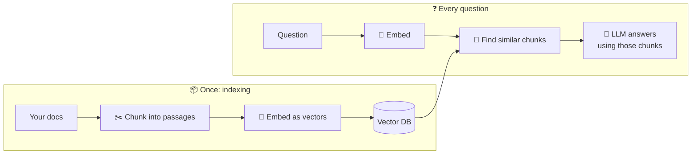

# 23 · RAG, Memory & Knowledge: Make AI Know *Your* Stuff 🧠📚

AI knows the internet, but it doesn't know your notes, your company docs, or what you told it last
Tuesday. This chapter covers the ways to fix that, from zero-effort to build-your-own.

---

## The ladder (easiest → most powerful)

| Rung | How | Best for |
|---|---|---|
| 1. **Paste it in** | Drop files into the chat | One-off questions. Modern context windows are huge! |
| 2. **Projects** | Claude/ChatGPT Projects, Gemini Gems, Perplexity Spaces | Ongoing topics with a fixed set of docs |
| 3. **NotebookLM** | Upload up to hundreds of sources and get grounded answers with citations | Studying, research, "chat with this pile of PDFs" |
| 4. **Connectors / MCP** | AI searches your Drive, Notion, or Slack live | Your *living* knowledge that changes daily |
| 5. **Memory** | Built-in memory, `CLAUDE.md`, the Memory MCP server | Preferences and facts about you |
| 6. **Build your own RAG** | Embeddings + vector DB + retrieval | Big private corpora, custom apps, full control |

Most people should live on rungs 2–5. Rung 6 is a fantastic *learning* project.

## 🎧 NotebookLM deserves its own shout-out
Google's NotebookLM is one of the most delightful AI tools out there:
- **Grounded answers:** everything cites your sources, which means far fewer hallucinations.
- **Audio Overviews:** turns your sources into a **podcast** with two AI hosts. 🎙️ It's wild.
- **Video overviews, mind maps, study guides, flashcards, and quizzes** from your material.
- **🎮 Try:** Upload your résumé, 3 job descriptions, and the company's blog. Ask for an audio
  overview of "how this candidate fits these roles." Listen on your commute.

## 🔍 How RAG actually works (the 60-second version)

**RAG = Retrieval-Augmented Generation.** Instead of stuffing *everything* into the prompt, you fetch
only the relevant bits.

- **Embeddings** turn text into lists of numbers where *similar meaning = nearby numbers*. That's
  why "car trouble" can find a note about "my engine is making a noise."
- **Chunking** matters a lot. Too big and results get noisy. Too small and you lose context.
- **Hybrid search** (keywords + vectors) and **reranking** are the usual upgrades when results feel off.

## Vector databases & tools
| Tool | Why pick it |
|---|---|
| **Chroma** | Easiest to start with, runs in-process in Python |
| **pgvector** (Postgres) | Keep vectors next to your normal data. Supabase and Neon have it built in |
| **LanceDB** | Embedded, fast, great for local and multimodal |
| **Qdrant, Weaviate, Milvus** | Open-source, scalable, feature-rich |
| **Pinecone, Turbopuffer** | Managed, serverless, zero ops |
| **SQLite + sqlite-vec** | Tiny, local, portable |

**Frameworks:** LlamaIndex (RAG specialist), LangChain, Haystack, or n8n's vector store nodes (no code!).

## 🧠 Memory: making AI remember *you*
- **Built-in memory** in Claude, ChatGPT, and Gemini learns preferences across chats. You can view and edit it.
- **Memory files:** `CLAUDE.md` / `AGENTS.md` for coding agents ([example](../../examples/prompts-for-agents/CLAUDE.md)).
- **Memory MCP servers:** the official **Memory** server (knowledge graph), **Basic Memory** (Markdown
  files), and **mem0/OpenMemory**. They give *any* MCP app a shared memory.

> 💡 **Hot take:** Plain Markdown files make excellent AI memory. They're readable, editable, searchable,
> and version-controllable. An Obsidian vault plus a Filesystem MCP server gives you a "second brain" that both you and your AI
> can use.

## Fun projects 🎮
1. **Chat with your life:** export years of notes and journals and ask *"What was I worried about in 2023 that turned out fine?"*
2. **Personal docs bot:** RAG over your appliance manuals. *"How do I descale the coffee machine?"*
3. **Course companion:** NotebookLM with all your class materials, then generate a practice exam.
4. **n8n RAG pipeline:** Google Drive folder → auto-embed new files → a chatbot you can reach from Slack.

---

### 🚀 Try this next
Make a NotebookLM notebook from 5 sources about something you're curious about, and generate the
Audio Overview. It's the fastest "wow" in this whole guide. 🎧

**Next:** [24 · Build a RAG System, Step by Step →](24-build-a-rag-system.md)
