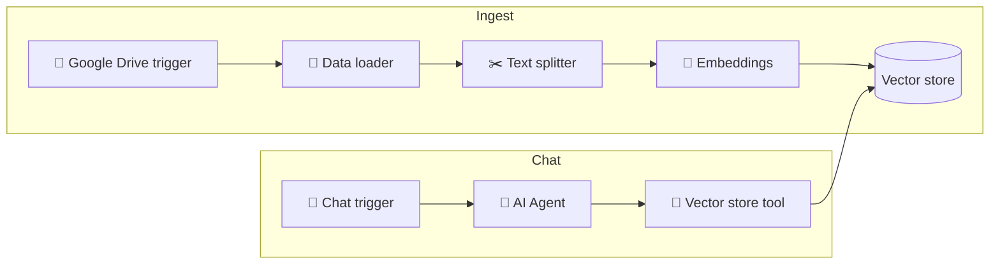

# 24 · Build a RAG System, Step by Step 🏗️📚

In [Ch. 23](23-rag-memory-and-knowledge.md) you learned *what* RAG is. Now you'll **build one**, first from
scratch to understand every piece, then with real embeddings and a vector database, and finally with
zero code in n8n. By the end, you'll be able to make AI answer questions about *any* collection of documents.

---

## Stage 1: RAG from scratch (no API key needed for search!)

The [rag-from-scratch kit](../../examples/rag-from-scratch/) is a working RAG system in ~120 lines of plain Python.

```bash
cd examples/rag-from-scratch
python rag.py --search "my basil keeps dying when it's cold"
#   🔎 Top 1 of 10 chunks: garden.md › Herbs
python rag.py "my basil keeps dying when it's cold, what do I do?"   # with ANTHROPIC_API_KEY set
```

### The four moves

**1. Chunk:** split documents into passages that each make sense on their own.
```python
for section in re.split(r"\n(?=#{1,3} )", text):   # split at Markdown headings
```

**2. Vectorize:** turn each chunk into numbers. The kit uses **TF-IDF**: each word gets a weight based on how often it
appears in this chunk versus how rare it is overall.

**3. Search:** vectorize the question the same way and find the chunks with the highest **cosine similarity** (the "angle"
between vectors: same direction = similar).

**4. Answer:** send the top chunks to the model with strict instructions:
```text
Answer using ONLY the provided sources. Cite them like [1]. If the sources don't contain the answer, say so.
```

That last instruction is the magic. **Grounding + permission to say "I don't know" = far fewer hallucinations.**

## Stage 2: Real embeddings 🧬

TF-IDF matches **words**. Embeddings match **meaning**. "espresso machine error" finds the "coffee maker E4 code" note.

| Embedding option | Notes |
|---|---|
| **Voyage AI** | High-quality embeddings, recommended by Anthropic for Claude-based RAG |
| **OpenAI / Cohere / Google** | Popular hosted options |
| **Local**: `sentence-transformers`, Ollama embedding models (e.g. `nomic-embed-text`) | Free and private, and runs on a laptop |

### With Chroma (a vector DB that runs in-process)
```python
import chromadb

client = chromadb.PersistentClient(path="./chroma")
notes = client.get_or_create_collection("notes")   # uses a default local embedding model

notes.add(ids=[...], documents=[chunk_texts...], metadatas=[{"source": ...}, ...])

results = notes.query(query_texts=["espresso machine error"], n_results=3)
print(results["documents"][0])
```

Then pass `results["documents"]` into the same answering prompt as Stage 1. That's a production-shaped RAG system in ~20 lines.

💡 **Vibe-code it:** *"Upgrade examples/rag-from-scratch to use Chroma with local embeddings, keeping the TF-IDF
version as a fallback. Add a test that 'espresso machine error' finds the Error codes chunk."*

## Stage 3: No-code RAG in n8n ⚙️



1. **Ingest workflow:** Drive trigger (new or updated file) → Default Data Loader → Recursive Character Text Splitter → Embeddings node → Supabase/Qdrant/Pinecone Vector Store (insert).
2. **Chat workflow:** Chat Trigger → AI Agent + Vector Store tool (same store, retrieve mode) → answer.
3. Share the chat URL, or connect it to Slack or Telegram.

## Making RAG *good* ✨ (the tuning checklist)

| Problem | Fix |
|---|---|
| Answers miss obvious info | Retrieve more chunks (k), or use smaller chunks with some **overlap** |
| Right doc, wrong section | Chunk at structure (headings, paragraphs), and include the title/heading in each chunk |
| Exact terms (SKUs, names, codes) not found | **Hybrid search:** combine keyword (BM25) + vector results |
| Relevant but low-ranked results | Add a **reranker** (e.g. Cohere Rerank, Voyage rerank) on the top 20 |
| Model ignores sources or makes things up | Stricter prompt, require citations, and lower the effort for simple Q&A |
| Stale answers | Re-ingest on file changes (triggers), and store `updated_at` metadata |
| Questions need the *whole* doc | Don't chunk. Long-context models can take entire documents, and prompt caching makes repeat questions cheap |
| Multi-hop questions ("compare X and Y") | Let an **agent** do several searches (agentic RAG) |

> [!TIP]
> **Sometimes you don't need RAG at all**
> Modern context windows hold hundreds of pages. For a few documents, just **put them all in the prompt** (with caching).
> Use RAG when the corpus is big, changing, or needs fine-grained citations.

## Evaluate it (seriously, 10 minutes) 🧪

Write 15 real questions with known answers from your docs. Run them and score:
- ✅ **Retrieval hit:** was the right chunk in the top k? (The kit's `test_rag.py` does exactly this!)
- ✅ **Answer correct?**
- ✅ **Cited the right source?**
- ✅ **Said "I don't know"** for questions with no answer in the docs?

Change one thing at a time (chunk size, k, embedding model) and re-run. More in [Ch. 38](../part-10-mastery/38-evaluating-ai.md).

## Project ideas 🎮
1. 🏠 **Home manual bot:** every appliance manual PDF → "why is the dishwasher beeping?"
2. 🎓 **Course companion:** lecture notes + slides → study Q&A with citations
3. 🏢 **Team wiki bot** in Slack: Notion/Confluence export → answers with links
4. 🧑‍⚕️ **Personal health log** Q&A (local models only! [Ch. 26](../part-7-local-ai/26-local-and-open-models.md))
5. 📜 **Family history archive:** scanned letters (OCR) → "what did Grandpa write about the farm?"

---

### 🎮 Try this
Point the kit at your own notes: `python rag.py --notes ~/Documents/notes --search "something you wrote about"`.
Then try a question using **different words** than your notes use, and see where TF-IDF fails. You've just discovered
why embeddings exist. 🧬

---

**Next:** [25 · Personal Knowledge Management with AI →](25-personal-knowledge-management.md)
