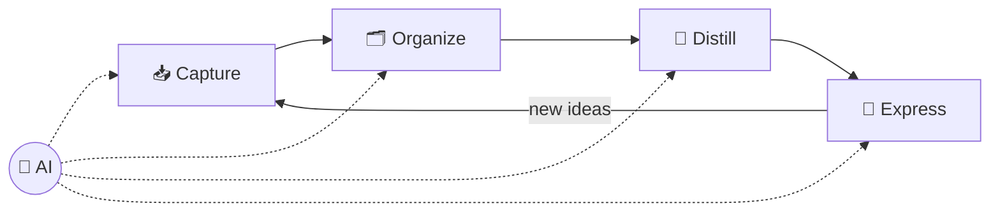

# 25 · Personal Knowledge Management with AI 🧠🗃️

You consume a firehose of information: articles, podcasts, meetings, books, ideas in the shower. Most
of it evaporates. **Personal Knowledge Management (PKM)** is the practice of capturing, organizing, and
*using* what you learn. AI makes each step 10× easier, and finally makes your notes **talk back**.

---

## The AI-powered knowledge loop

| Stage | Old way | AI way |
|---|---|---|
| 📥 **Capture** | Copy-paste, typing notes | Voice dictation, auto-transcripts, clip + auto-summary, screenshots → text |
| 🗂️ **Organize** | Manual folders and tags | AI triage, auto-tagging, suggested links, semantic search (no perfect filing needed!) |
| 💎 **Distill** | Highlight, re-read, summarize | AI summaries, key takeaways, flashcards, "what's new vs. what I already knew" |
| 🚀 **Express** | Stare at a blank page | Ask your notes questions, draft from your own ideas, find connections |

**The big shift:** with semantic search and AI synthesis, **retrieval matters more than filing**. You don't need a perfect
system. You need your stuff in *one searchable place* that AI can read.

## Choose your home base 🏡

| Home base | Best for | AI access |
|---|---|---|
| **Obsidian** ([Ch. 16](../part-4-ai-in-your-apps/16-obsidian-and-ai.md)) | Ownership, privacy, tinkerers | Plugins, MCP filesystem, Claude Code, local models |
| **Notion** ([Ch. 14](../part-4-ai-in-your-apps/14-notion-ai-deep-dive.md)) | Databases, teams, polish | Notion AI + agents, official MCP |
| **Google Drive/Docs** | Already living there | Gemini, NotebookLM, connectors |
| **Apple Notes** / simple apps | Minimalists | Export or sync to one of the above for AI |
| **Mem, Reflect, Capacities, Tana** | AI-native note apps | Built-in AI features |

## Capture pipelines that run themselves 📥

| Source | Pipeline |
|---|---|
| 🎙️ Voice ideas | iOS Shortcut/Action Button → webhook → AI cleanup → Inbox ([Ch. 12](../part-3-automation/12-webhooks-apis-json.md)) |
| 📰 Articles | Readwise Reader / web clipper → AI summary property → Resources |
| 📺 YouTube & podcasts | Transcript → AI key-ideas note with timestamps |
| 💬 Meetings | AI meeting notes (Granola, Notion, Meet, Teams) → action items + decisions |
| 📚 Books | Kindle/Readwise highlights → AI turns them into evergreen notes |
| 🤖 AI chats | *"Save the key insights from this conversation to my notes"* (via connector/MCP) |
| 📸 Whiteboards/handwriting | Photo → vision model → Markdown |

## Distilling with AI 💎: prompts that work

- *"Summarize this in 3 bullets, then give me the ONE idea most worth remembering."*
- *"What in this article contradicts or extends what I already have in my notes on [topic]?"*
- *"Turn these highlights into 5 atomic evergreen notes, one idea each, titled as claims."*
- *"Make 10 spaced-repetition flashcards from this chapter (question → answer)."*
- *"Explain this like I'm new to it, then like I'm an expert."*

## Asking your notes questions 🗣️

Once AI can read your knowledge base (MCP, NotebookLM, Notion AI, [RAG](24-build-a-rag-system.md)):

- *"What have I learned about negotiation across all my notes? Cite them."*
- *"Which ideas from my reading this year connect in surprising ways?"*
- *"I'm writing about remote work. Pull every relevant note and suggest an outline."*
- *"What did I believe about X a year ago versus now?"*
- *"What topics do I keep saving but never act on?"* 😅

## Review rituals (with AI doing the heavy lifting) 🔁

| Ritual | AI assist |
|---|---|
| **Daily** (5 min) | *"Summarize today's captures and pull out tasks"* |
| **Weekly** (20 min) | Weekly review agent/skill: wins, open loops, top 3 next week ([example skill](../../examples/prompts-for-agents/skills/weekly-review/SKILL.md)) |
| **Monthly** (30 min) | *"Monthly reflection: themes, growth, recurring worries, what to drop"* |
| **Yearly** | *"Write my year in review from my notes: highlights, lessons, and people who mattered"* ✨ |

## Principles for a PKM that lasts 🌳
1. **Capture friction → zero.** If saving takes more than 5 seconds, you won't do it.
2. **One inbox.** Everything lands in one place first, and AI helps sort it later.
3. **Write in your own words sometimes.** AI summaries are great, but your own thinking is what compounds.
4. **Link generously.** Connections make your knowledge graph useful, and AI can suggest them.
5. **Use it or lose it.** The goal is *output*: decisions, writing, projects. It's not a pretty archive.
6. **Own your data.** Prefer exportable formats (Markdown!).

---

### 🎮 Try this
Set up **one** automatic capture pipeline this week (voice → inbox is the most life-changing). After 7 days, ask AI:
*"What patterns do you see in everything I captured this week?"* Prepare to be surprised by your own brain. 🧠

---

**Next:** [26 · Local & Open Models →](../part-7-local-ai/26-local-and-open-models.md)
