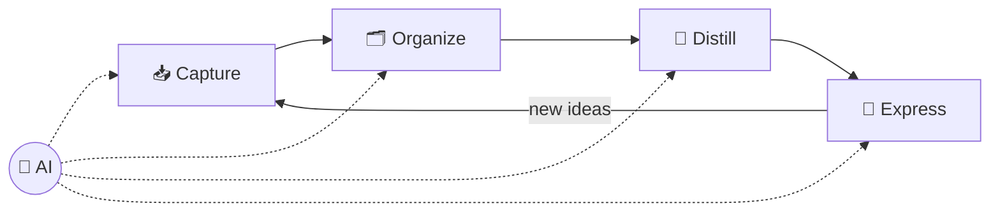

# 46 · Personal Knowledge Management with AI: A Second Brain That Talks Back 🧠🗃️

> ⏱️ 8 min read · 🎯 Everyone · 🧰 Needs: a notes app (Obsidian, Notion, Google Docs…), optionally an automation tool for capture

**You consume a firehose of information: articles, podcasts, meetings, books, ideas in the shower. Most of it evaporates.**
Personal Knowledge Management (PKM) is the practice of capturing, organizing and *using* what you learn. AI makes every step
dramatically easier, and finally makes your notes **talk back**. This chapter gives you the loop, the tools, self-running
capture pipelines, prompts for distilling ideas, review rituals, and a 30-day plan to build a second brain that sticks. 🌱

🧸 ELI5: This chapter in 30 seconds

Your brain is great at *having* ideas but bad at *keeping* them. A **second brain** is a special place (like a notebook app)
where you save the cool things you learn. With AI, you can save stuff super quickly (just talk!), the AI tidies it up for
you, and later you can ask your notes questions like "what have I learned about sleep?" and get an answer from your own
past self. 🧠➡️📓➡️💡

<!-- in-this-chapter -->

## 🔁 The AI-powered knowledge loop

🧸 ELI5

Four steps, round and round: save things, sort them, squeeze out the best bits, and use them to make something. AI helps with
every step.

| Stage | Old way | AI way |
|---|---|---|
| 📥 **Capture** | Copy-paste, typing notes | Voice dictation, auto-transcripts, clip + auto-summary, screenshots → text |
| 🗂️ **Organize** | Manual folders and tags | AI triage, auto-tagging, suggested links, semantic search (no perfect filing needed!) |
| 💎 **Distill** | Highlight, re-read, summarize | AI summaries, key takeaways, flashcards, "what's new vs. what I already knew" |
| 🚀 **Express** | Stare at a blank page | Ask your notes questions, draft from your own ideas, find connections |

> [!TIP]
> **💡 The big shift: retrieval beats filing**
> With semantic search and AI synthesis, you don't need a perfect filing system. You need your stuff in **one searchable
> place that AI can read**. Messy but searchable wins over tidy but forgotten.

## 🏡 Choose your home base

🧸 ELI5

Pick one main place to keep your notes. Each app is good at different things. The best one is the one you'll actually use.

| Home base | Best for | AI access |
|---|---|---|
| **Obsidian** ([Obsidian & AI](../part-4-ai-in-your-apps/25-obsidian-and-ai.md)) | Ownership, privacy, tinkerers | Plugins, MCP filesystem, Claude Code, local models |
| **Notion** ([Notion AI Deep Dive](../part-4-ai-in-your-apps/23-notion-ai-deep-dive.md)) | Databases, teams, polish | Notion Agent + Custom Agents, official MCP |
| **Google Drive / Docs** | Already living there | Gemini, Gemini Notebook (NotebookLM), connectors |
| **Apple Notes** / simple apps | Minimalists | Apple Intelligence, or export to one of the above for AI |
| **Capacities, Tana, Reflect, Mem** | AI-native note apps | Built-in AI features |
| **Plain Markdown folder** | Maximum portability | Any AI with file access |

**The quick decision:** own your files and love tinkering → **Obsidian**. Want databases and a team → **Notion**. Live in Google
→ **Docs + Gemini Notebook**. Can't decide → start with whatever's already on your phone, and move later (Markdown exports
make that easy).

## 📥 Capture pipelines that run themselves

🧸 ELI5

Make saving so easy it takes two seconds: talk into your phone, tap "share," forward an email. Little robots do the rest and
put it in your notes inbox.

| Source | Pipeline |
|---|---|
| 🎙️ **Voice ideas** | Phone shortcut or Action Button → webhook → AI cleanup → Inbox ([Phone & Desktop Automation](../part-3-automation/19-phone-and-desktop-automation.md)) |
| 📰 **Articles** | Readwise Reader or a web clipper → AI summary property → Resources |
| 📺 **YouTube & podcasts** | Transcript → AI key-ideas note with timestamps |
| 💬 **Meetings** | AI meeting notes (Granola, Notion, Meet, Teams, Zoom) → action items + decisions |
| 📚 **Books** | Kindle or Readwise highlights → AI turns them into evergreen notes |
| 🤖 **AI chats** | *"Save the key insights from this conversation to my notes"* (via connector or MCP) |
| 📸 **Whiteboards & handwriting** | Photo → vision model → Markdown |
| 📧 **Emails worth keeping** | Forward to a capture address → AI summary → Inbox |

> [!TIP]
> **🎮 The most life-changing pipeline**
> **Voice → inbox.** Ideas show up while walking, driving and showering. A one-tap voice capture that lands as a cleaned-up
> note means you never lose one again. The [idea-inbox workflow](../../examples/n8n-workflows/idea-inbox-to-notion.json) is a
> ready-made starting point.

## 🗂️ Organizing (without the busywork)

🧸 ELI5

Instead of spending hours sorting, keep it simple: one inbox, a few big folders, and let AI suggest tags and links.

A simple structure beats a clever one. Two popular frameworks:

| Framework | Folders | AI's job |
|---|---|---|
| **PARA** | Projects, Areas, Resources, Archive | Triage the inbox into the right bucket |
| **Zettelkasten-lite** | Atomic notes, one idea each, heavily linked | Split long notes into ideas, suggest links |

**Let AI do the sorting:**

- *"Go through my Inbox folder. For each note, suggest a PARA folder, 3 tags and 2 related notes. Show me the plan before
  moving anything."*
- *"Find notes that are about the same topic and suggest which to merge."*
- *"Suggest links between my notes on cooking and my notes on chemistry."* 🧪🍳

Embeddings can do this at scale: they find related notes even when they use different words
([Embeddings & Vector Databases](42-embeddings-and-vector-databases.md#-beyond-rag-10-things-embeddings-can-do)).

## 💎 Distilling with AI: prompts that work

🧸 ELI5

Distilling means squeezing a long thing into its juiciest bits. AI is great at squeezing, but it's even better when you ask
it to connect new ideas to things you already know.

| Goal | Prompt |
|---|---|
| **The one idea** | *"Summarize this in 3 bullets, then give me the ONE idea most worth remembering."* |
| **What's new to me** | *"What in this article contradicts or extends what I already have in my notes on [topic]?"* |
| **Atomic notes** | *"Turn these highlights into 5 atomic evergreen notes, one idea each, titled as claims."* |
| **Flashcards** | *"Make 10 spaced-repetition flashcards from this chapter (question → answer)."* |
| **Two levels** | *"Explain this like I'm new to it, then like I'm an expert."* |
| **Action** | *"What's one thing I could try this week because of this?"* |

> [!NOTE]
> **📌 Write in your own words sometimes**
> AI summaries are wonderful for speed, but *your* thinking is what compounds. A one-line "why this matters to me" note beats
> a perfect AI summary you never think about again.

## 🗣️ Asking your notes questions

🧸 ELI5

Once the AI can read your notes, you can ask them anything, like asking your past self for advice.

Once AI can read your knowledge base (MCP, Gemini Notebook, Notion AI, [RAG](43-build-a-rag-system.md)):

- *"What have I learned about negotiation across all my notes? Cite them."*
- *"Which ideas from my reading this year connect in surprising ways?"*
- *"I'm writing about remote work. Pull every relevant note and suggest an outline."*
- *"What did I believe about X a year ago versus now?"*
- *"What topics do I keep saving but never act on?"* 😅
- *"Based on my journal, when am I happiest? What patterns do you notice?"*

## 🔁 Review rituals (with AI doing the heavy lifting)

🧸 ELI5

Every day, week, month and year, spend a few minutes looking back with AI's help. That's how saved stuff turns into wisdom.

| Ritual | Time | AI assist |
|---|---|---|
| **Daily** | 5 min | *"Summarize today's captures and pull out tasks."* |
| **Weekly** | 20 min | A weekly review agent or skill: wins, open loops, top 3 next week ([example skill](../../examples/prompts-for-agents/skills/weekly-review/SKILL.md)) |
| **Monthly** | 30 min | *"Monthly reflection: themes, growth, recurring worries, what to drop."* |
| **Yearly** | 1 hour | *"Write my year in review from my notes: highlights, lessons, and people who mattered."* ✨ |

## 🛠️ Three second-brain setups

🧸 ELI5

Three ready-made setups: one that's simple, one that's powerful, and one that's totally private.

=== "🌱 Simple (1 hour)"

    - **Home:** Notion or Google Docs
    - **Capture:** phone share sheet + web clipper
    - **AI:** built-in Notion AI or Gemini, plus a Gemini Notebook per big topic
    - **Review:** a weekly 20-minute prompt

=== "⚡ Power user (a weekend)"

    - **Home:** Obsidian vault in Git
    - **Capture:** voice → n8n → Inbox, Readwise highlights, meeting notes
    - **AI:** Claude Code or Claude Desktop with a filesystem MCP server on the vault
    - **Organize:** an AI triage skill + auto-linking suggestions
    - **Review:** a weekly-review skill that writes the review note for you

=== "🔒 Private (a weekend)"

    - **Home:** Obsidian vault, local only
    - **Capture:** local transcription (Whisper) of voice memos
    - **AI:** Ollama + a local model, local embeddings for search ([Local & Open Models](../part-7-local-ai/47-local-and-open-models.md))
    - **Nothing leaves your machine** 🔐

The full build is in [Build-Along: Your Second Brain](../part-11-build-alongs/83-build-along-second-brain.md).

## 🗓️ A 30-day second-brain plan

🧸 ELI5

Build your second brain in small steps over a month, so it becomes a habit instead of a chore.

| Week | Mission |
|---|---|
| **1 · Capture** | Pick your home base. Set up one-tap voice capture and a web clipper. Capture everything |
| **2 · Organize** | Create PARA folders. Let AI triage your inbox daily. Delete ruthlessly |
| **3 · Distill** | Turn your 10 best captures into atomic notes. Make flashcards for one topic |
| **4 · Express** | Connect AI to your notes. Ask 10 questions. Write one thing (a post, a plan, a letter) from your notes 🎉 |

## 🌳 Principles for a PKM that lasts

🧸 ELI5

Make saving easy, keep one inbox, write some things yourself, link ideas together, actually use your notes, and keep them in a
format you own.

1. **Capture friction → zero.** If saving takes more than 5 seconds, you won't do it.
2. **One inbox.** Everything lands in one place first, and AI helps sort it later.
3. **Write in your own words sometimes.** Your own thinking is what compounds.
4. **Link generously.** Connections make your knowledge graph useful, and AI can suggest them.
5. **Use it or lose it.** The goal is *output*: decisions, writing, projects. Not a pretty archive.
6. **Own your data.** Prefer exportable formats (Markdown!).
7. **Protect the private stuff.** Journals and health notes deserve local AI or careful settings ([Privacy & Your Data](../part-10-mastery/73-privacy-and-your-data.md)).

## 🎯 Key takeaways

- The loop: **capture → organize → distill → express**, with AI at every step.
- **Retrieval beats filing:** one searchable place that AI can read matters more than perfect folders.
- **Automated capture** (especially voice → inbox) is the biggest single upgrade.
- **Ask your notes questions** and run **review rituals** to turn saved stuff into wisdom.
- Keep it **simple, owned and used**.

## 🧠 Check yourself

❓ 1. Why don't you need a perfect folder system anymore?

Because **semantic search and AI synthesis** can find and connect notes by meaning, so **retrieval matters more than filing**.

❓ 2. What's the single capture pipeline most likely to change your life?

**Voice → inbox**: one-tap voice capture that lands as a cleaned-up note.

❓ 3. Why write some notes in your own words when AI summarizes so well?

Your own thinking is what **compounds**: it builds understanding and connects ideas to *your* life.

> [!TIP]
> **🎮 Try this**
> Set up **one** automatic capture pipeline this week (voice → inbox is the most life-changing). After 7 days, ask AI:
> *"What patterns do you see in everything I captured this week?"* Prepare to be surprised by your own brain. 🧠

---

**Next:** [47 · Local & Open Models →](../part-7-local-ai/47-local-and-open-models.md)
