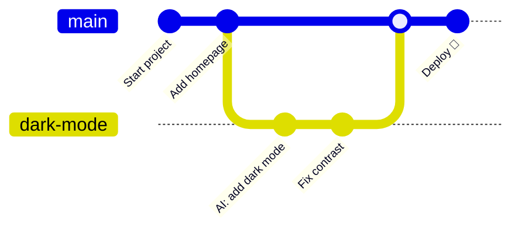
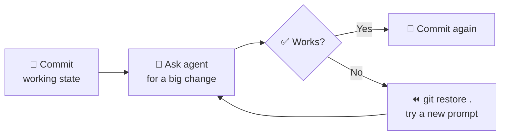

# 61 · Git & GitHub for AI Builders 🌳🐙

> ⏱️ 10 min read · 🎯 Everyone who builds with AI (no coding background needed) · 🧰 Needs: a free GitHub account, Git installed

**Git is the undo button that makes AI building fearless.** When a coding agent rewrites twenty files and something breaks,
Git lets you rewind in one command. GitHub adds a home in the cloud for your projects, free websites, automation robots
(Actions), and a place where AI agents can open pull requests for you to review. Learn these ten ideas and you'll build
with AI like a pro. 🦸

<details class="eli5" open>
<summary>🧸 ELI5: This chapter in 30 seconds</summary>

Imagine a video game where you can **save your progress** any time. If you fall into lava, you just load your last save.
**Git** is that save system for your projects. **GitHub** is a cloud locker where your saves live, where friends (and AI
helpers) can suggest changes, and where little robots can check your work and even turn it into a website.

</details>

<!-- in-this-chapter -->

## 🤔 Why AI builders need Git

<details class="eli5">
<summary>🧸 ELI5</summary>

AI helpers work fast and sometimes break things. With save points, you can always go back to "the last time it worked,"
so trying wild ideas becomes totally safe.

</details>

Coding agents make **big, fast changes**. That's their superpower and their risk. Git turns that risk into a playground:

| Without Git 😰 | With Git 😎 |
|---|---|
| "It worked an hour ago… what changed?" | `git diff` shows exactly what changed |
| One bad AI edit ruins your afternoon | `git restore .` rewinds in a second |
| You're scared to try a big refactor | Try it on a **branch**, keep it only if it works |
| Your project lives on one laptop | It's backed up on GitHub, forever |
| AI agents can't collaborate with you | Agents open **pull requests** you review and merge |

> [!TIP]
> **💡 The golden rule of AI building**
> **Commit before you ask an agent for a big change, and after every change that works.** Small, frequent save points
> mean you never lose more than a few minutes of work.

## 🧠 The 10 ideas that explain all of Git

<details class="eli5">
<summary>🧸 ELI5</summary>

Git has a lot of words, but they're simple ideas: a project folder (repository), save points (commits), parallel universes
to try things (branches), and a cloud copy (remote).

</details>

| # | Idea | Plain English |
|---|---|---|
| 1 | **Repository (repo)** | A project folder with a hidden time machine inside (`.git/`) |
| 2 | **Commit** | A save point with a message ("Add dark mode") |
| 3 | **Staging** | Choosing which changes go into the next save point |
| 4 | **Diff** | The "what changed?" view, with red lines removed and green lines added |
| 5 | **Branch** | A parallel universe to try an idea without touching the main version |
| 6 | **Merge** | Bringing a branch's changes back into main |
| 7 | **Remote** | A copy of the repo somewhere else, usually GitHub |
| 8 | **Push / pull** | Upload your commits / download others' commits |
| 9 | **Clone** | Download a whole repo (with its history) to your computer |
| 10 | **Pull request (PR)** | "Here are my changes, please review and merge them," on GitHub |



## 🛠️ Setup in 10 minutes

<details class="eli5">
<summary>🧸 ELI5</summary>

Install Git, tell it your name, make a free GitHub account, and connect the two. You only do this once.

</details>

1. **Install Git:** macOS: `xcode-select --install` (or `brew install git`). Windows: install "Git for Windows." Linux: your
   package manager (`sudo apt install git`).
2. **Introduce yourself** (this goes on your save points):

    ```bash
    git config --global user.name "Alex Rivera"
    git config --global user.email "alex@example.com"
    git config --global init.defaultBranch main
    ```

3. **Create a GitHub account** at github.com (free).
4. **Install the GitHub CLI** (`gh`) and log in. It handles authentication for you:

    ```bash
    gh auth login      # pick GitHub.com → HTTPS → log in with a web browser
    ```

5. **Optional but lovely:** GitHub Desktop (a visual app) or the Source Control panel in VS Code or Cursor, if you'd rather
   click than type.

> [!TIP]
> **🎮 Try this**
> Can't be bothered to remember any of it? Open Claude Code and say: *"Check whether Git and the GitHub CLI are installed
> and configured, and walk me through fixing anything missing."* Agents are great setup buddies.

## 💾 Your daily loop: save, check, share

<details class="eli5">
<summary>🧸 ELI5</summary>

Every day it's the same little dance: look at what changed, pick what to save, save it with a note, and send it to the
cloud.

</details>

```bash
git status                  # what's changed?
git diff                    # show me the exact changes
git add .                   # stage everything (or: git add file.py)
git commit -m "Add recipe scaler"   # save point with a message
git push                    # upload to GitHub
```

Starting a brand-new project and putting it on GitHub:

```bash
mkdir habit-tracker && cd habit-tracker
git init
# ...build something with your AI helper...
git add . && git commit -m "First version"
gh repo create habit-tracker --private --source=. --push
```

That last command creates the GitHub repo **and** pushes to it in one go. ✨

## 🤖 Git + coding agents: the perfect partnership

<details class="eli5">
<summary>🧸 ELI5</summary>

You can ask your AI helper to do the Git stuff for you: save with good notes, explain what changed, and rewind when
something breaks. You just say it in plain words.

</details>

Coding agents like Claude Code, Cursor and Copilot **speak fluent Git**. You don't need to memorize commands:

| Say this to your agent | What it does |
|---|---|
| *"Commit this with a clear message."* | Stages and commits with a descriptive message |
| *"What did you change? Show me the diff and explain it."* | A guided tour of the changes |
| *"That broke the login page. Undo your last change."* | Restores files or reverts the commit |
| *"Make a branch called `try-new-layout` and experiment there."* | Safe experimentation |
| *"Look at the git log and tell me when the search feature broke."* | Detective work through history |
| *"Write a changelog from the last 20 commits."* | Release notes in seconds |
| *"Open a pull request with a summary of these changes."* | A PR with a well-written description (via `gh`) |

**The safety-net workflow:**



## 🌿 Branches & worktrees: safe experiments, parallel agents

<details class="eli5">
<summary>🧸 ELI5</summary>

A branch is a copy of your project where you can try a wild idea. If the idea is great, you keep it. If not, you throw that
branch away and nothing is hurt. Worktrees let several AI helpers each work in their own copy at the same time.

</details>

```bash
git switch -c try-dark-mode    # create and switch to a new branch
# ...let the AI go wild...
git switch main                # back to safety
git merge try-dark-mode        # keep it! (or: git branch -D try-dark-mode to toss it)
```

**Worktrees** are the secret weapon for running **several agents in parallel**. Each worktree is a separate folder with
its own branch, sharing one repo:

```bash
git worktree add ../app-search -b feature/search
git worktree add ../app-darkmode -b feature/dark-mode
# run one Claude Code session in each folder, at the same time 🤯
```

Many tools do this for you: Claude Code can work in isolated worktrees, and cloud agents (Claude Code on the web, Codex,
Copilot coding agent, Cursor background agents) each get their own branch automatically.

## 🐙 GitHub superpowers

<details class="eli5">
<summary>🧸 ELI5</summary>

GitHub is more than a locker. It has a to-do board (issues), a review room (pull requests), robots that run checks
(Actions), free websites (Pages), and coding computers in the cloud (Codespaces).

</details>

| Feature | What it gives you | AI angle |
|---|---|---|
| **Repositories** | Free public and private project homes | Agents clone, read and push |
| **Issues** | A to-do list and bug tracker | Assign an issue to an AI agent, get a PR back |
| **Pull requests** | Review changes before they land | AI reviewers comment on every PR |
| **Actions** | Robots that run on every push (tests, deploys, schedules) | Run Claude Code in CI with `@claude` |
| **Pages** | Free static websites from a repo | This manual's website is hosted this way! |
| **Codespaces** | A full dev computer in your browser | Code from a Chromebook or iPad |
| **Releases** | Downloadable versions of your project | AI-written release notes |
| **Gists** | Tiny shareable snippets | Share prompts and configs |
| **Discussions** | Community forum for a repo | Q&A bots, community help |

## 🔀 Pull requests: how you review AI work

<details class="eli5">
<summary>🧸 ELI5</summary>

A pull request is like handing in homework: "here's what I changed, please check it." When an AI does the work, you're the
teacher who checks it before it counts.

</details>

A pull request (PR) is the **review gate** between "an agent changed things" and "the changes are real." Even when you work
alone, PRs are fantastic for AI work:

1. The agent works on a **branch** and opens a **PR**.
2. **Automated checks** run (tests, lint, build) via GitHub Actions. ✅ or ❌
3. You (and optionally an AI reviewer) read the **diff** and leave comments.
4. The agent addresses comments and pushes fixes.
5. You click **Merge**. 🎉

**How to review an AI's PR like a pro:**

- Read the **description** first: does it match what you asked for?
- Check the **files changed** list. Any surprises (a config file, a lockfile, something deleted)?
- Look for **tests**: did it add or update them?
- Run it yourself, or check the preview deployment ([Deploying & Hosting](66-deploying-and-hosting.md)).
- Ask the agent: *"What's the riskiest part of this change?"* It's usually honest!

## ⚙️ GitHub Actions: robots that work for you

<details class="eli5">
<summary>🧸 ELI5</summary>

Actions are little robots that wake up when something happens (like you saving code) and do a job: run tests, build your
website, or even ask an AI to fix a bug.

</details>

An Action is a YAML file in `.github/workflows/`. This one runs your Python tests on every push:

```yaml
name: tests
on: [push, pull_request]
jobs:
  test:
    runs-on: ubuntu-latest
    steps:
      - uses: actions/checkout@v4
      - uses: actions/setup-python@v5
        with: { python-version: "3.12" }
      - run: pip install -r requirements.txt
      - run: pytest
```

**Fun Actions for AI builders:**

| Action idea | Trigger |
|---|---|
| Run tests on every push | `push`, `pull_request` |
| Deploy your site to GitHub Pages | `push` to `main` |
| `@claude` in an issue → Claude writes the fix as a PR | Claude Code GitHub Action |
| AI code review on every PR | `pull_request` |
| Nightly "triage new issues and label them" | `schedule` (cron) |
| Weekly AI-written project digest to Slack | `schedule` |

You don't have to write YAML by hand: *"Add a GitHub Action that runs my tests on every PR"* is a perfect agent task.

## 🔐 Secrets & safety (the stuff that bites beginners)

<details class="eli5">
<summary>🧸 ELI5</summary>

Never put passwords or secret keys in your project files, because anyone who sees your project could steal them. Keep them
in a special hidden file that Git ignores, or in GitHub's secret vault.

</details>

| Rule | How |
|---|---|
| **Never commit API keys** | Put them in `.env`, and add `.env` to `.gitignore` |
| Use a `.gitignore` from day one | *"Create a sensible .gitignore for a Python + Node project"* |
| Store CI secrets in GitHub | Repo → Settings → Secrets and variables → Actions |
| Leaked a key? | **Rotate it immediately** (make a new key, delete the old one). Deleting the commit isn't enough |
| Turn on protection | Enable **push protection** and secret scanning in repo settings |
| Private by default | Start repos private, and go public when you're ready |

> [!WARNING]
> **⚠️ Deleted doesn't mean gone**
> Git remembers **everything**. If a secret was ever committed and pushed, assume it's public: rotate it, then clean up.
> Bots scan public GitHub for leaked keys within minutes.

## 🆘 "Oh no" rescue guide

<details class="eli5">
<summary>🧸 ELI5</summary>

Here's what to do when something goes wrong. Almost everything in Git can be fixed, so don't panic!

</details>

| Oh no… | Rescue |
|---|---|
| "The AI broke everything and I haven't committed" | `git restore .` (discard all uncommitted changes) |
| "I want to undo my last commit but keep the changes" | `git reset --soft HEAD~1` |
| "I want to undo a commit that's already pushed" | `git revert <commit>` (makes a new "undo" commit, safe to share) |
| "I committed to main but meant to use a branch" | `git switch -c my-branch` (your commit comes with you) |
| "Merge conflict!" | Ask your agent: *"Resolve this merge conflict, keeping both features working."* |
| "Push rejected" | `git pull` first (someone else pushed), then push again |
| "I lost a commit" | `git reflog` shows every place you've been, and you can go back |
| "Detached HEAD?!" | `git switch main` (you were just looking at an old save) |

> [!NOTE]
> **📌 Be careful with these**
> `git reset --hard`, `git push --force` and `git clean -fd` delete work permanently. Good agents ask before running them.
> Keep them on "ask first" in your agent's permissions ([Claude Code Masterclass](62-claude-code-masterclass.md)).

## 🌟 Open source & sharing your work

<details class="eli5">
<summary>🧸 ELI5</summary>

When you make your project public, anyone can see it, learn from it, and help improve it. It's like putting your drawing
on the fridge for the whole world.

</details>

- **Make it public** when you're proud of it, and add a `README.md` (agents write great ones), a license (MIT is a friendly
  default), and a screenshot.
- **Star ⭐ projects** you like. It's how you bookmark and say thanks.
- **Fork** someone's repo to make your own version, and open a PR to suggest improvements.
- **Contribute:** look for issues labeled `good first issue`. Ask an agent: *"Explain this codebase and help me fix issue
  #42."* AI has made open-source contribution far more approachable.
- **Your GitHub profile is a portfolio.** A few finished, well-described projects beat a hundred empty repos
  ([Turning AI Skills into Income](../part-12-mastery/109-turning-ai-skills-into-income.md)).

## 🎯 Key takeaways

- Git is **save points for your projects**, and it's what makes AI building fearless.
- **Commit before and after** every big agent change. `git restore .` is your panic button.
- **Branches and worktrees** let you experiment safely and run agents in parallel.
- **Pull requests** are how you review AI work. **Actions** are robots that test, deploy and even fix.
- **Never commit secrets.** If one leaks, rotate it immediately.

## 🧠 Check yourself

<details class="quiz">
<summary>❓ 1. An agent made changes you don't like, and you haven't committed. What's the fastest fix?</summary>

`git restore .` discards all uncommitted changes and takes you back to your last commit.

</details>

<details class="quiz">
<summary>❓ 2. You accidentally pushed an API key to GitHub, then deleted the file. Are you safe?</summary>

**No.** The key is still in the Git history and may already have been scraped. **Rotate the key immediately**, then clean
up the history if needed.

</details>

<details class="quiz">
<summary>❓ 3. How can three coding agents work on the same repo at the same time without stepping on each other?</summary>

Give each one its own **branch in its own worktree** (or use cloud agents, which each get their own branch), then review
and merge their PRs.

</details>

> [!TIP]
> **🎮 Try this**
> Make a folder, run `git init`, and ask your coding agent to *"build a tiny page that shows a random compliment."* Commit it.
> Then ask for something wild (*"make it rain emoji"*), look at `git diff`, and practice both endings: commit it if you love
> it, or `git restore .` if you don't. Finally, `gh repo create` and push it. You're officially a builder with a safety net. 🌧️🎉

---

**Next:** [62 · The Claude Code Masterclass →](62-claude-code-masterclass.md)
