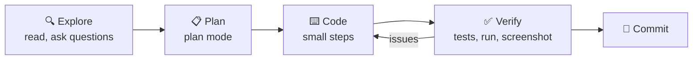

# 62 · The Claude Code Masterclass 🧑‍💻🤖

> ⏱️ 11 min read · 🎯 Beginner → intermediate (no coding required to start) · 🧰 Needs: a Claude Pro/Max plan or API key, a terminal (or the desktop/web app)

**Claude Code is an agentic coding tool.** It reads your project, runs commands, edits files, tests its own work and ships
features. It lives in your terminal, in VS Code and JetBrains, in a desktop app, on the web and on your phone. And it isn't
just for code: people use it to organize files, analyze data, write docs, tend Obsidian vaults and automate their computers.
This chapter takes you from first launch to a confident, efficient daily workflow. (Then [Power-Ups](63-claude-code-power-ups.md)
turns you into a wizard. 🧙)

> [!NOTE]
> **👋 Fun fact**
> This entire manual, website, examples and CI included, was built with Claude Code.

<details class="eli5" open>
<summary>🧸 ELI5: This chapter in 30 seconds</summary>

Claude Code is like having a super-smart helper sitting at your computer. You type what you want in plain words ("make me a
website about my cat"), and it opens files, writes code, runs it, sees what's broken and fixes it, asking your permission
for anything risky. Your job is to be a good boss: explain the goal, check the plan, and say "yes, keep going."

</details>

<!-- in-this-chapter -->

> [!NOTE]
> **🌍 Not using Claude? This chapter still applies**
> OpenAI's **Codex** (in the ChatGPT desktop app, a CLI and code editors), Google's **Gemini CLI**, **GitHub Copilot**'s
> agent mode and **Cursor** all work the same way: a project instructions file, plan-then-act, permissions, MCP
> servers and background tasks. The quick translation:
>
> | Idea | Claude Code | Codex | Gemini CLI |
> |---|---|---|---|
> | Install | `npm i -g @anthropic-ai/claude-code` (or the native installer) | `npm i -g @openai/codex` (or the ChatGPT desktop app) | `npm i -g @google/gemini-cli` |
> | Project instructions file | `CLAUDE.md` | `AGENTS.md` | `GEMINI.md` |
> | Add an MCP server | `claude mcp add …` | `codex mcp add …` | `gemini mcp add …` |
> | Run headless in scripts | `claude -p "…"` | `codex exec "…"` | `gemini -p "…"` |
>
> Many teams keep one `AGENTS.md` and point the other files at it, so every agent reads the same rules.

## 🚀 Install & first launch

<details class="eli5">
<summary>🧸 ELI5</summary>

You install it once, open a folder, type `claude`, log in, and start chatting. That's it.

</details>

```bash
# macOS / Linux / WSL: the native installer (check docs.claude.com for the current command)
curl -fsSL https://claude.ai/install.sh | bash

# or with npm (Node.js 18+)
npm install -g @anthropic-ai/claude-code

cd my-project      # any folder, even an empty one
claude             # start a session
```

Log in with your **Claude subscription** (Pro and Max include Claude Code) or an **API key** (pay per use).

| Where | How | Best for |
|---|---|---|
| 💻 **Terminal** | `claude` | The full-power experience |
| 🧩 **VS Code / JetBrains** | Install the extension | Seeing diffs inline in your editor |
| 🖥️ **Desktop app** | Claude Desktop → Code | A friendly visual interface, parallel sessions |
| 🌐 **Web** | claude.ai/code | Cloud sandboxes, run tasks from anywhere, auto PRs |
| 📱 **Phone** | Claude app | Kick off and check on tasks from the couch 🛋️ |

**Your first three prompts:**

1. *"Explain this project's structure to me like I'm new here."*
2. *"What would you improve first, and why?"*
3. *"Do the first one. Make sure it still works afterwards."*

## 🎛️ Essential controls

<details class="eli5">
<summary>🧸 ELI5</summary>

A few keyboard shortcuts let you steer: stop it, rewind it, point at a file, or switch it into "plan first, build later"
mode.

</details>

| Action | How |
|---|---|
| Cycle modes: normal → auto-accept edits → **plan mode** | `Shift+Tab` |
| Stop what it's doing | `Esc` |
| Rewind to an earlier point (code and chat) | `Esc` `Esc` or `/rewind` |
| Point at a file or folder | `@src/app.py` |
| Run a shell command yourself | `!npm test` |
| Add an image or screenshot | Paste or drag it into the prompt |
| New line without sending | `Shift+Enter` (or `\` then `Enter`) |
| Continue the last session | `claude --continue` |
| Pick an older session | `claude --resume` |

**Built-in slash commands you'll use constantly:**

| Command | Does |
|---|---|
| `/init` | Scans the project and writes a starter `CLAUDE.md` |
| `/clear` | Fresh context. Do this between unrelated tasks! |
| `/compact` | Summarizes the conversation to free up context |
| `/context` | Shows what's filling your context window |
| `/model` | Switch models |
| `/memory` | Edit your memory files |
| `/permissions` | Manage which tools run without asking |
| `/mcp` | Manage MCP servers and log in to them |
| `/agents`, `/hooks`, `/plugin` | Subagents, hooks, plugins ([Power-Ups](63-claude-code-power-ups.md)) |
| `/review` | Review code changes |
| `/doctor` | Diagnose installation problems |
| `/help` | Everything else |

## 🔁 The workflow that works: Explore → Plan → Code → Verify → Commit

<details class="eli5">
<summary>🧸 ELI5</summary>

First let it look around, then have it tell you its plan, then let it build, then make it check its own work, then save.
Skipping the "check" step is how bugs sneak in.

</details>



1. **Explore:** *"Read the checkout code and explain how discounts work. Don't change anything yet."*
2. **Plan:** press `Shift+Tab` until you're in **plan mode**. Claude researches and proposes a plan, and you approve or edit
   it. For anything bigger than a small fix, this step saves hours.
3. **Code:** let it implement. Watch the first few steps, and hit `Esc` if it drifts.
4. **Verify:** the **single biggest quality lever**. Give Claude a way to check its own work: tests, a linter, running the
   app, Playwright screenshots. *"Run the tests and fix any failures."*
5. **Commit:** *"Commit with a clear message."* Git is your undo button ([Git & GitHub](61-git-and-github.md)).

> [!TIP]
> **💡 Ask it to think harder**
> For tricky problems, say so: *"Think hard about edge cases before you start."* Models that can reason step by step do
> noticeably better when you give them room ([How Models Really Work](../part-3-foundations/33-how-models-really-work.md)).

## 🧠 CLAUDE.md: your project's memory

<details class="eli5">
<summary>🧸 ELI5</summary>

`CLAUDE.md` is a sticky note that Claude reads every time it starts: "here's how this project works, here are the house
rules." Write it once and you never repeat yourself.

</details>

Claude Code automatically loads `CLAUDE.md` files at startup:

| Location | Scope |
|---|---|
| `./CLAUDE.md` | This project (commit it, and your team shares it) |
| `./CLAUDE.local.md` | Just you, this project (keep it out of Git) |
| `~/.claude/CLAUDE.md` | You, everywhere (personal preferences) |
| `subfolder/CLAUDE.md` | Loaded when Claude works in that folder |

**A great CLAUDE.md is short and high-signal:**

```markdown
# Recipe Box

## Commands
- Run: `npm run dev` (http://localhost:5173)
- Test: `npm test`  ·  Lint: `npm run lint`

## Conventions
- TypeScript strict mode, React function components, Tailwind for styles.
- Every new component gets a test in `__tests__/`.

## Gotchas
- The `/legacy` folder is frozen. Never edit it.
- Recipes are stored in `data/recipes.json`. Keep the schema in `types.ts` in sync.
```

**Pro moves:**

- Run `/init` to generate a first draft, then trim it.
- After Claude makes a mistake: *"Add a note to CLAUDE.md so this never happens again."* Your memory file gets smarter
  every week.
- Keep it under a page or two. Everything in it costs context on every request.
- More examples: [example CLAUDE.md](../../examples/prompts-for-agents/CLAUDE.md), and the same idea is used by other tools
  as `AGENTS.md` or Cursor rules.

## 🔐 Permissions & safety

<details class="eli5">
<summary>🧸 ELI5</summary>

Claude asks before doing anything that could cause trouble, like deleting files or running commands. You can tell it which
safe things it may always do, and which things it must never do.

</details>

By default, Claude Code **asks before** editing files or running commands. You tune that in `/permissions` or
`.claude/settings.json`:

```json
{
  "permissions": {
    "allow": ["Bash(npm test)", "Bash(npm run lint)", "Bash(git status)", "Bash(git diff:*)"],
    "deny": ["Read(./.env)", "Read(./secrets/**)", "Bash(rm -rf:*)"]
  }
}
```

| Mode | What happens | Use when |
|---|---|---|
| **Normal** | Asks for each edit and command | Learning, sensitive projects |
| **Auto-accept edits** | Edits files freely, still asks for commands | You trust the direction |
| **Plan mode** | Reads and plans only, no changes | Starting any big task |
| **Allowlisted commands** | Safe commands (tests, lint) never ask | Every project, set it up once |

> [!WARNING]
> **⚠️ Keep the dangerous stuff on "ask"**
> Commands that delete, force-push, deploy or spend money should always ask first. Sandboxed environments (cloud sessions,
> containers, devcontainers) are the right place for "let it run wild" experiments.

## 🧹 Context management: the hidden skill

<details class="eli5">
<summary>🧸 ELI5</summary>

Claude has a backpack that can only hold so much. If you stuff it with old, unrelated stuff, it gets confused. Empty the
backpack between different jobs.

</details>

Everything in the conversation (files it read, command output, your messages) fills the **context window**. A cluttered
context makes any model worse ([Context Engineering](../part-3-foundations/36-context-engineering.md)).

| Habit | Why |
|---|---|
| `/clear` between unrelated tasks | Old task details confuse new ones |
| `/context` when things feel slow or confused | See what's eating space (big files, MCP tools) |
| `/compact` during long tasks | Keeps the important bits, drops the noise |
| Point at files with `@` | Faster and cheaper than "find the file that…" |
| Use subagents for research | They explore in their own context and return a summary ([Power-Ups](63-claude-code-power-ups.md)) |
| Write a plan to a file for big projects | `PLAN.md` survives `/clear` and new sessions |

## 🗣️ Prompt patterns that work brilliantly

<details class="eli5">
<summary>🧸 ELI5</summary>

Tell it what "finished" looks like, show it pictures and examples, and ask it to explain its choices. Clear bosses get
great work.

</details>

| Pattern | Example |
|---|---|
| **Define done** | *"Done means: tests pass, lint is clean, and it works on a phone-sized screen."* |
| **Show, don't describe** | Paste a screenshot, an error log, or a link to a design you like |
| **Options first** | *"Give me 3 approaches with tradeoffs before writing any code."* |
| **Interview me** | *"Ask me questions until you fully understand what I want, then write a spec."* |
| **Test first** | *"Write failing tests for this behavior, then make them pass."* |
| **Screenshot loop** | *"Use Playwright to screenshot the page, compare it to my mockup, and iterate."* |
| **Explain it back** | *"Walk me through your diff like I'm a junior developer."* |
| **Root cause** | *"Don't just fix the symptom. Find out why it happened."* |
| **Scope guard** | *"Only touch files in `src/search/`. Ask before changing anything else."* |

## 🧪 Non-coding superpowers

<details class="eli5">
<summary>🧸 ELI5</summary>

Claude Code isn't just for programmers. It can tidy your folders, rename photos, crunch spreadsheets and write documents,
because it can use your computer's files and tools.

</details>

Claude Code is a general-purpose **computer assistant with hands**. Point it at any folder:

- 📸 *"Rename every photo in this folder to `YYYY-MM-DD_place.jpg` using the EXIF data."*
- 📊 *"Analyze these 12 bank CSVs: monthly spending by category, and a chart."*
- 🗂️ *"Organize my Downloads folder into sensible subfolders. Show me the plan first."*
- 📝 *"Read all the meeting notes in this folder and write a decisions log."*
- 🧠 *"Go through my Obsidian vault, find notes about the same topic, and suggest links."*
- 🎞️ *"Convert all these videos to MP4 and compress them under 50MB each"* (it'll use `ffmpeg`).
- 🌐 *"Check every link in my website's pages and fix the broken ones."*

## 💎 20 pro tips

<details class="eli5">
<summary>🧸 ELI5</summary>

Twenty little tricks that experienced users swear by.

</details>

1. **Plan mode for anything over ~20 minutes of work.**
2. **Always give it a way to verify** (tests, a URL to load, a command to run).
3. **Commit early, commit often.** Rewinding is cheap when save points exist.
4. **`/clear` liberally.** Fresh context beats a 3-hour mega-session.
5. **Interrupt early** with `Esc` when it heads the wrong way, and redirect.
6. **Paste screenshots** of bugs and designs. Pictures beat paragraphs.
7. **Name files with `@`** so it doesn't have to search.
8. **Ask for options** on design decisions before code gets written.
9. **Teach CLAUDE.md** after every repeated mistake.
10. **Allowlist safe commands** so you're not clicking "yes" all day.
11. **Use subagents** for research and review to keep your main context clean.
12. **Run sessions in parallel** on separate worktrees or in the cloud.
13. **Let it write the tests** and then read the tests: they're a spec you can understand.
14. **Ask "what could go wrong?"** before merging anything important.
15. **Make it explain** the code. It's the fastest way to learn to program.
16. **Use it for setup chores:** installing tools, fixing environments, writing configs.
17. **Keep a `PLAN.md` or `TODO.md`** for multi-day projects.
18. **Start from a template** or an existing similar project when you can.
19. **Review the diff yourself** before pushing anything that matters.
20. **Celebrate small wins.** Ship tiny things often. 🎉

## 🗺️ 25 Claude Code projects for non-programmers

<details class="eli5">
<summary>🧸 ELI5</summary>

Twenty-five fun things you could build this month, even if you've never written code.

</details>

| # | Project | # | Project |
|---|---|---|---|
| 1 | Personal website, deployed free | 14 | Resume site generated from your LinkedIn export |
| 2 | Photo organizer (rename and sort by date and place) | 15 | Google Drive backup-and-tidy script |
| 3 | Budget analyzer from bank CSVs with charts | 16 | A browser game with a cat theme 🐱 |
| 4 | A Chrome extension that fixes one annoyance | 17 | Flashcard app from your study notes |
| 5 | A custom MCP server for your hobby's API | 18 | Wedding or party website with RSVP form |
| 6 | Discord or Telegram bot for your friends | 19 | Plant-care tracker with watering reminders 🌱 |
| 7 | Obsidian vault reorganization + auto-linking | 20 | Price-drop watcher for things you want |
| 8 | Recipe scaler + grocery list web app | 21 | Family chore chart with points and prizes |
| 9 | Job-application tracker | 22 | A "daily briefing" script (weather, calendar, news) |
| 10 | Home Assistant automations, written and tested | 23 | Podcast transcript search engine |
| 11 | Spreadsheet → dashboard web app | 24 | Book-reading tracker with stats |
| 12 | Newsletter pipeline: RSS → summaries → email | 25 | A tool that turns voice memos into to-dos |
| 13 | A portfolio for your art or photos | | |

## 🎯 Key takeaways

- Claude Code runs in your **terminal, IDE, desktop, web and phone**, and works on code *and* everyday files.
- The winning loop: **Explore → Plan → Code → Verify → Commit.** Verification is the biggest quality lever.
- **CLAUDE.md** is your project memory. Keep it short and teach it after mistakes.
- **Permissions** keep you safe: allowlist the safe stuff, keep risky commands on "ask."
- **Context hygiene** (`/clear`, `/context`, `/compact`) keeps results sharp.

## 🧠 Check yourself

<details class="quiz">
<summary>❓ 1. You're about to ask for a big new feature. What two things should you do first?</summary>

**Commit** your current working state (a save point), and switch to **plan mode** so Claude proposes a plan you can review
before it changes anything.

</details>

<details class="quiz">
<summary>❓ 2. Claude keeps forgetting that tests run with `pnpm test`, not `npm test`. What's the permanent fix?</summary>

Add it to **CLAUDE.md** (or ask Claude to: *"add a note to CLAUDE.md so this doesn't happen again"*).

</details>

<details class="quiz">
<summary>❓ 3. You finished a bug fix and now want to start on unrelated docs. What command should you run?</summary>

`/clear`, so the bug-fix details don't clutter the new task's context.

</details>

> [!TIP]
> **🎮 Try this**
> In an empty folder: `claude` → *"Build me a single-page 'daily affirmation' web app with a big button, confetti, and 50
> affirmations. Make it beautiful, test it with Playwright, then open it in my browser."* Then run `/init`, commit, and ask
> for one improvement in plan mode. Ten minutes, and you've used the whole workflow. 🎉

---

**Next:** [63 · Claude Code Power-Ups →](63-claude-code-power-ups.md)
