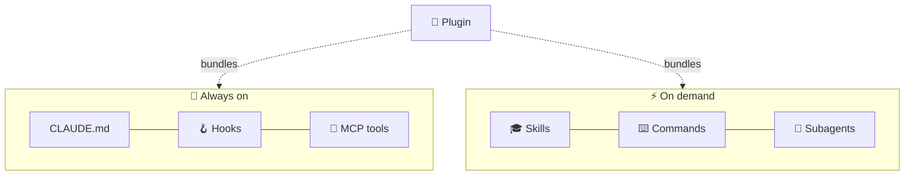

# 63 · Claude Code Power-Ups: Skills, Subagents, Hooks, Plugins & More ⚡🧙

> ⏱️ 10 min read · 🎯 Intermediate · 🧰 Needs: Claude Code installed ([Masterclass](62-claude-code-masterclass.md) first)

**Out of the box, Claude Code is brilliant. Customized, it's a whole team.** This chapter covers the power-user layer:
custom slash commands, skills, subagents, hooks, MCP servers, plugins, output styles, headless mode, GitHub Actions and the
Agent SDK. Each one is a small file you can write in minutes (or ask Claude to write for you), and together they turn a
general assistant into *your* assistant. 🛠️✨

<details class="eli5" open>
<summary>🧸 ELI5: This chapter in 30 seconds</summary>

Think of Claude Code as a robot with an empty backpack. **Skills** are instruction booklets it can pull out when needed.
**Subagents** are little helper robots it can send off on errands. **Hooks** are automatic rules ("always wipe your feet
when you come in"). **MCP** gives it new tools. **Plugins** are gift boxes containing all of the above. You can build every
one of them, or install ones other people made.

</details>

<!-- in-this-chapter -->

## 🗺️ The power-up map

<details class="eli5">
<summary>🧸 ELI5</summary>

Here's every power-up on one page, with when to use each one.

</details>

| Power-up | Lives in | Loaded when | Best for |
|---|---|---|---|
| 🧠 **CLAUDE.md** | `CLAUDE.md` | Always | Project facts and house rules |
| ⌨️ **Slash commands** | `.claude/commands/*.md` | You type `/name` | Prompts you reuse often |
| 🎓 **Skills** | `.claude/skills/*/SKILL.md` | When a task matches (or `/name`) | Playbooks, procedures, scripts |
| 👥 **Subagents** | `.claude/agents/*.md` | Claude delegates (or you ask) | Specialist work in a separate context |
| 🪝 **Hooks** | `.claude/settings.json` | On lifecycle events | Rules that must *always* happen |
| 🔌 **MCP servers** | `.mcp.json` / `claude mcp add` | Always available as tools | External apps and data |
| 🎁 **Plugins** | Marketplaces via `/plugin` | Once installed | Sharing whole setups |
| 🎨 **Output styles / status line** | Settings | Always | Changing how Claude talks and what you see |
| 🤖 **Headless & SDK** | `claude -p`, Agent SDK | In scripts, CI, apps | Automation and your own agents |



> [!TIP]
> **💡 Project vs. personal**
> Every power-up can live in the **project** (`.claude/…`, committed, shared with your team) or in your **home folder**
> (`~/.claude/…`, just for you, in every project). Start personal, promote to the project when it proves useful.

## ⌨️ Custom slash commands

<details class="eli5">
<summary>🧸 ELI5</summary>

A slash command is a saved message. Instead of typing the same long request every time, you type `/standup` and it's sent
for you.

</details>

Create `.claude/commands/fix-issue.md`:

```markdown
---
description: Fix a GitHub issue end to end
argument-hint: [issue-number]
---
Fix GitHub issue #$ARGUMENTS.

1. Read the issue with `gh issue view $ARGUMENTS`.
2. Find the relevant code and explain the root cause to me.
3. Write a failing test, then fix it.
4. Run the full test suite and lint.
5. Commit with a message that references the issue.
```

Now `/fix-issue 42` does the whole dance. Other favorites:

| Command | Prompt inside |
|---|---|
| `/standup` | *"Summarize what changed in git since yesterday, as 3 bullet points."* |
| `/explain` | *"Explain @$ARGUMENTS to a beginner, with a diagram."* |
| `/tidy` | *"Find dead code, unused imports and TODOs in this project. Propose a cleanup plan."* |
| `/ship` | *"Run tests and lint, update the changelog, commit, push, and open a PR."* |
| `/tests` | *"Write thorough tests for @$ARGUMENTS, including edge cases."* |

## 🎓 Skills: packaged expertise

<details class="eli5">
<summary>🧸 ELI5</summary>

A skill is an instruction booklet in a folder. Claude only sees the booklet's title until it needs it, then reads the whole
thing. So you can give it a hundred booklets without filling its backpack.

</details>

A **skill** is a folder with a `SKILL.md` (a name, a description and instructions) plus optional scripts, templates and
reference files. Claude sees only each skill's **name and description** until a task matches, then loads the rest
(**progressive disclosure**), so dozens of skills cost almost nothing.

```
.claude/skills/weekly-review/
├── SKILL.md          ← frontmatter (name, description) + instructions
├── template.md       ← supporting files, loaded only if needed
└── stats.py          ← scripts Claude can run
```

```markdown
---
name: weekly-review
description: Run my Friday weekly review. Use when I say "weekly review", "recap my week" or "what did I do this week".
---
# Weekly review

1. Run `python stats.py` to count commits and notes from the last 7 days.
2. Read this week's notes in `journal/`.
3. Fill in `template.md`: wins, lessons, stalled projects, 3 priorities for next week.
4. Keep the tone encouraging. Save it as `reviews/YYYY-MM-DD.md`.
```

**The description is everything:** it's how Claude decides *when* to use the skill. Include trigger phrases people
actually say. [Full example in this repo](../../examples/prompts-for-agents/skills/weekly-review/SKILL.md).

**Skill ideas:** brand voice guide · "how we write release notes" · PDF form filler (with a script) · data-cleaning
playbook · "set up a new Python project our way" · grocery-list-from-recipes · invoice generator.

> [!NOTE]
> **📌 Skills travel**
> Skills work across Claude's apps (claude.ai, the desktop app, the API and Claude Code), and the same `SKILL.md` format has
> been adopted by other agent tools. Write once, use everywhere.

## 👥 Subagents: your specialist team

<details class="eli5">
<summary>🧸 ELI5</summary>

Subagents are helper robots. The main robot says "go research this" or "go check my work," the helper does it in its own
room, and comes back with a short report. The main robot's backpack stays light.

</details>

**Subagents** have **their own context window, instructions and tool permissions**. The main agent delegates to them, and
they return just a summary. That keeps your main context clean and lets you specialize.

Create one with `/agents`, or add `.claude/agents/code-reviewer.md`:

```markdown
---
name: code-reviewer
description: Reviews diffs for bugs, security issues and readability. Use proactively after significant code changes.
tools: Read, Grep, Glob, Bash
---
You are a meticulous, kind senior reviewer. Check the current diff for correctness bugs, security issues,
missing tests and confusing names. Report findings by severity with file:line references.
Never edit files yourself.
```

| Subagent | Tools | Why it's great |
|---|---|---|
| 🔍 `researcher` | Web search, Read | Digs through docs without flooding your context |
| 🧪 `test-writer` | Read, Write, Bash | Writes and runs tests in isolation |
| 🛡️ `security-auditor` | Read, Grep | Read-only review for secrets and injection risks |
| 📝 `docs-writer` | Read, Write | Keeps README and docs in sync |
| 🖼️ `ui-verifier` | Playwright MCP | Screenshots pages and checks them against the spec |
| 📊 `data-analyst` | Read, Bash (Python) | Crunches CSVs and reports findings |

**Try:** *"Use the researcher subagent to compare three charting libraries, then the code-reviewer to check what we
built."* Subagents can also run **in parallel** for big jobs ([Multi-Agent Systems](70-multi-agent-systems.md)).

## 🪝 Hooks: automatic guardrails

<details class="eli5">
<summary>🧸 ELI5</summary>

Hooks are rules that always happen, no matter what. "Every time you edit a file, tidy it up." "Never, ever touch the secret
file." The robot can't forget them, because they're not suggestions, they're automatic.

</details>

**Hooks** run your shell commands at lifecycle events. They're **deterministic**: they don't rely on the model remembering.
Configure them with `/hooks` or in `.claude/settings.json`.

| Event | Fires when | Example use |
|---|---|---|
| `PreToolUse` | Before a tool runs (can **block** it) | Block edits to `.env` or `migrations/` |
| `PostToolUse` | After a tool runs | Auto-format every edited file |
| `UserPromptSubmit` | When you send a prompt | Inject context (today's ticket, the date) |
| `Stop` | When Claude finishes responding | Run tests, play a sound 🔔 |
| `SubagentStop` | When a subagent finishes | Log or check its output |
| `Notification` | When Claude needs your attention | Desktop or phone notification |
| `PreCompact` | Before context is compacted | Save a transcript backup |
| `SessionStart` / `SessionEnd` | A session begins or ends | Install deps, print project status, clean up |

**Auto-format after every edit** (hook input arrives as JSON on stdin):

```json
{
  "hooks": {
    "PostToolUse": [
      {
        "matcher": "Edit|Write",
        "hooks": [
          { "type": "command", "command": "jq -r '.tool_input.file_path' | xargs npx prettier --write 2>/dev/null || true" }
        ]
      }
    ]
  }
}
```

**Protect secret files** with a tiny script, `.claude/hooks/protect.py`:

```python
import json, sys

data = json.load(sys.stdin)
path = data.get("tool_input", {}).get("file_path", "")
if any(p in path for p in (".env", "secrets/", ".git/")):
    print(f"Blocked: {path} is protected.", file=sys.stderr)
    sys.exit(2)          # exit code 2 = block the tool call and tell Claude why
```

Register it under `PreToolUse` with the matcher `Edit|Write` and the command `python3 .claude/hooks/protect.py`.

> [!WARNING]
> **⚠️ Hooks run with your permissions**
> A hook is a real shell command that runs automatically. Only use hooks you understand, and read any hooks that come with
> a plugin or project you didn't write. Check the hooks docs for the exact input fields and exit-code rules.

## 🔌 MCP in Claude Code

<details class="eli5">
<summary>🧸 ELI5</summary>

MCP servers are plug-in tools: plug in GitHub, a web browser, or your notes app, and Claude can use them.

</details>

```bash
# a remote server (sign in with /mcp afterwards)
claude mcp add --transport http notion https://mcp.notion.com/mcp

# a local server
claude mcp add playwright -- npx @playwright/mcp@latest

# share with your team: saved to .mcp.json in the project
claude mcp add --scope project github --transport http https://api.githubcopilot.com/mcp/

claude mcp list          # see what's installed
```

| Scope | Stored in | Who gets it |
|---|---|---|
| `local` (default) | Your user settings, for this project | Just you, this project |
| `project` | `.mcp.json` (commit it) | Everyone on the project |
| `user` | Your user settings | You, in every project |

**Must-have servers for builders:** Playwright (see and click web pages), GitHub, Context7-style docs servers (current library
docs), a database server, Sentry, and your notes app. Full catalog in [MCP Server Catalog](../part-4-mcp-and-connectors/40-mcp-server-catalog.md).

> [!TIP]
> **💡 Too many tools?**
> Every MCP tool adds to your context. If `/context` shows MCP tools eating space, disable servers you're not using for
> this project.

## 🎁 Plugins & marketplaces

<details class="eli5">
<summary>🧸 ELI5</summary>

A plugin is a gift box with commands, skills, helpers, hooks and tools inside. Install the box, get everything at once.
Share your box, and your friends get your whole setup.

</details>

**Plugins** bundle slash commands, skills, subagents, hooks, MCP servers and LSP (code intelligence) servers into one
installable package. Browse and install with `/plugin`:

```text
/plugin marketplace add anthropics/claude-code      # add a marketplace (a GitHub repo)
/plugin install <plugin-name>@<marketplace>          # install a plugin from it
/plugin                                               # browse, enable, disable
```

**Make your own:** a plugin is a folder with `.claude-plugin/plugin.json` plus your `commands/`, `skills/`, `agents/` and
`hooks/`. Put it in a GitHub repo with a `marketplace.json`, and anyone can install it. Great for:

- 🏢 **Teams:** "our coding standards, reviewers and deploy commands" in one install.
- 🎓 **Teachers:** a "learning mode" plugin that explains everything.
- 🧑‍🎨 **Hobbyists:** a "game jam kit" or "Obsidian gardener" plugin to share.

## 🎨 Output styles, status line & other comforts

<details class="eli5">
<summary>🧸 ELI5</summary>

You can change how Claude talks to you (more teaching, more brief) and what little info bar you see at the bottom of the
screen.

</details>

| Feature | What it does | Try |
|---|---|---|
| **Output styles** | Changes Claude's personality and teaching mode | An "explanatory" or "learning" style that teaches as it codes |
| **Status line** | A custom bar showing model, branch, costs, anything | `/statusline` and describe what you want |
| **Notifications** | Ping you when Claude needs input | A `Notification` hook that sends a desktop or phone alert |
| **Custom models per agent** | Fast models for simple subagents | `model:` in a subagent's frontmatter |
| **Checkpoints** | Automatic save points you can rewind to | `Esc` `Esc` or `/rewind` |

## 🤖 Headless mode & scripting

<details class="eli5">
<summary>🧸 ELI5</summary>

Headless mode means Claude works without you chatting to it: a script says "do this job," Claude does it and prints the
answer. That's how you put Claude inside your own robots and schedules.

</details>

```bash
claude -p "Summarize the last 10 commits for a changelog"                      # print mode
claude -p "List all TODOs as JSON" --output-format json > todos.json            # machine-readable
cat error.log | claude -p "Explain this error and suggest a fix"                 # pipe input in
claude -p "Fix lint errors" --allowedTools "Edit,Bash(npm run lint)"             # limit what it may do
```

**Ideas:**

- 🌙 **Nightly cron:** *"Check for outdated dependencies and write a report."*
- 📬 **Git hook:** a pre-push check that asks Claude for a quick review.
- 🧾 **Batch jobs:** loop over 100 files and have Claude summarize each.
- 🧩 **n8n / Zapier:** call `claude -p` from an Execute Command node on your server ([n8n Masterclass](../part-5-automation/47-n8n-masterclass.md)).

## 🐙 Claude Code in GitHub Actions

<details class="eli5">
<summary>🧸 ELI5</summary>

You can invite Claude into your GitHub project. Write "@claude please fix this" on a bug report, and Claude writes the fix
and sends it to you for review.

</details>

Run `/install-github-app` inside Claude Code to set it up, or add the official action yourself:

```yaml
name: claude
on:
  issue_comment: { types: [created] }
  pull_request_review_comment: { types: [created] }
jobs:
  claude:
    if: contains(github.event.comment.body, '@claude')
    runs-on: ubuntu-latest
    permissions: { contents: write, pull-requests: write, issues: write }
    steps:
      - uses: actions/checkout@v4
      - uses: anthropics/claude-code-action@v1
        with:
          anthropic_api_key: ${{ secrets.ANTHROPIC_API_KEY }}
```

Now comment **`@claude add input validation to the signup form`** on an issue, and a PR shows up. You can also run it on a
schedule or on every PR for automatic reviews.

## 🧰 The Claude Agent SDK

<details class="eli5">
<summary>🧸 ELI5</summary>

The Agent SDK is Claude Code's engine, available as building blocks so you can put the same smart helper inside your own
programs.

</details>

The **Claude Agent SDK** (Python and TypeScript) is the same harness that powers Claude Code, as a library: tools, file
editing, MCP, subagents, hooks and context management, all built in.

```python
# pip install claude-agent-sdk
import anyio
from claude_agent_sdk import query, ClaudeAgentOptions

async def main():
    options = ClaudeAgentOptions(
        system_prompt="You are a friendly research assistant. Cite your sources.",
        allowed_tools=["Read", "Grep", "WebSearch"],
    )
    async for message in query(prompt="What are the three biggest themes in ./notes?", options=options):
        print(message)

anyio.run(main)
```

Use it when you want a **Claude-Code-grade agent inside your own app**: a support bot that reads your docs, a research agent,
an ops agent for your server. To understand what's happening under the hood first, build one from scratch in
[Build Your Own Agent](68-build-your-own-agent.md).

## ☁️ Parallel & cloud sessions

<details class="eli5">
<summary>🧸 ELI5</summary>

You can have several Claudes working at the same time, each on a different job, even in the cloud while your laptop is
closed. You just check their work later.

</details>

| Way | How | Great for |
|---|---|---|
| **Git worktrees** | One Claude Code session per worktree folder | Two or three features at once, locally |
| **Desktop app** | Multiple sessions side by side | Visual juggling of parallel tasks |
| **Claude Code on the web** | Start tasks at claude.ai/code in cloud sandboxes | Tasks that run while you're away, results as PRs |
| **Phone** | Start or check sessions from the Claude app | "Fix that typo on my site" from the bus 🚌 |
| **GitHub Action** | `@claude` on issues | Team-wide delegation |

## 🧪 Starter kit: a power-user setup in 15 minutes

<details class="eli5">
<summary>🧸 ELI5</summary>

Copy these steps and you'll have a customized, safer, smarter Claude Code in a quarter of an hour.

</details>

- [ ] Run `/init` and trim `CLAUDE.md` to one page.
- [ ] Allowlist your test and lint commands in `/permissions`, and deny `.env` reads.
- [ ] Add one **slash command** you'll use daily (`/standup` or `/ship`).
- [ ] Add a **code-reviewer subagent**.
- [ ] Add a **PostToolUse formatting hook** and a **Notification hook**.
- [ ] Connect **Playwright MCP** so Claude can see your web pages.
- [ ] Write one **skill** for a task you repeat weekly.
- [ ] Browse `/plugin` and install one plugin that looks fun.

Or just ask: *"Help me set up a power-user Claude Code config for this project: a CLAUDE.md, safe permissions, a reviewer
subagent, a formatting hook and a /ship command. Explain each piece as you go."* 🪄

## 🎯 Key takeaways

- **Commands** are saved prompts, **skills** are on-demand playbooks, **subagents** are specialists with their own context.
- **Hooks** are guaranteed behavior: formatting, protection, notifications.
- **MCP** adds tools, and **plugins** bundle everything to share.
- **Headless mode, GitHub Actions and the Agent SDK** put Claude Code inside scripts, CI and your own apps.
- Start small: one command, one subagent, one hook. Grow as you notice repetition.

## 🧠 Check yourself

<details class="quiz">
<summary>❓ 1. You want code to be auto-formatted after every single edit, guaranteed. Skill, CLAUDE.md note, or hook?</summary>

A **hook** (`PostToolUse`). CLAUDE.md notes and skills are instructions the model *should* follow; hooks *always* run.

</details>

<details class="quiz">
<summary>❓ 2. Why doesn't having 40 skills fill up Claude's context?</summary>

**Progressive disclosure:** only each skill's name and description are loaded up front. The full instructions load only
when a task matches.

</details>

<details class="quiz">
<summary>❓ 3. What's the main benefit of a research subagent over just asking the main agent?</summary>

It works in its **own context window** and returns only a summary, so your main conversation stays clean and focused.

</details>

<details class="quiz">
<summary>❓ 4. How do you share your whole Claude Code setup with a friend in one step?</summary>

Package it as a **plugin** in a GitHub repo marketplace, and they install it with `/plugin`.

</details>

> [!TIP]
> **🎮 Try this**
> Ask Claude Code: *"Create a `/compliment` slash command that reads my latest commit and writes an over-the-top,
> Shakespearean compliment about it."* Then make a `Stop` hook that plays a sound when Claude finishes. Silly? Yes. But
> you'll have learned commands and hooks in five minutes, and you'll smile every time. 🎭🔔

---

**Next:** [64 · Cursor & AI IDEs →](64-cursor-and-ai-ides.md)
