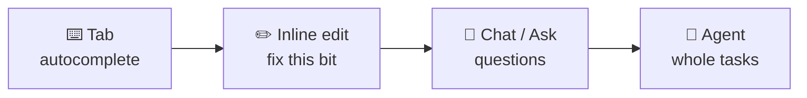

# 64 · Cursor & AI IDEs: Coding Side by Side with AI 🖱️✨

> ⏱️ 9 min read · 🎯 Beginner → intermediate · 🧰 Needs: a computer, and one of Cursor, VS Code + Copilot, Windsurf, Zed or JetBrains

**An AI IDE is a code editor with an AI co-pilot built in.** You see every file, every change and every suggestion as it
happens, which makes AI IDEs wonderful for learning *and* for precise work. This chapter tours the big editors, teaches the
four ways to work with AI inside them (autocomplete, inline edits, chat, agent), shows how to set up rules and MCP, and
explains when to reach for an IDE versus a terminal agent like Claude Code.

<details class="eli5" open>
<summary>🧸 ELI5: This chapter in 30 seconds</summary>

An IDE is the program where people write code, like a word processor for programs. An **AI IDE** has a helper that
finishes your sentences, fixes lines you point at, answers questions about your project, and can even make big changes
across many files while you watch. It's like writing with a friend looking over your shoulder who happens to be a coding
genius.

</details>

<!-- in-this-chapter -->

## 🧭 The AI IDE landscape

<details class="eli5">
<summary>🧸 ELI5</summary>

There are several AI code editors. Most are cousins of the free VS Code editor, so skills from one carry over to the
others.

</details>

| Editor | What makes it special | Price vibe |
|---|---|---|
| **Cursor** | The most popular AI-first editor (a VS Code fork): excellent Tab predictions, agent mode, its own fast Composer models, cloud background agents, Bugbot PR reviews | Free tier + paid plans |
| **VS Code + GitHub Copilot** | The world's most-used editor with Copilot's agent mode, next-edit suggestions, MCP and a coding agent on GitHub | Free tier + paid plans |
| **Windsurf** | An agentic IDE built around its "Cascade" agent with memories and flows | Free tier + paid plans |
| **Zed** | Blazing fast, built-in agent panel, and it can host outside agents (like Claude Code or Gemini CLI) | Free, pay for hosted AI |
| **JetBrains + AI Assistant / Junie** | Deep smarts for IntelliJ, PyCharm, WebStorm and friends | Paid add-on |
| **Kiro, Antigravity & newcomers** | Agent-first and spec-driven editors from big cloud companies | Evolving fast |
| **Claude Code in your IDE** | The Claude Code extension shows its diffs inside VS Code or JetBrains | Your Claude plan |

> [!NOTE]
> **📌 They all converge**
> These editors copy each other's best ideas quickly. Rules files, MCP support, agent mode and background agents are
> becoming standard everywhere. Pick the one that *feels* best, and your skills transfer.

## 🎚️ The four ways to work with AI in an editor

<details class="eli5">
<summary>🧸 ELI5</summary>

There are four levels: the AI finishing your line, the AI fixing a highlighted bit, you chatting about the code, and the AI
doing a whole task by itself.

</details>



| Mode | What you do | Example | Best for |
|---|---|---|---|
| ⌨️ **Tab / autocomplete** | Start typing, press `Tab` to accept | Type `function isWeekend(` → it writes the body | Flow state, boilerplate |
| ✏️ **Inline edit** (`Cmd/Ctrl+K`) | Highlight code, describe a change | *"Make this handle empty lists"* | Precise, local changes |
| 💬 **Ask / chat** | Ask about the code (no edits) | *"How does login work here?"* | Understanding, learning |
| 🤖 **Agent** | Describe a task, it edits many files, runs commands | *"Add a dark mode toggle and persist the setting"* | Features, refactors, bug hunts |

**Beginner path:** start in **Ask** mode to understand your project, use **Agent** to build, and use **inline edit** to polish.

## 🖱️ Cursor tour

<details class="eli5">
<summary>🧸 ELI5</summary>

Cursor looks like VS Code but with AI everywhere: it guesses your next edit, has a chat side panel that can make changes, and
can even send helpers to work in the cloud.

</details>

| Feature | How to use it |
|---|---|
| **Tab** | Predicts your *next edit* (not just the next word), even jumping to the next spot to change |
| **Inline edit** | `Cmd/Ctrl+K` on a selection or an empty line |
| **Agent panel** | `Cmd/Ctrl+L` (or `Cmd/Ctrl+I`) opens the AI pane. Pick Agent, Ask or Plan mode |
| **@-mentions** | `@file`, `@folder`, `@docs` (indexed documentation), `@web`, `@git` to add exact context |
| **Checkpoints** | Restore the code to before any agent step |
| **Rules** | `.cursor/rules/*.mdc` files (and `AGENTS.md`) for project instructions |
| **MCP** | Add servers in Settings → MCP or `.cursor/mcp.json` |
| **Background / cloud agents** | Run agents in the cloud on their own branch, and review the result later |
| **Bugbot** | An AI reviewer that comments on your GitHub pull requests |
| **Models** | Choose Claude, GPT, Gemini or Cursor's own fast Composer models per task |

**A Cursor rule file** (`.cursor/rules/style.mdc`):

```markdown
---
description: Frontend conventions for this project
globs: ["src/**/*.tsx"]
alwaysApply: false
---
- Use React function components and Tailwind classes.
- Every component gets a story in `stories/` and a test in `__tests__/`.
- Prefer small components (under 150 lines). Extract hooks for logic.
```

Rules with `globs` load automatically when you work on matching files. `alwaysApply: true` makes a rule load every time.

## 🟦 VS Code + GitHub Copilot tour

<details class="eli5">
<summary>🧸 ELI5</summary>

VS Code is the free editor millions of people use. Copilot is GitHub's AI helper that lives inside it, and it can even take a
bug report on GitHub and write the fix for you.

</details>

| Feature | How to use it |
|---|---|
| **Completions + next edit suggestions** | Suggestions as you type, and predictions of your next change |
| **Chat & agent mode** | The Chat view: Ask, Edit or Agent. Agent mode runs commands and iterates |
| **Custom instructions** | `.github/copilot-instructions.md` (project rules), plus `AGENTS.md` support |
| **Prompt files** | Reusable prompts in `.github/prompts/*.prompt.md` |
| **MCP** | `.vscode/mcp.json` or the built-in MCP server gallery |
| **Copilot coding agent** | Assign a GitHub issue to Copilot → it works in the cloud and opens a PR |
| **Code review** | Request Copilot as a reviewer on pull requests |
| **Claude in VS Code** | Choose Claude models in Copilot, or install the Claude Code extension |

**An MCP config** (`.vscode/mcp.json`):

```json
{
  "servers": {
    "playwright": { "command": "npx", "args": ["@playwright/mcp@latest"] },
    "github": { "type": "http", "url": "https://api.githubcopilot.com/mcp/" }
  }
}
```

## 🌊 Windsurf, Zed, JetBrains & friends

<details class="eli5">
<summary>🧸 ELI5</summary>

Other editors have their own flavors: one remembers things about you, one is super fast, one is great for Java and Python
pros. Try a couple and keep your favorite.

</details>

| Editor | Highlights | Try this first |
|---|---|---|
| **Windsurf** | Cascade agent, **memories** that learn your project, rules files, previews | *"Build a landing page and show me a live preview."* |
| **Zed** | Very fast, multiplayer editing, agent panel, runs external agents via the Agent Client Protocol | Open Claude Code or Gemini CLI inside Zed's agent panel |
| **JetBrains AI / Junie** | Deep refactoring smarts, Junie agent for multi-step tasks | *"Junie, add tests for the OrderService."* |
| **Kiro-style spec IDEs** | Write requirements → design → tasks, then the agent implements them | Great for learning structured planning |
| **Codespaces / cloud IDEs** | A full editor in your browser | Code from a Chromebook or tablet |

## 📜 Rules & memory files everywhere

<details class="eli5">
<summary>🧸 ELI5</summary>

Every AI editor lets you write a "house rules" file. It's the same idea everywhere, just with a different file name.

</details>

| Tool | Instructions file |
|---|---|
| Claude Code | `CLAUDE.md` |
| Many agents (Codex, Cursor, Copilot, Zed, Jules…) | `AGENTS.md` (a shared, open convention) |
| Cursor | `.cursor/rules/*.mdc` |
| GitHub Copilot | `.github/copilot-instructions.md` |
| Windsurf | Rules files + memories |
| Gemini CLI | `GEMINI.md` |

> [!TIP]
> **💡 One source of truth**
> Using several tools? Keep your main instructions in `AGENTS.md`, and make the others short pointers ("See AGENTS.md")
> or symlinks. Ask your agent: *"Set up AGENTS.md as the source of truth and point CLAUDE.md and Cursor rules at it."*

**What goes in a great rules file** (for any tool):

- How to **run, test and lint** the project (exact commands).
- **Tech stack** and conventions (framework, styling, naming).
- **Architecture map:** where things live.
- **Gotchas** and "never do X."
- **Definition of done** (tests pass, lint clean, docs updated).

## 🔌 MCP inside your editor

<details class="eli5">
<summary>🧸 ELI5</summary>

You can give your editor's AI extra tools, like a web browser it can click around in, or access to your database, by
plugging in MCP servers.

</details>

The same MCP servers work in every major editor ([MCP Explained](../part-4-mcp-and-connectors/38-mcp-explained.md)). Top picks
for coding:

| Server | Why |
|---|---|
| **Playwright** | The agent can open your app, click around and screenshot it: huge for UI work |
| **GitHub** | Read issues, open PRs, check CI |
| **Docs servers** (Context7-style) | Up-to-date library documentation, so no more outdated APIs |
| **Database** (Postgres, Supabase, SQLite) | The agent can inspect your real schema |
| **Sentry** | "Fix the top error from production" |
| **Figma** | Turn designs into code with real measurements |

## 🤖 Background & cloud agents

<details class="eli5">
<summary>🧸 ELI5</summary>

Some editors can send AI helpers to work on their own computers in the cloud. You give them a job, close your laptop, and
later they hand you their finished work to check.

</details>

**Background agents** run in a cloud sandbox on their own Git branch while you keep working (or sleep). You get a pull
request or a diff to review.

| Tool | Cloud agent |
|---|---|
| Cursor | Background agents (from the editor, web or Slack) |
| GitHub Copilot | Coding agent (assign issues) |
| Claude Code | Claude Code on the web and in the app |
| OpenAI Codex | Codex cloud tasks |
| Google | Jules |

**Good background tasks:** writing tests, dependency upgrades, small bug fixes with clear repro steps, docs updates,
"implement this well-specified issue." **Keep interactive:** fuzzy design work and anything you need to steer closely.

## ⚖️ IDE vs. terminal agent: which when?

<details class="eli5">
<summary>🧸 ELI5</summary>

Use an editor when you want to see and touch the code. Use a terminal agent like Claude Code when you want to hand off a
whole job. Lots of people use both together.

</details>

| Situation | Reach for |
|---|---|
| Learning to read code | 🖱️ IDE (Ask mode + seeing files) |
| Precise edits to a few lines | 🖱️ IDE (inline edit) |
| Big multi-file features, refactors | 🤖 Either: IDE agent mode or Claude Code |
| Non-code jobs (files, data, system setup) | 💻 Claude Code |
| Scripting, CI, headless automation | 💻 Claude Code (`claude -p`) |
| Working from your phone | ☁️ Cloud agents |
| "Best of both" | Claude Code **inside** your IDE's terminal or extension, with diffs in the editor |

## 💎 Pro tips for AI IDEs

<details class="eli5">
<summary>🧸 ELI5</summary>

A handful of habits that make AI editors work much better.

</details>

1. **Add exact context with `@`:** the right files beat a long explanation.
2. **Start new chats for new tasks.** Long chats get confused (same as any AI).
3. **Review diffs before accepting.** Accept file by file when it matters.
4. **Use checkpoints** to rewind agent steps instead of manually undoing.
5. **Pick the model per task:** a fast model for small edits, a frontier model for hard problems.
6. **Let the agent run your tests.** Give it the command in your rules file.
7. **Index your docs** (`@docs`) for libraries you use a lot.
8. **Keep rules short.** A page of sharp rules beats ten pages of wishes.
9. **Turn on AI PR review** (Bugbot, Copilot review, Claude) for a second pair of eyes.
10. **Learn five keyboard shortcuts.** Tab, inline edit, open chat, accept, reject. Speed is fun. ⚡

## 🎯 Key takeaways

- AI IDEs give you **four modes**: Tab, inline edit, chat/ask and agent. Use them together.
- **Cursor** and **VS Code + Copilot** lead, with Windsurf, Zed and JetBrains close behind, and ideas spread fast between them.
- **Rules files** (`AGENTS.md`, `.cursor/rules`, Copilot instructions) are how you teach the AI your project.
- **MCP** works in editors too: Playwright, GitHub and docs servers are must-haves.
- **Background agents** handle well-specified tasks in the cloud while you do something else.

## 🧠 Check yourself

<details class="quiz">
<summary>❓ 1. You want to understand a confusing function without changing anything. Which mode?</summary>

**Ask / chat mode** (no edits), with the file or function `@`-mentioned.

</details>

<details class="quiz">
<summary>❓ 2. You use Claude Code, Cursor and Copilot on the same project. How do you avoid writing rules three times?</summary>

Keep one **`AGENTS.md`** as the source of truth, and point the other tools' rules files at it.

</details>

<details class="quiz">
<summary>❓ 3. Which MCP server lets your editor's agent actually see and click your web app?</summary>

**Playwright** (or a similar browser-automation MCP server).

</details>

> [!TIP]
> **🎮 Try this**
> Open this repo in Cursor or VS Code. In **Ask** mode, ask *"Explain how `scripts/mkdocs_hooks.py` turns GitHub-style
> alerts into boxes."* Then switch to **Agent** mode and ask it to *"add a new 🎉 'celebrate' box type, with confetti colors,
> and a test page that shows it."* You'll learn how this very manual works while building a feature for it. 🎉

---

**Next:** [65 · Vibe Coding Your First Real App →](65-vibe-coding-your-first-app.md)
