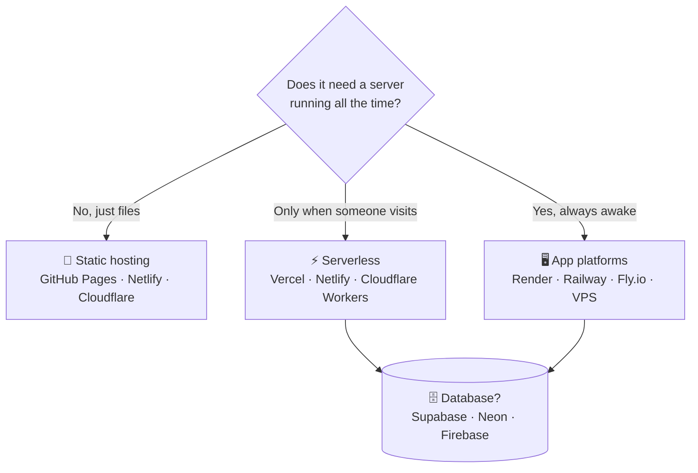
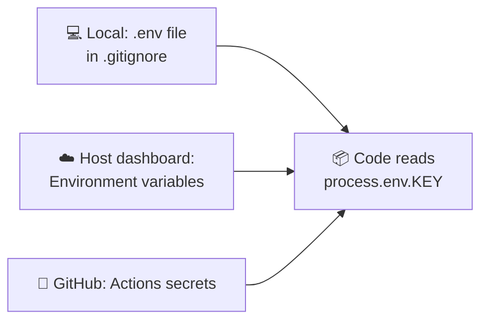

# 66 · Deploying & Hosting: Put Your Creation on the Internet 🌍🚀

> ⏱️ 10 min read · 🎯 Beginner → intermediate · 🧰 Needs: a project in a GitHub repo, and a free Vercel, Netlify, Cloudflare or GitHub account

**An app on your laptop is a hobby. An app with a link is a gift to the world.** Deploying used to be the scary part.
Today it's often a single click, and most hobby projects host **for free**. This chapter shows you where to host each kind of
project (static sites, full-stack apps, bots, automations, MCP servers), how to handle secrets and domains, and how to let
your AI helper do the fiddly bits.

<details class="eli5" open>
<summary>🧸 ELI5: This chapter in 30 seconds</summary>

Your app lives on your computer, and only you can see it. **Deploying** means copying it to a computer that's always on and
connected to the internet, so anyone with the link can use it. Some companies give you that computer for free for small
projects. You connect your GitHub, click "deploy," and get a link to share. 🔗

</details>

<!-- in-this-chapter -->

## 🗺️ What are you deploying?

<details class="eli5">
<summary>🧸 ELI5</summary>

Different projects need different homes. A simple web page needs a simple home. An app with logins and a database, or a bot
that's always awake, needs a bit more.

</details>

| You built… | It needs… | Great homes |
|---|---|---|
| 📄 **Static site** (HTML, docs, portfolio, this manual) | Just file hosting | GitHub Pages, Netlify, Cloudflare Pages, Vercel |
| ⚛️ **Web app** (Next.js, React, Svelte) | Hosting + server functions | **Vercel**, Netlify, Cloudflare |
| 🗄️ **App with database + logins** | The above + a database | Vercel/Netlify + **Supabase**, Firebase, Neon |
| 🐍 **Python API / backend** | An always-on server or container | Render, Railway, Fly.io, Google Cloud Run |
| 🤖 **Bot** (Discord, Telegram, Slack) | An always-on process (or webhooks) | Railway, Render, Fly.io, a home server |
| ⚙️ **Automation** (n8n) | An always-on server | n8n Cloud, a small VPS, your home lab |
| 🔌 **Remote MCP server** | An HTTPS endpoint | Cloudflare Workers, Vercel, Cloud Run, Render |
| 🎮 **Game / prototype** | Static hosting | itch.io, GitHub Pages, Netlify |
| 🎨 **Claude Artifact** | Nothing! | Publish and share the link right from Claude |



## 🔑 Hosting vocabulary in 60 seconds

<details class="eli5">
<summary>🧸 ELI5</summary>

A few words you'll hear a lot: "static" means plain files, "serverless" means code that wakes up only when needed, "domain"
is your web address, and "environment variables" are secret settings.

</details>

| Word | Meaning |
|---|---|
| **Static site** | Plain files (HTML, CSS, JS, images) served as-is. Fast, cheap, usually free |
| **Build** | Turning your source code into deployable files (`npm run build`) |
| **Serverless function** | Code that runs on demand (per request), with no server to manage |
| **Edge** | Running close to users around the world, for speed |
| **Container** | A packaged app with everything it needs (Docker) |
| **VPS** | A rented virtual computer you control fully |
| **Environment variables** | Settings and secrets given to your app at runtime (API keys) |
| **Domain / DNS** | Your web address, and the phonebook that points it at your host |
| **Preview deployment** | A temporary live copy of each branch or pull request |
| **CI/CD** | Robots that test and deploy on every push ([Git & GitHub](61-git-and-github.md#-github-actions-robots-that-work-for-you)) |

## ⚡ The one-click path: Vercel & Netlify

<details class="eli5">
<summary>🧸 ELI5</summary>

Connect your GitHub, pick your project, click deploy. Every time you save new code to GitHub, the website updates by itself.

</details>

1. Push your project to **GitHub**.
2. Sign in to **Vercel** or **Netlify** with GitHub.
3. **Import** the repo. It auto-detects the framework (Next.js, Vite, Astro, SvelteKit…).
4. Add **environment variables** (e.g. `NEXT_PUBLIC_SUPABASE_URL`, `ANTHROPIC_API_KEY`).
5. Click **Deploy**. ☕ In a minute or two you get a URL like `gift-circle.vercel.app`.
6. From now on, **every push to `main` redeploys**, and every pull request gets its own **preview URL**. 🤯

> [!TIP]
> **💡 Preview deployments are a superpower with AI agents**
> When an agent opens a pull request, the preview link lets you click around the new version *before* merging. Review the
> live app, not just the code.

**CLI alternative** (great for agents):

```bash
npx vercel          # first time: links the project, then deploys a preview
npx vercel --prod   # deploy to production
```

## 📄 Free static hosting: GitHub Pages & friends

<details class="eli5">
<summary>🧸 ELI5</summary>

If your website is just pages (no logins, no database), GitHub will host it for free, forever. This very manual lives there!

</details>

**GitHub Pages** hosts straight from your repo, and this manual's website is built by a GitHub Action and deployed there.

1. Repo → **Settings → Pages** → Source: **GitHub Actions** (or "Deploy from a branch" for plain HTML).
2. For a plain HTML site, put `index.html` in the root or `docs/`. Done.
3. For built sites (MkDocs, Vite, Astro), use a workflow that builds and uploads the site. Ask your agent: *"Add a GitHub
   Actions workflow that builds this site and deploys it to GitHub Pages."*

| Host | Free tier highlights |
|---|---|
| **GitHub Pages** | Public repos, custom domains, HTTPS |
| **Cloudflare Pages** | Generous bandwidth, global edge, Workers for functions |
| **Netlify** | Forms, functions, deploy previews |
| **Vercel** | Best-in-class for Next.js, previews, functions |

## 🗄️ Databases, logins & storage

<details class="eli5">
<summary>🧸 ELI5</summary>

If your app needs to remember things or know who's logged in, you add a database service. Supabase gives you a database,
logins and file storage in one place, with a free tier.

</details>

| Service | What you get | Why beginners love it |
|---|---|---|
| **Supabase** | Postgres database, auth, file storage, edge functions, vector search | AI builders know it well, great dashboard |
| **Firebase** | NoSQL database, auth, hosting, storage | Google's mature, mobile-friendly stack |
| **Neon** | Serverless Postgres with branching | Pairs well with Vercel |
| **Convex** | Reactive backend in TypeScript | Real-time apps with little code |
| **Turso / SQLite** | Lightweight SQL at the edge | Tiny apps, fast reads |

**Golden rules:** enable **row-level security**, keep the **service key on the server only**, and **back up** anything you
can't afford to lose.

## 🐍 Always-on apps, bots & backends

<details class="eli5">
<summary>🧸 ELI5</summary>

Bots and some apps need to be awake all the time, like a shopkeeper who never closes. For those, you rent a small always-on
computer from services like Render or Railway.

</details>

| Platform | Style | Great for |
|---|---|---|
| **Render** | Connect GitHub, pick "web service" or "background worker" | Python/Node APIs, bots, cron jobs |
| **Railway** | Deploy from GitHub or a template in a few clicks | Bots, databases, n8n, quick experiments |
| **Fly.io** | Containers close to your users | Apps that need global speed |
| **Google Cloud Run** | Containers that scale to zero | APIs and MCP servers, pay per use |
| **A VPS** (Hetzner, DigitalOcean…) | A whole Linux server | n8n, multiple bots, full control |
| **Home server** | A mini PC or Raspberry Pi | Private tools, local AI ([Home Lab](../part-9-local-ai/80-home-lab.md)) |

**A Dockerfile makes you portable.** Ask your agent: *"Write a Dockerfile for this bot and a `render.yaml` so I can deploy it
to Render."* Once it runs in a container, it runs almost anywhere.

> [!NOTE]
> **📌 Webhooks vs. always-on**
> Many bots (Telegram, Slack) can use **webhooks** instead of staying awake: the platform calls your URL when a message
> arrives. That means a serverless function can host your bot for free or nearly free ([Webhooks, APIs & JSON](../part-5-automation/46-webhooks-apis-json.md)).

## 🔌 Hosting a remote MCP server

<details class="eli5">
<summary>🧸 ELI5</summary>

If you built a tool plug-in (an MCP server) and want to use it from your phone or share it with friends, you put it on the
internet with a web address, and protect it with a login.

</details>

Local MCP servers run on your machine. **Remote** ones live at an HTTPS URL, so they work from Claude on the web, your phone
and other people's apps ([Building MCP Servers](../part-4-mcp-and-connectors/42-building-mcp-servers.md)).

| Host | Why |
|---|---|
| **Cloudflare Workers** | Templates for remote MCP servers with OAuth, a generous free tier |
| **Vercel** | MCP handlers inside a Next.js app |
| **Cloud Run / Render / Railway** | Run the Python or TypeScript SDK server in a container |

**Checklist:** HTTPS ✅ · **authentication** (OAuth or at least a secret token) ✅ · rate limits ✅ · logs ✅ · no secrets in
tool outputs ✅. The full walkthrough is [Build-Along: Publish an MCP Server](../part-13-build-alongs/113-build-along-publish-an-mcp-server.md).

## 🔐 Secrets & environment variables

<details class="eli5">
<summary>🧸 ELI5</summary>

Secret keys go into the hosting service's secret settings, not into your code. Your code asks for them by name when it
runs.

</details>



| Rule | Why |
|---|---|
| Secrets live in **env vars**, never in code | Code gets shared, copied and pushed |
| `NEXT_PUBLIC_` / `VITE_` prefixed vars are **public** | They're baked into the browser bundle |
| Different keys for dev and production | A leaked dev key can't hurt production |
| Set **spend limits** on AI API keys | A bug or abuser can't drain your wallet |
| **Rotate** any key that leaks | Deleting it from code isn't enough |

## 🌐 Custom domains

<details class="eli5">
<summary>🧸 ELI5</summary>

Instead of `my-app.vercel.app`, you can buy a name like `mycoolapp.com` and point it at your app. It's like getting a
nicer street address.

</details>

1. **Buy a domain** from a registrar (Cloudflare, Namecheap, Porkbun…). Often around the price of a pizza per year. 🍕
2. In your host's dashboard, **add the domain**. It shows you the DNS records to create.
3. At your registrar, **add those DNS records** (usually a `CNAME` for `www` and an `A`/`ALIAS` record for the root).
4. Wait a few minutes (sometimes longer), and HTTPS certificates are issued **automatically**.

**Stuck?** Paste your DNS settings and the host's instructions into your assistant: *"What's wrong with my DNS setup?"*
It's excellent at this.

## 💸 Costs & free tiers

<details class="eli5">
<summary>🧸 ELI5</summary>

Most small projects cost nothing to host. The things that can cost money are AI calls and very popular apps, so set limits
and alerts.

</details>

| Cost | Typical hobby reality | Protect yourself |
|---|---|---|
| Static hosting | Free | Nothing to do 🎉 |
| Serverless functions | Free tier covers most hobby apps | Watch usage dashboards |
| Databases | Free tiers (may pause when idle) | Upgrade only when you have real users |
| Always-on servers | Small monthly fee, some free tiers | Pick the smallest size first |
| **AI API calls** | The biggest variable! | **Spend limits**, rate limits, caching ([Cost Optimization](../part-12-mastery/106-cost-optimization.md)) |
| Domains | A small yearly fee | Turn off auto-renew for experiments you'll abandon |

> [!WARNING]
> **⚠️ Protect public AI features**
> If your app calls an AI API for visitors, add **rate limits per user**, require login for heavy features, and set a
> **hard monthly spend cap** on your API key. Bots find open AI endpoints fast.

## 🤖 Let your agent do the deploying

<details class="eli5">
<summary>🧸 ELI5</summary>

Your AI helper can do most of the deploying for you: writing config files, running the deploy command, and reading the error
messages when something goes wrong.

</details>

| Ask your agent | Result |
|---|---|
| *"Get this project ready to deploy on Vercel. List the env vars I need to set."* | Config + a checklist |
| *"Write a Dockerfile and deploy instructions for Render."* | A portable container setup |
| *"Here's the failed build log. What's wrong?"* | A diagnosis and fix |
| *"Add a GitHub Action that deploys to Pages on every push to main."* | CI/CD in one prompt |
| *"Add a health-check endpoint and uptime monitoring."* | A `/health` route + monitor setup |
| *"Make the site load faster. Check images, fonts and bundle size."* | Performance fixes |

Many hosts also have **MCP servers or CLIs** (Vercel, Netlify, Cloudflare, Supabase), so agents can deploy, read logs and
manage settings directly.

## 🩺 After launch: logs, monitoring & updates

<details class="eli5">
<summary>🧸 ELI5</summary>

Once it's live, keep an eye on it: check the logs when something's weird, get an alert if it goes down, and keep the parts up
to date.

</details>

- **Logs:** every host has a logs page. When users report a bug, logs tell the story.
- **Error tracking:** Sentry catches errors with details (and has an MCP server, so agents can fix them).
- **Uptime monitoring:** free services ping your site and alert you if it goes down.
- **Analytics:** privacy-friendly tools (Plausible, Umami, PostHog) show what people use.
- **Updates:** ask a background agent monthly: *"Update dependencies, run tests, open a PR."*
- **Backups:** export your database regularly, or use your provider's backups.

## 🎯 Key takeaways

- Match the host to the project: **static → Pages/Netlify/Cloudflare**, **web apps → Vercel/Netlify**, **always-on →
  Render/Railway/Fly/VPS**.
- Connect GitHub once, and **every push deploys**, with **preview URLs** for every PR.
- **Secrets go in env vars**, and `NEXT_PUBLIC_`/`VITE_` variables are public.
- AI API calls are the main cost risk: **spend caps and rate limits**.
- Your agent is a great **deploy buddy**: config, Dockerfiles, CI and log debugging.

## 🧠 Check yourself

<details class="quiz">
<summary>❓ 1. You built a portfolio site with plain HTML and CSS. What's the simplest free host?</summary>

**GitHub Pages** (or Netlify / Cloudflare Pages). No server needed.

</details>

<details class="quiz">
<summary>❓ 2. Is it OK to put your Anthropic API key in a `NEXT_PUBLIC_` environment variable?</summary>

**No!** `NEXT_PUBLIC_` variables are bundled into browser code, so anyone can see them. Keep AI keys in server-only variables.

</details>

<details class="quiz">
<summary>❓ 3. Your Telegram bot needs to respond 24/7. Name two ways to host it.</summary>

An **always-on process** (Render, Railway, Fly.io, a VPS or home server), or **webhooks** pointing at a serverless function.

</details>

> [!TIP]
> **🎮 Try this**
> Take the tiny compliment page from [Git & GitHub](61-git-and-github.md) (or any HTML file), push it to GitHub, and turn on
> **GitHub Pages**. Then send the link to a friend. Your first thing on the internet, live in under 10 minutes. 🌍🎉

---

**Next:** [67 · Calling AI APIs Directly →](67-calling-ai-apis.md)
