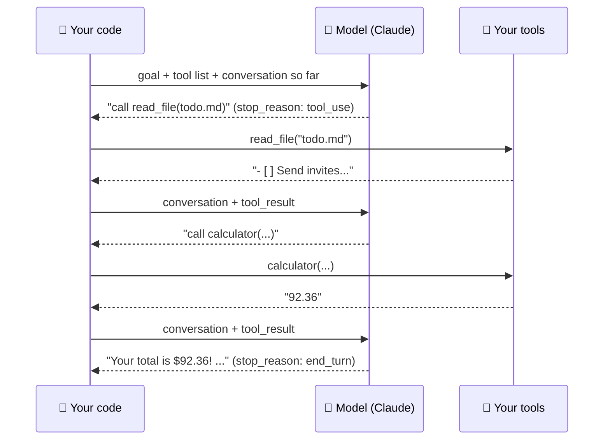

# 68 · Build Your Own Agent 🤖🔧

> ⏱️ 9 min read · 🎯 Intermediate · 🧰 Needs: Python 3.10+, an Anthropic API key, the [build-your-own-agent kit](../../examples/build-your-own-agent/)

**You've used agents. Now you'll build one and understand exactly what's happening inside.** Once you've written an agent
loop yourself, every "AI agent" product stops being mysterious, and you can build custom agents for anything: research,
files, inboxes, games, your home. The secret is surprisingly small. Let's open the hood. 🔧

<details class="eli5" open>
<summary>🧸 ELI5: This chapter in 30 seconds</summary>

An agent is an AI that can **do things**, not just talk. You give it a goal and a toolbox (a calculator, a file reader, a web
search). It thinks "I need the calculator," uses it, looks at the answer, thinks again, uses another tool, and keeps going
until the job is done. That "think → use a tool → look → think again" circle is called **the loop**, and you'll write it
yourself in about 100 lines.

</details>

<!-- in-this-chapter -->

> [!NOTE]
> **🌍 Same loop, any provider**
> The starter kit uses the Claude API, but the agent loop (send tools → model asks for a tool → run it → send the result
> back → repeat) is identical with OpenAI's function calling, Gemini's function calling, Grok, DeepSeek or a local model
> through Ollama. Only the field names change; see the [translation table](67-calling-ai-apis.md#-the-same-first-call-with-openai-gemini--friends).
> Frameworks in the [Agent Frameworks Tour](69-agent-frameworks-tour.md) hide the differences entirely.

## 🧩 The whole secret, in one diagram

<details class="eli5">
<summary>🧸 ELI5</summary>

Your program sends the AI a goal and a list of tools. The AI says "please use this tool." Your program uses it and reports
back. Repeat until the AI says "done!"

</details>



> [!TIP]
> **🎯 The formula**
> **An agent = a model + tools + a loop + a stopping rule.** That's it. Everything else is refinement.

## 🤔 When do you actually need an agent?

<details class="eli5">
<summary>🧸 ELI5</summary>

Not every job needs an agent. If the steps are always the same, a simple recipe is better. Agents are for jobs where the AI
has to figure out the steps as it goes.

</details>

| Pattern | What it is | Use when | Example |
|---|---|---|---|
| **Single call** | One prompt → one answer | The task is one step | "Summarize this email" |
| **Workflow / chain** | Fixed steps you define | The steps are always the same | "Transcribe → summarize → email me" |
| **Router** | AI picks which fixed path to take | A few known categories | "Is this a refund, a bug or a question?" |
| **Agent** | AI decides the steps in a loop | Open-ended, the path varies | "Find why the build fails and fix it" |

**Start simple.** Many "agent" ideas are really a single API call or a fixed workflow in n8n. Reach for a full agent when
the task is **open-ended and multi-step**, and the model needs to decide the path.

## 🚀 Hands-on: run the ~100-line agent

<details class="eli5">
<summary>🧸 ELI5</summary>

This repo includes a tiny, complete agent with four safe tools. You run it with one command and watch every step it takes.

</details>

The [build-your-own-agent kit](../../examples/build-your-own-agent/) is a complete, commented agent with four harmless tools
(`calculator`, `list_files`, `read_file`, `now`) working in a sandbox folder:

```bash
cd examples/build-your-own-agent
pip install -r requirements.txt
export ANTHROPIC_API_KEY=sk-ant-...
python agent.py "How much will the party shopping list cost in total, and what's still left on my to-do list?"
```

You'll see each step printed: which tool it chose, what the tool returned, and the final answer. Watching a trajectory
scroll by is the moment agents "click." 💡

## 🔍 Walkthrough of `agent.py`

<details class="eli5">
<summary>🧸 ELI5</summary>

Three parts: a menu that describes the tools, the actual tools, and the loop that keeps asking the AI "what next?" until it's
done.

</details>

**1 · Describe the tools** (the model's instruction manual):

```python
{"name": "read_file",
 "description": "Read a text file from the workspace folder by name, e.g. 'todo.md'.",
 "input_schema": {"type": "object", "properties": {"name": {"type": "string"}}, "required": ["name"]}}
```

The **name and description are everything**: they're how the model decides when and how to use each tool.

**2 · Implement them** (plain functions, with safety checks):

```python
def run_tool(name, args):
    if name == "read_file":
        path = (WORKSPACE / args["name"]).resolve()
        if WORKSPACE.resolve() not in path.parents:
            raise ValueError("That file is outside the workspace")
        return path.read_text()
```

**3 · The loop:**

```python
for turn in range(MAX_TURNS):
    response = client.beta.messages.create(model=MODEL, tools=TOOLS, messages=messages, ...)
    messages.append({"role": "assistant", "content": response.content})
    tool_calls = [b for b in response.content if b.type == "tool_use"]
    if not tool_calls:
        return final_text                         # done!
    results = [{"type": "tool_result", "tool_use_id": c.id, "content": run_tool(c.name, c.input)}
               for c in tool_calls]
    messages.append({"role": "user", "content": results})   # all results in ONE message
```

That's the entire engine of every coding agent, research agent and automation agent you've ever used. 🤯

## 🏅 Details that separate toy agents from good ones

<details class="eli5">
<summary>🧸 ELI5</summary>

Small details make a big difference: telling the AI when a tool failed (so it can try something else), setting a step limit
so it can't run forever, and keeping a diary of every step.

</details>

| Detail | Why |
|---|---|
| **Return all tool results in one message** | Keeps parallel tool calls working |
| **Send errors back as `tool_result` with `is_error: true`** | The model adapts ("file not found → let me list files first") |
| **A max-turns limit** | Prevents runaway loops and runaway bills |
| **Sandboxed tools** | The model can be persuaded, so tools must enforce their own limits |
| **Check `stop_reason`** | Handle `max_tokens`, `refusal` and friends explicitly |
| **Log every step** | Debugging agents means reading their trajectory |
| **Great tool descriptions** | Say when to use it, what it returns, and examples of input |
| **Useful tool output** | Return concise, relevant data, not a 10,000-line dump |

## 🛠️ Designing great tools

<details class="eli5">
<summary>🧸 ELI5</summary>

A good tool does one clear job, has a name that explains itself, and gives back short, useful answers. Think of making tools
for a clever new helper who has never seen your house.

</details>

| Do ✅ | Don't ❌ |
|---|---|
| `search_recipes(ingredients, max_minutes)` | `do_stuff(json_blob)` |
| Clear descriptions with examples | One-word descriptions |
| Return the 10 most relevant results | Return the whole database |
| Helpful error messages ("City not found. Try 'Lisbon, PT'") | Stack traces |
| Few tools that cover the job | 60 overlapping tools |
| Read-only by default, with separate write tools | One tool that reads, writes and deletes |

> [!TIP]
> **💡 Ask the model to review your tools**
> *"Here are my tool definitions. As the agent who has to use them, what's confusing, missing or ambiguous?"* Models give
> excellent feedback on their own toolbox.

## 📈 Leveling up your agent

<details class="eli5">
<summary>🧸 ELI5</summary>

Once the basic agent works, you can make it ask permission before risky actions, remember things between runs, plug in
ready-made tools, and let the SDK do the boring loop code for you.

</details>

### 🙋 Human-in-the-loop approvals

```python
if call.name in {"send_email", "delete_file"}:
    if input(f"Allow {call.name}({call.input})? [y/N] ").lower() != "y":
        output, is_error = "User declined this action.", True
```

### 🧠 Memory across runs

Save `messages` (or a summary of them) to a JSON file at the end and reload it next time. For long-term facts, give the
agent `remember(fact)` and `recall(query)` tools backed by a file or database ([Memory for Agents](../part-8-knowledge-and-memory/75-memory-for-agents.md)).

### 🔌 Plugging in MCP servers

Instead of writing tools, **connect MCP servers** and forward their tools to the model. Your agent instantly gains GitHub,
Notion, browser control and more. The Claude API also has an **MCP connector** that can call remote MCP servers for you.

### 🏃 Let the SDK run the loop

Once you understand the loop, use the SDK's **tool runner** to skip the boilerplate ([Calling AI APIs](67-calling-ai-apis.md#-tool-use-letting-the-model-call-your-functions)).

### 🧰 Give it a real harness

For file editing, shell commands, search, subagents and context management out of the box, use the **Claude Agent SDK**
([Claude Code Power-Ups](63-claude-code-power-ups.md#-the-claude-agent-sdk)).

## 🧭 Choosing how to build agents

<details class="eli5">
<summary>🧸 ELI5</summary>

You can build agents from scratch, with a helper library, with a big framework, or with drag-and-drop tools. Start simple and
move up when you need more.

</details>

| Approach | You write | Use when |
|---|---|---|
| **Manual loop** (this chapter) | Everything | Learning, or full control over every step |
| **SDK tool runner** | Just tool functions | Most custom agents with your own tools |
| **Claude Agent SDK** | A prompt + options | You want Claude Code's full harness inside your app |
| **Managed agent platforms** (e.g. Claude Managed Agents) | Config + your tools | You want the provider to host the loop and a sandbox, with long-running sessions |
| **Frameworks** (LangGraph, OpenAI Agents SDK, CrewAI, Pydantic AI, Mastra, Google ADK) | Framework-style code | Complex graphs, multi-provider setups, team conventions ([Agent Frameworks Tour](69-agent-frameworks-tour.md)) |
| **No-code** (n8n AI Agent, Zapier Agents, Make AI Agents) | Nothing (visual) | Agents wired into business workflows ([n8n AI Agents](../part-5-automation/48-n8n-ai-agents.md)) |

## 🐞 Debugging agents

<details class="eli5">
<summary>🧸 ELI5</summary>

When an agent does something silly, read its diary (the log of every step). Usually a tool description was confusing or a
tool gave back something unhelpful.

</details>

| Symptom | Likely cause | Fix |
|---|---|---|
| Never uses a tool | Vague tool description | Say *when* to use it, with an example |
| Uses the wrong tool | Overlapping tools | Merge or clearly separate them |
| Loops forever | No success signal, confusing errors | Clear error messages, a max-turns limit, a "done" criterion |
| Makes things up instead of calling tools | The prompt doesn't require tools | *"Always look things up with tools. Never guess prices."* |
| Gets lost in long tasks | Context overflow | Summarize progress, use a scratchpad file, split into subtasks |
| Expensive | Huge tool outputs, too many turns | Trim outputs, cache prompts, cheaper model for simple steps |

## 🏛️ Agent design principles

<details class="eli5">
<summary>🧸 ELI5</summary>

Five rules for good agents: simple tools, a way to check its work, a small playground, limits on everything, and always
keeping a diary.

</details>

1. **Few, well-described tools** beat many vague ones.
2. **Give it a way to verify** (tests, a "check" tool, reading back what it wrote).
3. **Constrain the blast radius:** sandboxes, allowlists, read-only by default.
4. **Budget everything:** turns, tokens, time, money.
5. **Observe:** log trajectories, and review failures to improve prompts and tools ([Evaluating AI](../part-12-mastery/105-evaluating-ai.md)).

## 💡 Agent ideas to build

<details class="eli5">
<summary>🧸 ELI5</summary>

A dozen agents you could build, each with the tools it needs.

</details>

| Agent | Tools |
|---|---|
| 📚 Research agent | web search, fetch, save_note ([Build-Along](../part-13-build-alongs/116-build-along-research-agent.md)) |
| 🗂️ File organizer | list, move, rename (with an approval gate!) |
| 📧 Inbox assistant | Gmail search and draft (never send without approval) |
| 🧪 Data analyst | read CSV, run pandas in a sandbox, make charts |
| 🎲 Game master | dice, NPC generator, campaign memory |
| 🛒 Deal hunter | fetch product pages, price history DB, notify |
| 🌱 Garden planner | weather forecast, planting calendar, notes |
| 🍳 Meal planner | pantry list, recipe search, grocery list writer |
| 🏠 Home helper | Home Assistant MCP (lights, sensors), with approvals |
| 🧑‍🏫 Study buddy | flashcards DB, quiz generator, progress tracker |
| ✈️ Trip planner | flight/hotel search, weather, itinerary writer |
| 🐙 Repo janitor | GitHub issues, labels, stale-PR finder |

## 🎯 Key takeaways

- **Agent = model + tools + loop + stopping rule.** You can write one in ~100 lines.
- **Tool descriptions and outputs** are where most agent quality comes from.
- Send **errors back to the model**, cap the **turns**, sandbox the **tools**, and **log** everything.
- Use a **workflow** when steps are fixed, and an **agent** when the path varies.
- Graduate to the **tool runner**, the **Agent SDK** or a **framework** once you understand the loop.

## 🧠 Check yourself

<details class="quiz">
<summary>❓ 1. What are the four ingredients of an agent?</summary>

A **model**, **tools**, a **loop**, and a **stopping rule** (like "no more tool calls" or a max-turns limit).

</details>

<details class="quiz">
<summary>❓ 2. A tool fails with "file not found." What should your code send back to the model?</summary>

A `tool_result` with the error message and **`is_error: true`**, so the model can adapt (for example, list the files first).

</details>

<details class="quiz">
<summary>❓ 3. Your task is always "transcribe → summarize → email." Agent or workflow?</summary>

A **workflow**. The steps never change, so a fixed chain is cheaper, faster and more predictable.

</details>

> [!TIP]
> **🎮 Try this**
> Add a `write_file` tool to the kit's agent (workspace-only!) plus a y/N approval prompt. Then ask it to *"write a shopping
> plan to plan.md, grouped by store."* You've built a **safe, human-supervised agent that takes actions**. 🏆

---

**Next:** [69 · Agent Frameworks Tour →](69-agent-frameworks-tour.md)
