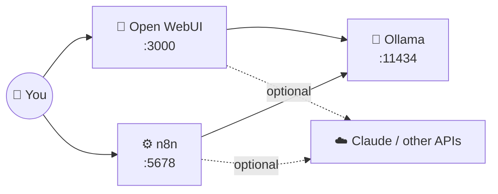

# 27 · The AI Home Lab 🏠🔬

A **home lab** is your personal AI playground: models, chat UIs, automations, and databases running on
hardware you control. It's private, it's free to run all day, and it's one of the best ways to understand how
all these pieces fit together. This chapter gets you from zero to a working lab in about 15 minutes.

---

## The one-command lab 🚀

The [homelab kit](../../examples/homelab/) runs three services with Docker Compose:



```bash
cd examples/homelab
docker compose up -d
docker compose exec ollama ollama pull gemma3
```

Open **http://localhost:3000** and you're chatting with a model running on your own machine. 🎉

## Hardware: what do you need? 🖥️

| Setup | What runs well | Notes |
|---|---|---|
| Any laptop, 8 GB RAM | 1–4B models | Fine for summaries, tagging, simple chat |
| 16 GB RAM / Apple M-series | 7–14B models | The sweet spot for most people |
| 32–64 GB Mac (unified memory) | 20–35B+ models | Macs punch above their weight thanks to unified memory |
| PC with a 12–24 GB NVIDIA GPU | 14–35B models, fast | Great tokens-per-second |
| Mini PC / old desktop (always-on) | n8n, databases, small models | A perfect 24/7 automation box |
| Raspberry Pi 5 | n8n, tiny models | Fun, low-power, great for automations |

**Upgrade path:** start with what you have. The lab is useful even if the models are small, because n8n can call cloud
models for the hard stuff.

## Level-ups for your lab 📈

| Add | Why | How |
|---|---|---|
| **Tailscale** | Reach your lab securely from your phone, anywhere | Install on the host + phone. No port-forwarding! |
| **Postgres + pgvector** | A real database and vector store for n8n RAG | Add a `postgres` service (pgvector image) |
| **Qdrant** | A dedicated vector database | Add a `qdrant` service |
| **Whisper** (speech-to-text) | Transcribe voice memos locally | faster-whisper server container |
| **SearXNG** | Private web search for Open WebUI and agents | Add a container and enable web search in Open WebUI |
| **Home Assistant** | Smart home + AI (it has an MCP server!) | Separate install, then connect ([Ch. 5](../part-2-mcp-and-connectors/05-mcp-server-catalog.md)) |
| **Uptime Kuma** | Monitors that everything's running | One container, with alerts to your phone |
| **Cloudflare Tunnel** | Expose *specific* webhooks publicly (safely) | For n8n webhooks from outside services |

💡 **Let AI do the plumbing:** open Claude Code in `examples/homelab` and ask:
*"Add Postgres with pgvector and Qdrant to this compose file, wire n8n to Postgres, and update the README."*

## Five home lab projects 🎮

### 1. Private document chat 📄
Open WebUI → **Workspace → Knowledge** → upload your manuals, notes, or tax docs → chat with them. Nothing leaves your machine.

### 2. Local voice journal 🎙️
Phone shortcut → n8n webhook (via Tailscale) → Whisper transcription → Ollama summarizes and tags → Markdown file in your
Obsidian vault. **Your diary never touches the cloud.**

### 3. The hybrid assistant 🌗
In Open WebUI, add both local models *and* a Claude API key. Use local for private or quick stuff and Claude for the hard
thinking, all in one interface.

### 4. The 24/7 automation box ⚙️
Move n8n to an always-on mini PC or Pi. Run the Morning Digest, idea inbox, and price trackers without leaving your laptop on.

### 5. Model tasting night 🍷
Pull 3–4 models (`gemma3`, `llama3.2`, `qwen3`, `mistral`) and run the same 10 prompts through Open WebUI's side-by-side
mode. Score them blind. You'll develop real intuition for model differences. ([Ch. 38](../part-10-mastery/38-evaluating-ai.md))

## Maintenance cheat sheet 🧰

```bash
docker compose pull && docker compose up -d        # update all services
docker compose exec ollama ollama list             # installed models
docker compose exec ollama ollama rm <model>       # free disk space
docker system df                                   # what's using disk
```

Back up the volumes (or bind-mount folders you back up), especially `n8n_data`, since it holds your workflows and credentials.

## Security basics 🔒
- Keep services on **localhost or Tailscale**. Never expose them raw to the internet.
- Set strong passwords (Open WebUI admin, n8n owner).
- Keep images updated.
- If you do expose something (a webhook), use HTTPS + auth + a tunnel, and expose *only* that path.

---

### 🎮 Try this
Get the lab running, then do project #1 with a document you'd *never* upload to a cloud service. Feeling the
privacy of local AI firsthand is a great "aha." 🔒

---

**Next:** [28 · The Multimodal Playground →](../part-8-creative-ai/28-multimodal-playground.md)
