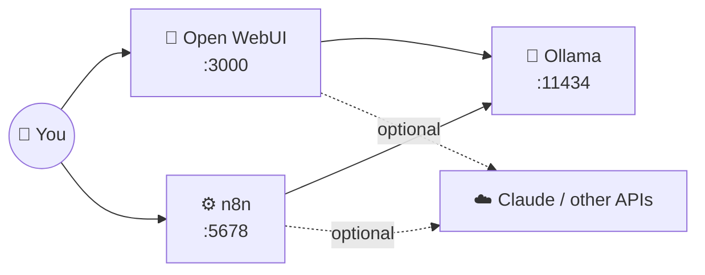

# 49 · The AI Home Lab: Your Private AI Playground 🏠🔬

> ⏱️ 7 min read · 🎯 Beginner → intermediate (copy-paste friendly) · 🧰 Needs: Docker, 16 GB RAM recommended, the [homelab kit](../../examples/homelab/)

**A home lab is your personal AI playground: models, chat UIs, automations and databases running on hardware you control.**
It's private, it's free to run all day, and it's one of the best ways to understand how all the pieces in this manual fit
together. This chapter gets you from zero to a working lab in about 15 minutes, then shows you how to grow it into a 24/7
private assistant with voice, search, RAG and remote access from your phone. 🧪📱

<details class="eli5" open>
<summary>🧸 ELI5: This chapter in 30 seconds</summary>

A home lab is like a science kit for AI that lives in your house. With one command, your computer starts three helpers: a
**brain** (Ollama, which runs the AI models), a **chat window** (Open WebUI, like your own private ChatGPT), and a **robot
arm** (n8n, which does automatic chores). Everything stays inside your house, and you can add more gadgets whenever you like.

</details>

<!-- in-this-chapter -->

## 🧩 What's in the lab

<details class="eli5">
<summary>🧸 ELI5</summary>

Three programs work together: one runs the AI, one lets you chat with it, and one does automatic jobs with it.

</details>



| Service | Job | Like… |
|---|---|---|
| 🦙 **Ollama** | Runs open models and serves an API | The engine |
| 💬 **Open WebUI** | ChatGPT-style interface with document chat, tools, multiple users | The dashboard |
| ⚙️ **n8n** | Automations and AI agents ([n8n Masterclass](../part-3-automation/16-n8n-masterclass.md)) | The robot arms |

## 🚀 The one-command lab

<details class="eli5">
<summary>🧸 ELI5</summary>

Install Docker (a program that runs other programs in neat boxes), then one command starts everything.

</details>

1. Install **Docker Desktop** (Mac/Windows) or Docker Engine (Linux).
2. Start the lab:

    ```bash
    cd examples/homelab
    docker compose up -d                              # first run downloads a few GB
    docker compose exec ollama ollama pull gemma4     # grab a model
    ```

3. Open **http://localhost:3000**, create the admin account, pick your model, and chat. 🎉
4. Open **http://localhost:5678** and create the n8n owner account.

> [!TIP]
> **🍎 On a Mac? Run Ollama natively**
> Docker can't use the Mac GPU. For much faster models, install **Ollama from ollama.com**, remove the `ollama` service from
> the compose file, and point Open WebUI and n8n at `http://host.docker.internal:11434`. The [kit's README](../../examples/homelab/README.md)
> has the details.

**Stuck?** Open Claude Code in `examples/homelab` and say *"Get this running on my machine and fix whatever's wrong."* It'll
read the error messages for you.

## 🔌 Wire everything together

<details class="eli5">
<summary>🧸 ELI5</summary>

Tell the automation robot where the AI brain lives, and optionally give the chat window a key to a smarter online AI for
hard questions.

</details>

| Connection | How |
|---|---|
| **n8n → Ollama** | Add an **Ollama** credential with base URL `http://ollama:11434` (containers reach each other by service name) |
| **Open WebUI → Claude** | Settings → Connections → add an Anthropic (or OpenAI-compatible) API key |
| **Open WebUI → documents** | Workspace → **Knowledge** → upload files → chat with them (built-in RAG) |
| **n8n → Claude** | An Anthropic credential for the hard jobs, Ollama for the private and bulk ones |
| **Claude Code → lab** | Point MCP servers or scripts at `localhost` services |

## 📈 Level-ups for your lab

<details class="eli5">
<summary>🧸 ELI5</summary>

Once the basics work, you can add gadgets: a way to reach your lab from your phone, a database, voice transcription, private
web search, and more.

</details>

| Add | Why | How |
|---|---|---|
| 🔐 **Tailscale** | Reach your lab securely from your phone, anywhere | Install on the host + phone. No port-forwarding! |
| 🐘 **Postgres + pgvector** | A real database and vector store for n8n RAG | Add a `postgres` service (pgvector image) |
| 🔎 **Qdrant** | A dedicated vector database | Add a `qdrant` service |
| 🎙️ **Whisper** (speech-to-text) | Transcribe voice memos locally | A faster-whisper server container |
| 🗣️ **Local TTS** (Piper, Kokoro-style voices) | Give your assistant a voice | A TTS container, then enable it in Open WebUI |
| 🌐 **SearXNG** | Private web search for Open WebUI and agents | Add a container, enable web search in Open WebUI |
| 🎨 **ComfyUI** | Local image generation (NVIDIA recommended) | A ComfyUI container ([Image Generation](../part-8-creative-ai/53-image-generation-deep-dive.md)) |
| 🏡 **Home Assistant** | Smart home + AI (it has an MCP server!) | Separate install, then connect ([Private Home Assistant](../part-11-build-alongs/86-build-along-private-home-assistant.md)) |
| 📈 **Uptime Kuma** | Watches that everything's running | One container, alerts to your phone |
| 🚇 **Cloudflare Tunnel** | Expose *specific* webhooks publicly, safely | For n8n webhooks from outside services |

> [!TIP]
> **🪄 Let AI do the plumbing**
> Open Claude Code in `examples/homelab` and ask: *"Add Postgres with pgvector, Qdrant and a Whisper server to this compose
> file, wire n8n to Postgres, and update the README."*

## 🎮 Eight home lab projects

<details class="eli5">
<summary>🧸 ELI5</summary>

Eight fun projects for your lab, from chatting with private documents to building a voice diary that never leaves your house.

</details>

### 1 · Private document chat 📄

Open WebUI → **Workspace → Knowledge** → upload manuals, notes or tax docs → chat with them. Nothing leaves your machine.

### 2 · Local voice journal 🎙️

Phone shortcut → n8n webhook (via Tailscale) → Whisper transcription → Ollama summarizes and tags → a Markdown file in your
Obsidian vault. **Your diary never touches the cloud.**

### 3 · The hybrid assistant 🌗

In Open WebUI, add local models *and* a Claude API key. Use local for private or quick stuff, Claude for the hard thinking,
all in one interface.

### 4 · The 24/7 automation box ⚙️

Move n8n to an always-on mini PC or Raspberry Pi. Run morning digests, the idea inbox and price trackers without leaving your
laptop on ([Automation Recipe Book](../part-3-automation/21-automation-recipe-book.md)).

### 5 · Model tasting night 🍷

Pull 3–4 models (`gemma4`, `qwen3.6:27b`, `gpt-oss:20b`, `mistral`) and use Open WebUI's side-by-side mode to run the same 10
prompts. Score them blind. You'll develop real intuition for model differences ([Evaluating AI](../part-10-mastery/74-evaluating-ai.md)).

### 6 · Family AI (safely) 👨‍👩‍👧

Create Open WebUI accounts for family members with a friendly, age-appropriate system prompt and a small model. Homework help
that you control ([Parents, Teachers & Students](../part-9-ai-for-life-and-work/67-parents-teachers-and-students.md)).

### 7 · Photo library tagger 📸

A local vision model + an n8n or Python batch job captions and tags thousands of photos. Search "birthday cake 2024" later.

### 8 · Private search engine 🔎

SearXNG + Open WebUI web search = a research assistant that doesn't log your queries.

## 🔐 Security basics

<details class="eli5">
<summary>🧸 ELI5</summary>

Keep your lab's doors locked: only let in your own devices, use strong passwords, and never open it up to the whole internet.

</details>

| Rule | Why |
|---|---|
| Keep services on **localhost or Tailscale** | Never expose them raw to the internet |
| **Strong passwords** for Open WebUI admin and the n8n owner | These control your data and credentials |
| **Keep images updated** | Security fixes arrive regularly |
| Expose *only* specific webhooks, with **HTTPS + auth + a tunnel** | Minimal attack surface |
| Separate accounts for family members | Everyone gets their own chats and permissions |
| Don't store API keys in compose files you share | Use an `.env` file in `.gitignore` |

> [!WARNING]
> **⚠️ Open ports get found fast**
> Bots scan the internet constantly. An exposed n8n or Ollama without authentication can be found and abused within hours.
> **Tailscale** is the easy, safe way to reach your lab remotely.

## 🧰 Maintenance cheat sheet

<details class="eli5">
<summary>🧸 ELI5</summary>

A few commands to update everything, see what's installed, free up space, and make backups.

</details>

```bash
docker compose ps                                   # what's running
docker compose logs -f open-webui                   # watch logs
docker compose pull && docker compose up -d         # update all services
docker compose exec ollama ollama list              # installed models
docker compose exec ollama ollama rm <model>        # free disk space
docker system df                                    # what's using disk
```

**Back up** the Docker volumes (or bind-mount folders you back up), especially `n8n_data`, since it holds your workflows and
credentials. Ask your agent: *"Write a nightly backup script for these Docker volumes to my external drive."*

## 🗺️ A lab growth plan

<details class="eli5">
<summary>🧸 ELI5</summary>

Grow your lab one step at a time over a month, adding one gadget each week.

</details>

| Week | Add | You can now… |
|---|---|---|
| 1 | The base lab + one model | Chat privately, chat with documents |
| 2 | Tailscale | Use your lab from your phone anywhere |
| 3 | Whisper + a voice-journal workflow | Talk to your notes 🎙️ |
| 4 | Postgres/pgvector or Qdrant + an n8n RAG bot | Ask questions of your whole document archive |

## 🎯 Key takeaways

- **One command** gives you Ollama (models), Open WebUI (chat) and n8n (automations).
- On a **Mac**, run Ollama natively for GPU speed.
- **Tailscale** gives safe remote access. Never expose services raw.
- Level up with **vector databases, Whisper, SearXNG, ComfyUI and Home Assistant**.
- Go **hybrid**: local for private and bulk, cloud models for the hardest thinking.

## 🧠 Check yourself

<details class="quiz">
<summary>❓ 1. Inside Docker, what base URL does n8n use to reach Ollama?</summary>

`http://ollama:11434`. Containers reach each other by **service name**.

</details>

<details class="quiz">
<summary>❓ 2. What's the safest easy way to use your lab from your phone while away from home?</summary>

**Tailscale** (a private network), not port-forwarding.

</details>

<details class="quiz">
<summary>❓ 3. Your Mac lab feels slow. What's the most likely fix?</summary>

Run **Ollama natively** instead of in Docker, so it can use the Mac's GPU.

</details>

> [!TIP]
> **🎮 Try this**
> Get the lab running, then do project #1 with a document you'd *never* upload to a cloud service. Feeling the privacy of
> local AI firsthand is a great "aha." 🔒

---

**Next:** [50 · Local AI for Coding & Agents →](50-local-ai-for-coding-and-agents.md)
