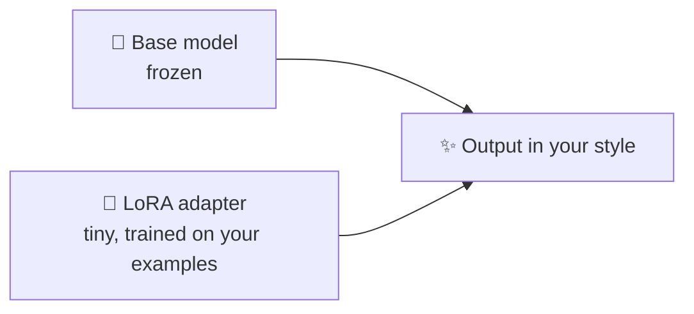

# 51 · Fine-Tuning for Normal People: Teach a Model Your Style 🎓🎛️

> ⏱️ 8 min read · 🎯 Intermediate (curious beginners welcome) · 🧰 Needs: a good dataset idea, a free Colab GPU or a Mac with 16 GB+, and patience

**Fine-tuning means taking an existing model and training it a little more on your own examples, so it picks up your
style, format or specialty.** It sounds like a PhD-only activity, but tools like Unsloth, MLX and LoRA have made it a weekend
project on free or cheap hardware. This chapter explains when fine-tuning is worth it (and when it's not!), how LoRA works in
plain English, how to prepare data, a step-by-step walkthrough, and how to run your custom model in Ollama. 🧪✨

<details class="eli5" open>
<summary>🧸 ELI5: This chapter in 30 seconds</summary>

Imagine a talented chef who can cook anything. **Fine-tuning** is like giving that chef a week of lessons in *your* grandma's
recipes: afterwards, everything they cook tastes a little like home. You don't teach them to cook from scratch (that would
take years); you just show them lots of examples of the style you love. For AI, you show it hundreds of examples of the
answers you want, and it learns to answer that way naturally.

</details>

<!-- in-this-chapter -->

## 🤔 Do you actually need fine-tuning?

<details class="eli5">
<summary>🧸 ELI5</summary>

Most of the time, you don't! Good instructions or giving the AI your documents solves most problems faster and cheaper. Fine-tuning
is for special cases.

</details>

| You want the model to… | Best tool | Why |
|---|---|---|
| Follow instructions or a format | **Prompting** + examples | Instant, free, easy to change ([Context Engineering](../part-1-foundations/05-context-engineering.md)) |
| Know facts from your documents | **RAG** or long context | Facts change; fine-tuning is bad at memorizing facts ([RAG, Memory & Knowledge](../part-6-knowledge-and-memory/41-rag-memory-and-knowledge.md)) |
| Remember you | **Memory** | Built for exactly this ([Memory for Agents](../part-6-knowledge-and-memory/44-memory-for-agents.md)) |
| Nail a **consistent style, tone or format** every time | **Fine-tuning** ✅ | Learned behavior, no long prompt needed |
| Make a **small model** do one job as well as a big one | **Fine-tuning** ✅ | Cheaper, faster, runs locally |
| Handle a **niche task** (your labels, your jargon) | **Fine-tuning** ✅ | Learns patterns from many examples |
| Speak in a character's voice for a game | **Fine-tuning** ✅ (or prompting) | Consistent personality |

> [!TIP]
> **💡 The golden rule**
> **Try prompting first. Then RAG. Fine-tune last.** Fine-tuning is for *behavior* (style, format, skill), not *knowledge*.
> If a great prompt with examples gets you 90% there, you probably don't need it.

## 🧩 How fine-tuning works (LoRA in plain English)

<details class="eli5">
<summary>🧸 ELI5</summary>

Instead of rewriting the whole giant brain, LoRA adds a tiny "sticky note" layer that nudges its answers. The sticky note is
small, cheap to train, and you can peel it off or swap it anytime.

</details>

| Method | What changes | Needs |
|---|---|---|
| **Full fine-tuning** | Every parameter in the model | Lots of GPU memory, expertise |
| **LoRA** (Low-Rank Adaptation) | Small "adapter" matrices added alongside the model; the original stays frozen | A fraction of the memory |
| **QLoRA** | LoRA on a quantized (compressed) model | Fits bigger models on consumer GPUs |



The adapter is often only tens of megabytes. You can keep one base model and swap adapters: "email-voice," "support-tone,"
"pirate-mode." 🏴‍☠️

## 📚 Step 1: Prepare your data (the part that matters most)

<details class="eli5">
<summary>🧸 ELI5</summary>

Gather lots of good examples of questions and the perfect answers. The AI learns from your examples, so messy examples make a
messy AI.

</details>

Fine-tuning data is usually **example conversations** in JSONL (one JSON object per line):

```json
{"messages": [{"role": "system", "content": "You write product descriptions for Cozy Candles."}, {"role": "user", "content": "Lavender & oat, 8oz, soy wax"}, {"role": "assistant", "content": "Slow Sunday in a jar. 🕯️ Soft lavender meets warm toasted oat..."}]}
{"messages": [{"role": "system", "content": "You write product descriptions for Cozy Candles."}, {"role": "user", "content": "Cedar & smoke, 12oz, coconut wax"}, {"role": "assistant", "content": "A cabin fire you can carry. 🌲 Crackling cedar..."}]}
```

| Guideline | Why |
|---|---|
| **Quality over quantity** | 200 excellent examples beat 5,000 sloppy ones |
| **Start with 100–1,000 examples** | Enough to learn a style or format |
| **Cover the variety** you expect | Short and long, easy and weird inputs |
| **Consistent format** | The model copies whatever patterns you show it, including mistakes |
| **Hold out 10–20% for testing** | Check it on examples it didn't train on |
| **Remove private info** | Models can memorize and repeat training data |

> [!TIP]
> **🪄 Let a big model help build the dataset**
> Write 20 perfect examples yourself, then ask Claude to *"generate 300 more in exactly this style, varied in length and
> topic."* Review a sample carefully. Using a big model to teach a small one is called **distillation**. Check the big
> model's terms of use first: some providers restrict using outputs to train other models.

## 🛠️ Step 2: Pick your tool

<details class="eli5">
<summary>🧸 ELI5</summary>

There are free tools that do the hard parts for you. Some run in your web browser on free computers, some on a Mac, and some
companies do it all for you online.

</details>

| Tool | Where | Why pick it |
|---|---|---|
| **Unsloth** | Free Google Colab or Kaggle notebooks, or your NVIDIA GPU | Fast, memory-efficient, beginner-friendly notebooks for popular models |
| **MLX-LM** | Apple Silicon Macs | LoRA fine-tuning on your Mac with one command |
| **Axolotl, LLaMA-Factory** | Your GPU or a rented one | Config-driven, powerful, lots of options (LLaMA-Factory has a web UI) |
| **Hugging Face** (TRL, AutoTrain) | Anywhere | The ecosystem everything builds on |
| **Hosted fine-tuning** | Providers like OpenAI, Google Vertex AI, Together, Fireworks | Upload JSONL, click train, get an API model |
| **Rented GPUs** | RunPod, Lambda, Modal, Vast.ai and others | Bigger models for a few dollars an hour |

## 🚀 Step 3: Train (a walkthrough)

<details class="eli5">
<summary>🧸 ELI5</summary>

Load a base model, show it your examples a few times, and save the little sticky-note adapter. The tools make this a few
clicks or one command.

</details>

=== "☁️ Unsloth on free Colab"

    1. Open one of Unsloth's **free Colab notebooks** for a small model (e.g. a Gemma, Qwen or Llama variant).
    2. Upload your `train.jsonl`, or load it from Google Drive.
    3. Run the cells: load the model in 4-bit → add LoRA adapters → train (usually minutes to an hour for small models).
    4. Test with a few prompts in the notebook.
    5. **Export to GGUF** (the notebooks include a cell for this) so you can run it in Ollama.

=== "🍎 MLX on a Mac"

    ```bash
    pip install mlx-lm
    # data/ contains train.jsonl and valid.jsonl
    mlx_lm.lora --model <a-small-hugging-face-model> --train --data ./data --iters 600
    mlx_lm.generate --model <same-model> --adapter-path adapters \
        --prompt "Cedar & smoke, 12oz, coconut wax"
    ```

    Ask Claude Code to fill in a current small model name and walk you through fusing the adapter and exporting it.

**Key settings (the defaults are usually fine):**

| Setting | Meaning | Starting point |
|---|---|---|
| **Epochs** | How many times it sees your data | 1–3 (too many = overfitting) |
| **Learning rate** | How big each adjustment is | The tool's default |
| **LoRA rank (r)** | Size of the adapter | 8–32 |
| **Max length** | Longest example it handles | Fit your longest example |

## 🧪 Step 4: Evaluate honestly

<details class="eli5">
<summary>🧸 ELI5</summary>

Test your new model on examples it never saw, and compare it to the original model with a good prompt. Only keep it if it's
really better.

</details>

1. Run your **held-out test examples** through the fine-tuned model **and** the base model with your best prompt.
2. Compare side by side, ideally **blind** (you don't know which is which). 🙈
3. Check for **overfitting**: does it only work on inputs just like the training data? Does it repeat training examples word for word?
4. Check for **side effects**: did it get worse at general things it used to do well?

If the base model with a good prompt is just as good, **keep the prompt**. Cheaper, simpler, easier to change. More in
[Evaluating AI](../part-10-mastery/74-evaluating-ai.md).

## 🦙 Step 5: Run it in Ollama

<details class="eli5">
<summary>🧸 ELI5</summary>

Turn your trained model into a file, give Ollama a tiny recipe card, and now you can chat with your custom AI like any other.

</details>

```text
# Modelfile
FROM ./cozy-candles.gguf
SYSTEM "You write product descriptions for Cozy Candles: warm, playful, one emoji."
PARAMETER temperature 0.7
```

```bash
ollama create cozy-candles -f Modelfile
ollama run cozy-candles "Fig & black tea, 8oz, soy wax"
```

Now n8n, Open WebUI and your scripts can all use `cozy-candles` like any other model ([Home Lab](49-home-lab.md)). 🕯️

## 🎨 Fine-tuning beyond text

<details class="eli5">
<summary>🧸 ELI5</summary>

You can also teach picture-making AIs your art style or your pet's face, which is one of the most fun kinds of fine-tuning.

</details>

| Kind | What you train | Example |
|---|---|---|
| 🖼️ **Image LoRAs** | A style, character, product or pet | 20 photos of your dog → "Biscuit as an astronaut" 🐶🚀 ([Image Generation](../part-8-creative-ai/53-image-generation-deep-dive.md)) |
| 🗣️ **Voice models** | A voice (with consent!) | Your own voice for narrating your videos |
| 🏷️ **Classifiers & embedders** | Labels or similarity for your domain | Tag support tickets your way |

> [!WARNING]
> **⚠️ Consent and rights**
> Only train on data you have the right to use. Never train on someone's face, voice or art without their permission, and
> respect artists' and authors' wishes ([AI Ethics for Builders](../part-10-mastery/76-ai-ethics-for-builders.md)).

## 🎮 Fun fine-tuning projects

<details class="eli5">
<summary>🧸 ELI5</summary>

Eight fun things to teach an AI.

</details>

| # | Project | Examples needed |
|---|---|---|
| 1 | ✉️ **Your email voice** in a small local model | 200 of your sent emails (cleaned of private info) |
| 2 | 🕯️ **Product-description writer** for a small shop | 150 great descriptions |
| 3 | 🏷️ **Support-ticket tagger** with your categories | 500 labeled tickets |
| 4 | 🏴‍☠️ **A game character** with a consistent personality | 300 in-character dialogues |
| 5 | 🧾 **Receipt → JSON** extractor that always nails your format | 200 receipts + target JSON |
| 6 | 🐶 **Pet image LoRA** | 15–30 good photos |
| 7 | 📚 **Kid-friendly explainer** that always uses simple words | 300 question → ELI5 answer pairs |
| 8 | 🧑‍🍳 **Family recipe rewriter** in grandma's voice | 100 recipes in her style |

## 🎯 Key takeaways

- Fine-tune for **behavior** (style, format, niche skills), not **knowledge** (use RAG for that).
- **Try prompting first, then RAG, then fine-tuning.**
- **LoRA/QLoRA** make it cheap: a tiny adapter on a frozen base model.
- **Data quality is everything:** 100–1,000 excellent, varied examples, with a held-out test set.
- **Evaluate against a well-prompted base model**, then export to GGUF and run it in Ollama.

## 🧠 Check yourself

<details class="quiz">
<summary>❓ 1. You want a model to know your company's 2026 price list. Fine-tune or RAG?</summary>

**RAG** (or just put the list in the prompt). Fine-tuning is poor at memorizing facts, and prices change.

</details>

<details class="quiz">
<summary>❓ 2. What's the main advantage of LoRA?</summary>

It trains only a **small adapter** while the base model stays frozen, so it needs **far less memory** and the result is small
and swappable.

</details>

<details class="quiz">
<summary>❓ 3. Your fine-tuned model is great on training-like inputs but weird on anything new. What happened?</summary>

**Overfitting**: too many epochs or too little variety in the data. Use fewer epochs, more varied examples, and a held-out test set.

</details>

> [!TIP]
> **🎮 Try this**
> Write 20 examples of a fun style (your texting voice, a pirate, a haiku bot), ask Claude to expand them to 200, then open an
> Unsloth Colab notebook and train a small model. Export it to Ollama and ask it about your day. Talking to a model *you*
> taught is a special feeling. 🎓🎉

---

**Next:** [28 · The Multimodal Playground →](../part-8-creative-ai/52-multimodal-playground.md)
