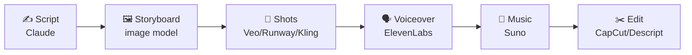

# 30 · Video & Audio Production with AI 🎬🎧

You can now produce a narrated short film, a podcast episode, or a music video **from your laptop in an
afternoon**. This chapter covers the tools, then walks through three complete production pipelines.

---

## The toolbox

### 🎥 Video generation
| Tool | Strengths |
|---|---|
| **Google Veo** (Gemini, Flow) | Cinematic quality, native audio and dialogue, strong prompt adherence |
| **OpenAI Sora** | Story-driven clips, remixing, social features |
| **Runway** | Pro creative suite: gen video, references, motion tools, editing |
| **Kling, Hailuo, Luma, Pika** | Strong alternatives, each with different strengths and pricing |
| **Midjourney video** | Animate Midjourney images in its signature style |
| **Open models** (e.g. Wan, HunyuanVideo, LTX) | Local/ComfyUI control for tinkerers with GPUs |

### ✂️ Editing & post
| Tool | Strengths |
|---|---|
| **Descript** | Edit video by editing the transcript, remove filler words, AI voice fixes |
| **CapCut** | Fast social editing, auto-captions, effects, templates |
| **DaVinci Resolve / Premiere** | Pro editors with growing AI features (masking, speech-to-text, enhance) |
| **Opus Clip & friends** | Auto-cut long videos into short clips |

### 🗣️ Voice & audio
| Tool | Strengths |
|---|---|
| **ElevenLabs** | Realistic TTS, voice design and cloning (with consent!), dubbing, sound effects, music |
| **Adobe Podcast Enhance** | Make bad microphone audio sound studio-quality |
| **Whisper** (open) | Transcription anywhere, free and local |
| **Suno / Udio** | Full songs with vocals from a prompt |
| **HeyGen / Synthesia** | Talking avatars and video translation with lip-sync |

---

## Pipeline 1: The 60-second AI short film 🎞️

1. **Script** with Claude: *"Write a 60-second short film about a lighthouse keeper who befriends a whale. 6 shots.
   For each: visual description, camera move, narration line, and mood."*
2. **Storyboard frames:** generate one image per shot with a **consistent style and character reference** ([Ch. 29](29-image-generation-deep-dive.md)).
3. **Animate:** use image-to-video with each frame as the starting image, plus the camera move ("slow dolly in, waves crashing").
4. **Voiceover:** paste the narration into ElevenLabs and pick a warm storyteller voice.
5. **Music:** Suno: *"gentle orchestral piano, hopeful, oceanic, 60 seconds, instrumental."*
6. **Edit:** assemble in CapCut or Descript, time the cuts to the narration, and add captions and a title card.

**Tips:** generate 3–4 variations per shot and pick the best. Short shots (3–5 seconds) hide AI weirdness, and consistency
comes from reusing reference images.

## Pipeline 2: The effortless podcast 🎙️

1. **Record** on anything (even your phone), then run **Adobe Podcast Enhance** for studio sound.
2. **Transcribe + edit** in Descript: delete words in the transcript to cut the audio, and remove "ums" in one click.
3. **Show notes:** Claude turns the transcript into a summary, timestamps, key quotes, and links.
4. **Clips:** an auto-clip tool, or Claude finds the 5 best 30-second moments → vertical clips with captions.
5. **Bonus:** translate and **dub** episodes into Spanish with ElevenLabs to reach a new audience. 🌍

Or go meta: **NotebookLM Audio Overviews** turn your documents into a two-host podcast automatically.

## Pipeline 3: The faceless YouTube explainer 📺

1. **Research + script** with Claude (+ web search): hook, 3 key points, examples, call to action.
2. **Voiceover** in ElevenLabs (or record yourself, since your real voice builds more trust).
3. **Visuals:** a mix of AI images/clips, screen recordings, and stock footage. Descript or CapCut can auto-match b-roll to the script.
4. **Captions + thumbnail** (Ideogram or ChatGPT images are great for bold thumbnail text).
5. **Automate distribution** with Make/Zapier: publish → auto-generate a description, tags, and social posts ([Ch. 11](../part-3-automation/11-zapier-and-make-walkthroughs.md)).

## Prompting video models 🎥

Include: **subject + action + setting + camera + lighting + style + duration/pace**.

> *Close-up of an old lighthouse keeper's weathered hands lighting an oil lamp, warm flicker on his face, storm raging
> through the window behind. Slow push-in. Cinematic, 35mm film grain, moody blue and amber palette. 5 seconds.*

Camera vocabulary that works: *static shot, slow push-in, dolly out, pan left, tracking shot, drone aerial, handheld, orbit,
rack focus, time-lapse.*

## Ethics & consent ⚖️
- **Only clone voices with explicit consent** (your own, or with written permission).
- **Never** create deceptive deepfakes of real people. Label AI-generated media where people could be misled.
- Check commercial-use and music licensing terms for each tool before monetizing.

---

### 🎮 Try this
Make **Pipeline 1** with a story about your pet, your hometown, or a childhood memory. Keep it to 30 seconds and 4 shots.
Your first AI film will be imperfect and completely magical. 🎬✨

---

**Next:** [31 · Voice Agents →](31-voice-agents.md)
