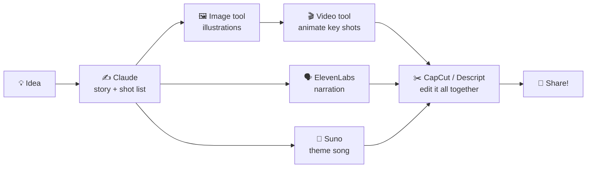

# 52 · The Multimodal Playground: See, Hear, Make 🎨🎬🎵

> ⏱️ 7 min read · 🎯 Everyone · 🧰 Needs: a browser and a free tier or two (Claude, ChatGPT, Gemini, and a creative tool you like)

**Text is just the beginning.** Today's AI can look at photos, read handwriting, watch videos, listen to audio, and make
images, video, speech and music. This chapter is the grand tour: what each kind of "multimodal" AI can do, which tools lead
right now, the underrated superpower of giving AI pictures and sounds as *input*, and a one-hour creative sprint that makes a
whole multimedia storybook. 🖼️🎧📖

> [!NOTE]
> **📌 Names change monthly**
> Creative AI moves faster than any other area. The tools below were current in September 2026, but new versions appear
> constantly (and some tools disappear: OpenAI shut down its Sora video app in 2026). Focus on the *kinds* of tools and
> skills, which last much longer than any version number.

🧸 ELI5: This chapter in 30 seconds

"Multimodal" means the AI can use more than words. It can **see** (look at your photo), **hear** (listen to your voice),
and **make** things: pictures, little movies, voices and even songs. It's like having an art studio, a recording studio and
a movie studio in your pocket, and you just describe what you want.

<!-- in-this-chapter -->

## 🗺️ The multimodal map

🧸 ELI5

AI can take in pictures, sounds and videos, and it can make pictures, sounds and videos. Here's the whole map on one page.

| Mode | AI can **understand** it (input) | AI can **make** it (output) |
|---|---|---|
| 🖼️ **Images** | Photos, screenshots, charts, handwriting, diagrams | Illustrations, photos, logos, edits |
| 📄 **Documents** | PDFs with tables, charts and scans | Formatted docs, slides, spreadsheets |
| 🎙️ **Speech** | Voice messages, meetings, lectures | Natural voices, narration, dubbing |
| 🎬 **Video** | Clips and long videos (Gemini is especially strong here) | Short cinematic clips with sound |
| 🎵 **Music** | Songs (describe, analyze, transcribe lyrics) | Full songs with vocals, instrumentals, sound effects |
| 🧊 **3D** | Some models understand 3D scenes | 3D models from text or images ([3D, Games & Worlds](57-3d-games-and-worlds.md)) |
| 🖱️ **Screens** | Screenshots of apps and websites | Clicks and typing ([Computer Use](../part-5-building-with-ai/40-computer-use-and-browser-agents.md)) |

## 🧪 Multimodal *inputs*: the underrated superpower

🧸 ELI5

You can show the AI a photo or play it a sound and ask about it. That's often even more useful than asking it to make
pictures.

Most people only type. Power users **show**. Every major assistant (Claude, ChatGPT, Gemini) accepts images and documents,
and many handle audio and video too.

| Show it… | Ask |
|---|---|
| 📸 Your fridge | *"Dinner ideas with what's here? Nothing spicy."* |
| 🖥️ A confusing error or settings page | *"What am I looking at, and what should I click?"* |
| 📝 A whiteboard photo | *"Turn this into a Mermaid diagram and a task list."* |
| 📊 A chart from a report | *"What's the story here? Anything misleading?"* |
| 🧾 A pile of receipts | *"Make a table: date, store, total, category."* |
| 🌿 A plant or bug | *"What is this, and is it a problem?"* |
| 👕 Your outfit | *"Does this work for a garden wedding? Be honest but kind."* |
| ▶️ A YouTube link or long video (Gemini) | *"At what timestamp do they explain X?"* |
| 🎙️ A voice memo | *"Clean this up into a to-do list."* |
| 🏠 A room | *"Suggest 3 cheap ways to make this feel cozier."* |

> [!TIP]
> **💡 Screenshots beat descriptions**
> When something on your screen is confusing, don't describe it: screenshot it. It's faster and the AI sees exactly what you
> see. This one habit saves hours.

## 🖼️ Images

🧸 ELI5

Describe a picture and AI paints it. You can also ask it to change a photo: new background, different colors, add a hat to
your cat.

| Tool | Superpower |
|---|---|
| **ChatGPT (GPT Image models)** | Follows complex instructions, great text in images, edits by conversation. Top of the leaderboards at the time of writing |
| **Google Gemini ("Nano Banana" image models)** | Superb editing, consistent characters, fast |
| **Midjourney** | Gorgeous, artistic aesthetics: the concept-art favorite |
| **FLUX (Black Forest Labs)** | Top photoreal models, including open-weight versions you can run locally |
| **Ideogram** | Best-in-class typography: posters, logos, signs |
| **Recraft** | Vector/SVG output and brand-consistent sets |
| **Adobe Firefly** | Designed for commercial safety, built into Photoshop |
| **Canva AI** | Generation plus ready-made layouts |
| **ComfyUI** | Node-based local pipelines for open models. Infinite tinkering 🔧 |

Deep dive: [Image Generation](53-image-generation-deep-dive.md).

## 🎬 Video

🧸 ELI5

Describe a scene and AI films a short clip, sometimes with sound and talking. You can also turn a photo into a moving video.

| Tool | Superpower |
|---|---|
| **Google Veo** (in Gemini and Flow) | Cinematic clips with native audio and dialogue, strong prompt-following |
| **Kling** | Realistic motion, longer multi-shot storytelling |
| **Seedance (ByteDance)** | Leaderboard-topping quality in 2026 |
| **Runway** | A pro creative suite: generation, editing, camera control, character consistency |
| **Luma, Hailuo (MiniMax), Pika** | Strong alternatives with different strengths |
| **HeyGen, Synthesia** | Talking avatars and video translation with lip-sync |
| **Descript, CapCut** | Edit video by editing the transcript, plus auto-captions |

Deep dive: [Video & Audio Production](54-video-and-audio-production.md).

## 🗣️ Voice & audio

🧸 ELI5

AI can turn words into very natural voices, turn speech into text, and even have a real conversation with you out loud.

| Tool | Superpower |
|---|---|
| **ElevenLabs** | Ultra-realistic voices, voice design, dubbing, sound effects, voice agents (and an MCP server!) |
| **ChatGPT Voice, Gemini Live, Claude voice mode** | Natural real-time conversation |
| **Whisper** (open) and cloud transcription | Speech-to-text that just works |
| **Gemini Notebook Audio Overviews** | Instant podcasts from your docs ([Masterclass](../part-6-knowledge-and-memory/45-notebooklm-masterclass.md)) |
| **Wispr Flow, Superwhisper** | Dictation that writes like you type |
| **Vapi, Retell, LiveKit Agents** | Build phone-call voice agents ([Voice Agents](56-voice-agents.md)) |

## 🎵 Music

🧸 ELI5

Type "a happy song about my dog, in the style of summer pop" and AI writes and sings a whole song.

- **Suno:** full songs with vocals from a prompt. Its v6 models (September 2026) are trained on licensed music from label
  partners.
- **Udio:** now focused on licensed remixing and fan creation inside its platform.
- **ElevenLabs Music, Stable Audio:** instrumentals, jingles and sound design.
- **Ableton MCP:** Claude controls a real music production app ([MCP Server Catalog](../part-2-mcp-and-connectors/09-mcp-server-catalog.md)).

Deep dive: [Music Making with AI](55-music-making-with-ai.md).

## 🔗 Chaining modes: where the magic happens

🧸 ELI5

The coolest projects use several AI tools in a row: one writes a story, another draws it, another reads it aloud, another adds
music.

**Pro tip:** let Claude be your **creative director**. Ask it to write the story, *and* the image prompts, *and* the shot list,
*and* the narration script, *and* the song lyrics, all consistent with each other. Then paste each into the right tool.

## 🔐 Creative responsibility

🧸 ELI5

Be kind and fair with AI art: don't copy real people's faces or voices without asking, be honest when something is
AI-made, and respect artists.

| Do ✅ | Don't ❌ |
|---|---|
| Label AI-generated content when it matters | Pass off AI images as real photos of events |
| Get consent for anyone's face or voice | Clone a voice or face without permission |
| Check each tool's commercial-use terms | Assume every output is free to use commercially |
| Credit the tools you used | Imitate living artists to compete with them |
| Keep kids' photos private | Upload other people's private photos |

More in [AI Ethics for Builders](../part-10-mastery/76-ai-ethics-for-builders.md).

## 🎮 20 creative experiments

🧸 ELI5

Twenty fun things to try with pictures, sounds and videos.

| 🖼️ Images | 🎬 Video & 🎙️ audio | 🎵 Music & 🧩 mashups |
|---|---|---|
| A brand kit for an imaginary business | A 30-second trailer for your pet's life story | A birthday song packed with inside jokes |
| Your house as a Studio Ghibli-style scene | A narrated tour of your city in 5 shots | A theme song for your D&D party |
| A children's book about your family | Your voice memo turned into a podcast intro | A lullaby with your kid's name in it |
| Tarot cards for your friend group | A talking-avatar "welcome" video for your website | Your grocery list as an opera 🎭 |
| A recipe card with a gorgeous food photo | Old family photos gently animated | A multimedia storybook (below!) |
| A poster for a fake movie starring you | A 1-minute explainer from a Gemini Notebook | A jingle for your side hustle |
| Reimagined logos for your favorite teams | Dub a video into Spanish with lip-sync | A soundtrack for your morning run |

## 🎯 Key takeaways

- **Multimodal** AI understands *and* makes images, documents, speech, video, music, 3D and screens.
- **Showing** AI things (photos, screenshots, voice memos) is an underrated superpower.
- Leaders shift monthly: learn the **kinds** of tools and your skills transfer.
- **Chain modes** with Claude as creative director for the biggest wow.
- Create **responsibly**: consent, labeling and respect for artists.

## 🧠 Check yourself

❓ 1. Your laptop shows a confusing settings screen. What's the fastest way to get help?

**Screenshot it** and ask the AI what you're looking at. It sees exactly what you see.

❓ 2. Which assistant is especially strong at understanding long videos and YouTube links?

**Gemini**.

❓ 3. How can Claude help in a multi-tool creative project?

As the **creative director**: writing the story, image prompts, shot list, narration and lyrics so everything stays consistent.

> [!TIP]
> **🎮 Try this: the one-hour creative sprint**
> Pick a theme → Claude writes a short story and 3 image prompts → an image tool makes the illustrations → ElevenLabs narrates →
> Suno writes a theme song. You just produced a multimedia storybook. 📖✨

---

**Next:** [53 · Image Generation Deep Dive →](53-image-generation-deep-dive.md)
