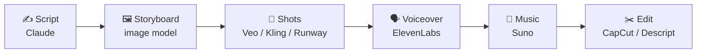

# 54 · Video & Audio Production with AI 🎬🎧

> ⏱️ 8 min read · 🎯 Beginner → intermediate creators · 🧰 Needs: a video tool (Veo in Gemini, Kling, Runway…), ElevenLabs or similar, and an editor like CapCut or Descript

**You can now produce a narrated short film, a podcast episode or a music video from your laptop in an afternoon.** This
chapter covers the toolbox (generation, editing, voice, music), how to prompt video models like a cinematographer, and four
complete production pipelines you can follow step by step: an AI short film, an effortless podcast, a faceless YouTube
explainer, and a family memory video. Lights, camera, AI! 🎥✨

🧸 ELI5: This chapter in 30 seconds

Making videos used to need cameras, actors, a studio and lots of money. Now you can **describe a scene** and AI films a short
clip, **type words** and AI reads them in a lovely voice, and **describe a song** and AI makes the music. Then you put all
the pieces together in an easy editing app, like building with LEGO. Your first movie can happen this weekend. 🍿

<!-- in-this-chapter -->

## 🧰 The toolbox

🧸 ELI5

You need a few kinds of tools: ones that make video clips, ones that cut clips together, ones that make voices, and ones that
make music.

### 🎥 Video generation

| Tool | Strengths |
|---|---|
| **Google Veo** (Gemini app, Flow) | Cinematic quality, native audio and dialogue, strong prompt-following, 4K options |
| **Kling** | Realistic motion, multi-shot storytelling with consistent characters |
| **Seedance** (ByteDance) | Top of the video leaderboards in 2026 |
| **Runway** | Pro creative suite: generation, reference images, camera control, editing |
| **Luma, Hailuo (MiniMax), Pika** | Strong alternatives, each with different strengths and pricing |
| **Midjourney video** | Animate Midjourney images in its signature style |
| **Open models** (Wan, HunyuanVideo, LTX and friends) | Local ComfyUI control for tinkerers with GPUs |

> [!NOTE]
> **📌 Tools come and go**
> OpenAI shut down its Sora video app and API in 2026. It's a good reminder: **keep your own copies** of everything you make,
> and don't build a business on a single tool.

### ✂️ Editing & post-production

| Tool | Strengths |
|---|---|
| **Descript** | Edit video by editing the transcript, remove filler words, AI voice fixes |
| **CapCut** | Fast social editing, auto-captions, effects, templates |
| **DaVinci Resolve / Premiere Pro** | Pro editors with growing AI features (masking, speech-to-text, enhance, generative extend) |
| **Opus Clip & friends** | Auto-cut long videos into short vertical clips |

### 🗣️ Voice, audio & music

| Tool | Strengths |
|---|---|
| **ElevenLabs** | Realistic voices, voice design and cloning (with consent!), dubbing, sound effects, music |
| **Adobe Podcast Enhance** | Makes bad microphone audio sound studio-quality |
| **Whisper** and cloud transcription | Transcripts and captions, free and local with Whisper |
| **Suno** | Full songs with vocals ([Music Making](55-music-making-with-ai.md)) |
| **HeyGen / Synthesia** | Talking avatars and video translation with lip-sync |

## 🎥 Prompting video models like a cinematographer

🧸 ELI5

Describe your scene like a movie director: who's in it, what they do, where, how the camera moves, the lighting, and the
feeling.

Include: **subject + action + setting + camera + lighting + style + sound + duration**.

> *Close-up of an old lighthouse keeper's weathered hands lighting an oil lamp, warm flicker on his face, storm raging through
> the window behind. Slow push-in. Cinematic, 35mm film grain, moody blue and amber palette. Sound: rain on glass, distant
> thunder. 6 seconds.*

| Camera move | Feels like |
|---|---|
| **Static shot** | Calm, observational |
| **Slow push-in** | Intimacy, tension building |
| **Dolly out / pull back** | Reveal, loneliness |
| **Tracking shot** | Following action, energy |
| **Drone aerial** | Epic scale, establishing a place |
| **Handheld** | Documentary, urgency |
| **Orbit** | Showcasing a subject, heroic moment |
| **Rack focus** | Shifting attention between two things |
| **Time-lapse** | Time passing |

> [!TIP]
> **💡 Image-to-video beats text-to-video**
> For consistency, generate a perfect **still frame** first ([Image Generation](53-image-generation-deep-dive.md)), then
> animate it. You control the look, and the video model only has to add motion.

## 🎞️ Pipeline 1: The 60-second AI short film

🧸 ELI5

Write a tiny story, draw a picture for each scene, turn each picture into a moving clip, add a narrator and music, and glue it
all together.

1. **Script** with Claude: *"Write a 60-second short film about a lighthouse keeper who befriends a whale. 6 shots. For each:
   visual description, camera move, narration line and mood."*
2. **Storyboard frames:** one image per shot with a **consistent style and character reference**.
3. **Animate:** image-to-video with each frame as the starting image, plus the camera move ("slow dolly in, waves crashing").
4. **Voiceover:** paste the narration into ElevenLabs and pick a warm storyteller voice.
5. **Music:** Suno: *"gentle orchestral piano, hopeful, oceanic, 60 seconds, instrumental."*
6. **Edit:** assemble in CapCut or Descript, time cuts to the narration, add captions and a title card.

**Tips:** generate 3–4 variations per shot and pick the best. Short shots (3–6 seconds) hide AI weirdness. Consistency comes
from reusing reference images.

## 🎙️ Pipeline 2: The effortless podcast

🧸 ELI5

Record yourself talking, let AI make it sound professional, edit it by deleting words from the text, and let AI write the
episode notes and make short clips.

1. **Record** on anything (even your phone), then run **Adobe Podcast Enhance** for studio sound.
2. **Transcribe + edit** in Descript: delete words in the transcript to cut the audio, and remove "ums" in one click.
3. **Show notes:** Claude turns the transcript into a summary, timestamps, key quotes and links.
4. **Clips:** an auto-clip tool, or Claude finds the 5 best 30-second moments → vertical clips with captions.
5. **Bonus:** translate and **dub** episodes into another language with ElevenLabs to reach a new audience. 🌍

Or go meta: **Gemini Notebook Audio Overviews** turn your documents into a two-host podcast automatically
([Gemini Notebook Masterclass](../part-6-knowledge-and-memory/45-notebooklm-masterclass.md)).

## 📺 Pipeline 3: The faceless YouTube explainer

🧸 ELI5

Make a teaching video without showing your face: AI helps write the script, read it aloud, find pictures and add captions.

1. **Research + script** with Claude (+ web search): hook, 3 key points, examples, call to action.
2. **Voiceover** in ElevenLabs, or record yourself (your real voice builds more trust).
3. **Visuals:** a mix of AI images and clips, screen recordings and stock footage. Descript or CapCut can auto-match b-roll to
   the script.
4. **Captions + thumbnail** (GPT Image, Nano Banana or Ideogram are great for bold thumbnail text).
5. **Automate distribution:** publish → auto-generate a description, tags and social posts ([Zapier & Make](../part-3-automation/18-zapier-and-make-walkthroughs.md)).

## 👵 Pipeline 4: The family memory video

🧸 ELI5

Turn old family photos into a gentle, moving video with a narrator and soft music, perfect for a birthday or reunion.

1. **Scan** old photos (a phone scanning app works great).
2. **Restore and colorize** gently: *"Repair scratches and colorize naturally. Keep faces exactly as they are."*
3. **Animate subtly** with image-to-video: *"Gentle breeze in the trees, very slow push-in, keep faces still."*
4. **Narrate:** interview a relative, or write the story with Claude from family notes.
5. **Music:** soft, era-appropriate instrumental.
6. **Edit** into a 2–3 minute film. Bring tissues. 🥲

> [!NOTE]
> **📌 Be gentle with real people's faces**
> Keep animation subtle and faces unchanged, and share only with family members' blessing. Don't put words in real people's
> mouths.

## 🌍 Dubbing, translation & accessibility

🧸 ELI5

AI can translate your video into other languages with a voice that sounds like you, and add captions so everyone can follow
along.

| Task | Tools | Why |
|---|---|---|
| **Captions** | CapCut, Descript, YouTube auto-captions + a quick fix | Most social video is watched on mute, and captions help deaf and hard-of-hearing viewers |
| **Dubbing** | ElevenLabs, HeyGen | Reach new languages in your own voice (with lip-sync on some tools) |
| **Audio description** | Claude writes it, a TTS voice reads it | Makes videos accessible to blind viewers ([Accessibility](../part-9-ai-for-life-and-work/70-accessibility-and-ai.md)) |
| **Transcripts** | Whisper, Descript | Searchable, quotable, better SEO |

## ✅ Production checklist

🧸 ELI5

Before you share your video, check a few things: does it look good, does it sound good, is it fair, and can everyone enjoy it?

- [ ] Script tight? (Read it out loud; cut 20%.)
- [ ] Consistent characters and style across shots?
- [ ] Audio clean, music not drowning the voice?
- [ ] Captions added and proofread?
- [ ] AI weirdness checked (hands, text, faces, physics)?
- [ ] Rights checked: music license, commercial-use terms, consent for any real voice or face?
- [ ] AI use labeled where viewers could be misled?
- [ ] Your own backup copies saved?

## ⚖️ Ethics & consent

🧸 ELI5

Never copy someone's voice or face without asking, never make fake videos that could trick people, and always tell viewers
when it's AI if it could confuse them.

- **Only clone voices with explicit consent** (your own, or with written permission).
- **Never** create deceptive deepfakes of real people. Label AI-generated media where people could be misled.
- Many platforms now **require AI-content labels** for realistic synthetic media. Follow them.
- Check **commercial-use and music licensing** terms before monetizing ([AI Ethics for Builders](../part-10-mastery/76-ai-ethics-for-builders.md)).

## 🎯 Key takeaways

- The toolbox: **generate** (Veo, Kling, Seedance, Runway), **edit** (CapCut, Descript), **voice** (ElevenLabs), **music** (Suno).
- Prompt like a **cinematographer**: subject, action, setting, camera, lighting, style, sound, duration.
- **Image-to-video** with reference frames is the secret to consistency.
- Four pipelines: **short film, podcast, faceless explainer, family memory video**.
- **Consent, labels and licenses** keep your creations fun and fair.

## 🧠 Check yourself

❓ 1. Why generate a still frame first and then animate it?

It gives you **control over the look and consistency**, and the video model only needs to add motion.

❓ 2. Your AI clips have weird glitches in long shots. What's a simple fix?

Use **shorter shots** (3–6 seconds), generate **several variations**, and pick the best.

❓ 3. When is it OK to clone someone's voice?

Only with their **explicit consent** (or it's your own voice), and never to deceive.

> [!TIP]
> **🎮 Try this**
> Make **Pipeline 1** with a story about your pet, your hometown or a childhood memory. Keep it to 30 seconds and 4 shots.
> Your first AI film will be imperfect and completely magical. 🎬✨

---

**Next:** [55 · Music Making with AI →](55-music-making-with-ai.md)
