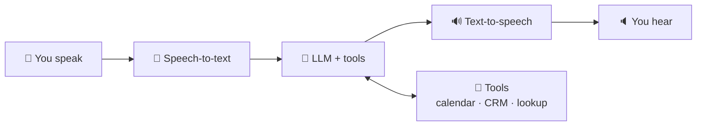

# 31 · Voice Agents: AI You Can Talk To (and That Can Call You) 📞🗣️

Voice is the most natural interface there is. Today you can build an AI that **answers your phone, books
appointments, runs a language-practice session, or quizzes you while you drive**, and it sounds natural. This
chapter explains how voice agents work and how to build one.

---

## Using voice AI today (no building required)

| Tool | Great for |
|---|---|
| **ChatGPT Voice / Gemini Live / Claude voice mode** | Hands-free brainstorming, learning, practicing conversations |
| **Wispr Flow / Superwhisper / built-in dictation** | Talking instead of typing, everywhere |
| **ElevenLabs Reader / NotebookLM audio** | Listening to articles and docs |
| **Language apps with AI conversation** | Speaking practice without judgment |

🎮 **Try:** *"Be my Spanish conversation partner. I'm a beginner. Speak slowly, correct me gently, and quiz me on 5 new words."*

## How voice agents work 🔧



Two architectures:
| | **Pipeline** (STT → LLM → TTS) | **Speech-to-speech** (realtime models) |
|---|---|---|
| How | Three separate models chained | One model hears and speaks directly |
| Pros | Pick the best model for each step, easy to use any LLM (e.g. Claude), transcripts for free | Lowest latency, and it captures tone and emotion |
| Cons | Latency adds up | Fewer model choices, and harder to control |

**Latency is everything in voice.** People expect replies in under a second. Platforms handle streaming, interruptions
("barge-in"), and turn-taking, which is why most people build on one.

## Voice agent platforms 🧱

| Platform | Vibe |
|---|---|
| **Vapi** | Developer-friendly voice agents with phone numbers, tools, and any LLM |
| **Retell AI** | Phone agents focused on business calls |
| **ElevenLabs Agents** | Top voices plus agent building, with tools and knowledge bases |
| **LiveKit Agents** | Open-source framework for real-time voice and video agents |
| **Pipecat** | Open-source Python framework for voice pipelines |
| **Twilio** | Phone infrastructure underneath many of these |
| **Bland, Synthflow, and others** | No-code phone agent builders |

## Build: an appointment-booking phone agent 📅 (1–2 hours)

**Goal:** a phone number people call to book a slot on your calendar.

1. **Pick a platform** (Vapi, Retell, or ElevenLabs Agents) and create an agent.
2. **Choose models:** a fast STT, your LLM (e.g. Claude), and a warm voice.
3. **System prompt:**
   ```text
   You are Riley, the friendly receptionist for Pixel's Plant Studio. Keep replies to 1–2 short sentences.
   Goal: book 30-minute plant consultations. Collect name, phone, preferred day/time.
   Use check_availability before offering times, then book_appointment. Confirm details back.
   If asked something you don't know, offer to take a message. Never make up prices.
   ```
4. **Tools:** connect `check_availability` and `book_appointment`. Most platforms call a **webhook**, so point them at
   **n8n or Make** workflows that talk to Google Calendar ([Ch. 12](../part-3-automation/15-webhooks-apis-json.md)).
5. **Knowledge:** upload your FAQ (hours, location, services).
6. **Buy or attach a phone number** and call it yourself. Iterate on the prompt based on real calls. 📞

### Voice prompt tips 🎙️
- **Short replies.** Nobody wants to listen to a paragraph.
- **Spell out** numbers, emails, and dates the way they should be *spoken*.
- **Confirm critical info** by reading it back.
- **Plan for interruptions** and "sorry, can you repeat that?"
- **Graceful handoff:** transfer to a human or take a message when stuck.

## More voice projects 🎮
| Project | Stack idea |
|---|---|
| 🧠 Daily check-in coach that calls *you* each morning | Scheduled outbound call + LLM + your task list |
| 🗣️ Language tutor with memory of your mistakes | Realtime voice model + memory store |
| 🍳 Hands-free kitchen assistant | Voice agent + recipe RAG ([Ch. 24](../part-6-knowledge-and-memory/43-build-a-rag-system.md)) |
| 🎲 Interactive audio adventure game | Voice agent as a narrator + dice tool |
| 📋 Voice-to-task inbox | Dictation → n8n → task app |
| ☎️ After-hours line for a small business | Phone agent + FAQ + message-taking ([Ch. 34](../part-9-ai-for-life-and-work/62-small-business.md)) |

## Responsible voice AI ⚖️
- **Disclose it's an AI** at the start of calls (in many places this is legally required).
- **Consent for recordings** and cloned voices.
- **Follow the rules** for outbound calling (telemarketing laws are strict!).
- Keep sensitive transactions (payments, medical, legal) behind human confirmation.

---

### 🎮 Try this
Start with a **free-tier voice agent** on any platform and build a *"call me to practice for a job interview"* agent.
Give it the job description and ask it to be tough but kind. Talking to your own agent the first time is a genuine wow moment. 🤯📞

---

**Next:** [32 · AI for Research & Learning →](../part-9-ai-for-life-and-work/60-research-and-learning.md)
