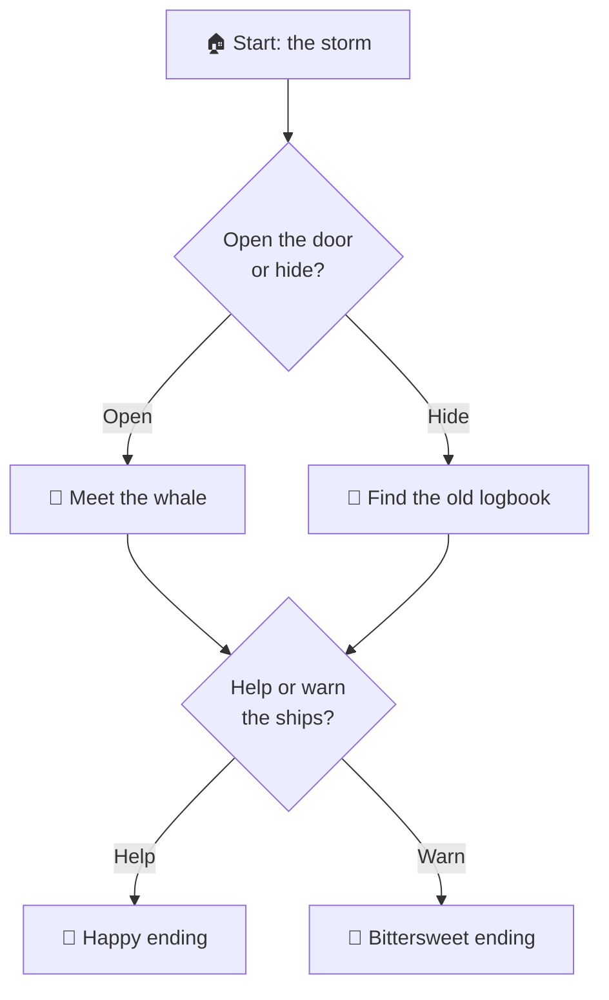

# 58 · Storytelling & Interactive Fiction: Co-Write with AI 📖🐉

> ⏱️ 7 min read · 🎯 Writers, game masters, parents, daydreamers · 🧰 Needs: Claude (or any assistant), optionally Twine or Claude Code for interactive builds

**AI is a wonderful creative partner: a brainstorming buddy at 2am, a tireless game master, a character you can interview,
a kind editor, and a bedtime-story machine.** This chapter shows how to co-write *with* AI while keeping your own voice,
build a story bible, run tabletop and chat adventures, make choose-your-own-adventure games, craft bedtime stories with kids,
and publish responsibly. Once upon a time, you opened this chapter... ✨

<details class="eli5" open>
<summary>🧸 ELI5: This chapter in 30 seconds</summary>

AI can be your story buddy. It can help you think up ideas ("what if the dragon is scared of mice?"), pretend to be your
characters so you can ask them questions, run a make-believe adventure where you decide what happens next, and tell bedtime
stories starring your kids. You're still the author: AI just helps the ideas flow. 🐉🐭

</details>

<!-- in-this-chapter -->

## ✍️ Co-writer, not ghostwriter

<details class="eli5">
<summary>🧸 ELI5</summary>

The best stories come from you. Let AI help with ideas, questions and feedback, but keep the heart of the story yours.

</details>

| AI is brilliant at… | You bring… |
|---|---|
| 💡 Brainstorming 50 "what ifs" in a minute | The idea that makes *you* excited |
| ❓ Asking questions about your world | Answers rooted in your life and taste |
| 🎭 Playing characters so you can "interview" them | The emotional truth of who they are |
| 🔍 Spotting plot holes and pacing problems | Deciding what to fix and how |
| 🧹 Line edits, grammar, variety | Your voice and rhythm |
| 📚 Research (history, science, places) | Choosing what matters for the story |

> [!TIP]
> **💡 Ask for options, not answers**
> *"Give me 10 possible reasons the lighthouse keeper refuses to leave. Make 3 of them surprising."* Choosing from options keeps
> **you** the author, and the best idea is often a mix of two.

## 📚 Build a story bible

<details class="eli5">
<summary>🧸 ELI5</summary>

A story bible is a notebook about your story world: who the characters are, what places exist, and the rules. Giving it to
the AI keeps everything consistent.

</details>

A **story bible** keeps long projects consistent. Put it in a Claude Project (or a `STORY.md` file for Claude Code) so every
conversation knows your world ([Context Engineering](../part-1-foundations/05-context-engineering.md)).

```markdown
# Story bible: The Lighthouse at Gull's End

## Premise
A retired lighthouse keeper befriends a whale who can speak only during storms.

## Tone & style
Cozy, bittersweet, quiet humor. Present tense. Short chapters. For ages 10+.

## Characters
- **Edda Marsh (71)**: stubborn, kind, hums sea shanties off-key. Lost her husband at sea.
- **Old Grey**: an ancient whale; speaks in riddles; fears the new shipping lanes.

## World rules
- The whale speaks only when lightning strikes.
- The lighthouse is being automated next spring.

## Plot so far
Ch 1–3: Edda hears the whale for the first time...
```

**Prompts that use the bible:** *"Check chapter 4 against the story bible. List any contradictions."* · *"Suggest 3 ways
Old Grey's fear could raise the stakes in act two."*

## 🧰 Writing workflows

<details class="eli5">
<summary>🧸 ELI5</summary>

Different tricks for different moments: getting ideas, planning the story, getting unstuck, and polishing the final words.

</details>

| Stage | Technique | Prompt |
|---|---|---|
| **Idea** | "What if" storms | *"20 what-ifs combining a cozy mystery with a space station."* |
| **Characters** | Interview them | *"You are Edda. I'll interview you about your husband. Stay in character."* |
| **Outline** | Structure help | *"Outline this as a three-act story with a midpoint twist. Keep my beats, suggest missing ones."* |
| **Stuck** | Next-beat options | *"Here's where I'm stuck. Give me 5 possible next scenes, from quiet to explosive."* |
| **Dialogue** | Voice check | *"Does each character sound distinct? Rewrite one line per character to sharpen their voice."* |
| **Feedback** | Beta reader | *"Read this chapter as a 12-year-old reader. Where did you get bored or confused?"* |
| **Polish** | Line edits | *"Suggest line edits for rhythm only. Don't change my word choices unless they're errors."* |
| **Titles & blurbs** | Marketing copy | *"15 title ideas and a 100-word back-cover blurb."* |

## 🎲 AI as game master

<details class="eli5">
<summary>🧸 ELI5</summary>

The AI can run a pretend adventure: it describes the world, you say what you do, it tells you what happens next. Like a board
game with no board.

</details>

Chat-based role-playing adventures are one of the most fun things you can do with AI. The secret is a great setup prompt:

```text
You are the game master for a cozy fantasy adventure. I play Pip, a halfling baker with a magic rolling pin.

Rules:
- Describe scenes vividly in 3–5 sentences, then ask "What do you do?"
- Never decide my actions or feelings for me.
- When an action is risky, roll a d20 (show the roll) and describe the result: 1–7 fail, 8–14 mixed, 15–20 success.
- Track my inventory, health (10 hearts) and gold in a short status line after each turn.
- Keep a mystery running in the background, with clues I can discover.
- Keep it PG, funny and warm.

Begin in the village square on market day.
```

| Level up | How |
|---|---|
| **Group play** | Run it in a Discord bot for your friends ([Chat Apps & Bots](../part-4-ai-in-your-apps/28-chat-apps-and-bots.md)) |
| **Real dice** | Give an agent a dice tool so rolls are truly random ([Build Your Own Agent](../part-5-building-with-ai/37-build-your-own-agent.md)) |
| **Campaign memory** | A campaign notes file the AI updates after each session |
| **Maps & portraits** | Generate character art and maps ([Image Generation](53-image-generation-deep-dive.md)) |
| **Voice narration** | A voice agent narrator for an audio adventure ([Voice Agents](56-voice-agents.md)) |

**For human game masters:** AI is an amazing prep partner. *"Generate a tavern with 5 NPCs, each with a secret and a rumor."* ·
*"My players went off-script into the sewers. Give me a 20-minute sewer encounter, fast!"* 😅

## 🌳 Build a choose-your-own-adventure

<details class="eli5">
<summary>🧸 ELI5</summary>

Make a story where readers pick what happens next: "open the door" or "run away." You can build it as a little website or
game.

</details>

| Tool | Style |
|---|---|
| **Twine** | Free, visual branching-story editor that exports a web page |
| **Ink** (Inkle) | A scripting language for branching narrative, used in real games |
| **A custom web app** | Vibe-code it with Claude Code: story nodes in JSON + a pretty reader |
| **AI-driven branches** | Fixed story skeleton + AI-generated flavor text at each step |

**A hybrid that works beautifully:**



You design the **skeleton** (key choices and endings) so the story always makes sense. AI writes the prose, and optionally
adds personalized flavor (the reader's name, their pet, their favorite color). Ask Claude Code: *"Build a Twine-like web reader
for this story graph with page-turn animations and a map of choices made."*

## 🌙 Bedtime stories & kids' books

<details class="eli5">
<summary>🧸 ELI5</summary>

Make up bedtime stories together with your kids: they pick the hero, the place and the problem, and the AI helps tell the
tale. You can even turn favorites into little picture books.

</details>

- **Co-create with your child:** they choose the hero, the setting and the problem. *"A story about Maya and her dog Biscuit
  who find a door in the moon."* 🌙🐶
- **Keep kids in the driver's seat:** stop at a cliffhanger and ask *them* what happens next.
- **Gentle values:** *"The story should show that it's OK to be scared and ask for help."*
- **Make it a book:** consistent illustrations ([Image Generation](53-image-generation-deep-dive.md#-consistency-same-character-many-images)),
  then print a photo book or make a PDF.
- **Read it aloud:** narrate it in your own voice. AI voices are fine, but *your* voice is the magic.

More for families in [Parents, Teachers & Students](../part-9-ai-for-life-and-work/67-parents-teachers-and-students.md).

## 🌍 Worldbuilding superpowers

<details class="eli5">
<summary>🧸 ELI5</summary>

AI can help you invent whole worlds: countries, history, languages, recipes, even the currency the dragons use.

</details>

| Build | Prompt |
|---|---|
| 🗺️ Geography | *"Design a continent shaped by one giant ancient river. List 6 regions, their climates and conflicts."* |
| 📜 History | *"A 1,000-year timeline for this kingdom with 8 turning points."* |
| 🗣️ Languages | *"Invent 30 words and naming rules for a sea-faring culture. Keep it pronounceable."* |
| 🍲 Culture | *"What do people eat at weddings here? Invent 3 dishes and a toast."* |
| ⚖️ Politics | *"Three factions who want different things from the lighthouse. None are villains."* |
| 🪙 Economy | *"What's money here, and what's the most valuable thing?"* |

## 📤 Publishing & ethics

<details class="eli5">
<summary>🧸 ELI5</summary>

If you share or sell a story made with AI help, be honest about it, follow the publisher's rules, and don't copy other
people's characters or writing.

</details>

| Topic | Practical guidance |
|---|---|
| **Disclosure** | Some platforms (e.g. Amazon KDP) ask whether content is AI-generated. Answer honestly |
| **Copyright** | Purely AI-generated text may not be protected. Your own writing, selection and editing are what count |
| **Magazines & contests** | Many ban AI-generated submissions. Read the rules |
| **Fan fiction** | Respect the original creators and community norms |
| **Real people** | Don't write harmful or misleading stories about real, private people |
| **Your voice** | Readers connect with *you*. Use AI to help, not to replace |

## 🎯 Key takeaways

- Use AI as a **co-writer**: options, questions, feedback, while you keep the voice and the choices.
- A **story bible** in a Project keeps long works consistent.
- AI makes a delightful **game master** with a good setup prompt (rules, dice, status line, never deciding for you).
- Build **branching stories** with a human-designed skeleton and AI-written flavor.
- **Bedtime stories** are one of the sweetest uses of AI, especially co-created with kids.
- Publish **honestly**: disclosure, platform rules and your own authorship.

## 🧠 Check yourself

<details class="quiz">
<summary>❓ 1. Why ask AI for 10 options instead of "the answer"?</summary>

Choosing and combining options keeps **you the author** and usually leads to fresher ideas.

</details>

<details class="quiz">
<summary>❓ 2. What rule stops an AI game master from ruining the fun?</summary>

**Never decide the player's actions or feelings.** Describe, then ask "What do you do?"

</details>

<details class="quiz">
<summary>❓ 3. Why design the skeleton of a branching story yourself?</summary>

So the story **always makes sense** and reaches satisfying endings, while AI adds prose and flavor.

</details>

> [!TIP]
> **🎮 Try this**
> Paste the game-master prompt above into Claude and play for 15 minutes. Then ask: *"Summarize our adventure as a short story
> chapter, in the style of a classic children's book."* You just co-wrote a story by *playing* it. 🎲📖

---

**Next:** [59 · Design & UI with AI →](59-design-and-ui.md)
