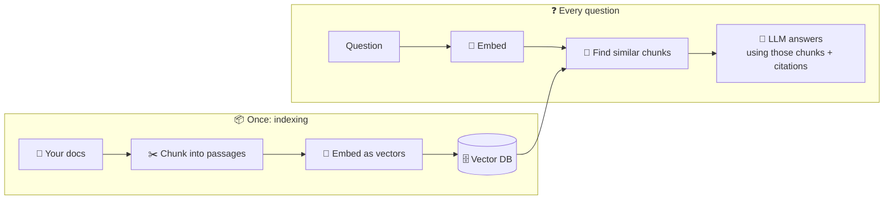
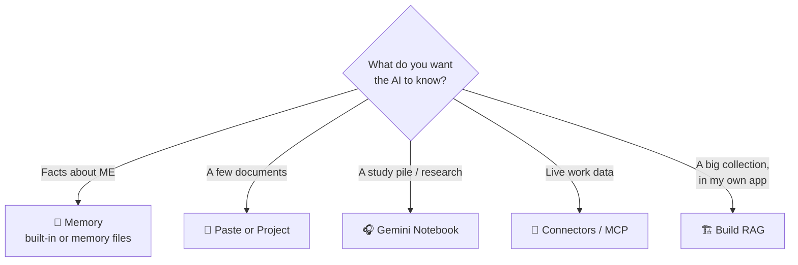

# 72 · RAG, Memory & Knowledge: Make AI Know *Your* Stuff 🧠📚

> ⏱️ 8 min read · 🎯 Everyone · 🧰 Needs: nothing to start (a Claude/ChatGPT Project or Gemini Notebook (NotebookLM) for the hands-on bits)

**AI knows the internet, but it doesn't know your notes, your company docs, or what you told it last Tuesday.** This chapter
is the map of every way to fix that, from "drag a file into the chat" to "build your own retrieval system." You'll learn
the six rungs of the knowledge ladder, how RAG really works in plain English, how AI memory works (and how to control it),
and exactly which approach to pick for your situation. 🪜

🧸 ELI5: This chapter in 30 seconds

An AI is like a super-smart new friend who has read every library book in the world, but has never seen **your** diary,
**your** school notes, or **your** family recipe box. There are two ways to help: give it a **library card** to look things
up in your stuff when it needs to (that's called **RAG**), and give it a **notebook** where it writes down things about you
so it remembers next time (that's **memory**).

<!-- in-this-chapter -->

## 🪜 The knowledge ladder

🧸 ELI5

There are six ways to teach AI your stuff, from super easy (just show it a file) to "build your own robot librarian." Most
people only ever need the easy ones.

| Rung | How | Effort | Best for |
|---|---|---|---|
| 1️⃣ **Paste it in** | Drop files into the chat | 🟢 None | One-off questions. Modern context windows are huge! |
| 2️⃣ **Projects** | Claude or ChatGPT Projects, Gemini Gems, Perplexity Spaces | 🟢 Minutes | Ongoing topics with a fixed set of docs |
| 3️⃣ **Gemini Notebook (NotebookLM)** | Upload lots of sources, get grounded answers with citations | 🟢 Minutes | Studying, research, "chat with this pile of PDFs" ([Masterclass](76-notebooklm-masterclass.md)) |
| 4️⃣ **Connectors / MCP** | AI searches your Drive, Notion or Slack live | 🟡 Setup once | *Living* knowledge that changes daily ([Built-in Connectors](../part-4-mcp-and-connectors/41-built-in-connectors.md)) |
| 5️⃣ **Memory** | Built-in memory, `CLAUDE.md`, memory MCP servers | 🟡 Setup once | Preferences and facts about *you* ([Memory for Agents](75-memory-for-agents.md)) |
| 6️⃣ **Build your own RAG** | Embeddings + vector database + retrieval | 🔴 A weekend | Big private collections, custom apps, full control ([Build a RAG System](74-build-a-rag-system.md)) |

> [!TIP]
> **💡 Live on rungs 2–5**
> Most people get 90% of the value from Projects, Gemini Notebook (NotebookLM), connectors and memory. Rung 6 is a fantastic *learning*
> project, and the right call for apps you ship to other people.

## 📏 Context windows: the "just paste it" superpower

🧸 ELI5

The AI's "desk" is now so big it can hold whole books at once. So for a few documents, you don't need anything fancy: just
put them all on the desk.

The **context window** is how much text the model can consider at once ([How Models Really Work](../part-3-foundations/33-how-models-really-work.md)).
Today's frontier models handle hundreds of thousands of tokens, sometimes a million or more: several novels' worth.

| You have… | Approach |
|---|---|
| 1–10 documents | **Paste them all.** Simple, accurate, and the model sees everything |
| The same documents, asked about repeatedly | A **Project**, or the API with **prompt caching** (cheap repeats) |
| Hundreds to millions of pages | **RAG**: fetch only the relevant bits |
| Knowledge that changes every hour | **Connectors / MCP** (live search) |

**But bigger isn't free:** long prompts cost more, run slower, and models can still overlook details buried in the middle of a
huge context. When a context is stuffed with irrelevant material, answers get worse ([Context Engineering](../part-3-foundations/36-context-engineering.md)).

## 🔍 How RAG actually works (in 60 seconds)

🧸 ELI5

First, you cut your documents into small cards and file them by what they're about. When someone asks a question, a robot
librarian finds the few cards that match best and hands them to the AI, which answers using only those cards.

**RAG = Retrieval-Augmented Generation.** Instead of stuffing *everything* into the prompt, you fetch only the relevant bits.

| Word | Plain English |
|---|---|
| **Chunk** | A bite-sized passage (a paragraph or section) that makes sense on its own |
| **Embedding** | A list of numbers that captures a chunk's *meaning*. Similar meaning = nearby numbers ([Embeddings & Vector Databases](73-embeddings-and-vector-databases.md)) |
| **Vector database** | A store that finds the nearest embeddings fast |
| **Retrieval** | Finding the top few chunks for a question |
| **Grounding** | Telling the model to answer *only* from those chunks, with citations |

That's why "car trouble" can find a note about "my engine is making a weird noise": the words differ, but the meanings are
close. 🚗

## 🧬 RAG flavors: from simple to agentic

🧸 ELI5

Some robot librarians fetch cards once. Fancier ones search with both keywords and meaning, double-check which cards are best,
or keep searching again and again until they're sure.

| Flavor | What's different | Use when |
|---|---|---|
| **Naive RAG** | Embed → top-k → answer | Getting started, small collections |
| **Hybrid search** | Keywords (BM25) + vectors combined | Names, codes, SKUs and exact terms matter |
| **Reranking** | A second model re-sorts the top ~20 results | "The right chunk is in there, just ranked too low" |
| **Contextual retrieval** | Each chunk gets a short summary of its document prepended before embedding | Chunks that don't make sense alone ("It costs $40") |
| **Agentic RAG** | An agent decides what to search, searches several times, and checks results | Multi-step questions ("compare our 2024 and 2025 policies") |
| **GraphRAG** | Builds a knowledge graph of entities and relationships | "How are all these people and projects connected?" |
| **Long-context + caching** | No retrieval: the whole corpus goes in, cached | A few long documents you ask about a lot |

Coding agents like Claude Code are a great example of **agentic retrieval**: they don't use a vector database at all. They
`grep`, list folders, open files and search again, like a person would. For many collections, that works beautifully.

## 🧠 Memory: making AI remember *you*

🧸 ELI5

Memory is the AI's notebook about you: your name, what you like, what you're working on. You can read the notebook, fix
mistakes in it, or tear pages out.

| Memory type | Examples | You control it by… |
|---|---|---|
| **Built-in chat memory** | Claude, ChatGPT and Gemini remember preferences and past chats | Settings → Memory: view, edit, delete, or turn off. Use incognito/temporary chats |
| **Instructions files** | `CLAUDE.md`, `AGENTS.md`, custom instructions, Project instructions | Editing the file or settings text |
| **Memory MCP servers** | The official Memory server (knowledge graph), Basic Memory (Markdown), mem0/OpenMemory | Choosing what's stored and where |
| **Your own files** | An Obsidian vault or notes folder the AI reads via MCP | It's just files: edit, grep, back up |

> [!TIP]
> **💡 Hot take: Markdown files are excellent AI memory**
> They're readable, editable, searchable and version-controllable. An Obsidian vault plus a filesystem MCP server gives you a
> "second brain" that **both you and your AI** can use ([Personal Knowledge Management](77-personal-knowledge-management.md)).

## 🧭 Which approach should you use?

🧸 ELI5

Answer a few questions and follow the arrows to the right tool for your situation.

| Scenario | Pick |
|---|---|
| "Help me study these 12 lecture PDFs" | Gemini Notebook (NotebookLM) |
| "Answer questions from our company wiki in Slack" | Connector search, or an n8n RAG bot |
| "Know I'm vegetarian and live in Lisbon" | Built-in memory or custom instructions |
| "Search 20 years of my journals" | Local RAG (private!) or Obsidian + MCP |
| "Customer support bot over 3,000 help articles" | Build RAG (hybrid + reranking) |
| "Code agent that knows our conventions" | `CLAUDE.md` / `AGENTS.md` |

## 🔐 Privacy & knowledge

🧸 ELI5

When you give AI your documents, think about who else could see them. For very private stuff, keep everything on your own
computer.

- **Check where documents go:** uploaded files follow your plan's data policy. Work plans usually have stricter protections
  ([Privacy & Your Data](../part-12-mastery/104-privacy-and-your-data.md)).
- **Permissions carry over:** connectors should respect who can see what. Test with a teammate's account before rolling out
  a team bot.
- **Go local for sensitive stuff:** health records, journals and finances can use local embeddings + local models
  ([Local & Open Models](../part-9-local-ai/78-local-and-open-models.md)).
- **Prompt injection via documents:** a document can contain instructions aimed at the AI. Keep retrieval bots read-only
  unless a human approves actions.

## 🎮 Fun projects

🧸 ELI5

Eight fun ways to make AI know your stuff.

| # | Project | Rung |
|---|---|---|
| 1 | 📓 **Chat with your life:** years of journals → *"What was I worried about in 2023 that turned out fine?"* | 6 (local) |
| 2 | 🏠 **Home manuals bot:** *"How do I descale the coffee machine?"* | 2 or 6 |
| 3 | 🎓 **Course companion:** class materials → practice exams | 3 |
| 4 | 🍲 **Family cookbook:** scanned recipe cards → *"what can I make with leeks?"* | 2 or 6 |
| 5 | 💼 **Job-hunt brain:** résumé + job posts → tailored cover letters | 2 |
| 6 | 🤝 **Team wiki in Slack** with citations | 4 or 6 |
| 7 | 🧳 **Travel binder:** bookings, tickets, maps in one Project | 2 |
| 8 | 🎲 **D&D campaign memory:** session notes the game master AI can search | 5 or 6 |

## 🎯 Key takeaways

- The **knowledge ladder**: paste → Projects → Gemini Notebook (NotebookLM) → connectors → memory → build your own RAG.
- For a few documents, **just paste them** (with caching if you ask repeatedly). RAG shines for **big or changing** collections.
- **RAG = chunk → embed → retrieve → answer with citations.** Hybrid search, reranking and agentic retrieval make it better.
- **Memory** is how AI remembers *you*: view it, edit it, and keep sensitive data out.
- **Markdown files** are wonderfully simple AI memory.

## 🧠 Check yourself

❓ 1. You have 4 PDFs and a few questions. Do you need to build a RAG system?

**No.** Paste them into the chat (or a Project). Modern context windows hold them easily.

❓ 2. Your support bot can't find answers about part number "XK-2291." Which RAG upgrade helps?

**Hybrid search**: combining keyword matching (great for exact codes) with vector search.

❓ 3. What's the difference between RAG and memory?

**RAG** looks things up in a collection of documents when needed. **Memory** stores facts and preferences about *you* (or
the project) across conversations.

> [!TIP]
> **🎮 Try this**
> Make a Gemini Notebook (NotebookLM) notebook from 5 sources about something you're curious about, and generate the **Audio Overview**.
> Then open your Claude or ChatGPT memory settings and read what it remembers about you. Two "whoa" moments in 15 minutes. 🎧🧠

---

**Next:** [73 · Embeddings & Vector Databases →](73-embeddings-and-vector-databases.md)
