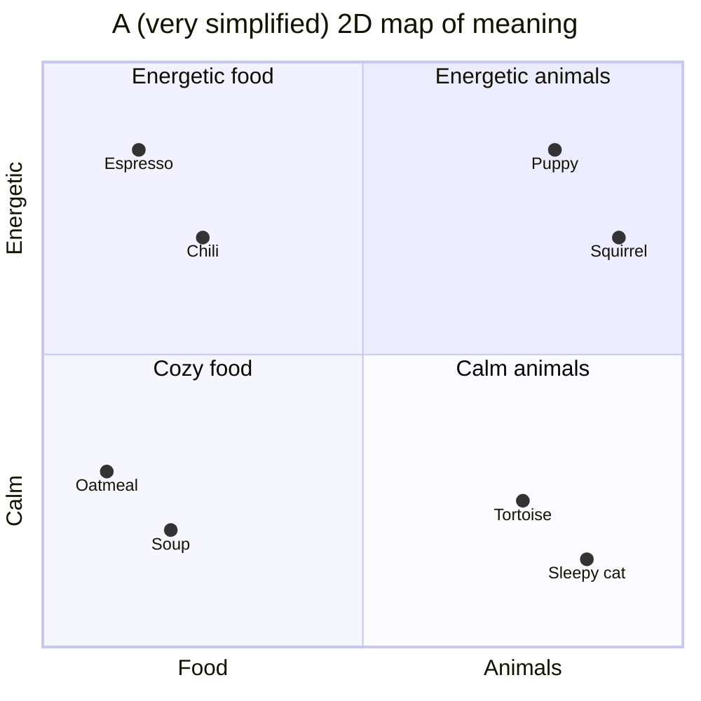

# 73 · Embeddings & Vector Databases: Search by Meaning 🧬🗺️

> ⏱️ 8 min read · 🎯 Curious beginners → intermediate · 🧰 Needs: optional Python for the hands-on bits (runs on a laptop, no API key)

**Embeddings are the quiet magic behind RAG, semantic search, recommendations, duplicate detection and "find me things
like this."** They turn words, images and sounds into coordinates on a giant map of meaning, where similar things sit close
together. This chapter builds the intuition first (no math degree needed), then shows you how to make embeddings on your
laptop, store them in a vector database, and use them for way more than chatbots. 🗺️✨

<details class="eli5" open>
<summary>🧸 ELI5: This chapter in 30 seconds</summary>

Imagine a huge playground map where every word, sentence and picture gets a spot. Things that *mean* similar stuff stand
close together: "puppy" is near "dog," "pizza" is near "pasta," and a photo of a beach is near the sentence "sunny day by the
sea." An **embedding** is just the address of a spot on that map (a list of numbers). A **vector database** is a super-fast
helper that answers "who's standing near this spot?" That's how AI finds things by meaning instead of exact words.

</details>

<!-- in-this-chapter -->

## 🗺️ The map of meaning

<details class="eli5">
<summary>🧸 ELI5</summary>

Every piece of text gets a location made of numbers. Close locations mean similar meanings, far locations mean different
meanings.

</details>

An **embedding model** reads a piece of text and outputs a **vector**: a list of numbers, often hundreds or a few thousand of
them. Each number is a coordinate in a very high-dimensional space.



Real embeddings use hundreds of dimensions instead of two, so they capture far subtler things: topic, tone, language,
formality, even "is this a question or an answer." You can't picture 1,024 dimensions (nobody can 🤯), but the idea is the
same: **distance = difference in meaning**.

## 📐 Measuring "closeness"

<details class="eli5">
<summary>🧸 ELI5</summary>

To check if two things are similar, we look at whether their arrows point in the same direction. Same direction means
similar, opposite directions means very different.

</details>

| Measure | Idea | Notes |
|---|---|---|
| **Cosine similarity** | Do the two arrows point the same way? (1 = same, 0 = unrelated) | The most common choice for text |
| **Dot product** | Direction *and* length | Same as cosine when vectors are normalized |
| **Euclidean distance** | Straight-line distance between the points | Smaller = more similar |

You don't need to compute these by hand: every library and vector database does it for you. Just remember **cosine similarity
close to 1 = very similar**.

## 🔤 Words vs. meaning: why embeddings beat keyword search

<details class="eli5">
<summary>🧸 ELI5</summary>

Old search only finds the exact words you typed. Meaning search also finds things said in different words, like finding
"automobile" when you asked about "cars."

</details>

| Query | Keyword search finds | Embedding search also finds |
|---|---|---|
| "car won't start" | Notes containing "car," "start" | "engine turns over but dies," "dead battery on the Honda" |
| "cheap flights to Portugal" | Pages with those words | "budget airlines to Lisbon," "low-cost travel to Porto" |
| "how to calm down" | Exact phrase matches | "breathing exercises for anxiety," "box breathing" |
| "espresso machine error" | Exact words only | "coffee maker E4 code" 🎯 |

**But keywords still matter!** Embeddings can be fuzzy on exact names, part numbers and rare jargon, which is why the best
systems use **hybrid search** (keywords + embeddings) ([Build a RAG System](74-build-a-rag-system.md)).

## 🧪 Make embeddings on your laptop (no API key)

<details class="eli5">
<summary>🧸 ELI5</summary>

You can make these meaning-maps on your own computer for free with a small open-source model. Here's how, in about ten lines.

</details>

=== "🐍 Python (sentence-transformers)"

    ```python
    # pip install sentence-transformers
    from sentence_transformers import SentenceTransformer

    model = SentenceTransformer("all-MiniLM-L6-v2")   # small, fast, downloads once (~90 MB)

    notes = [
        "The coffee maker shows error E4 when the water tank is empty.",
        "Basil hates cold nights. Bring the pots inside below 10°C.",
        "Our Lisbon hotel is near the Time Out Market.",
    ]
    question = "espresso machine is flashing a code"

    note_vecs = model.encode(notes)
    q_vec = model.encode([question])
    scores = model.similarity(q_vec, note_vecs)[0]    # cosine similarity for each note

    for note, score in sorted(zip(notes, scores), key=lambda x: -x[1]):
        print(f"{score:.2f}  {note}")
    ```

=== "🦙 Ollama (local HTTP API)"

    ```bash
    ollama pull nomic-embed-text
    curl http://localhost:11434/api/embed -d '{
      "model": "nomic-embed-text",
      "input": ["The coffee maker shows error E4.", "espresso machine is flashing a code"]
    }'
    ```

You'll see the coffee note score far higher than the basil note, even though "espresso," "flashing" and "code" never appear
in it. That's the moment embeddings click. ☕✨

## 🏷️ Choosing an embedding model

<details class="eli5">
<summary>🧸 ELI5</summary>

Different map-makers draw slightly different maps. Some are free and run on your computer, some are online and extra
accurate. Pick one and stick with it, because maps from different makers don't match.

</details>

| Option | Type | Why pick it |
|---|---|---|
| **Voyage AI** | Hosted API | Top-quality text and code embeddings, recommended by Anthropic for Claude-based RAG |
| **OpenAI, Cohere, Google (Gemini)** | Hosted API | Popular, multilingual, easy to start |
| **sentence-transformers** (e.g. MiniLM, BGE, E5, GTE families) | Local, open | Free, private, runs on a laptop |
| **Ollama embedding models** (e.g. `nomic-embed-text`, `mxbai-embed-large`) | Local, open | One command, works with local RAG stacks |
| **Multimodal** (CLIP-style, and hosted multimodal embedders) | Local or hosted | Text ↔ image search: "photos of my dog at the beach" |

**How to choose:**

- **Start local and free** for learning and private data.
- **Check the MTEB leaderboard** (Hugging Face) for rankings by task and language, then **test on your own data**. A 20-question
  eval beats any leaderboard ([Evaluating AI](../part-12-mastery/105-evaluating-ai.md)).
- **Multilingual content?** Pick a model trained for it.
- **Code?** Pick a code-aware embedding model.

> [!WARNING]
> **⚠️ One model per index**
> Vectors from different embedding models live on **different maps**. If you switch models, you must **re-embed everything**.
> Store the model name alongside your vectors so future-you remembers.

## 🗄️ Vector databases

<details class="eli5">
<summary>🧸 ELI5</summary>

When you have millions of spots on the map, you need a special helper that can find the nearest ones instantly. That's a
vector database.

</details>

With a few thousand chunks, a plain Python list works fine. With millions, you need a **vector database**: it stores
vectors plus metadata (source, date, author) and finds nearest neighbors in milliseconds using clever indexes.

| Tool | Style | Why pick it |
|---|---|---|
| **Chroma** | Embedded (in your Python process) | Easiest start, great for prototypes |
| **LanceDB** | Embedded, file-based | Fast, local, multimodal-friendly |
| **SQLite + sqlite-vec** | A tiny extension | Portable single-file projects |
| **pgvector** (Postgres) | An extension | Keep vectors next to your normal data. Built into Supabase and Neon |
| **Qdrant, Weaviate, Milvus** | Open-source servers | Scalable, rich filtering, hybrid search |
| **Pinecone, Turbopuffer** | Managed, serverless | Zero ops, scale to huge |
| **Elasticsearch / OpenSearch** | Search engines with vectors | Great hybrid (keyword + vector) search |

**pgvector in five lines of SQL** (works on Supabase):

```sql
create extension if not exists vector;
create table notes (id bigserial primary key, content text, source text, embedding vector(384));
create index on notes using hnsw (embedding vector_cosine_ops);
-- nearest 5 notes to a query vector ($1), by cosine distance:
select content, source from notes order by embedding <=> $1 limit 5;
```

## ⚡ How vector search stays fast

<details class="eli5">
<summary>🧸 ELI5</summary>

Instead of checking every single spot on the map, the database builds shortcuts, like signposts, so it can jump straight to
the right neighborhood.

</details>

Comparing a query to *every* vector (**exact search**) is fine up to maybe a hundred thousand vectors. Beyond that, databases
use **approximate nearest neighbor (ANN)** indexes:

| Index | Intuition |
|---|---|
| **HNSW** | A multi-level "highway map": jump across the space fast, then walk the local streets |
| **IVF** | Divide the map into neighborhoods, and only search the closest few |
| **Quantization** | Store smaller, compressed vectors to save memory (tiny accuracy trade-off) |

"Approximate" sounds scary, but these indexes typically find nearly all of the true nearest neighbors, thousands of times
faster. 🏎️

## 🎨 Beyond RAG: 10 things embeddings can do

<details class="eli5">
<summary>🧸 ELI5</summary>

The meaning-map isn't just for chatbots. You can use it to group similar things, find duplicates, recommend stuff, and
spot weird ones out.

</details>

| # | Use | Example |
|---|---|---|
| 1 | 🔎 **Semantic search** | Search your notes, docs or photos by meaning |
| 2 | 🧺 **Clustering** | Group 2,000 survey answers into themes automatically |
| 3 | 👯 **Deduplication** | Find near-duplicate support tickets or contacts |
| 4 | 🎁 **Recommendations** | "Readers who liked this article…" |
| 5 | 🏷️ **Classification** | Tag items by comparing them to example embeddings for each label |
| 6 | 🚨 **Anomaly detection** | Flag reviews unlike all the others |
| 7 | 🔗 **Auto-linking notes** | Suggest related notes in Obsidian ([Personal Knowledge Management](77-personal-knowledge-management.md)) |
| 8 | 🖼️ **Image search** | "Photos of my dog on a beach" with multimodal embeddings |
| 9 | 🌍 **Cross-language search** | An English query finds Portuguese documents |
| 10 | 🗺️ **Visualize your notes** | Squash embeddings to 2D (UMAP) and see your knowledge as a map |

> [!TIP]
> **🎮 Try this: map your notes**
> Ask Claude Code: *"Embed every Markdown file in this folder with sentence-transformers, cluster them with k-means, name each
> cluster, and draw an interactive 2D map with UMAP and Plotly."* Seeing your own brain as a galaxy of dots is unforgettable. 🌌

## 🪤 Pitfalls & best practices

<details class="eli5">
<summary>🧸 ELI5</summary>

A few rules keep your meaning-map useful: use the same map-maker for everything, cut documents into sensible pieces, and
keep labels on every card so you know where it came from.

</details>

| Pitfall | Best practice |
|---|---|
| Mixing embedding models | One model per index. Store the model name with the vectors |
| Chunks too big or too small | Chunk at natural boundaries (headings, paragraphs), ~200–800 tokens, with some overlap |
| Lost context ("It costs $40") | Prepend the document title or a short summary to each chunk before embedding |
| Missing exact terms | Add keyword search (hybrid) |
| No metadata | Store source, date, author and permissions for filtering and citations |
| Stale vectors | Re-embed when documents change (use `updated_at`) |
| Private data sent to an API | Use a local embedding model for sensitive collections |

## 🎯 Key takeaways

- **Embeddings** turn meaning into coordinates. **Close = similar.**
- **Cosine similarity** measures closeness. Vector databases find nearest neighbors fast with **ANN indexes** like HNSW.
- Start with a **local model** (free, private), then test hosted options like **Voyage** on your own data.
- **One embedding model per index.** Switching models means re-embedding.
- Embeddings power far more than RAG: **clustering, dedup, recommendations, classification and image search**.

## 🧠 Check yourself

<details class="quiz">
<summary>❓ 1. Why can embedding search find "coffee maker E4 code" when you search "espresso machine error"?</summary>

Because embeddings capture **meaning**, and those phrases sit close together on the map of meaning, even with different words.

</details>

<details class="quiz">
<summary>❓ 2. You switched from one embedding model to another, and search results became nonsense. Why?</summary>

Vectors from different models live on **different maps**. You need to **re-embed all documents** with the new model.

</details>

<details class="quiz">
<summary>❓ 3. Name three uses of embeddings that aren't chatbots.</summary>

Any three of: **clustering**, **deduplication**, **recommendations**, **classification**, **anomaly detection**, **auto-linking
notes**, **image search**, **cross-language search**.

</details>

> [!TIP]
> **🎮 Try this**
> Run the sentence-transformers example above, then add ten sentences about your own life (hobbies, chores, plans). Ask
> questions using completely different words and watch it find the right ones. Then try a question with no good match and see
> how low the scores get. That's the "I don't know" signal good RAG systems use. 🧬

---

**Next:** [74 · Build a RAG System, Step by Step →](74-build-a-rag-system.md)
