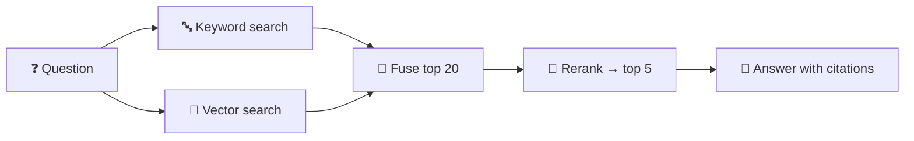
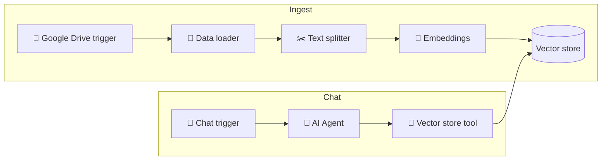

# 74 · Build a RAG System, Step by Step 🏗️📚

> ⏱️ 7 min read · 🎯 Intermediate (copy-paste friendly) · 🧰 Needs: Python 3.10+, the [rag-from-scratch kit](../../examples/rag-from-scratch/), optionally an Anthropic API key and n8n

**In [RAG, Memory & Knowledge](72-rag-memory-and-knowledge.md) you learned *what* RAG is. Now you'll build one, four
times, each better than the last.** First from scratch (to understand every piece), then with real embeddings and a vector
database, then with hybrid search and reranking, and finally with zero code in n8n. By the end, you can make AI answer
questions about *any* pile of documents, with citations. 📚✅

<details class="eli5" open>
<summary>🧸 ELI5: This chapter in 30 seconds</summary>

We're building a robot librarian. Step one: cut your notes into index cards. Step two: give every card a "meaning address."
Step three: when you ask a question, the robot fetches the best few cards. Step four: the AI reads those cards and answers,
pointing to which card each fact came from. We'll build it the simple way first so you see every gear turning, then make
it smarter and smarter.

</details>

<!-- in-this-chapter -->

## 🗺️ The four stages

<details class="eli5">
<summary>🧸 ELI5</summary>

We'll build the same librarian four times: a basic one, a smarter one, a super-precise one, and one made by dragging blocks
around with no code at all.

</details>

| Stage | What you build | Search quality | Effort |
|---|---|---|---|
| 1️⃣ **From scratch** | TF-IDF search + Claude answers, ~120 lines of plain Python | Matches **words** | 🟢 10 min |
| 2️⃣ **Real embeddings** | Chroma + local embeddings | Matches **meaning** | 🟢 20 min |
| 3️⃣ **Pro retrieval** | Hybrid search + reranking + contextual chunks | Matches meaning **and** exact terms | 🟡 An afternoon |
| 4️⃣ **No-code** | n8n ingest + chat workflows | Meaning, with a chat URL to share | 🟡 An hour |

## 1️⃣ Stage 1: RAG from scratch

<details class="eli5">
<summary>🧸 ELI5</summary>

The simplest robot librarian: it finds cards that share the most important words with your question, then asks Claude to
answer using only those cards.

</details>

The [rag-from-scratch kit](../../examples/rag-from-scratch/) is a working RAG system in ~120 lines of plain Python. The
search half needs **no API key and no downloads**.

```bash
cd examples/rag-from-scratch
python rag.py --search "my basil keeps dying when it's cold"
#   🔎 Top 1 of 10 chunks: garden.md › Herbs
python rag.py "my basil keeps dying when it's cold, what do I do?"   # with ANTHROPIC_API_KEY set
python rag.py --notes ~/Documents/notes --search "something you wrote about"
```

### The four moves

**1 · Chunk:** split documents into passages that each make sense on their own.

```python
for section in re.split(r"\n(?=#{1,3} )", text):   # split at Markdown headings
```

**2 · Vectorize:** turn each chunk into numbers. The kit uses **TF-IDF**: each word gets a weight based on how often it
appears in this chunk versus how rare it is overall. (The ancestor of embeddings.)

**3 · Search:** vectorize the question the same way and find the chunks with the highest **cosine similarity**
([Embeddings & Vector Databases](73-embeddings-and-vector-databases.md#-measuring-closeness)).

**4 · Answer:** send the top chunks to the model with strict instructions:

```text
Answer using ONLY the provided sources. Cite them like [1]. If the sources don't contain the answer, say so.
```

> [!TIP]
> **🎯 The magic sentence**
> **Grounding + permission to say "I don't know" = far fewer hallucinations.** That one instruction is the heart of every good
> RAG system.

## 2️⃣ Stage 2: Real embeddings with Chroma

<details class="eli5">
<summary>🧸 ELI5</summary>

Now the librarian understands meaning, not just matching words. "Espresso machine error" finds the card about the "coffee
maker E4 code."

</details>

TF-IDF matches **words**. Embeddings match **meaning**. Chroma is a vector database that runs inside your Python process and
comes with a default local embedding model:

```python
# pip install chromadb
import chromadb

client = chromadb.PersistentClient(path="./chroma")
notes = client.get_or_create_collection("notes")        # default local embedding model

notes.add(
    ids=["coffee-1", "garden-1"],
    documents=["The coffee maker shows error E4 when the water tank is empty.",
               "Basil hates cold nights. Bring pots inside below 10°C."],
    metadatas=[{"source": "coffee-machine.md"}, {"source": "garden.md"}],
)

results = notes.query(query_texts=["espresso machine error"], n_results=3)
print(results["documents"][0], results["metadatas"][0])
```

Then pass `results["documents"]` into the same answering prompt as Stage 1. That's a production-shaped RAG system in about
20 lines. 🎉

> [!TIP]
> **🪄 Vibe-code it**
> *"Upgrade examples/rag-from-scratch to use Chroma with local embeddings, keeping the TF-IDF version as a fallback. Add a
> test that 'espresso machine error' finds the Error codes chunk."*

## 3️⃣ Stage 3: Pro retrieval

<details class="eli5">
<summary>🧸 ELI5</summary>

Three upgrades make the librarian excellent: search by meaning AND exact words, have a second expert re-sort the best cards,
and write a tiny summary on each card so it makes sense on its own.

</details>

### 🔀 Hybrid search

Combine **keyword search** (BM25, great for names, codes and rare terms) with **vector search** (great for meaning), then merge
the two ranked lists. A simple, robust merge is **Reciprocal Rank Fusion**:

```python
def rrf(*ranked_lists, k=60):
    """Merge ranked lists of chunk IDs: items near the top of any list win."""
    scores = {}
    for ranking in ranked_lists:
        for rank, chunk_id in enumerate(ranking):
            scores[chunk_id] = scores.get(chunk_id, 0) + 1 / (k + rank + 1)
    return sorted(scores, key=scores.get, reverse=True)

best = rrf(keyword_results, vector_results)[:20]
```

### 🥇 Reranking

Retrieve the top ~20 candidates, then let a **reranker** model (Voyage, Cohere and open-source rerankers) score each one
against the question more carefully, and keep the best 5. It's slower per item, so you only rerank a short list.

### 🧩 Contextual chunks

Chunks often don't make sense alone ("It costs $40 per month"). Before embedding, **prepend context**: the document title,
the section heading, or a one-sentence summary written by a small, cheap model ("This chunk is from the 2025 pricing page,
about the Pro plan"). Retrieval accuracy jumps noticeably.



## 4️⃣ Stage 4: No-code RAG in n8n

<details class="eli5">
<summary>🧸 ELI5</summary>

The same librarian built by connecting blocks: one robot files new documents automatically, and another answers questions in
a chat window.

</details>



1. **Ingest workflow:** Drive trigger (new or updated file) → Default Data Loader → Recursive Character Text Splitter →
   Embeddings node → Supabase, Qdrant or Pinecone Vector Store (insert).
2. **Chat workflow:** Chat Trigger → AI Agent + Vector Store tool (same store, retrieve mode) → answer.
3. **Share** the chat URL, or connect it to Slack or Telegram ([Chat Apps & Bots](../part-6-ai-in-your-apps/59-chat-apps-and-bots.md)).

More n8n detail in [n8n AI Agents](../part-5-automation/48-n8n-ai-agents.md#-rag-inside-n8n).

## ✨ The tuning checklist

<details class="eli5">
<summary>🧸 ELI5</summary>

When the librarian gives bad answers, here's a list of what's probably wrong and how to fix it.

</details>

| Problem | Fix |
|---|---|
| Answers miss obvious info | Retrieve more chunks (k), or use smaller chunks with some **overlap** |
| Right doc, wrong section | Chunk at structure (headings, paragraphs), and include the title and heading in each chunk |
| Exact terms (SKUs, names, codes) not found | **Hybrid search** (keywords + vectors) |
| Relevant but low-ranked results | Add a **reranker** on the top 20 |
| Model ignores sources or makes things up | Stricter prompt, require citations, allow "I don't know" |
| Stale answers | Re-ingest on file changes (triggers), and store `updated_at` metadata |
| Questions need the *whole* document | Don't chunk. Long-context models can take entire documents, and prompt caching makes repeats cheap |
| Multi-hop questions ("compare X and Y") | Let an **agent** do several searches (agentic RAG) |
| Users see docs they shouldn't | Filter by **permission metadata** at retrieval time |

> [!TIP]
> **💡 Sometimes you don't need RAG at all**
> Modern context windows hold hundreds of pages. For a few documents, just **put them all in the prompt** (with caching). Use
> RAG when the collection is big, changing, or needs fine-grained citations.

## 🧪 Evaluate it (seriously, 10 minutes)

<details class="eli5">
<summary>🧸 ELI5</summary>

Write a quiz for your librarian with questions you already know the answers to. Every time you change something, run the quiz
again to see if it got better or worse.

</details>

Write **15–20 real questions** with known answers from your docs (include 3 whose answers **aren't** in the docs). Score:

- ✅ **Retrieval hit:** was the right chunk in the top k? (The kit's `test_rag.py` does exactly this!)
- ✅ **Answer correct?**
- ✅ **Cited the right source?**
- ✅ **Said "I don't know"** for the unanswerable ones?

Change **one thing at a time** (chunk size, k, embedding model, reranker) and re-run. More in [Evaluating AI](../part-12-mastery/105-evaluating-ai.md).

## 🚀 Going to production

<details class="eli5">
<summary>🧸 ELI5</summary>

If real people will use your librarian, add a few grown-up features: keep documents fresh, respect who's allowed to see what,
show sources, and keep an eye on costs.

</details>

- [ ] **Ingestion pipeline** that re-embeds changed documents automatically
- [ ] **Metadata**: source URL, title, date, permissions, embedding model name
- [ ] **Permission filtering** at query time (never rely on the prompt to hide things)
- [ ] **Citations** shown to users as clickable links
- [ ] **Feedback buttons** (👍/👎) logged for improvement
- [ ] **Eval set** run on every change
- [ ] **Cost controls**: cache prompts, cheaper models for simple questions ([Cost Optimization](../part-12-mastery/106-cost-optimization.md))
- [ ] **Injection defenses**: treat document text as data, keep the bot read-only

## 🎮 Project ideas

<details class="eli5">
<summary>🧸 ELI5</summary>

Six fun librarians you could build this month.

</details>

| # | Project | Stage |
|---|---|---|
| 1 | 🏠 **Home manual bot:** every appliance manual PDF → "why is the dishwasher beeping?" | 2 |
| 2 | 🎓 **Course companion:** lecture notes + slides → study Q&A with citations | 2 or 4 |
| 3 | 🏢 **Team wiki bot** in Slack: Notion or Confluence export → answers with links | 4 |
| 4 | 🧑‍⚕️ **Personal health log** Q&A (local models only! [Local & Open Models](../part-9-local-ai/78-local-and-open-models.md)) | 2 (local) |
| 5 | 📜 **Family history archive:** scanned letters (OCR) → "what did Grandpa write about the farm?" | 3 |
| 6 | 🎮 **Game wiki helper:** a fan wiki → "how do I beat the fire boss?" | 2 |

## 🎯 Key takeaways

- RAG is four moves: **chunk → vectorize → search → answer with citations.**
- **Embeddings** beat keyword search for meaning. **Hybrid + reranking** beats either alone.
- **Contextual chunks** (titles and summaries prepended) boost retrieval.
- **n8n** gets you a shareable RAG chatbot with no code.
- **Evaluate** with 15–20 known questions, and change one thing at a time.

## 🧠 Check yourself

<details class="quiz">
<summary>❓ 1. Why tell the model it may say "I don't know"?</summary>

Without permission, models tend to guess. Allowing "I don't know" when the sources lack the answer **cuts hallucinations**.

</details>

<details class="quiz">
<summary>❓ 2. The right chunk appears at position 14 of your results, but you only send the top 5. What helps?</summary>

A **reranker** over the top ~20 (or hybrid search), so the best chunk moves up into the top 5.

</details>

<details class="quiz">
<summary>❓ 3. Why include a few unanswerable questions in your eval set?</summary>

To check the system **admits when the answer isn't in the documents** instead of making something up.

</details>

> [!TIP]
> **🎮 Try this**
> Point the kit at your own notes: `python rag.py --notes ~/Documents/notes --search "something you wrote about"`. Then try a
> question using **different words** than your notes use, and see where TF-IDF fails. You've just discovered why embeddings
> exist. Now do Stage 2 and watch it succeed. 🧬

---

**Next:** [75 · Memory for Agents →](75-memory-for-agents.md)
