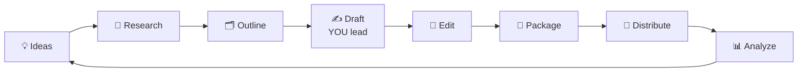

# 33 · AI for Writing & Content Creators ✍️📣

AI can make you a **faster, braver, more consistent** writer and creator without making you sound like a
robot. The trick is to use AI as editor, sparring partner, researcher, and production assistant, while **your
ideas, voice, and taste** stay in charge.

---

## The creator's AI workflow

| Stage | How AI helps | You own |
|---|---|---|
| 💡 Ideas | Brainstorm 50 angles, find gaps, mine your notes | Choosing what *you* care about |
| 🔎 Research | Deep research, source finding, fact-checks | Judging credibility |
| 🗂️ Outline | Structure options, argument flow | The core thesis |
| ✍️ Draft | Unblocking, expanding bullet points, alternative phrasings | Voice, stories, opinions |
| 🧐 Edit | Line edits, clarity, cutting fluff, catching weak arguments | Final taste |
| 📣 Package | Titles, hooks, thumbnails, descriptions | Picking the honest one |
| 🚀 Distribute | Repurposing into platforms and formats, scheduling | Engagement |
| 📊 Analyze | Summarize comments and metrics, find patterns | Deciding what to do next |

## Teaching AI your voice 🗣️

1. **Collect 5–10 samples** of your best writing.
2. Ask: *"Analyze my writing style: sentence length, vocabulary, tone, humor, structure, quirks. Write a style guide I can reuse."*
3. Save that style guide in a **Project** / custom instructions / a **skill** ([Ch. 18](../part-5-building-with-ai/18-claude-code-masterclass.md)).
4. When drafting: *"Using my style guide, turn these bullet points into a draft. Keep my stories exactly as written."*
5. **Always edit the final pass yourself.** Read it aloud. If it doesn't sound like you, fix it.

### Banishing "AI voice" 🚫🤖
Tell it plainly: *"Avoid clichés and filler: no 'delve', 'in today's fast-paced world', 'game-changer', 'it's not just X, it's Y',
no rhetorical questions as openers, no generic conclusions. Be specific and concrete. Use short sentences where they help."*
Then give it **specific details only you know** (stories, numbers, opinions). Specificity is the antidote to blandness.

## The AI editor (the highest-value use) 🧐

| Prompt | What it does |
|---|---|
| *"Edit for clarity and concision. Show changes as a list with reasons. Don't change my voice."* | Line editing you can learn from |
| *"What's the weakest argument in this piece? How would a smart skeptic respond?"* | Strengthens thinking |
| *"Where will readers get bored or confused?"* | Pacing and structure |
| *"Give me 10 headline options: 3 curious, 3 benefit-driven, 3 contrarian, 1 wildcard."* | Packaging |
| *"Is anything here potentially inaccurate or overstated?"* | Fact-check pass |

## Content repurposing machine ♻️

One piece of long-form content → a week of posts:
> *"From this article, create: a 7-post X thread, a LinkedIn post, an Instagram carousel (10 slides of text), a 60-second
> video script, a newsletter intro, and 5 quote graphics. Match each platform's norms. Keep my voice."*

Automate it with Make/Zapier/n8n: new post → AI repurposes → drafts land in Buffer or Notion for your review ([Ch. 11](../part-3-automation/11-zapier-and-make-walkthroughs.md)).

## Creator tool stack 🧰
| Need | Tools |
|---|---|
| Writing & editing | Claude, ChatGPT, Gemini (+ your style guide) |
| Grammar & polish | Grammarly, built-in editor modes |
| Newsletter | Beehiiv, Substack, Kit (with AI features) |
| Visuals | Canva AI, Ideogram, Midjourney ([Ch. 29](../part-8-creative-ai/29-image-generation-deep-dive.md)) |
| Video & audio | Descript, CapCut, ElevenLabs ([Ch. 30](../part-8-creative-ai/30-video-and-audio-production.md)) |
| Scheduling | Buffer, Typefully, Later |
| Ideas & research | Perplexity, deep research, your PKM ([Ch. 25](../part-6-knowledge-and-memory/25-personal-knowledge-management.md)) |

## Special formats 📝
- **Emails that get replies:** *"Rewrite this email to be half as long, warmer, and with one clear ask."*
- **Fiction:** use AI for brainstorming plots, naming, character interviews ("interview my villain"), and continuity checks. Write the prose yourself for your own voice.
- **Speeches & talks:** *"Turn this outline into a spoken-style script with a strong open and callback ending. Mark pauses."*
- **Résumés & cover letters:** *"Tailor my résumé bullets to this job description. Quantify impact. Don't invent anything."*
- **Grant/proposal writing:** *"Check this proposal against the funder's criteria and score each section."*

## Ethics & trust 🤝
- **Disclose AI use** where your audience or platform expects it.
- **Never publish unverified AI facts or quotes.**
- **Respect copyright:** don't prompt for copies of others' work, and add your own original perspective.
- Your **authentic perspective** is your moat. AI can produce average content infinitely, and only you can produce *yours*.

---

### 🎮 Try this
Build your **personal style guide** today (step 2 above) and save it as a Project or skill. Then write your next piece with
AI as *editor only*: you draft, it critiques. Compare how it feels. Most people find their writing gets better *and* more themselves. ✍️

---

**Next:** [34 · AI for Small Business & Side Hustles →](34-small-business.md)
