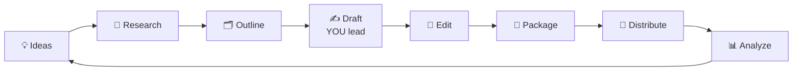
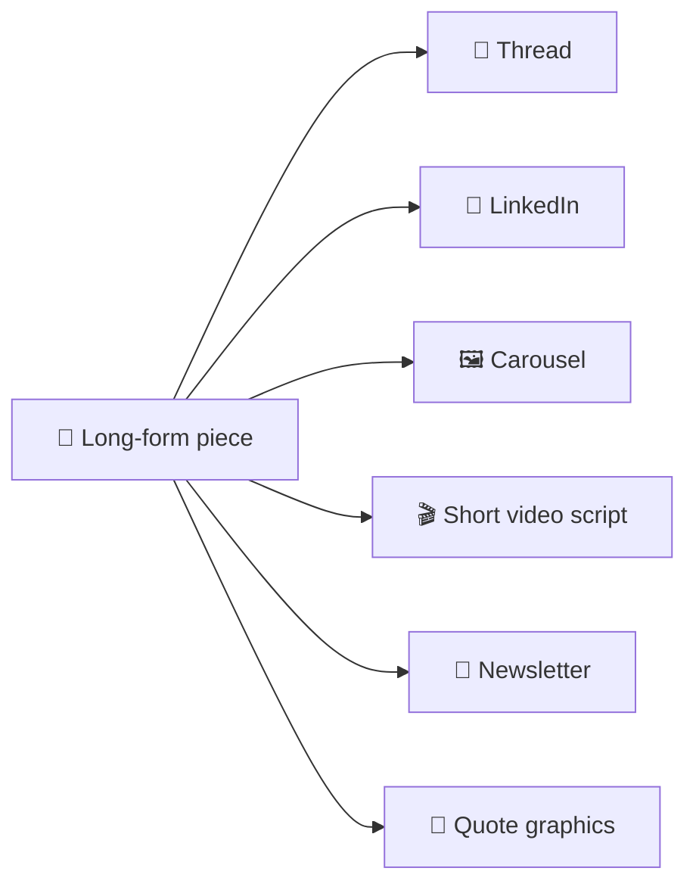

# 61 · AI for Writing & Content Creators ✍️📣

> ⏱️ 6 min read · 🎯 Writers, bloggers, newsletter folks, creators, anyone who writes at work · 🧰 Needs: an assistant (Claude, ChatGPT, Gemini), optionally a Project or skill for your style guide

**AI can make you a faster, braver, more consistent writer and creator, without making you sound like a robot.** The trick is
to use AI as editor, sparring partner, researcher and production assistant, while **your ideas, voice and taste** stay in
charge. This chapter covers the creator workflow, teaching AI your voice, banishing "AI voice," the AI editor, a repurposing
machine, special formats, the creator tool stack and the ethics that keep your audience's trust. ✨

<details class="eli5" open>
<summary>🧸 ELI5: This chapter in 30 seconds</summary>

Writing with AI is like having a really good friend read your work. They help you find ideas when you're stuck, tell you which
parts are confusing, fix spelling, and turn one story into lots of little posts. But the ideas, the jokes and the way you talk
are **yours**. That's what makes people want to read it. ✍️💛

</details>

<!-- in-this-chapter -->

## 🔁 The creator's AI workflow

<details class="eli5">
<summary>🧸 ELI5</summary>

Making content has steps: ideas, research, planning, writing, fixing, packaging and sharing. AI can help at each step, but
you make the important choices.

</details>



| Stage | How AI helps | You own |
|---|---|---|
| 💡 Ideas | Brainstorm 50 angles, find gaps, mine your notes | Choosing what *you* care about |
| 🔎 Research | Deep research, source finding, fact-checks | Judging credibility ([Research & Learning](60-research-and-learning.md)) |
| 🗂️ Outline | Structure options, argument flow | The core thesis |
| ✍️ Draft | Unblocking, expanding bullet points, alternative phrasings | Voice, stories, opinions |
| 🧐 Edit | Line edits, clarity, cutting fluff, catching weak arguments | Final taste |
| 📣 Package | Titles, hooks, thumbnails, descriptions | Picking the honest one |
| 🚀 Distribute | Repurposing into platforms and formats, scheduling | Engagement |
| 📊 Analyze | Summarize comments and metrics, find patterns | Deciding what to do next |

## 🗣️ Teaching AI your voice

<details class="eli5">
<summary>🧸 ELI5</summary>

Show the AI some of your best writing so it learns how you sound. Save those notes as a "style guide" it reads every time.

</details>

1. **Collect 5–10 samples** of your best writing.
2. Ask: *"Analyze my writing style: sentence length, vocabulary, tone, humor, structure, quirks. Write a style guide I can
   reuse."*
3. Save the style guide in a **Project**, custom instructions, or a **skill** ([Claude Code Power-Ups](../part-5-building-with-ai/32-claude-code-power-ups.md#-skills-packaged-expertise)).
4. When drafting: *"Using my style guide, turn these bullet points into a draft. Keep my stories exactly as written."*
5. **Always edit the final pass yourself.** Read it aloud. If it doesn't sound like you, fix it.

## 🚫🤖 Banishing "AI voice"

<details class="eli5">
<summary>🧸 ELI5</summary>

AI writing can sound bland and full of the same tired phrases. Tell it which phrases to avoid, and give it real details only
you know.

</details>

Tell it plainly:

```text
Avoid clichés and filler: no "delve," "in today's fast-paced world," "game-changer," "it's not just X, it's Y,"
no rhetorical questions as openers, no generic conclusions, no lists of three for rhythm's sake.
Be specific and concrete. Use short sentences where they help. Prefer plain words.
```

Then give it **specific details only you know**: stories, numbers, names, opinions, mistakes you made. **Specificity is the
antidote to blandness.**

| Bland (AI voice) | Specific (your voice) |
|---|---|
| "Productivity is important in today's busy world." | "Last Tuesday I answered 43 emails and did zero real work." |
| "Gardening offers many benefits." | "My first tomato cost me $38 and three weekends. Best tomato of my life." |
| "It's a game-changer for teams." | "Our Monday meeting went from 60 minutes to 15." |

## 🧐 The AI editor (the highest-value use)

<details class="eli5">
<summary>🧸 ELI5</summary>

The best way to use AI for writing is as an editor: you write, and it tells you what's unclear, what's weak and what could
be shorter.

</details>

| Prompt | What it does |
|---|---|
| *"Edit for clarity and concision. Show changes as a list with reasons. Don't change my voice."* | Line editing you can learn from |
| *"What's the weakest argument here? How would a smart skeptic respond?"* | Strengthens thinking |
| *"Where will readers get bored or confused?"* | Pacing and structure |
| *"Cut this by 30% without losing any idea."* | Tight writing |
| *"Give me 10 headline options: 3 curious, 3 benefit-driven, 3 contrarian, 1 wildcard."* | Packaging |
| *"Is anything here potentially inaccurate or overstated?"* | Fact-check pass |
| *"Read this as my target reader [describe them]. What do you need that's missing?"* | Audience fit |

## ♻️ The content repurposing machine

<details class="eli5">
<summary>🧸 ELI5</summary>

Turn one big piece of writing into lots of little ones for different places: a thread, a video script, a newsletter, and
more.

</details>

One piece of long-form content → a week of posts:

> *"From this article, create: a 7-post thread, a LinkedIn post, an Instagram carousel (10 slides of text), a 60-second video
> script, a newsletter intro and 5 quote graphics. Match each platform's norms. Keep my voice."*



**Automate it:** new post → AI repurposes → drafts land in Buffer or Notion **for your review** ([Zapier & Make](../part-3-automation/18-zapier-and-make-walkthroughs.md),
[Build-Along: Automated Newsletter](../part-11-build-alongs/87-build-along-automated-newsletter.md)).

## 📝 Special formats

<details class="eli5">
<summary>🧸 ELI5</summary>

AI helps with all kinds of writing: emails, speeches, stories, résumés and applications. Here are the best tricks for each.

</details>

| Format | Prompt |
|---|---|
| ✉️ **Emails that get replies** | *"Rewrite this email to be half as long, warmer, and with one clear ask."* |
| 🎤 **Speeches & talks** | *"Turn this outline into a spoken-style script with a strong open and a callback ending. Mark pauses."* |
| 💍 **Toasts & eulogies** | *"Help me structure a 3-minute toast from these stories. Keep my words, suggest the order."* |
| 📄 **Résumés** | *"Tailor my résumé bullets to this job description. Quantify impact. Don't invent anything."* ([Careers](63-careers-and-job-hunting.md)) |
| 💰 **Grants & proposals** | *"Check this proposal against the funder's criteria and score each section."* |
| 📚 **Fiction** | Brainstorm, interview characters, check continuity, and write the prose yourself ([Storytelling](../part-8-creative-ai/58-storytelling-and-interactive-fiction.md)) |
| 📰 **Newsletters** | *"Suggest 5 subject lines and a 2-sentence preview for this issue."* |
| 🛍️ **Product copy** | *"Write 3 descriptions: playful, premium, practical."* |

## 🧰 The creator tool stack

<details class="eli5">
<summary>🧸 ELI5</summary>

A list of handy tools for writing, pictures, videos, newsletters and scheduling posts.

</details>

| Need | Tools |
|---|---|
| Writing & editing | Claude, ChatGPT, Gemini (+ your style guide) |
| Grammar & polish | Grammarly, built-in editor modes |
| Newsletter | Beehiiv, Substack, Kit (with AI features) |
| Visuals | Canva AI, Ideogram, Midjourney ([Image Generation](../part-8-creative-ai/53-image-generation-deep-dive.md)) |
| Video & audio | Descript, CapCut, ElevenLabs ([Video & Audio](../part-8-creative-ai/54-video-and-audio-production.md)) |
| Scheduling | Buffer, Typefully, Later |
| Ideas & research | Perplexity, deep research, your second brain ([Personal Knowledge Management](../part-6-knowledge-and-memory/46-personal-knowledge-management.md)) |

## 📊 Learning from your audience

<details class="eli5">
<summary>🧸 ELI5</summary>

AI can read all the comments and numbers on your posts and tell you what people liked, what confused them, and what they want
next.

</details>

- **Comment digest:** *"Summarize these 300 comments: top praise, top questions, top complaints, and 5 ideas for future posts."*
- **Metrics story:** export your analytics and ask *"What do my best-performing posts have in common?"*
- **Reader interviews:** *"Draft 5 questions to ask my newsletter readers about what they want more of."*
- **Content calendar:** *"Based on all this, plan my next 4 weeks of content."*

## 🤝 Ethics & trust

<details class="eli5">
<summary>🧸 ELI5</summary>

Be honest with readers: check your facts, don't copy other people's work, and say when AI helped if your readers would want to
know.

</details>

- **Disclose AI use** where your audience or platform expects it.
- **Never publish unverified AI facts or quotes.**
- **Respect copyright:** don't prompt for copies of others' work, and add your own original perspective.
- **Your authentic perspective is your moat.** AI can produce average content infinitely; only you can produce *yours*.

## 🎯 Key takeaways

- Use AI across the **whole creator workflow**, while **your ideas, voice and taste** stay in charge.
- A **style guide** from your own samples keeps drafts sounding like you.
- **Specific details** beat AI voice. Ban the clichés explicitly.
- The **AI editor** is the highest-value use: clarity, weak arguments, boring bits, headlines.
- **Repurpose** one great piece into a week of content, and **verify** everything you publish.

## 🧠 Check yourself

<details class="quiz">
<summary>❓ 1. What's the antidote to bland "AI voice"?</summary>

**Specificity**: real stories, numbers, names and opinions only you know, plus an explicit list of clichés to avoid.

</details>

<details class="quiz">
<summary>❓ 2. What's the highest-value way to use AI for writing?</summary>

As an **editor and sparring partner**: you draft, it critiques clarity, arguments, pacing and accuracy.

</details>

<details class="quiz">
<summary>❓ 3. Your AI-written post includes a surprising statistic. What must you do before publishing?</summary>

**Verify it at the source.** Never publish unverified AI facts or quotes.

</details>

> [!TIP]
> **🎮 Try this**
> Build your **personal style guide** today (step 2 above) and save it as a Project or skill. Then write your next piece with AI
> as *editor only*: you draft, it critiques. Most people find their writing gets better *and* more themselves. ✍️

---

**Next:** [62 · AI for Small Business & Side Hustles →](62-small-business.md)
