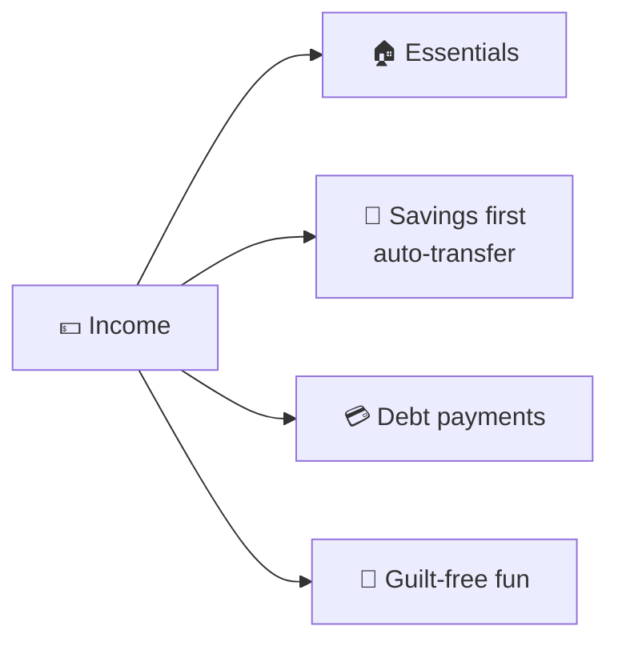

# 65 · Money & Personal Finance with AI 💸📊

> ⏱️ 8 min read · 🎯 Everyone who earns, spends or saves · 🧰 Needs: an assistant with code execution (for spreadsheets), a bank export (CSV), optionally a budgeting app

**Money stress is real, and a lot of it comes from not quite understanding where it goes or what the options mean.** AI is a
patient, judgment-free money tutor and analyst: it can find your spending patterns, build a budget you'll actually keep,
explain loans and investing concepts in plain English, compare big purchases, organize tax paperwork and spot scams. This
chapter shows you how, with an important promise: **AI helps you understand; you (and qualified professionals) decide.** 💛

> [!WARNING]
> **⚠️ Not financial advice**
> AI can explain, calculate and organize, but it can be wrong, and it doesn't know your full situation. For investments, taxes,
> debt strategy, insurance and retirement decisions, verify the numbers and talk to a qualified professional.

🧸 ELI5: This chapter in 30 seconds

Money can feel confusing, like a jigsaw puzzle with lots of pieces. AI can help sort the pieces: show you where your money goes
each month, help you make a plan to save for something you want, and explain grown-up money words like "interest" in simple
ways. It's like a friendly teacher for money, but for the really big choices, you still ask a real expert. 🐷💰

<!-- in-this-chapter -->

## 🗺️ What AI is great at (and not) with money

🧸 ELI5

AI is great at sorting, explaining and calculating. It's not great at predicting the future or knowing what's right for your
whole life.

| 🌟 Great at | ⚠️ Be careful with |
|---|---|
| Categorizing spending and finding patterns | Predicting stock prices or markets (nobody can) |
| Building budgets and savings plans | Personalized investment picks |
| Explaining concepts (APR, index funds, compound interest) | Tax rules for your specific situation (they vary and change) |
| Comparing options side by side | Math done "in its head" (use code execution or a spreadsheet) |
| Drafting negotiation and dispute letters | Anything that moves money automatically |
| Spotting scam red flags | Up-to-date rates and rules (check current sources) |

> [!TIP]
> **💡 Make it calculate, not guess**
> For any money math, ask the AI to **use code execution or a spreadsheet** and show its working: *"Calculate this with Python
> and show the table."* Language models are great at reasoning but can slip on arithmetic done in their head.

## 🔍 Where does my money go? (the spending analyzer)

🧸 ELI5

Download your bank's list of spending, give it to AI, and it sorts everything into groups like "food" and "fun," then draws
charts so you can see where the money went.

1. **Export** 3 months of transactions as CSV from your bank (most offer this).
2. **Redact** account numbers (and anything you don't want to share), or use a local model for full privacy
   ([Local & Open Models](../part-7-local-ai/47-local-and-open-models.md)).
3. **Upload** to an assistant with code execution:

> *"Categorize every transaction (groceries, eating out, transport, housing, subscriptions, fun, other). Show monthly totals per
> category in a table and a chart. List my 10 biggest one-off expenses and every recurring charge. Then give me 3 gentle,
> specific observations."*

**Follow-ups that help:** *"What would my month look like if I cut eating out by a third?"* · *"Which subscriptions overlap?"*
· *"When in the month do I overspend?"*

## 🧮 A budget you'll actually keep

🧸 ELI5

A budget is a plan for your money: how much for needs, how much for fun, and how much to save. AI helps you make one that fits
your real life.

| Budget style | Idea | AI prompt |
|---|---|---|
| **50/30/20** | Needs / wants / saving | *"Split my take-home pay of [X] using 50/30/20 and compare with my actual spending."* |
| **Zero-based** | Every dollar gets a job | *"Build a zero-based budget from my income and these fixed costs."* |
| **Envelope / buckets** | Separate pots for categories | *"Suggest 6 spending buckets and weekly amounts."* |
| **Anti-budget** | Save first, spend the rest freely | *"How much can I auto-save on payday and still be comfortable?"* |

**Make it stick:** a simple spreadsheet or budgeting app, a **monthly 15-minute check-in** with AI (*"Here's this month vs.
budget. What went well? One thing to adjust?"*), and celebrating wins. 🎉

## 🎯 Goals, savings & debt plans

🧸 ELI5

AI can make a plan for saving up for something special or paying off money you owe, showing how long it'll take each month.

| Goal | Prompt |
|---|---|
| 🏝️ **Savings goal** | *"I want [amount] for a trip in 10 months. Build a monthly plan and show the balance each month in a table."* |
| 🆘 **Emergency fund** | *"How many months of essential costs is a sensible emergency fund, and how do I build it gradually?"* |
| 💳 **Debt payoff** | *"Compare avalanche (highest interest first) vs. snowball (smallest balance first) for these debts. Calculate months to payoff and total interest with Python."* |
| 🏠 **Big goal** | *"What would it take to save a house deposit of [X] in 5 years? Show 3 scenarios."* |

## 📚 Money concepts in plain English

🧸 ELI5

Grown-up money words can be confusing. AI can explain any of them simply, with examples, and quiz you until you understand.

Use AI as a **judgment-free money tutor** ([Research & Learning](60-research-and-learning.md)):

| Concept | Ask |
|---|---|
| **Compound interest** | *"Explain compound interest with a pizza analogy, then show $100/month for 30 years at a few different rates."* |
| **APR vs. interest rate** | *"Explain APR and why two loans with the same rate can cost different amounts."* |
| **Credit scores** | *"What affects a credit score, and what are 5 practical ways to improve one?"* |
| **Index funds** | *"Explain index funds vs. picking stocks, with the pros and cons of each."* |
| **Inflation** | *"What does inflation do to cash savings? Show an example."* |
| **Retirement accounts** | *"Explain the retirement account types in [my country] in plain English."* (then verify current rules) |
| **Insurance** | *"Explain deductibles, premiums and coverage limits using a car-insurance example."* |

## ⚖️ Big purchases & comparisons

🧸 ELI5

Before buying something big, AI can compare the choices side by side, including hidden costs, so you pick the best one.

- **Total cost of ownership:** *"Compare buying these two cars over 5 years: price, fuel, insurance estimate, maintenance,
  resale. Make a table and show your assumptions."*
- **Rent vs. buy:** *"Build a rent-vs-buy spreadsheet for my situation. Let me change the assumptions."*
- **Phone and internet plans:** paste the plans → *"Which is cheapest for my usage over 2 years?"*
- **Read the fine print:** *"Summarize the cancellation terms, fees and auto-renewal rules in this contract."*
- **The 24-hour rule:** *"Help me decide if I really need this. Ask me 5 questions."* 😄

## 🧾 Taxes & paperwork

🧸 ELI5

At tax time, AI can help you gather and organize the papers and explain the forms, but a tax expert or official tool should
check the final answers.

- **Organize:** *"Here's a list of my documents. What else might I need for my tax return in [country]?"*
- **Receipts:** photos → extraction → a categorized expense sheet ([Spreadsheet Superpowers](../part-4-ai-in-your-apps/27-spreadsheet-superpowers.md)).
- **Understand forms:** *"Explain what this form is for and which boxes are likely relevant to a freelancer."*
- **Side-hustle records:** a simple income/expense tracker from day one ([Small Business](62-small-business.md)).
- **Always** confirm with official guidance, tax software or a tax professional. Rules change yearly and vary by place.

## 🗣️ Negotiating & saving money

🧸 ELI5

AI can write polite messages asking for a better price, a refund or a lower bill, and help you practice what to say on the
phone.

| Situation | Prompt |
|---|---|
| **Lower a bill** | *"Script for calling my internet provider to ask for a better rate. Include what to say if they say no."* |
| **Dispute a charge** | *"Draft a clear dispute letter for this incorrect charge: facts, evidence, what I want."* |
| **Refund request** | *"A polite but firm refund request for a product that broke after 3 weeks."* |
| **Salary** | See [Careers & Job Hunting](63-careers-and-job-hunting.md#-negotiating-offers) |
| **Practice** | Voice mode: *"Play the customer-retention agent. Push back realistically."* |

## 🛡️ Scams & AI-powered fraud

🧸 ELI5

Bad people use AI too, for example faking a family member's voice on the phone. If a message is urgent and asks for money,
stop, check with the real person, and ask AI if it looks like a scam.

AI is a great **second opinion** on suspicious messages, and scammers now use AI themselves (fake voices, polished emails,
deepfake videos).

| Red flag | Protect yourself |
|---|---|
| **Urgency and secrecy** ("act now, tell no one") | Slow down. Real organizations can wait |
| **A "family emergency" call** asking for money | Hang up and call the person back on their known number. Agree on a **family code word** |
| **Requests for gift cards, crypto or wire transfers** | Legitimate companies almost never ask for these |
| **Too-good-to-be-true investments** | *"Analyze this offer for scam red flags."* Check regulator warning lists |
| **Links in texts and emails** | Go to the website directly instead of clicking |

**Prompt:** *"Is this message a scam? Explain the red flags and what a real company would do instead."* Never share passwords,
one-time codes or full card numbers with any AI tool.

## 🎯 Key takeaways

- AI is a patient **money tutor and analyst**, not a financial advisor.
- **Make it calculate** (code execution or spreadsheets) and **show assumptions**.
- The **spending analyzer** + a simple **budget** + a **monthly check-in** changes everything.
- Use AI for **goals, debt plans, comparisons, negotiations and paperwork**, then verify big decisions with professionals.
- Watch for **AI-powered scams**: urgency, secrecy, unusual payment methods. Use a family code word.

## 🧠 Check yourself

❓ 1. Why ask AI to use code execution for debt calculations?

Language models can slip on arithmetic "in their head." **Code or a spreadsheet** gives accurate, checkable numbers.

❓ 2. What should you do before uploading your bank export?

**Redact** account numbers and anything private (or use a **local model**).

❓ 3. A caller sounding exactly like your cousin urgently needs money wired. What do you do?

**Hang up and call them back** on their known number (and use a family **code word**). Voices can be cloned.

> [!TIP]
> **🎮 Try this**
> Run the **spending analyzer** on last month's transactions (redacted!). Ask for three gentle observations and one small change
> to try this month. Then set a 15-minute monthly check-in on your calendar. Future-you says thanks. 🐷💛

---

**Next:** [66 · Health, Fitness & Wellbeing with AI →](66-health-fitness-and-wellbeing.md)
