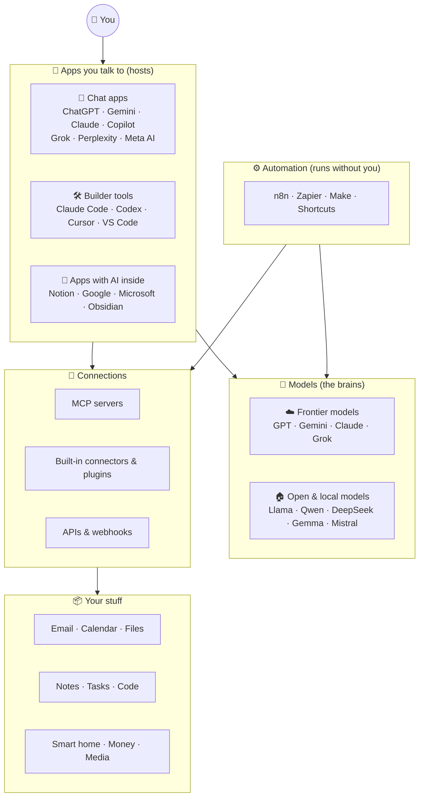
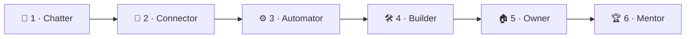

# 🗺️ The Big Map of AI (One-Page Overview)

> ⏱️ 8 min read · 🎯 Everyone · 🧰 Needs: nothing

**Before diving into chapters, here's the whole territory on one page.** Once you can see how models, apps, connectors,
automations and your own data fit together, every chapter in this manual slots neatly into place.

🧸 ELI5: This page in 30 seconds

Think of AI like a city. The **models** are the power plant (the brains). The **apps** are the buildings you walk into
(Claude, ChatGPT, Cursor). **Connectors and MCP** are the roads and pipes that link buildings to everything else.
**Automations** are the delivery trucks that run on a schedule. And **your data** is your house, full of your stuff.
This map shows how it all connects.

<!-- in-this-chapter -->

## 🏙️ The whole landscape in one picture

🧸 ELI5

You talk to an app. The app uses a brain (a model). The app reaches your stuff through connectors. Robots (automations)
can also use the brain on their own while you sleep.

## 🧱 The five layers

🧸 ELI5

Five building blocks stack together: brains, apps, connections, robots, and your data. You'll learn each block in its
own part of the manual.

| Layer | What it is | Examples | Learn it in |
|---|---|---|---|
| 🧠 **Models** | The "brains" that read and write | GPT, Gemini, Claude, Grok, Llama, DeepSeek, Mistral, Qwen | [Part III](../part-3-foundations/index.md), [Part IX](../part-9-local-ai/index.md) |
| 🏢 **Apps (hosts)** | Where you talk to the brains | ChatGPT, Gemini, Claude, Copilot, Grok, Perplexity, Meta AI, Cursor, Notion AI | [Part II](../part-2-ai-assistants-field-guide/index.md), [Part VI](../part-6-ai-in-your-apps/index.md), [Part VII](../part-7-building-with-ai/index.md) |
| 🔌 **Connections** | How apps reach tools and data | MCP servers, connectors, APIs | [Part IV](../part-4-mcp-and-connectors/index.md) |
| ⚙️ **Automation** | Workflows that run on triggers | n8n, Zapier, Make, Shortcuts | [Part V](../part-5-automation/index.md) |
| 📦 **Your data & knowledge** | What makes AI useful *to you* | Files, notes, RAG, memory | [Part VIII](../part-8-knowledge-and-memory/index.md) |

Everything else in the manual is about **combining** these layers: creative projects ([Part X](../part-10-creative-ai/index.md)),
real-life uses ([Part XI](../part-11-ai-for-life-and-work/index.md)), doing it well ([Part XII](../part-12-mastery/index.md)),
and full projects ([Part XIII](../part-13-build-alongs/index.md)).

## 🪜 The skills ladder

🧸 ELI5

Like levels in a video game: first you chat, then you connect, then you automate, then you build, then you run your own
AI, and finally you teach others. You can skip levels whenever you want!

| Level | You can… | Next step |
|---|---|---|
| 💬 **1 · Chatter** | Ask questions, draft text | [Your First Hour](b-your-first-hour.md) |
| 🔌 **2 · Connector** | Let AI read and act on *your* apps | [MCP Explained](../part-4-mcp-and-connectors/38-mcp-explained.md) |
| ⚙️ **3 · Automator** | Make workflows that run without you | [Automation Platforms](../part-5-automation/45-automation-platforms.md) |
| 🛠️ **4 · Builder** | Create apps, MCP servers and agents | [Agents & Coding Tools](../part-7-building-with-ai/60-agents-and-coding-tools.md) |
| 🏠 **5 · Owner** | Run private AI on your own hardware | [Local & Open Models](../part-9-local-ai/78-local-and-open-models.md) |
| 🏆 **6 · Mentor** | Evaluate, secure, and teach others | [Teaching Others](../part-12-mastery/108-teaching-others.md) |

## ❓ Which chapter answers my question?

🧸 ELI5

Got a question? Find it in this list and jump straight to the chapter that answers it.

| Your question | Go to |
|---|---|
| "I've never used AI. Where do I start?" | [Part I · AI from Zero](../part-1-ai-from-zero/index.md) |
| "Which assistant should I use: ChatGPT, Gemini, Claude…?" | [Meet the Assistants](../part-2-ai-assistants-field-guide/17-meet-the-assistants.md) |
| "Why does the AI make things up?" | [How Models Really Work](../part-3-foundations/33-how-models-really-work.md) |
| "What's this MCP thing everyone talks about?" | [MCP Explained](../part-4-mcp-and-connectors/38-mcp-explained.md) |
| "Which AI subscription should I pay for?" | [Choosing Your AI Stack](../part-3-foundations/37-choosing-your-ai-stack.md) |
| "Can AI handle my inbox?" | [Email & Calendar Superpowers](../part-6-ai-in-your-apps/57-email-and-calendar.md) |
| "How do I make AI do stuff on a schedule?" | [Automation Platforms](../part-5-automation/45-automation-platforms.md) |
| "Can I build an app with no coding experience?" | [Vibe Coding Your First Real App](../part-7-building-with-ai/65-vibe-coding-your-first-app.md) |
| "How do I make AI know my documents?" | [RAG, Memory & Knowledge](../part-8-knowledge-and-memory/72-rag-memory-and-knowledge.md) |
| "Can I run AI without the cloud?" | [Local & Open Models](../part-9-local-ai/78-local-and-open-models.md) |
| "How do I make a song or a video?" | [Music](../part-10-creative-ai/86-music-making-with-ai.md), [Video & Audio](../part-10-creative-ai/85-video-and-audio-production.md) |
| "Is my data safe?" | [Privacy & Your Data](../part-12-mastery/104-privacy-and-your-data.md) |
| "How do I avoid a surprise bill?" | [Cost Optimization](../part-12-mastery/106-cost-optimization.md) |
| "Just give me a project to build!" | [The Build-Alongs](../part-13-build-alongs/index.md) |

## 🔤 Your vocabulary starter pack

🧸 ELI5

Ten words you'll see everywhere. Learn these and the rest of the manual gets much easier. The full list (with an ELI5
for every word) is in the [Glossary](../appendices/a-glossary.md).

| Word | 🧸 ELI5 |
|---|---|
| **Model** | The brain: a giant pattern-matcher that predicts what words come next |
| **Token** | A word-chunk. AI reads, writes and charges in tokens |
| **Context window** | How much the AI can "hold in its head" at once |
| **Tool / function calling** | When the AI asks your app to press a button for it |
| **Agent** | An AI that loops: think → use a tool → look at the result → repeat until done |
| **MCP** | The universal plug that lets any AI app use any tool |
| **Connector** | A ready-made MCP plug inside an app (click to install) |
| **RAG** | Letting AI look things up in your documents before answering |
| **Automation / workflow** | A robot recipe: "when X happens, do Y" |
| **Local model** | A brain that runs on your own computer, with no internet needed |

## 🎯 Key takeaways

- Five layers: **models, apps, connections, automation, your data**. Every AI setup is a combination of them.
- The **skills ladder** runs from chatting to mentoring, and you can climb in any order.
- Use the **question table** above as a shortcut to the right chapter.

## 🧠 Check yourself

❓ Is Cursor a model or a host?

A **host** (an app you use). It *uses* models like Claude or GPT under the hood.

❓ What's the difference between a connector and an automation?

A **connector** lets an AI app *reach* a tool when you ask. An **automation** runs *on its own* when a trigger happens
(like a schedule or a new email).

> [!TIP]
> **🎮 Try this**
> Look at the landscape diagram and circle (mentally!) the pieces you already use. The empty spots are your adventure
> map. Pick one and open its part landing page from the sidebar.

---

**Next:** [01 · What Is AI, Really? →](../part-1-ai-from-zero/01-what-is-ai-really.md)
