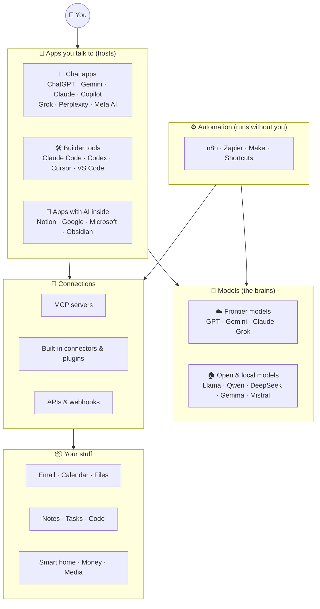
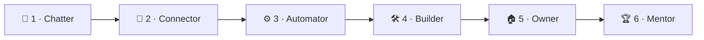

# 🗺️ The Big Map of AI (One-Page Overview)

> ⏱️ 8 min read · 🎯 Everyone · 🧰 Needs: nothing

**Before diving into chapters, here's the whole territory on one page.** Once you can see how models, apps, connectors,
automations and your own data fit together, every chapter in this manual slots neatly into place.

✅ Key Points & Steps

The AI world can look chaotic, but it fits into five layers that work together. Knowing the layers helps you understand any new tool you come across.

- **Models** are the AI systems that read and generate text, images and more.
- **Apps** like ChatGPT, Gemini and Claude are how you talk to models.
- **Connectors, MCP and automations** link those apps to **your data** and to other tools, so AI can act, not just answer.

<!-- in-this-chapter -->

## 🏙️ The whole landscape in one picture

✅ Key Points & Steps

You interact with an app, which sends your request to a model. Through connectors, the app can reach your files and services. Automations can use the same models on their own, on a schedule or when something happens.

```mermaid
flowchart TB
    YOU((🧑 You))
    subgraph APPS["🏢 Apps you talk to (hosts)"]
        A1["💬 Chat apps<br/>ChatGPT · Gemini · Claude · Copilot<br/>Grok · Perplexity · Meta AI"]
        A2[🛠️ Builder tools<br/>Claude Code · Codex · Cursor · VS Code]
        A3[🏡 Apps with AI inside<br/>Notion · Google · Microsoft · Obsidian]
    end
    subgraph BRAINS["🧠 Models (the brains)"]
        M1[☁️ Frontier models<br/>GPT · Gemini · Claude · Grok]
        M2[🏠 Open & local models<br/>Llama · Qwen · DeepSeek · Gemma · Mistral]
    end
    subgraph PIPES["🔌 Connections"]
        C1[MCP servers]
        C2[Built-in connectors & plugins]
        C3[APIs & webhooks]
    end
    subgraph ROBOTS["⚙️ Automation (runs without you)"]
        R1[n8n · Zapier · Make · Shortcuts]
    end
    subgraph STUFF["📦 Your stuff"]
        D1[Email · Calendar · Files]
        D2[Notes · Tasks · Code]
        D3[Smart home · Money · Media]
    end
    YOU --> APPS
    APPS --> BRAINS
    APPS --> PIPES
    ROBOTS --> BRAINS
    ROBOTS --> PIPES
    PIPES --> STUFF
```

## 🧱 The five layers

✅ Key Points & Steps

The five layers stack on top of each other, and each one has a dedicated part of this manual. The table maps every layer to examples and to the chapters where you'll learn it.

| Layer | What it is | Examples | Learn it in |
|---|---|---|---|
| 🧠 **Models** | The "brains" that read and write | GPT, Gemini, Claude, Grok, Llama, DeepSeek, Mistral, Qwen | [Part III](../part-3-foundations/index.md), [Part IX](../part-9-local-ai/index.md) |
| 🏢 **Apps (hosts)** | Where you talk to the brains | ChatGPT, Gemini, Claude, Copilot, Grok, Perplexity, Meta AI, Cursor, Notion AI | [Part II](../part-2-ai-assistants-field-guide/index.md), [Part VI](../part-6-ai-in-your-apps/index.md), [Part VII](../part-7-building-with-ai/index.md) |
| 🔌 **Connections** | How apps reach tools and data | MCP servers, connectors, APIs | [Part IV](../part-4-mcp-and-connectors/index.md) |
| ⚙️ **Automation** | Workflows that run on triggers | n8n, Zapier, Make, Shortcuts | [Part V](../part-5-automation/index.md) |
| 📦 **Your data & knowledge** | What makes AI useful *to you* | Files, notes, RAG, memory | [Part VIII](../part-8-knowledge-and-memory/index.md) |

Everything else in the manual is about **combining** these layers: creative projects ([Part X](../part-10-creative-ai/index.md)),
real-life uses ([Part XI](../part-11-ai-for-life-and-work/index.md)), doing it well ([Part XII](../part-12-mastery/index.md)),
and full projects ([Part XIII](../part-13-build-alongs/index.md)).

## 🪜 The skills ladder

✅ Key Points & Steps

Most people's AI skills grow in a predictable order: chatting, connecting apps, automating, building, running models locally, and finally teaching others. Each level has a natural next step, but you can jump ahead whenever a topic interests you.

```mermaid
flowchart LR
    L1[💬 1 · Chatter] --> L2[🔌 2 · Connector] --> L3[⚙️ 3 · Automator] --> L4[🛠️ 4 · Builder] --> L5[🏠 5 · Owner] --> L6[🏆 6 · Mentor]
```

| Level | You can… | Next step |
|---|---|---|
| 💬 **1 · Chatter** | Ask questions, draft text | [Your First Hour](b-your-first-hour.md) |
| 🔌 **2 · Connector** | Let AI read and act on *your* apps | [MCP Explained](../part-4-mcp-and-connectors/38-mcp-explained.md) |
| ⚙️ **3 · Automator** | Make workflows that run without you | [Automation Platforms](../part-5-automation/45-automation-platforms.md) |
| 🛠️ **4 · Builder** | Create apps, MCP servers and agents | [Agents & Coding Tools](../part-7-building-with-ai/60-agents-and-coding-tools.md) |
| 🏠 **5 · Owner** | Run private AI on your own hardware | [Local & Open Models](../part-9-local-ai/78-local-and-open-models.md) |
| 🏆 **6 · Mentor** | Evaluate, secure, and teach others | [Teaching Others](../part-12-mastery/108-teaching-others.md) |

## ❓ Which chapter answers my question?

✅ Key Points & Steps

If you have a specific question, find it in the table below and follow the link to the chapter that answers it.

| Your question | Go to |
|---|---|
| "I've never used AI. Where do I start?" | [Part I · AI from Zero](../part-1-ai-from-zero/index.md) |
| "Which assistant should I use: ChatGPT, Gemini, Claude…?" | [Meet the Assistants](../part-2-ai-assistants-field-guide/17-meet-the-assistants.md) |
| "Why does the AI make things up?" | [How Models Really Work](../part-3-foundations/33-how-models-really-work.md) |
| "What's this MCP thing everyone talks about?" | [MCP Explained](../part-4-mcp-and-connectors/38-mcp-explained.md) |
| "Which AI subscription should I pay for?" | [Choosing Your AI Stack](../part-3-foundations/37-choosing-your-ai-stack.md) |
| "Can AI handle my inbox?" | [Email & Calendar Superpowers](../part-6-ai-in-your-apps/57-email-and-calendar.md) |
| "How do I make AI do stuff on a schedule?" | [Automation Platforms](../part-5-automation/45-automation-platforms.md) |
| "Can I build an app with no coding experience?" | [Vibe Coding Your First Real App](../part-7-building-with-ai/65-vibe-coding-your-first-app.md) |
| "How do I make AI know my documents?" | [RAG, Memory & Knowledge](../part-8-knowledge-and-memory/72-rag-memory-and-knowledge.md) |
| "Can I run AI without the cloud?" | [Local & Open Models](../part-9-local-ai/78-local-and-open-models.md) |
| "How do I make a song or a video?" | [Music](../part-10-creative-ai/86-music-making-with-ai.md), [Video & Audio](../part-10-creative-ai/85-video-and-audio-production.md) |
| "Is my data safe?" | [Privacy & Your Data](../part-12-mastery/104-privacy-and-your-data.md) |
| "How do I avoid a surprise bill?" | [Cost Optimization](../part-12-mastery/106-cost-optimization.md) |
| "Just give me a project to build!" | [The Build-Alongs](../part-13-build-alongs/index.md) |

## 🔤 Your vocabulary starter pack

✅ Key Points & Steps

These ten terms come up constantly. Learning them now makes the rest of the manual much easier to follow; the [Glossary](../appendices/a-glossary.md) defines more than 200 others.

| Word | What it means |
|---|---|
| **Model** | The AI system itself: a large pattern-learning program that predicts what text should come next |
| **Token** | A chunk of text, roughly ¾ of a word. Models read, write and bill in tokens |
| **Context window** | How much text the model can consider at once: your messages, files and its replies |
| **Tool / function calling** | The model asking your app to run an action for it, like searching or creating an event |
| **Agent** | An AI that works in a loop: decide on a step → use a tool → check the result → repeat until done |
| **MCP** | An open standard that lets any AI app connect to any tool or data source |
| **Connector** | A ready-made MCP connection inside an app, installed with a few clicks |
| **RAG** | Retrieval-augmented generation: the AI searches your documents and answers from what it finds |
| **Automation / workflow** | A rule that runs on its own: "when X happens, do Y" |
| **Local model** | A model that runs on your own computer, privately and without an internet connection |

## 🎯 Key takeaways

- Five layers: **models, apps, connections, automation, your data**. Every AI setup is a combination of them.
- The **skills ladder** runs from chatting to mentoring, and you can climb in any order.
- Use the **question table** above as a shortcut to the right chapter.

## 🧠 Check yourself

❓ Is Cursor a model or a host?

A **host** (an app you use). It *uses* models like Claude or GPT under the hood.

❓ What's the difference between a connector and an automation?

A **connector** lets an AI app *reach* a tool when you ask. An **automation** runs *on its own* when a trigger happens
(like a schedule or a new email).

> [!TIP]
> **🎮 Try this**
> Look at the landscape diagram and circle (mentally!) the pieces you already use. The empty spots are your adventure
> map. Pick one and open its part landing page from the sidebar.

---

**Next:** [01 · What Is AI, Really? →](../part-1-ai-from-zero/01-what-is-ai-really.md)
